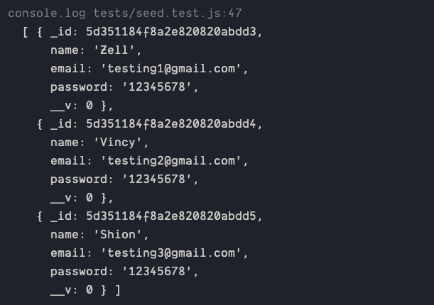

# 设定数据库种子

> 原文：<https://dev.to/zellwk/seeding-a-database-1847>

当您为后端编写测试时，您需要测试四种不同的操作:

1.  创建(用于向数据库添加内容)
2.  阅读(从数据库中获取信息)
3.  更新(用于更改数据库)
4.  删除(从数据库中删除内容)

最容易测试的类型是创建操作。你把一些东西放入数据库，测试它是否在那里。

对于其他三种类型的操作，您需要在编写测试之前将一些内容放入数据库中。

## 将东西放入数据库

向数据库添加初始内容的过程称为**播种**。

假设您想要向数据库添加三个用户。这些用户包含姓名和电子邮件地址。

```
const users = [
  {
    name: "Zell",
    email: "testing1@gmail.com"
  },
  {
    name: "Vincy",
    email: "testing2@gmail.com"
  },
  {
    name: "Shion",
    email: "testing3@gmail.com"
  }
]; 
```

您可以在测试开始时使用您的模型作为数据库的种子。

```
const User = require("../model/User"); // Link to User model

it("does something", async done => {
  // Add users to the database
  for (const u of users) {
    const user = new User(u);
    await user.save();
  }

  // Create the rest of your test here
}); 
```

如果每次测试都需要这些用户，最好的方法是通过`beforeEach`钩子添加他们。在每个`it`声明之前，`beforeEach`钩子都会运行。

```
// Seed the database with users
beforeEach(async () => {
  for (u of users) {
    const user = new User(u);
    await user.save();
  }
}); 
```

你也可以用 Mongoose 的`create`功能来做同样的事情。它运行`new Model()`和`save()`，所以下面的代码和上面的代码做同样的事情。

```
// Seed the database with users
beforeEach(async () => {
  await User.create(users);
}); 
```

## 创建 vs 插入多

Mongoose 有第二种方法来帮助您播种数据库。这种方法叫做`insertMany`。`insertMany`比`create`快，因为:

*   `insertMany`向服务器发送一个操作
*   `create`为每个文档发送一个操作

但是，`insertMany`并不运行`save`中间件。

### 触发保存中间件重要吗？

这取决于你的种子数据。如果你的种子数据需要经过`save`中间件，你需要使用`create`。例如，假设您想要将用户的密码保存到数据库中。你有这个数据:

```
const users = [
  {
    name: "Zell",
    email: "testing1@gmail.com",
    password: "12345678"
  },
  {
    name: "Vincy",
    email: "testing2@gmail.com",
    password: "12345678"
  },
  {
    name: "Shion",
    email: "testing3@gmail.com",
    password: "12345678"
  }
]; 
```

当我们将用户的密码保存到数据库中时，出于安全原因，我们希望对密码进行哈希处理。我们通常通过`save`中间件哈希密码。

```
// Hashes password automatically
userSchema.pre("save", async function(next) {
  if (!this.isModified("password")) return next();
  const salt = bcrypt.genSaltSync(10);
  const hashedPassword = bcrypt.hashSync(password, salt);
  this.password = hashedPassword;
}); 
```

如果你使用`create`，你会得到散列密码的用户:

[](https://res.cloudinary.com/practicaldev/image/fetch/s--jm6XBGSP--/c_limit%2Cf_auto%2Cfl_progressive%2Cq_auto%2Cw_880/https://zellwk.cimg/2019/seed-database/create.png)

如果您使用`insertMany`，您将得到没有散列密码的用户:

[](https://res.cloudinary.com/practicaldev/image/fetch/s--oFuJbmG---/c_limit%2Cf_auto%2Cfl_progressive%2Cq_auto%2Cw_880/https://zellwk.cimg/2019/seed-database/insert-many.png)

### 何时使用 create，何时使用 insertMany

因为`insertMany`比`create`快，所以你想尽可能使用`insertMany`。

我是这样做的:

1.  如果种子数据不需要`save`中间件，则使用`insertMany`。
2.  如果种子数据需要`save`中间件，使用`create`。然后，覆盖种子数据，使其不再需要`save`中间件。

对于上面的密码示例，我将首先运行`create`。然后，我复制粘贴哈希密码种子数据。然后，我将从这一点开始运行`insertMany`。

如果您想覆盖复杂的种子数据，您可能想直接从 MongoDB 获取 JSON。为此，您可以使用`mongoexport` :

```
mongoexport --db <databaseName> --collection <collectionName> --jsonArray --pretty --out output.json 
```

上面写着:

1.  从`<databaseName>`导出`<collection>`
2.  在一个名为`output.json`的文件中创建 JSON 数组形式的输出。该文件将放在您运行该命令的文件夹中。

## 播种多个测试文件和集合

您需要一个存储种子数据的地方，这样您就可以在所有的测试和收集中使用它们。这是我使用的一个系统:

1.  我根据它们的模型来命名种子文件。我用`user.seed.js`文件播种了一个`User`模型。
2.  我把种子文件放在了`seeds`文件夹中
3.  我遍历每个种子文件来播种数据库。

要遍历每个种子文件，您需要使用`fs`模块。`fs`代表文件系统。

遍历文件最简单的方法是在同一个`seeds`文件夹中创建一个`index.js`文件。一旦你有了`index.js`文件，你可以使用下面的代码来查找所有带有`*.seed.js`
的文件

```
const fs = require("fs");
const util = require("util");

// fs.readdir is written with callbacks.
// This line converts fs.readdir into a promise
const readDir = util.promisify(fs.readdir);

async function seedDatabase() {
  // Gets list of files in the directory
  // `__dirname` points to the `seeds/` folder
  const dir = await readDir(__dirname);

  // Gets a list of files that matches *.seed.js
  const seedFiles = dir.filter(f => f.endsWith(".seed.js"));
} 
```

一旦有了种子文件列表，就可以遍历每个种子文件来为数据库设定种子。这里，我使用了一个`for...of`循环来简化事情。

```
async function seedDatabase() {
  for (const file of seedFiles) {
    // Seed the database
  }
} 
```

要对数据库进行种子化，我们需要从种子文件的名称中找到正确的 Mongoose 模型。名为`user.seed.js`的文件应该是`User`模型的种子。这意味着:

1.  我们必须从`user.seed.js`中找到`user`
2.  我们必须将`user`大写成`User`

这是一个粗略的版本，它完成了所需的工作。(如果你愿意，可以用 regex 而不是`split`让代码更健壮)。

```
for (const file of seedFiles) {
  const fileName = file.split(".seed.js")[0];
  const modelName = toTitleCase(fileName);
  const model = mongoose.models[modelName];
} 
```

接下来，我们要确保每个文件都有一个与之对应的模型。如果找不到模型，我们希望抛出一个错误。

```
for (const file of seedFiles) {
  //...
  if (!model) throw new Error(`Cannot find Model '${modelName}'`);
} 
```

如果有相应的模型，我们希望用种子文件中的内容播种数据库。为此，我们需要首先读取种子文件。在这里，由于我使用了`.js`扩展名，我可以简单地要求文件。

```
for (const file of seedFiles) {
  //...
  const fileContents = require(path.join(__dirname, file));
} 
```

为此，我的种子文件必须导出一组数据。

```
module.exports = [
  {
    name: "Zell",
    email: "testing1@gmail.com",
    password: "12345678"
  },
  {
    name: "Vincy",
    email: "testing2@gmail.com",
    password: "12345678"
  },
  {
    name: "Shion",
    email: "testing3@gmail.com",
    password: "12345678"
  }
]; 
```

一旦我有了种子文件的内容，我就可以运行`create`或`insertMany`。

```
async function seedDatabase(runSaveMiddleware = false) {
  // ...
  for (const file of seedFiles) {
    // ...

    runSaveMiddleware
      ? model.create(fileContents)
      : model.insertMany(fileContents);
  }
} 
```

下面是完整的`seedDatabase`代码:

```
const fs = require("fs");
const util = require("util");
const readDir = util.promisify(fs.readdir).bind(fs);
const path = require("path");
const mongoose = require("mongoose");

function toTitleCase(str) {
  return str.replace(/\w\S*/g, txt => {
    return txt.charAt(0).toUpperCase() + txt.substr(1).toLowerCase();
  });
}

async function seedDatabase(runSaveMiddleware = false) {
  const dir = await readDir(__dirname);
  const seedFiles = dir.filter(f => f.endsWith(".seed.js"));

  for (const file of seedFiles) {
    const fileName = file.split(".seed.js")[0];
    const modelName = toTitleCase(fileName);
    const model = mongoose.models[modelName];

    if (!model) throw new Error(`Cannot find Model '${modelName}'`);
    const fileContents = require(path.join(__dirname, file));

    runSaveMiddleware
      ? await model.create(fileContents)
      : await model.insertMany(fileContents);
  }
} 
```

## 为什么是 JS，不是 JSON？

使用 JSON 存储数据是行业规范。在这种情况下，我发现使用 JavaScript 对象更容易，因为:

1.  我不需要为每个属性写开始和结束双引号。
2.  我根本不用双引号！(写单引号更容易，因为不需要按 shift 键)。

```
// Which is easier to write. JavaScript objects or JSON?

// JavaScript objects
module.exports = [
  {
    objectName: "property"
  }
][
  // JSON
  {
    objectName: "property"
  }
]; 
```

如果您想使用 JSON，请确保将`seedDatabase`改为使用 JSON。(我将让您自己处理代码)。

## 调整 setupDB 功能

在[上一篇文章](https://zellwk.com/blog/jest-and-mongoose)中，我创建了一个`setupDB`函数来帮助我建立测试数据库。`seedDatabase`进入`setupDB`功能，因为播种是设置过程的一部分。

```
async function seedDatabase(runSaveMiddleware = false) {
  // ...
}

module.exports = {
  setupDB(databaseName, runSaveMiddleware = false) {
    // Connect to Mongoose
    beforeAll(/*...*/);

    // Seed Data
    beforeEach(async () => {
      await seedDatabase(runSaveMiddleware);
    });

    // Cleans up database between each test
    afterEach(/*...*/);

    // Disconnect Mongoose
    afterAll(/*...*/);
  }
}; 
```

## 一个 Github 库

我创建了一个 [Github 库](https://github.com/zellwk/endpoint-testing-example)来配合这个由三部分组成的测试系列。我希望这个演示代码可以帮助您开始测试您的应用程序。

* * *

感谢阅读。这篇文章最初发表在我的博客上。如果你想要更多的文章来帮助你成为一个更好的前端开发者，请注册[我的时事通讯](https://zellwk.com)。