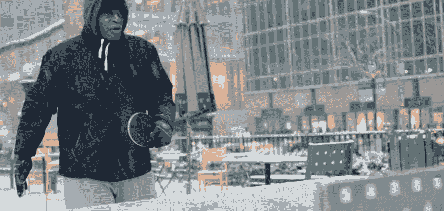

# 寻找意外收获

> 原文：<https://dev.to/hzoo/seeking-serendipity-85j>

> 为了这篇文章，我改编了上个月我为我的[支持者](https://github.com/users/hzoo/sponsorship)写的“意识流”时事通讯！

我想分享一些有时感觉无法量化的东西:为什么我们爱(或学会爱)某人、某物，或者在这种情况下，一个地方。

### 你爱什么，你就是什么

在过去的一年里，许多人问我为什么决定留在纽约，而不是住在另一个城市，搬回家，甚至成为一名“数字流浪者”。这是一个恰当的问题，尤其是在我一年多前辞掉工作，不确定接下来会发生什么之后。

这让我反思为什么有人梦想搬到城市，更不用说在那里定居了。

从很多可识别的角度来看，这毫无意义。住在这里让我对我的生活方式有了不同的思考:我如何花费我的时间和金钱。也许是做多份工作，乘坐公共交通工具而不是开车，做饭而不是外出就餐，与人合租而不是拥有自己的工作室，住得离城市更远，只是拥有的东西更少。值得忍受所有的努力、牺牲和不便吗？

事实证明，对我来说，这一切都是值得的。我可以很自信地说，因为我已经很好地融入了这座城市的一种特殊气质:我们太在乎工作了(不管是好是坏)。

但是，当我已经辞掉工作，可以去任何地方工作的时候，这是我留下来的理由吗？

### 偶遇

我认为这个城市迫使任何来的人做出真实的、发自内心的反应。

“为什么不呢？”这个回答太冷漠了，难以令人信服。没有信念，我将被迫面对现实并离开。

理论上，它看起来也不怎么样。我告诉自己许多关于纽约典型负面的合理化建议:不可预测的天气(“我喜欢真正的季节”)、忙碌和喧嚣(“这个城市充满活力，我也感受到了”)、巨大的人群(发展第六感以远离时代广场)、噪音(购买昂贵耳机的理由)、气味(好吧，这里没有一线希望)、高昂的食物/租金/活动费用(发展理财技能)。从这个角度来看，难怪这里的人们会如此厌倦。

我不会总是把纽约描述成一个熙熙攘攘、忙碌、令人焦虑的地方(对我来说肯定是这样)，但相反，它常常是一个多样化的邀请。人们忙于自己的生活这一事实意味着，在团结感持续存在的同时，人们可能会感到孤独，尤其是在冲突时期(最近的一个例子是:在最近的停电期间，志愿者帮助指挥街道交通)。每个人似乎都有这种心照不宣的，对这里的生活斗争的共同理解。不管我在哪个区，都有一种特定的欢乐气氛；它也体现在居住在其中的人们身上。

所以我得出结论，我的推理(我会认为是一种感觉)一定来自于生活在一个城市的模糊品质。某种可以超越所有明显负面因素的东西。

我把它描述为一种深深的敬畏和惊奇。由于在过去一年的旅行中发生了如此多的“偶遇”，我不禁注意到，我一直在寻找的东西是我在搬到这里之前已经忘记的: *serendipity* 。

### 定义偶然发现

这是一件既意外又幸运的事情。我甚至不知道我在找什么，但它超出了我的想象。我们不能强求；它发生在我们身上，让我们感觉充满活力。

> *..意外之喜，这是一种偶然的相遇，会导致与一个主题或想法进行更长时间、更丰富的互动。这就像一个重金属乐队在唱片店偶遇歌剧，或者一个年轻的孩子因为紧随票房成绩的书评而对历史感兴趣。这是大学里心血来潮选修的一门课程出人意料地通向新的终生追求的方式。——[订婚是机缘巧合的敌人](https://dancohen.org/2019/07/23/engagement-is-the-enemy-of-serendipity)*

### 主动等待

既然起了名字，就想要更多的意外收获！这是我能抓住或“抓住”更多的东西吗？或者试图奋斗和努力去实现它是否违背了整个要点？我觉得不是！

> *..但是很多时候是重复的。我声称运气不会涵盖一切。我要引用巴斯德的话，“幸运青睐有准备的人。”我认为这是我所相信的方式。确实有运气的成分，不，没有。有准备的头脑迟早会发现重要的事情并去做。所以没错，是运气。你做的特别的事情是运气，但是你做的事情不是。”——[《你和你的研究》](https://www.cs.virginia.edu/~robins/YouAndYourResearch.html)*

我们大多数人都认识到准备在生活的许多方面的重要性。但是朝着没有保证的方向努力真的值得吗？我会说是的！这辈子要面对各种未知。对某事的承诺不仅有帮助，而且是理解它的必要条件。我们冒着失败、损失、名誉的风险，希望有惊喜。

我开始意识到，这种不断把自己放在外面的有意识的暴露，打开了与人和世界更好的个人联系的可能性。

### 寻找社区，寻找家园

我是这里一些伟大社区的一部分:我的教堂，我在 Adobe 的(前)同事，以及像 BrooklynJS 这样的技术社区。而且总是有机会发现新的机会——最近对我来说，是像布莱恩特公园的乒乓球队这样的团体，以及由于 Patreon 和 Stripe 而在城市中更大的创造者/创业现场。

令人惊讶的是，It 事物是如何联系在一起的，关系是如何有机地形成的。

举个我对乒乓球感兴趣的例子:

> 最近的一个友谊故事:这是缪拉！我去纽约看他的孩子，当我和@rauchg 正在这个地方玩的时候🏓外面。后来我们联系上了，上个月我们经常一起玩(是的，即使是在那些热天),直到他上周回家【pic.twitter.com/g4YRcM9pXW
> 
> —亨利·朱(@ left _ pad)[2018 年 7 月 9 日](https://twitter.com/left_pad/status/1016402883934392320?ref_src=twsrc%5Etfw)

今年夏天，当他有机会来看我们的时候，我们又可以一起玩了。

几个月前，我偶然发现了这部关于布莱恩特公园乒乓球桌的获奖纪录片:乒乓球桌(15 分钟)。

听到在那里打球的各种人的故事是如此鼓舞人心。从某种意义上说，条件一点也不理想:外面(风，热/冷的温度)，桌子/网是金属的，到处都是随机的人。但是那里有一个繁荣的社区。各行各业的人都来了:在公园周围的大楼里工作的人在午休，其他无家可归的人，度假的游客，甚至是在这里住了多年却没有意识到桌子在那里的当地人(像我一样)。它看起来太酷了，并说服我从那以后几次去看看这个社区；我在纪录片中认出了几个同样的人，甚至有机会和他们一起玩&聊天。

这个社区帮助我认识到，我可以成为一个长期团体的一部分，这个团体甚至没有正式成员，但却是持续存在的。事实上，我可以去同一个地方，并期望人们在那里没有提前联系任何人或计划任何事情是如此特别。这就像是一个聚会的地方(咖啡馆，某人的地方),一周又一周都是同一群朋友，但都知道有人会在那里。

一个我不是单纯的认识别人，而是莫名其妙的被别人认识的地方。

### 预判

> *“没有普通人。你从未和一个凡人交谈过。国家、文化、艺术、文明——这些都是必死的，它们的生命对我们来说就像蚊蚋的生命。但是，我们与之开玩笑、共事、结婚、冷落和剥削的是不朽的人——不朽的恐怖或永恒的辉煌。这并不意味着我们要永远保持严肃。我们必须玩。但我们的快乐必须是那种(事实上，是最快乐的那种)存在于从一开始就认真对待彼此的人之间——没有轻率，没有优越感，没有假设。”- C.S .刘易斯*

我越来越注意到，每个月我都会有几次在地铁上或在外面散步时看到老朋友、聚会上的人、同事。像德文一样，我已经开始用我的日历记录过去的。当我在街上意外遇到一个朋友时，我会用一个👀记住这一时刻的表情符号！

我回想起四月份去罗马尼亚的前一天。我正从一个朋友家乘地铁回家，在第 72 街市中心的 Q 站偶然碰到一个正在探亲的中学伙伴。

在另一次去波士顿的旅途中，我去了我们的一个姐妹教堂参加祈祷会，并认出了两天后我在那里闲逛吃午饭时遇到的那个朋友！

而且这些机会不只是为我已经熟悉的人而来！我成了那些愿意(尽管不总是主动)在飞机上与陌生人交谈的人之一。甚至在最近一次从波斯顿乘坐美国国家铁路客运公司返回纽约的途中，优素福开始和我交谈，询问我的耳机，最终我们在谈论信仰和技术时真正地联系了起来。就像他说的，“我们相遇不是巧合！”。

也许我不应该感到惊讶，撞上某人的概率相当高，毕竟这是一个密集的城市。但是也有很多人，一天中的任何时候都有很多事情要做，不知道任何人的时间表。

我想知道有多少次我从一个我认识的人身边经过，但是太专注而没有注意到？

### 网络的魔力

在现实世界中体验意外收获让我想知道它是如何在我们的数字生活中培养起来的。

> 最近，我寻求一些关于条带支持的帮助。我很惊讶地得到了一些惊人的帮助，但也有一些回应:“遇到帮助维护巴别塔的人真是太酷了！——实际上，我现在正在学习成为一名网络开发人员，我对你们所做的一切感到敬畏。”

有时候，这就像和世界上任何人见面(发邮件)的机会一样简单。

最近的一个例子是:

在 Nadia [写了](https://nadiaeghbal.com/public-life)她在阅读《美国大城市的生与死》时的想法后，我真的对最后一章很感兴趣。我偶然发现了我们关于[城市](https://hopeinsource.com/city/)的最后一集播客的嘉宾，蒂莫西，通过使用谷歌搜索一个有信仰背景的人写了这个主题。

他的论文《作为礼拜仪式的城市》深深地打动了我，我终于鼓起勇气发了一封冷冰冰的电子邮件。让我惊讶的是，他竟然这么热情的去谈！在我看来，从一个对自己关心的事情超级投入的人(完全在你的领域或团队之外)那里收到一封随机的电子邮件意味着很多。

> 有幸见到了蒂莫西！我在网上搜索《信仰之光》中对简·雅各布斯的解读并联系他后，我们在播客上采访了他。冰冷的电子邮件和面对面交流的温暖喜悦🙂
> 
> 🎧往期剧集:[https://t.co/Jd01Hrj9DX](https://t.co/Jd01Hrj9DX)[pic.twitter.com/zIzVpvmwwT](https://t.co/zIzVpvmwwT)
> 
> —亨利·朱(@ left _ pad)[2019 年 5 月 16 日](https://twitter.com/left_pad/status/1129097595178106887?ref_src=twsrc%5Etfw)

不久之后，我有机会在波士顿拜访他！总之，能够接触到世界各地的这么多人确实有一些惊人的好处。

### 对城市的恐惧

尽管如此，我们还是不断听到(甚至是我自己)可以听到的叹息，提醒我在城市生活的危险:孤独、表演焦虑、即将到来的厄运。这就好像我们把城市作为我们问题的借口，渴望逃离到更绿的牧场。城市本身失去了尊重，成了我们的替罪羊。

时间并没有治愈所有的伤口，而是让我们的心变硬。我们感觉被环境打败了。厌倦是现在的默认。

连接的开放性逐渐消失。我们对人际关系和他人的外在关注本身也是内在的。我们变得怀疑这个世界和我们周围的人。但是我们应该继续生活在怀疑中吗？

> “我不可能是个白痴，但我宁愿一次又一次地被欺骗——并为此付出代价——也不愿成为一个生活在不信任中的人。当我被骗时，我只是把它记在我没有住在可疑星球上而支付的租金上。”——[阿比盖尔·迪斯尼](https://www.thecut.com/2019/03/abigail-disney-has-more-money-than-shell-ever-spend.html)T3】

与此同时，我们如此努力地为自己操纵世界，去创新和取代，而不是维护和保存。

“越多越好”充斥着这个世界。一切都是用效用来衡量的，一种特定形式的目的。它渗透到我们的自我意识中，拥有更多就是完整。一切都变成了另一种形式的衡量和优化。在我们这个心烦意乱的科技时代，我们倾向于认为沉默、无聊和安静是消极的事情。

> “参与就是避免沉默，消除无聊，用我的注意力换取别人的利益来充实每一刻——承诺这会比那些沉默和无聊的时刻更好。”——[订婚是机缘巧合的敌人](https://dancohen.org/2019/07/23/engagement-is-the-enemy-of-serendipity)

我们往往会发现自己一直很忙，我发现这是一种懒惰。懒惰不仅仅是一种什么都不做的习惯，而是一种对生活的冷漠，一种不在乎的精神状态。

但是我们有这种感觉是因为我们实际上不想去思考，去思考我们自己面临的问题。我们需要空间让自己退后一步，在那里培养意外之喜。当设计师在用户界面和艺术中利用空间的力量时，我们可以注意在其他领域做同样的事情。尤其是在我们这个时代。

### 神圣化时间

> 我们的心永不停息，直到他们在你身上找到安息。——奥古斯丁

我们能不能学会把我们的时间看成不是平的(不完全一样)，而是有意义的，甚至是神圣的？富有成效并不意味着更快地从一个地方到达另一个地方，也不意味着“做得更多”,而是更多地体验生活给予我们的东西，充分地活着？

> 人们总是相信乘出租车可以节省时间。比如说，你坐出租车，花了 10 分钟，而走路要 20 分钟。从数学上来说，你节省了 10 分钟。但在出租车里的那 10 分钟，你什么都没经历。”- [“为什么走路是更高效的关键”](https://www.gq.com/story/why-walking-is-the-key-to-being-more-productive)

我们是一个努力工作的人，为了下一份工作，学校，人生的下一步。正是在不夜城，我们必须练习有意休息。

安息日。我们停止过度工作、精疲力竭、焦虑循环的方式最终可能会完全违背其目标。不做。一个没有奋斗或证明的地方。一个属于我们的地方，我们的家。

我想起了我之前读过的一本书，Tish Harrison Warren 的《平凡的礼拜仪式》，书中问道:我们如何“在平凡中拥抱神圣，在神圣中拥抱平凡？”作者展示了日常生活中的琐事如何成为快乐和深度的源泉。甚至在第一章，沃伦提出了一个简单的行为，即每天早上醒来，提醒自己学会被上帝所爱。

当她醒来时又累又脆弱，没有她给自己的任何身份(孩子、朋友、母亲、雇员、公民等等)，尽管她什么也没做，上帝还是喜欢她。她起床后记得她在基督里的身份是被给予的，而不是被赢得的。

### 投降

尽管它是免费赠送的，但意外之财向我们“索取”了什么吗？我们需要为它的出现留下“空间”:我们的时间，我们在哪里，我们的思想。它是计划之外的，期待着意想不到的事情。

这里没有公式，没有明显的因果关系。它超越了有效利用时间的概念。我们需要的是休息时间，自由玩耍，白日做梦，以及再次想象的能力。

它要求的比我们一开始可能意识到的更多。它要求一种投降的行为，而不是意志的行为。我们放下具体的计划、最强烈的愿望和不屈不挠的意志，怀着看不见的希望。我们知道在寻找意外收获的过程中，没有什么是可以保证的，但我们仍然会致力于此。为什么？

因为我们经历了一个超出我们预期的礼物，一个我们知道不能归因于我们自己行为的礼物。我们意识到我们不是灵魂的船长，我们卑微却自由。意外之喜，尤其是在这座城市里，让我明白了生活全靠恩典，虽然不值得，但却是我们的。在它找到我之前，我甚至不知道它就是我要找的东西。