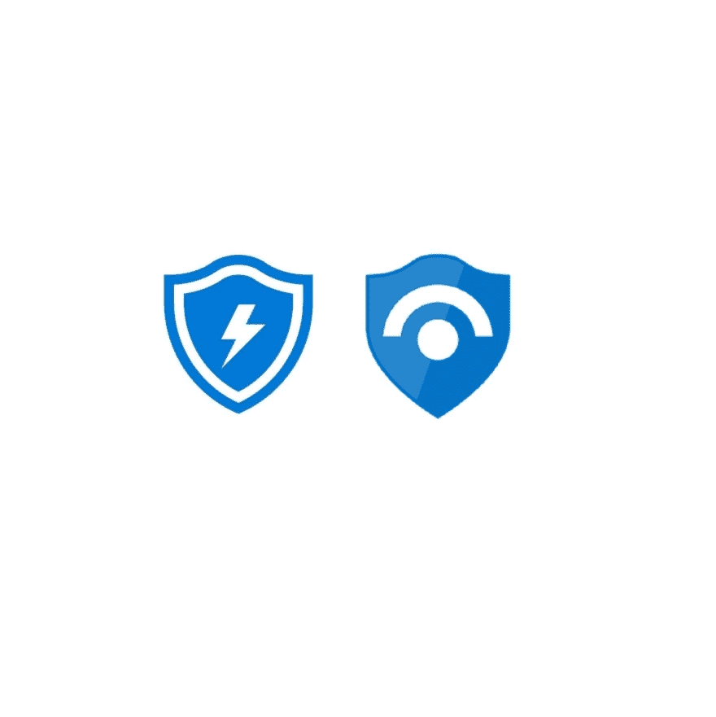
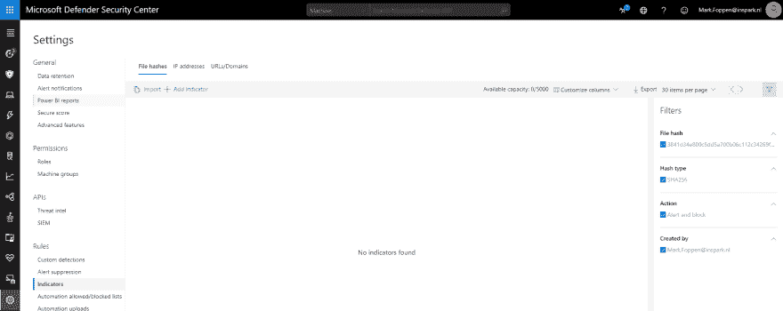
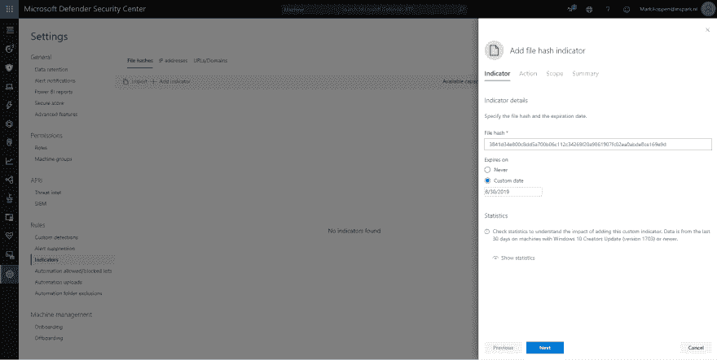
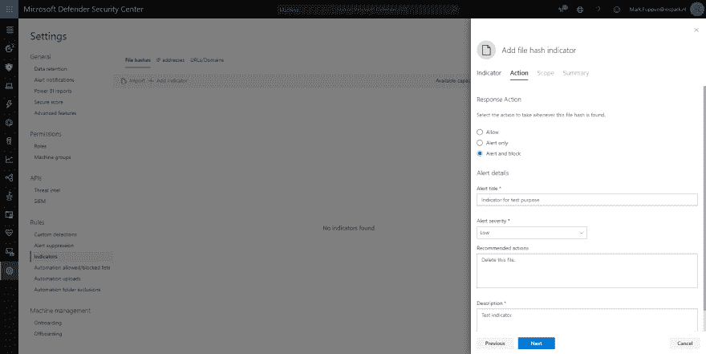
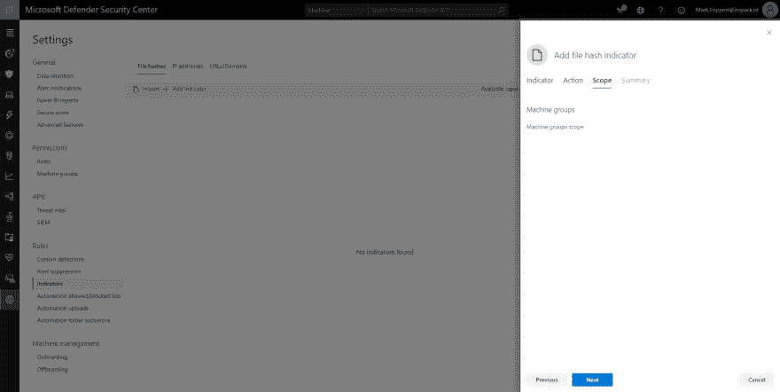
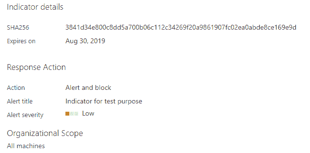
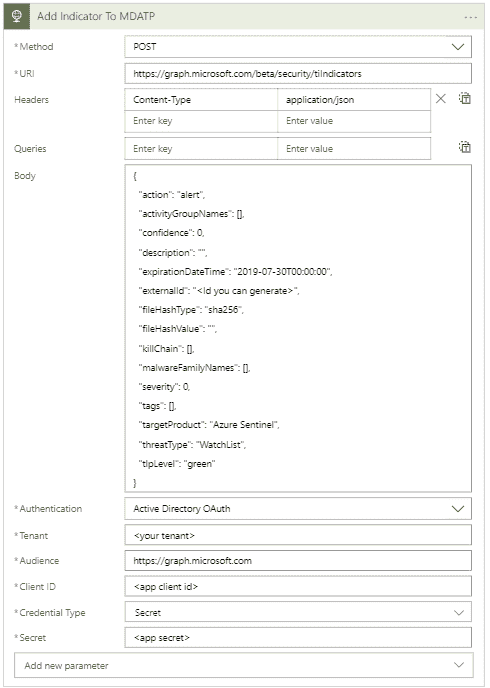
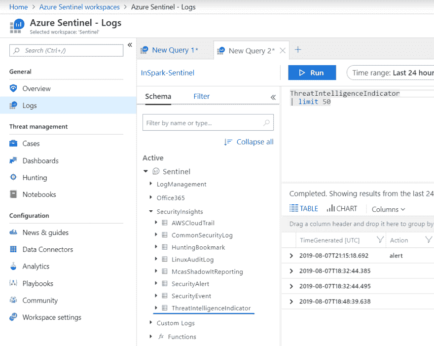

# 向 Azure Sentinel 发送您的威胁指标

> 原文：<https://dev.to/foppenma/sending-your-threat-indicators-to-azure-sentinel-4oma>

[](https://res.cloudinary.com/practicaldev/image/fetch/s--rTnNdqwG--/c_limit%2Cf_auto%2Cfl_progressive%2Cq_auto%2Cw_880/https://www.re-mark-able.net/conteimg/2019/08/ZnQSkLZ-_400x400-1.jpg)

您应该如何以及为什么将威胁指示器发送到 Azure Sentinel，或者手动将它们添加到 Microsoft Defender 高级威胁保护(MDATP)解决方案中？什么是指标，也称为折衷指标(IoC)？你为什么要在乎？你怎么能这样做？让我们仔细检查一下，并使用 Logic 应用程序和 Microsoft Graph Security API 手动添加指示器。

首先，我们将了解什么是指标以及它在 MDATP 中是如何工作的，以便更好地理解我们正在处理的是什么。然后通过微软 Graph Security API 将指标发送给 Azure Sentinel。

## 什么是指标？

IoC 是一种证据，可以表明您的环境中存在恶意活动。这可以有多种形式，即:

*   文件哈希
*   网络活动
*   Ip 地址或 URL

国际奥委会本身并不一定意味着你已经妥协。通常，文件哈希、网络活动和来源(IP 或 Url)的组合是上下文的提供者，而上下文又决定了它是否是一种威胁。要了解更多信息，你可以看看米特 ATT&CK 框架[这里](https://digitalguardian.com/blog/what-mitre-attck-framework)。这是一个框架，描述了用于识别和防御对您组织的攻击的策略和技术。

这一切都很好，但如果您在一台受管设备上遇到一个应用程序，并希望为整个组织阻止它，该怎么办呢？以 Android 应用程序为例(。apk)目前没有被 MDATP 检测到。众所周知，这些应用程序也可能含有恶意软件或下载其他应用程序。你的一个用户把它发送给另一个用户，然后又发送给另一个用户，如此循环。你怎么能阻止这一切？通过将 APK 的文件散列添加到 MDATP 中的指示符。这将停止文件的传播，并允许您进一步调查它。

## 手工添加指标

我们去 MDATP [门户](https://securitycenter.windows.com)登录吧。要进入**指示器**页面，我们首先必须进入左侧菜单中的**设置**，然后进入指示器页面。在这里，您可以看到所有指标的概览。这应该看起来像下面的门户

[](https://res.cloudinary.com/practicaldev/image/fetch/s--Lni_nhuD--/c_limit%2Cf_auto%2Cfl_progressive%2Cq_auto%2Cw_880/https://www.re-mark-able.net/conteimg/2019/07/Overview.png)

通过点击**+添加指标**，我们可以手动添加一个新指标。在这里，您必须给出文件哈希，可以是 SHA1、SHA256 或 MD5。目前，写这篇文章的时候有 5000 个指标的限制。通过设置到期日期，您可以自动清理它们。

[](https://res.cloudinary.com/practicaldev/image/fetch/s--6rYOd7yn--/c_limit%2Cf_auto%2Cfl_progressive%2Cq_auto%2Cw_880/https://www.re-mark-able.net/conteimg/2019/07/AddIndicator.png)

当您进入添加指示器的下一步时，您必须确定当存在具有相同散列的文件时 MDATP 应该采取的操作。我们有 3 种可能的行动:

*   允许
*   仅警报
*   警报和阻止

当 MDATP 已经阻止了您不希望被阻止的文件或可执行文件时，使用 **Allow** 。以 Mimikatz 为例，如果你把它的文件散列放在这里，你就可以使用这个程序，而不需要 MDATP 把它隔离。

**仅警报**用于您只想收到文件被检测到的警报，但不想阻止它的情况。如果你可以自己发布警告，你不应该使用这个。相反，使用 MDATP API (docs [这里是](https://docs.microsoft.com/en-us/windows/security/threat-protection/microsoft-defender-atp/create-alert-by-reference))来创建警报。这样你就不会在 5000 个条目的限制上使用另一个点。

**Alert & Block** 当您想要立即在所有或部分机器上阻止该文件时使用。使用这个选项时要非常小心。如果一个重要的 windows 文件在这里结束，它将对您的组织产生影响。

[](https://res.cloudinary.com/practicaldev/image/fetch/s--MIu81Q4X--/c_limit%2Cf_auto%2Cfl_progressive%2Cq_auto%2Cw_880/https://www.re-mark-able.net/conteimg/2019/07/ActionIndicator.png)

第 3 页也是最后一页是设置指标的范围。在下面的截图中，你看不到任何范围，因为我没有任何范围。范围可以设置为确定的机器列表或组织中的所有机器。

[](https://res.cloudinary.com/practicaldev/image/fetch/s--VFO0-etO--/c_limit%2Cf_auto%2Cfl_progressive%2Cq_auto%2Cw_880/https://www.re-mark-able.net/conteimg/2019/07/ScopeIndicators.png)

最后一步是总结，以确保您没有犯错误，并仔细检查您的输入。

[](https://res.cloudinary.com/practicaldev/image/fetch/s--FHY_Kvyt--/c_limit%2Cf_auto%2Cfl_progressive%2Cq_auto%2Cw_880/https://www.re-mark-able.net/conteimg/2019/07/Summary.png)

在我们完成这些简单的步骤后，您将看到指标添加到列表中。

[](https://res.cloudinary.com/practicaldev/image/fetch/s--gRWqWmxa--/c_limit%2Cf_auto%2Cfl_progressive%2Cq_auto%2Cw_880/https://www.re-mark-able.net/conteimg/2019/07/Added.png)

## 通过微软图形安全 API 添加指标

现在我们已经很好地理解了什么是威胁指示器以及它们是如何工作的，我们可以开始将它们添加到 Azure Sentinel 中了。为什么我们要将它们添加到 Azure Sentinel 中？Azure Sentinel 是一个非常好的产品，可以将不同日志源和不同微软安全产品之间的安全事件关联起来。

> 确保 Azure Sentinel 中的**威胁情报**数据连接器已启用。

为了给 Azure 添加指示器，我们使用了 Microsoft Graph Security API (beta)。在发布新指标之前，我们需要先设置一些属性:

*   动作:预警，只发出预警，不屏蔽文件。
*   FileHashType: SHA256，在这个例子中，为了简单起见，我们只处理 SHA256 哈希
*   FileHashValue:实际的文件哈希
*   到期日期:指标何时到期

一条基本的 post 消息应该是这样的:

```
{
  "action": "alert",
  "activityGroupNames": [],
  "confidence": 0,
  "description": "This is a canary indicator for demo purpose. Take no action on any observables set in this indicator.",
  "expirationDateTime": "2019-03-01T21:44:03.1668987+00:00",
  "externalId": "Test--8586509942423126760MS164-0",
  "fileHashType": "sha256",
  "fileHashValue": "b555c45c5b1b01304217e72118d6ca1b14b7013644a078273cea27bbdc1cf9d5",
  "killChain": [],
  "malwareFamilyNames": [],
  "severity": 3,
  "tags": [],
  "targetProduct": "Azure Sentinel",
  "threatType": "WatchList",
  "tlpLevel": "green",
} 
```

为了简单起见，你可以用 [postman](https://www.getpostman.com/) 将它发布到 Graph Security API，或者像我一样使用 Azure Logic 应用程序。您的逻辑应用程序 Http 步骤将类似于下图:

[](https://res.cloudinary.com/practicaldev/image/fetch/s--sfPIQenZ--/c_limit%2Cf_auto%2Cfl_progressive%2Cq_auto%2Cw_880/https://www.re-mark-able.net/conteimg/2019/07/logicapp.png)

在 logic 应用程序中，您会看到一个客户端 id 和客户端密码。这些来自应用程序注册，您可以看看[这里](https://dev.to/foppenma/how-to-access-data-from-the-beta-channel-of-graph-api-od5)您可以如何设置它。请记住，您的应用程序需要许可**威胁指示符。ReadWrite.OwnedBy** 请求工作。此权限需要由您的租户中的全局管理员授予。

> 有没有注意到 **targetProduct** 属性设置为 **Azure Sentinel** ？这是指定指示器重定向到的位置。

成功发布后，您可以在 Azure Sentinel 仪表板中查看指示器。这可以通过访问威胁智能指示器日志源来完成

[](https://res.cloudinary.com/practicaldev/image/fetch/s--sHuaW-Y9--/c_limit%2Cf_auto%2Cfl_progressive%2Cq_auto%2Cw_880/https://www.re-mark-able.net/conteimg/2019/08/SentinelLogSource.png)

当你查询这个的时候，你会得到类似如下的结果，这取决于你发布了多少个指标。

[](https://res.cloudinary.com/practicaldev/image/fetch/s--kIzRdtfe--/c_limit%2Cf_auto%2Cfl_progressive%2Cq_auto%2Cw_880/https://www.re-mark-able.net/conteimg/2019/08/Sentinel.png)

向 MDATP 和 Azure Sentinel 添加指示器是多么容易，但却如此强大。现在，您可以利用 Azure Sentinel 警报、关联和搜索中的指标数据。

感谢阅读！