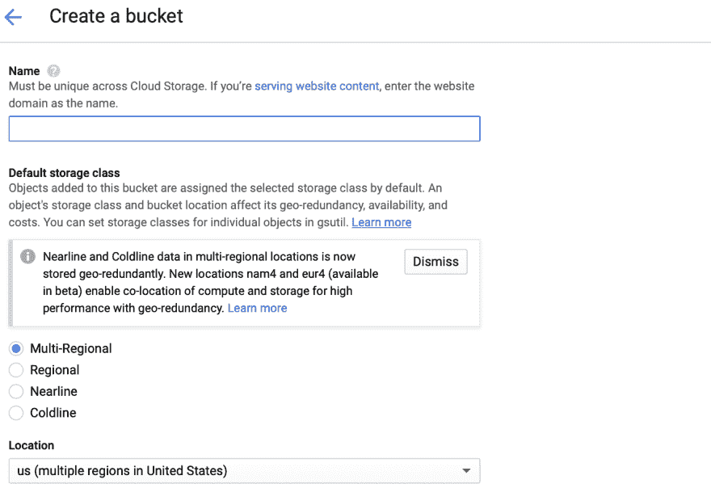
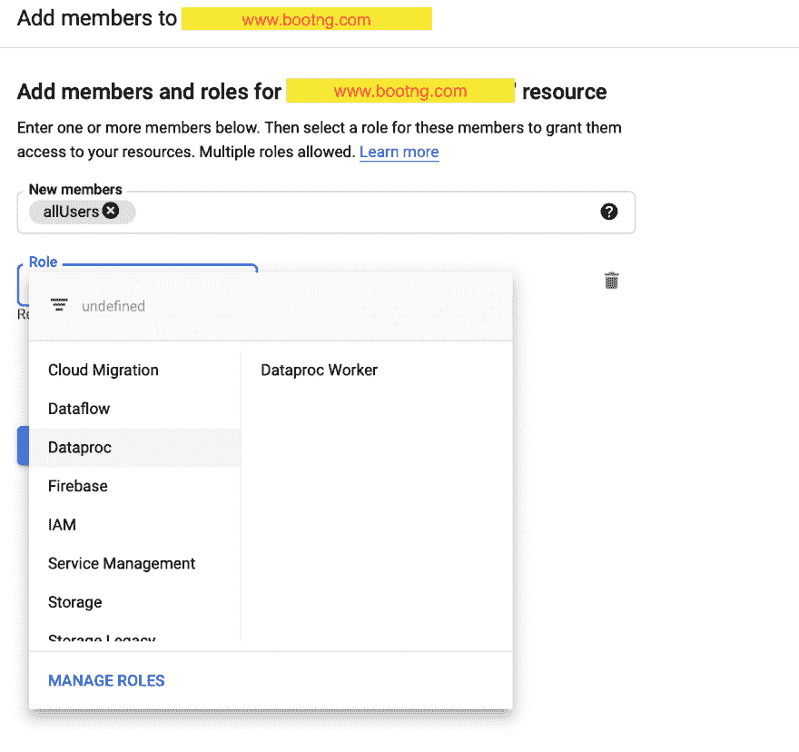

# 用 GCP 和谷歌域名建立一个静态网站

> 原文：<https://dev.to/siddharthab/setting-up-a-static-website-with-gcp-and-google-domain-3ko8>

本文将介绍在 GCP 上发布一个静态网站所需的设置，并使用谷歌域中的自定义域。它假设我们有一些像 html 页面等内容。在 GCP 上发布为静态网站。虽然它是为谷歌域名注册的域名而写的，但是其他域名提供商也可以。
假设

我们有一些像 HTML 页面这样的静态资源要发布。我们已经获得了一个拥有所有权的域名。
我们将使用 CNAME 将域名映射到 GCP 的静态页面桶。

# 高等级步骤

1)设置自定义域名 DNS 将请求转发给
2)在 Google cloud 上设置存储桶

# 在自定义域上设置 DNS

我们希望域名被映射到 GCP 资源(在我们的例子中，桶持有静态资源)。为自定义域设置 DNS 非常简单，我们只需要在自定义域 DNS 部分映射 CNAME 条目。

登录到 Google 域，并转到相应域的 DNS 设置页面。在自定义资源记录下有一个到 c.storage.googleapis.com 的 www 条目，如下所示。

一旦我们保存了上面的配置，我们就可以进入下一部分，在 GCP 设置静态桶。

为了更多地了解 CNAME 和它是如何运作的，一个 vs CNAME 的记录解释了 CNAME 记录的优势和它是如何运作的。
[A vs CNAME 战绩](https://webdevpedia.blogspot.com/2019/06/a-record-vs-cname-record.html)

# 在谷歌云上设置桶

创建一个名称与您为域创建的 CNAME 相匹配的存储桶。
例如，如果您添加了一个指向 c.storage.googleapis.com 的[www.bootng.com](http://www.bootng.com)的 CNAME 记录，那么创建一个名为“[www.bootng.com](http://www.bootng.com)的存储桶。
创建存储桶:
在 Google 云平台控制台中打开云存储浏览器。

[打开云存储浏览器](https://console.cloud.google.com/)

单击创建存储桶打开存储桶创建表单。
输入您的存储桶信息，然后单击继续完成每个步骤:
您的存储桶的名称。
铲斗的存储类别和位置。

单击创建。

一旦创建了 bucket，我们需要上传静态站点的内容，然后给单个对象(文件、目录)或 bucket 本身适当的权限。

要为存储桶分配权限，请执行以下操作:

转到存储桶列表页面，对应于刚刚创建的存储桶，单击最后一列，这将打开如下所示的操作菜单，然后单击编辑存储桶权限链接

因为我们希望公开这个 bucket 的内容，所以我们需要向一个名为 **allUsers** 的特殊组授予读取权限

完成后，存储桶列表将显示该存储桶可供公众访问。

# 结论

有了上面的设置，现在当我们键入[时，www.bootng.com](http://www.bootng.com)将映射到 GCP 上的桶[www.bootng.com](http://www.bootng.com)的内容。

我们仍然需要显式地访问资源，例如，如果我们有 welcome.html，那么我们需要在浏览器中键入[www.bootng.com/welcome.html](http://www.bootng.com/welcome.html)

本文没有涉及的几件事是:1)将默认页面映射到域名- >，这样我们就可以输入[www.bootng.com](http://www.bootng.com)T3】2)将子域映射到 GCP 桶- >，这样我们就可以输入 bootng.com