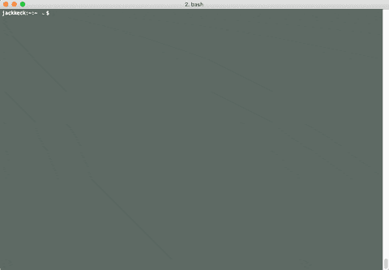
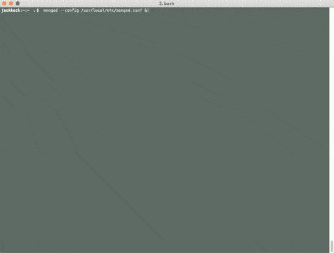
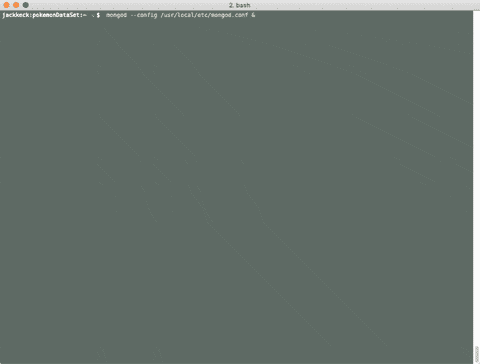
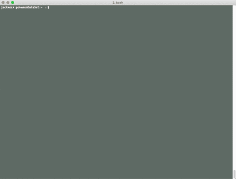
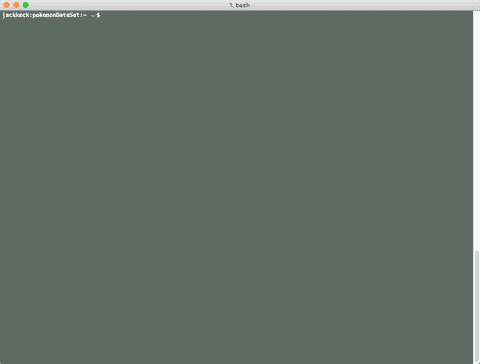
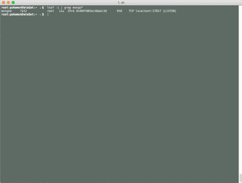

# 在本地设置 MongoDB

> 原文：<https://dev.to/jackkeck/setting-up-mongodb-locally-1lm2>

## **一个简单的 MONGO 数据库**

我使用过 MongoDB 很多次，想分享一下我通常是如何在本地构建快速实例的。如果你了解我，你就会知道我喜欢巴尼式的分解。

[](https://i.giphy.com/media/GMalHy5bWkfN6/giphy.gif)

所以不管你是新手还是经验丰富的兽医，都应该很容易理解。也就是说，我们将浏览:

*   [基本安装](#install)
*   [加载数据集](#load)
*   [基本安全](#security)

我依靠 [MongoDB 的安装说明](https://docs.mongodb.com/manual/tutorial/install-mongodb-on-os-x/)和他们的[核心文档](https://docs.mongodb.com/)进行安装。额外的来源在适当的情况下被内联注明。如果任何时候你需要从头开始，你可以使用底部的[有用碎片](#help)部分。有清理数据库的命令，以及如何执行干净的卸载。另外，你可以在下面找到我的[本地设置](#localhost)的细节。

* * *

* * *

## **我的本地主机**

为了在调试时保持透明和理智，这些是我的本地环境的相关细节。

| **本地设置** |
| --- |
| **OS** : macOS Mojave 10.14.4 |
| **自制**:自制 2.1.9 |
| **转到**:转到 2.22.0 版 |
| **MONGODB** : MongoDB 社区 4.0 |

* * *

* * *

## **安装**

[](https://i.giphy.com/media/ciwIbp8x2krQnhPgYu/giphy.gif) 
安装和启动 MongoDB 很简单。打开你的终端，使用下面的命令:

```
brew tap mongodb/brew
brew install mongodb-community@4.0 
mongod --config /usr/local/etc/mongod.conf & 
```

家酿的 [`tap`](https://docs.brew.sh/Taps) 命令创建了 [MongoDB 的公式](https://github.com/mongodb/homebrew-brew)的浅层克隆。这意味着它在您的自制软件中添加了一个指向 GitHub 库的引用/链接，以供将来使用。

我们运行 [`install`](https://docs.brew.sh/Manpage#install-formula) ，知道它使用我们之前指定的 MongoDB 公式。除了 MongoDB 二进制文件，Homebrew 还会创建您的配置文件(`mongod.conf`)和必要的路径。

尽管使用自制软件进行安装，我们将不会使用他们的 [`services`](https://docs.brew.sh/Manpage#services-subcommand) 命令。这是因为`brew services`使用了`launchctl`的 plist 文件。因此，[它不会在每次启动时获取配置文件的新副本。](https://github.com/Homebrew/homebrew-services/issues/186)

相反，我们直接调用 MongoDB 的父进程 [`mongod`](https://docs.mongodb.com/manual/reference/program/mongod/) ，并使用`--config`标志引用我们的“mongod.conf”。在 Linux 中，`&`是一个[控制操作符](https://www.w3resource.com/linux-system-administration/control-operators.php)。它允许您的 shell 管理在后台发出的命令；这将输出[过程标识符(PID)](http://www.linfo.org/pid.html) 。如果要验证，可以使用`jobs -l`打印进程运行背景及其 PID。你也可以使用`ps`(在这种情况下用一个`| grep mongo*`)。

* * *

* * *

## **载**

[](https://i.giphy.com/media/iFhFPIbQEQ6GPIs4KY/giphy.gif) 
现在我们已经安装并启动了 MongoDB，我们需要用数据填充它。我们将使用由 [ALT-WDI](https://github.com/ATL-WDI-Exercises) 提供的 [`mongo-pokemon`](https://github.com/ATL-WDI-Exercises/mongo-pokemon) 库中的数据集。为了简单起见，我将这个回购分成两部分，并将其精简为我们需要的单个数据集文件。

确保您已经启动了 MongoDB 实例，然后打开您的终端，导航到一个干净的目录，并运行以下代码:

```
git clone https://github.com/jackkeck/pokemonDataSet
cd pokemonDataSet
mongoimport -d pokemon -c pokemons --jsonArray < pokemon.json
mongo
show dbs
use pokemon
show collections
db.pokemons.find().pretty() 
```

Git 的 [`clone`](https://git-scm.com/docs/git-clone) 命令会将我的分叉存储库复制到您的本地机器上。一旦它被下载，你使用 [`cd`](http://linuxcommand.org/lc3_man_pages/cdh.html) 下拉到存储库中。

MongoDB 的 [`mongoimport`](https://docs.mongodb.com/manual/reference/program/mongoimport/) 命令允许我们批量装载数据。在这种情况下，我们使用标志来完成一些事情。我们正在使用`-d`标志创建一个名为“口袋妖怪”的数据库。我们正在使用`-c`国旗创建一个名为“口袋妖怪”的集合。我们告诉 import 命令将数据文件视为一个 [JSON 数组](https://www.json.org/)。最后，我们将 pokemon.json 指定为我们的导入文件。

MongoDB 通过它的 [`mongo`](https://docs.mongodb.com/manual/mongo/) 命令提供了一个基于 Javascript 的 shell。一旦我们弹出一个 shell，我们就使用 [`show dbs`](https://docs.mongodb.com/manual/reference/mongo-shell/) 命令来列出所有可用的数据库，以验证我们已经创建了 pokemon 数据库。我们`use`口袋妖怪数据库然后使用 [`show collections`](https://docs.mongodb.com/manual/reference/mongo-shell/) 列出它的收藏。我们可以看到“口袋妖怪”集合被创建，所以我们使用 [`db.pokemons.find().pretty()`](https://docs.mongodb.com/manual/reference/method/db.collection.find/index.html) 来检查数据是否被导入。我喜欢添加 [`.pretty()`](https://docs.mongodb.com/manual/reference/method/cursor.pretty/index.html) 方法，让输出更容易阅读。对于熟悉关系数据库和 sql 的人来说，这是 mongo 中的`select * from pokemon.pokemons`。

* * *

* * *

## **安全**

MongoDB 和安全社区有着有趣的关系。在 3.6 版本之前，MongoDB 默认允许 27017 端口上的任何连接(这意味着如果您不在防火墙后面，任何人都可以进入您的数据库)。即使现在，它仍然没有默认启用任何类型的访问控制或身份验证，除非您有企业许可版本💰。本节将介绍一些我们可以用来保护实例的基本步骤。

* * *

* * *

### **基于角色的访问控制**

作为一条规则，我们应该努力遵守最小特权原则(PoLP)。通过现在应用这一原则，我们可以确保我们构建的应用程序具有生产环境中的访问级别。

MongoDB 使用基于角色的访问控制(RBAC)来实现治理(er....控制)的访问。有大量关于 RBAC 是什么的资料。如果你感兴趣的话，这里有来自大卫·费拉约洛和里夏德·库恩的会议论文*“基于角色的访问控制”* : 的定义

> 基于角色的访问控制(RBAC)策略将访问控制决策建立在用户在组织内被允许执行的功能的基础上。用户不能随意将访问权限传递给其他用户。

默认情况下，MongoDB 不会启用此功能。为了实现这一点，我们需要:

1.  创建超级用户。
2.  在我们的`mongod.conf`中启用`authorization`。
3.  创建一个具有读写(RW)权限的用户，但只能访问 pokemon 数据库。

#### *创建管理员用户*

[](https://i.giphy.com/media/McUpUbMLNHwjFm0o3K/giphy.gif) 
超级用户可以做任何事情。默认情况下，你一直使用这个权限。因此，让我们创建一个带有密码的专用管理员用户。在您的终端中，打开一个 mongo shell 并运行以下命令:

```
use admin

db.createUser(
  { 
    user: "admin",  
    pwd: "doNotEatThat", 
    roles: 
      [
        {role: "userAdminAnyDatabase", db: "admin"},
        {role: "dbAdminAnyDatabase",   db: "admin"},
        {role: "readWriteAnyDatabase", db: "admin"}
      ]
  }
) 
```

* * *

* * *

#### *启用授权*

[](https://i.giphy.com/media/MBNtB3E78GeCA0Rdyl/giphy.gif) 
一旦创建了 admin 用户，我们需要在 MongoDB 中启用`security.authorization`设置。

1.  停止 MongoDB 运行`pkill -f mongod`来停止数据库。您可以确认它已经停止使用`jobs -l`。
2.  更新`mongod.conf`我用了`sudo vi`。作为参考，使用箭头键到达文件的末尾，按键盘上的“I”键键入，在下面添加安全块，按键盘上的“esc”键，然后键入“:wq”，然后按 enter 键保存并退出。

```
/:~$ sudo vi /usr/local/etc/mongod.conf

systemLog:
  destination: file
  path: /usr/local/var/log/mongodb/mongo.log
  logAppend: true
storage:
  dbPath: /usr/local/var/mongodb
net:
  bindIp: 127.0.0.1
security:
   authorization: enabled 
```

#### *创建基础用户*

[](https://i.giphy.com/media/J4Ij43gtosj1PWAVaE/giphy.gif) 
基本用户仅对*口袋妖怪数据库拥有读写权限。在您的终端中，打开一个 mongo shell 并运行以下代码:* 

```
db.auth("admin", "doNotEatThat")

use pokemon

db.createUser(
  { 
    user: "misty",  
    pwd: "godDamitPsyduck", 
    roles: 
      [
        {role: "readWrite", db: "pokemon"}
      ]
  }
) 
```

* * *

* * *

#### *信任，但*核实

[](https://i.giphy.com/media/XBu8j8LPQB3WNqQn1m/giphy.gif) 
验证你的数据库现在是用 RBAC 治理的，试着连接并查看一些东西。您会注意到，当您使用`mongo` shell 启动一个连接时，不再有警告消息说“没有为这个数据库启用访问控制”。此外，在使用`db.auth("user","pwd")`验证之前，我们无法查看或编辑任何内容。

* * *

* * *

#### **更改默认端口**

[](https://i.giphy.com/media/LPHQpKvJKUsIZSOD2A/giphy.gif) 
从 MongoDB 3.6 开始，mongod 现在被配置为只允许来自本地主机的*连接。这意味着您只能从您的笔记本电脑访问您的实例。这很好，但是 IP 可能会被欺骗，等等。我们将采取的一个额外步骤是更改默认的 MongoDB 的默认端口。类似于我们如何启用`security.authorization`，我们将更新我们的`mongod.conf`。*

1.  停止 MongoDB 运行`pkill -f mongod`来停止数据库。您可以确认它已经停止使用`jobs -l`。
2.  更新`mongod.conf`我用了`sudo vi`。作为参考，使用箭头键到达文件的末尾，按键盘上的“I”键键入，在下面添加端口设置，按键盘上的“esc”键，然后键入“:wq”，然后按 enter 键保存并退出。

```
/:~$ sudo vi /usr/local/etc/mongod.conf

systemLog:
  destination: file
  path: /usr/local/var/log/mongodb/mongo.log
  logAppend: true
storage:
  dbPath: /usr/local/var/mongodb
net:
  port: 23456
  bindIp: 127.0.0.1
security:
   authorization: enabled 
```

现在开始备份您的数据库。请记住，你需要运行“mongo - port 23456”来启动你的连接。

* * *

* * *

#### **义气残羹**

**数据库清理**
要快速清除除 admin 之外的所有数据库*，请使用来自用户的这个漂亮的一行程序 [kev](https://stackoverflow.com/users/348785/kev) 作为[MongoDB drop every DATABASE](https://stackoverflow.com/a/16908246)线程堆栈溢出:
``bash
mongo --quiet --eval 'db.getMongo().getDBNames().forEach(function(i){db.getSiblingDB(i).dropDatabase()})'`  `**CLEAN UNISTALLL**
To completely uninstall MongoDB and delete all of its tertiary data, please run the following commands:
``bash
pkill -f mongod
launchctl unload ~/Library/LaunchAgents/homebrew.mxcl.mongodb.plist
rm -f ~/Library/LaunchAgents/homebrew.mxcl.mongodb.plist
launchctl remove homebrew.mxcl.mongodb
brew uninstall --force mongodb-community
brew untap mongodb/brew
rm -rf /usr/local/etc/mongo*
rm -rf /usr/local/bin/mong*
rm -rf /usr/local/var/mongodb
rm -rf /Users/$USER/Library/Caches/Homebrew/downloads/*mongodb*
``` 
