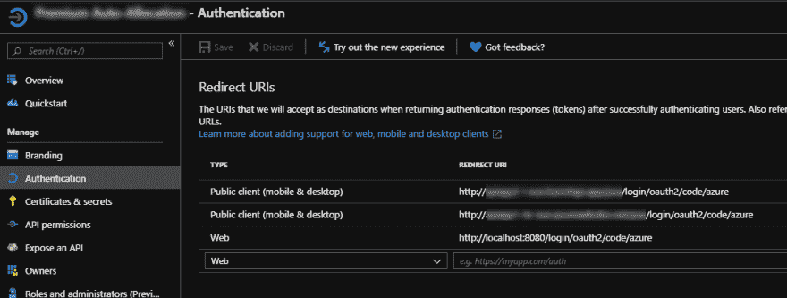
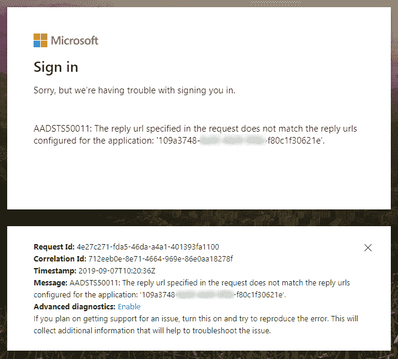

# 使用 Azure Active Directory 设置 Spring 安全性

> 原文：<https://dev.to/cowinr/setting-up-spring-security-with-azure-active-directory-55l5>

以下是配置 Spring Boot web 应用以使用 Azure Active Directory 身份验证的设置。

App 基于`spring-boot-starter-parent:2.1.4.RELEASE`。

POM 依赖项片段:

```
<dependency>
    <groupId>com.microsoft.azure</groupId>
    <artifactId>azure-active-directory-spring-boot-starter</artifactId>
    <version>2.1.6</version>
</dependency>

<dependency>
    <groupId>org.springframework.boot</groupId>
    <artifactId>spring-boot-starter-security</artifactId>
</dependency>

<dependency>
    <groupId>org.springframework.security</groupId>
    <artifactId>spring-security-oauth2-client</artifactId>
</dependency>

<dependency>
    <groupId>org.springframework.security</groupId>
    <artifactId>spring-security-oauth2-jose</artifactId>
</dependency> 
```

`application.properties`片段:

```
# Active Directory Authentication
spring.security.oauth2.client.registration.azure.client-id=109a3748-yada-yada-yada-f80c1f30621e
spring.security.oauth2.client.registration.azure.client-secret=OBAYaOKp-HwhateverIxFxY@?
azure.activedirectory.tenant-id=f447e5ca-yada-yada-yada-370ff157fdb6
azure.activedirectory.user-group.allowed-groups=group1, group2
azure.activedirectory.active-directory-groups=group1, group2 
```

`AADOAuth2LoginSecurityConfig.java` :

```
@EnableWebSecurity
@EnableGlobalMethodSecurity(prePostEnabled = true)
public class AADOAuth2LoginSecurityConfig extends WebSecurityConfigurerAdapter {

    @Autowired
    private OAuth2UserService<OidcUserRequest, OidcUser> oidcUserService;

    @Override
    protected void configure(HttpSecurity http) throws Exception {
        http
                .csrf().disable()
                .authorizeRequests()
                .antMatchers("/**").hasRole("group1")
                .anyRequest().authenticated()
                .and()
                .exceptionHandling().accessDeniedPage("/browse/403")
                .and()
                .oauth2Login()
                .userInfoEndpoint()
                .oidcUserService(oidcUserService);
    }

} 
```

我被 JSP 卡住了，所以使用 taglibs，例如:

```
<security:authorize access="hasRole('group1')">
    Authorised users only
</security:authorize>

User's name: <security:authentication property="name"/> 
```

Azure 配置是它开始变得奇怪的地方。有一个关联的应用程序注册，其身份验证配置如下:

[](https://res.cloudinary.com/practicaldev/image/fetch/s--xUiyu5DL--/c_limit%2Cf_auto%2Cfl_progressive%2Cq_auto%2Cw_880/https://thepracticaldev.s3.amazonaws.com/i/8vq22memrva62d1ct4bo.png)

我有一个`localhost`设置，它允许本地开发使用`http`前缀——这没什么不对。

然而，对于我的两个应用服务部署，我必须使用`http`而不是`https`(注意。我的应用程序配置为仅接受 HTTPS)，我只能通过选择“公共客户端(移动&桌面)”来完成此操作。

如果我尝试使用类型为“Web”的`https`,我会得到以下认证错误:

[](https://res.cloudinary.com/practicaldev/image/fetch/s--a-_bfsRe--/c_limit%2Cf_auto%2Cfl_progressive%2Cq_auto%2Cw_880/https://thepracticaldev.s3.amazonaws.com/i/uhbpvclwxl2shwps8mb8.png)