# 使用 Laravel 为水疗中心设置 Vue

> 原文：<https://dev.to/raghunathan/setting-up-vue-with-laravel-for-spas-1d0i>

本文将指导您设置 Laravel 环境，使您能够在前端使用 Vue 创建单页面应用程序(spa)。

Laravel 自带内置支持，支持用 Vue 开发前端。其实 Laravel 的官网也是用 Vue 开发的。

事不宜迟，我们开始吧。

# 基本项目设置

我们需要使用命令行创建一个 Laravel 项目；前往您的服务器根目录并创建一个新项目

现在完成了，在你的浏览器中打开项目，你应该看到这个；

[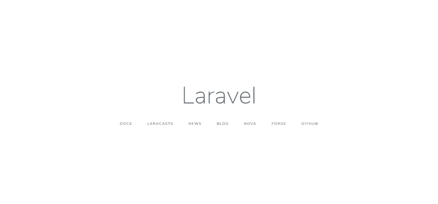](https://res.cloudinary.com/practicaldev/image/fetch/s--N8AkLQUh--/c_limit%2Cf_auto%2Cfl_progressive%2Cq_auto%2Cw_880/https://thepracticaldev.s3.amazonaws.com/i/kfa7dum4t7d1q09enjkj.png)

我们现在已经成功地创建了一个 Laravel 项目。

# Vue 端

让我们先完成 Vue 端的设置，然后再继续学习 Laravel 端。

建议您在系统上安装 npm，因为您将在整个开发过程中使用它来安装软件包。

Vue 端的核心是 app.js 文件，它位于/resources/js/app.js 中。
它将包含所有已安装的包导入和 Vue 应用配置

[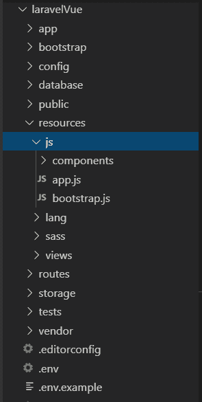](https://res.cloudinary.com/practicaldev/image/fetch/s--_HN65umU--/c_limit%2Cf_auto%2Cfl_progressive%2Cq_auto%2Cw_880/https://thepracticaldev.s3.amazonaws.com/i/uoumpxfshn1ajeohdfp3.png)

打开 app.js 并删除现有代码，因为我们将从头开始。让我们首先导入 Vue，然后创建一个新的 Vue app 实例，该实例配置 id 为 **app** 的元素(将在 Laravel 端创建)供 Vue 使用。

[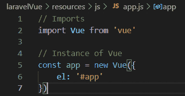](https://res.cloudinary.com/practicaldev/image/fetch/s--4aaBT8vc--/c_limit%2Cf_auto%2Cfl_progressive%2Cq_auto%2Cw_880/https://thepracticaldev.s3.amazonaws.com/i/b66x23l9bhpc80yvdwvd.png)

我们将使用 vue-router 来实施 SPA，因此让我们继续使用 npm 来安装它。安装后，我们将使用 app.js 将其导入到我们的应用程序中，告诉 Vue 使用它，然后在 Vue 实例中设置 router 变量。然后，我们将创建一个 **routes.js** 文件，我们将在其中为我们的应用程序配置路线，并将其导入 app.js 文件中。

[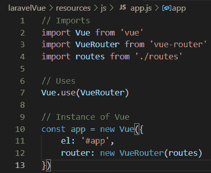](https://res.cloudinary.com/practicaldev/image/fetch/s--qGIA2x0x--/c_limit%2Cf_auto%2Cfl_progressive%2Cq_auto%2Cw_880/https://thepracticaldev.s3.amazonaws.com/i/uwyo50gt3p2fo478y643.png)

[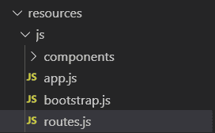](https://res.cloudinary.com/practicaldev/image/fetch/s--W-kd9Zkq--/c_limit%2Cf_auto%2Cfl_progressive%2Cq_auto%2Cw_880/https://thepracticaldev.s3.amazonaws.com/i/a9sxvq4xq7rsyj3rha5l.png)

我们现在已经用 Vue 路由器设置了 Vue。
我们现在将创建三个组件；

1.  应用程序视图
2.  主视图
3.  About.vue，都在组件目录里面。

在此之前，删除 components 目录中的现有组件。

App.vue 文件是我们应用程序的根组件。这个组件将总是被加载到 DOM 中，其他组件(这里是 Home.vue 和 About.vue)将被动态加载到 DOM 中。

就 App.vue 文件而言，我们将创建各种导航，以动态地从 Home.vue 和 About.vue 切换，然后我们将使用 **router-view** 标签将所需的组件加载到其中。

[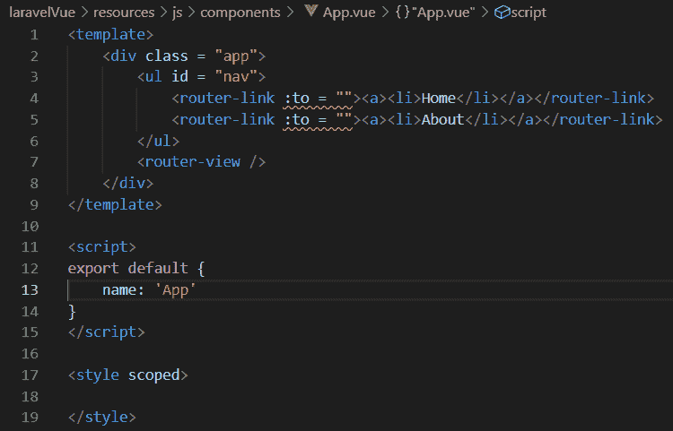](https://res.cloudinary.com/practicaldev/image/fetch/s--eoKEEm5C--/c_limit%2Cf_auto%2Cfl_progressive%2Cq_auto%2Cw_880/https://thepracticaldev.s3.amazonaws.com/i/odtfftll24l8atn9sx7y.png)

*到*属性故意留空。一旦我们定义了路线，它就会被填充。

现在，我们已经定义了 App 组件，让我们继续将它添加到我们在 app.js 中创建的 Vue 实例中。

[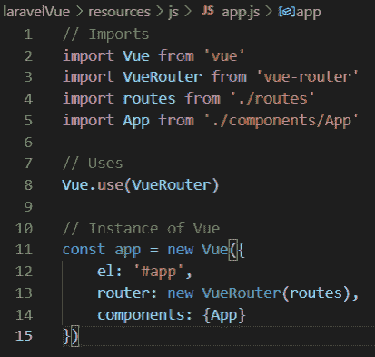](https://res.cloudinary.com/practicaldev/image/fetch/s--Wa3UW09n--/c_limit%2Cf_auto%2Cfl_progressive%2Cq_auto%2Cw_880/https://thepracticaldev.s3.amazonaws.com/i/8ksnqxu3ald3dl9qsgua.png)

我们现在已经配置了 Vue 实例，将 App 组件注入到 id 为 **app** 的元素中。

现在，让我们在 routes.js 文件中定义路由。我们将有两条路线，一条用于 Home 组件，另一条用于 About 组件。

[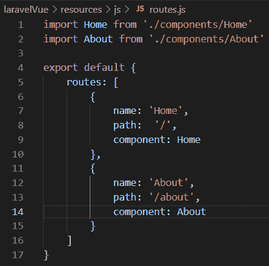](https://res.cloudinary.com/practicaldev/image/fetch/s--f-cuYaEN--/c_limit%2Cf_auto%2Cfl_progressive%2Cq_auto%2Cw_880/https://thepracticaldev.s3.amazonaws.com/i/oek5f53v2rln0nd0bse9.png)

定义路由后，我们需要将其添加到 App.vue 文件的 router-link 标签的*到*属性中

现在让我们在 Home.vue 和 About.vue 文件中添加一些内容。

[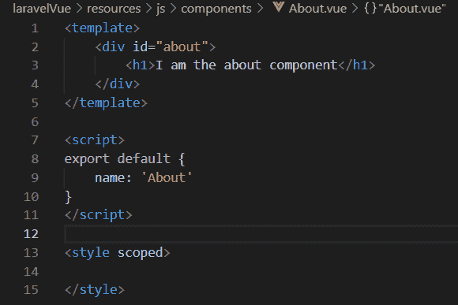](https://res.cloudinary.com/practicaldev/image/fetch/s--B_a7LpHs--/c_limit%2Cf_auto%2Cfl_progressive%2Cq_auto%2Cw_880/https://thepracticaldev.s3.amazonaws.com/i/4icoyl9mof6ew4pk19gy.png)

完成后，Vue 的设置就完成了。

# 船舷

打开/routes/web.php，更改如下所示的内容，使 Laravel 路由与 Vue 路由器无缝协作。

[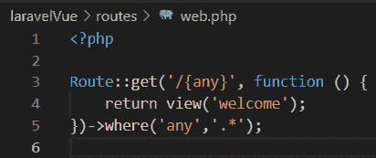](https://res.cloudinary.com/practicaldev/image/fetch/s--QGQ1DGg_--/c_limit%2Cf_auto%2Cfl_progressive%2Cq_auto%2Cw_880/https://thepracticaldev.s3.amazonaws.com/i/vdwau4qg4hihg6v2ua8n.png)

现在我们需要更改/resources/views/welcome . blade . PHP 的内容来使用 Vue。

我们将首先删除 welcome.blade.php 的内容，然后用我们自己的代码替换它。

我们必须创建一个 id 为 **app** 的元素，然后在这个元素中注入 app 组件。

最后，我们需要使用脚本标签将 **app.js** 链接到 welcome.blade.php。

[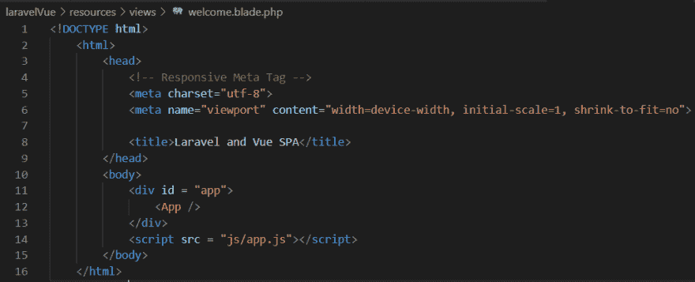](https://res.cloudinary.com/practicaldev/image/fetch/s--8RTHEh8O--/c_limit%2Cf_auto%2Cfl_progressive%2Cq_auto%2Cw_880/https://thepracticaldev.s3.amazonaws.com/i/vwkm6catv2jfsbk7ltvr.png)

至此，Laravel 的设置也完成了。

# 演示

[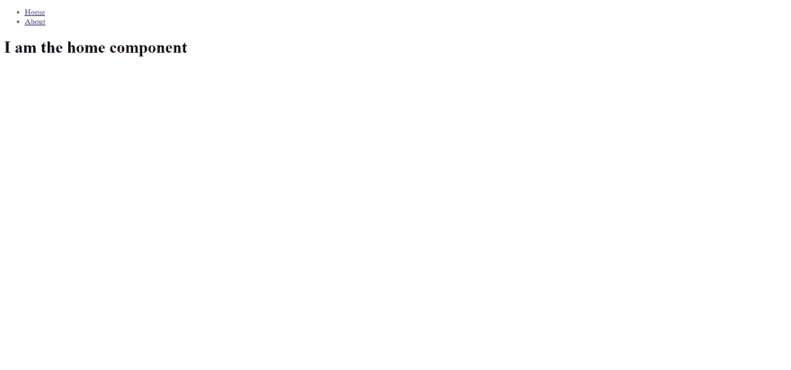](https://res.cloudinary.com/practicaldev/image/fetch/s--FymtioRf--/c_limit%2Cf_auto%2Cfl_progressive%2Cq_auto%2Cw_880/https://thepracticaldev.s3.amazonaws.com/i/0qnxfy0bhch1717e9hns.png)

感谢您的阅读！