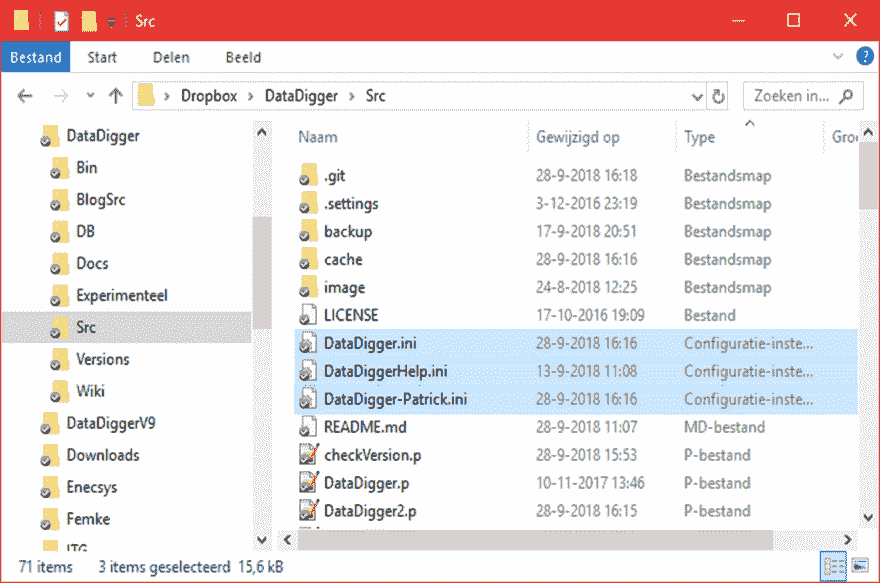

# 设置，到处都是设置

> 原文：<https://dev.to/patricktingen/settings-settings-everywhere-al2>

DataDigger 是一款面向 OpenEdge 开发者的开源数据库浏览器。它使他们能够查看、更新、删除、即时通讯和导出数据库中的数据。DataDigger 完全是用 OpenEdge 4GL 编写的，有超过 40，000 行代码。里面是一些真正的宝藏，所以我将剖析数据挖掘者，揭示他们。今天:缓存。

数据挖掘者记得很多。这可能是很少被注意到的事情，但是像窗口大小、位置、你选择了什么表、你隐藏了哪些字段或者你使用了什么过滤器，所有这些都被记录在设置文件中。但是还有更多，因为您在设置屏幕中使用的设置也保存在 ini 文件中。当您再次启动 DataDigger 时，这些设置将被保存和恢复。但是幕后发生了什么呢？

可以通过多种方式将设置保存在磁盘上。对于 DataDigger，我决定使用一个通用的设置格式，我选择了 Windows 使用的 [ini 文件格式](https://en.wikipedia.org/wiki/INI_file)。这是一种可读性很强的格式，并允许外部工具在必要时编辑文件。其他可能的格式有 xml 文件、json 文件或专有格式，但是我选择了一个简单的结构:

```
DEFINE TEMP-TABLE ttConfig NO-UNDO 
  FIELD cSection AS CHARACTER 
  FIELD cSetting AS CHARACTER
  FIELD cValue AS CHARACTER 
  INDEX idxPrim IS PRIMARY cSection cSetting. 
```

填充它很简单:

```
PROCEDURE readConfigFile : 
  DEFINE INPUT PARAMETER pcConfigFile AS CHARACTER NO-UNDO. 

  DEFINE VARIABLE cSection AS CHARACTER NO-UNDO. 
  DEFINE VARIABLE cLine    AS CHARACTER NO-UNDO. 

  INPUT FROM VALUE(pcConfigFile). 
  REPEAT: 
    IMPORT UNFORMATTED cLine. 
    IF cLine MATCHES "[\*]" THEN cSection = TRIM(cLine,"[]"). 
    IF NUM-ENTRIES(cLine,'=') = 2 THEN 
    DO: 
      FIND ttConfig 
        WHERE ttConfig.cSection = cSection 
          AND ttConfig.cSetting = ENTRY(1,cLine,"=") NO-ERROR. 
      IF NOT AVAILABLE ttConfig THEN 
      DO: 
        CREATE ttConfig. 
        ASSIGN ttConfig.cSection = cSection 
               ttConfig.cSetting = ENTRY(1,cLine,"="). 
      END. 
      ttConfig.cValue = ENTRY(2,cLine,"="). 
    END. 
  END. 
  INPUT CLOSE.
END PROCEDURE. /\* readConfigFile \*/ 
```

请注意，这是 DataDigger 中使用的简化版本。这里没有使用缓冲区(你真的应该使用缓冲区，比如:always ),也没有处理边缘情况。

## DataDigger 的 INI 文件

数据挖掘器使用 3 种不同的。ini 文件。一个是数据挖掘器本身；它的主要任务是保存源文件的时间戳。启动时，DataDigger 文件夹中当前文件的时间戳会与。基于此，DataDigger 决定是否重新编译它自己。

第二个文件用于帮助消息。事后看来，这些本可以放在初选中。ini 文件，但在 DataDigger 早期，我认为将它们放在一个单独的文件中会很方便。

最后一个是用户特定的。用户设置的 ini 文件。的。ini 文件附加了用户的登录名，因此每个用户都有自己的设置文件。在该文件中，保存了所有由用户操作产生的设置。

[](https://res.cloudinary.com/practicaldev/image/fetch/s--mE91ASxA--/c_limit%2Cf_auto%2Cfl_progressive%2Cq_auto%2Cw_880/https://i.imgur.com/rKsNrXk.png)

最后一个是获得最多读写操作的。当我介绍设置文件时，这是一个很好的保存和恢复用户设置的特性，但是随着 DataDigger 的发展，越来越多的文件出现在设置文件中，最终，读写变得很明显(读:慢)。

### 设置，版本 1

第一个版本使用 GET-KEY-VALUE 和 PUT-KEY-VALUE 直接从 INI 文件中读取设置。上面显示的临时表尚未使用。虽然简单明了，但速度很慢，所以我很快转向了 b 计划。

### 设置，版本 2

B 计划被称为“Hello 缓存”。在会议开始时，我阅读了。ini 文件导入 ttConfig，并从那里提供所有设置。会话结束时已完成保存。这比前一个解决方案好得多，但是当您的会话过早崩溃时会出现问题，因为您的设置不会被保存。这不是唯一的问题，因为当你同时打开两个窗口时，设置很容易不同步。

### 设置，版本 3

输入版本 3。更改时需要保存设置，所以我在启动时读取它们，但在它们更改时将它们保存到磁盘，因此当会话崩溃时数据会被保存。临时表被移动到永久库中，因此当运行多个窗口时，设置将保持同步。

此时，获取/设置配置的代码基本上可以归结为:

```
FUNCTION getRegistry RETURNS CHARACTER
    ( pcSection AS CHARACTER
    , pcKey     AS CHARACTER ) :

  FIND ttConfig 
    WHERE ttConfig.cSection = pcSection 
      AND ttConfig.cSetting = pcKey NO-ERROR.

  RETURN ( IF AVAILABLE ttConfig THEN ttConfig.cValue ELSE ? ).
END FUNCTION. /* getRegistry */

FUNCTION setRegistry RETURNS CHARACTER
  ( pcSection AS CHARACTER
  , pcKey     AS CHARACTER
  , pcValue   AS CHARACTER ) :

  FIND ttConfig
    WHERE ttConfig.cSection = pcSection
      AND ttConfig.cSetting = pcKey NO-ERROR.

  IF NOT AVAILABLE ttConfig THEN DO:
    CREATE ttConfig.
    ASSIGN ttConfig.cSection = pcSection
           ttConfig.cSetting = pcKey.
  END.

  IF pcValue = ? OR pcValue = '' 
    THEN DELETE ttConfig.
    ELSE ttConfig.cValue = pcValue.

  RETURN "". 
END FUNCTION. /* setRegistry */ 
```

*再次:去除缓冲器和边缘情况*

这个解决方案已经在 DataDigger 中使用了很长时间，但是由于越来越多的内容被保存到设置文件中，编写过程成为了一个问题，所以我需要解决这个问题。这个问题的答案是延迟写入磁盘。向磁盘写入会带来一些严重的开销，不管是向磁盘写入一个设置还是上百个设置。所涉及的额外时间是几毫秒的事情；将 100 个设置逐个保存到磁盘大约需要 80 毫秒。一次保存 100 个设置需要 3 毫秒。

### 设置，版本 4

首先，我们向 ttConfig 添加一个新字段，以指示值已经更改。

```
DEFINE TEMP-TABLE ttConfig NO-UNDO
  FIELD cSection AS CHARACTER 
  FIELD cSetting AS CHARACTER 
  FIELD cValue AS CHARACTER 
  FIELD lDirty AS LOGICAL 
  INDEX idxPrim IS PRIMARY cSection cSetting. 
```

每当我们更改表中的值时，该字段 lDirty 将被设置为 TRUE。因此，函数 setRegistry 更改为:

```
FUNCTION setRegistry RETURNS CHARACTER
  ( pcSection AS CHARACTER
  , pcKey     AS CHARACTER
  , pcValue   AS CHARACTER ) :

  FIND ttConfig
    WHERE ttConfig.cSection = pcSection
      AND ttConfig.cSetting = pcKey NO-ERROR.

  IF NOT AVAILABLE ttConfig THEN DO:
    CREATE ttConfig.
    ASSIGN ttConfig.cSection = pcSection
           ttConfig.cSetting = pcKey.
  END.

  IF pcValue = ? OR pcValue = '' 
    THEN DELETE ttConfig.
    ELSE ASSIGN ttConfig.cValue = pcValue
                ttConfig.lDirty = TRUE.

  RETURN "". 
END FUNCTION. /* setRegistry */ 
```

如您所见，只有一行额外的代码。现在，我们添加了一个计时器(查看我的帖子'[如何将计时器变成调度器](https://wordpress.com/post/datadigger.wordpress.com/1000))，并让它定期检查是否有任何东西要保存:

```
IF CAN-FIND(FIRST ttConfig WHERE ttConfig.lDirty = TRUE) THEN
DO:
  OUTPUT TO VALUE(cConfigFile).

  FOR EACH ttConfig WHERE ttConfig.lDirty = TRUE
    BREAK BY ttConfig.cSection:

    ttConfig.lDirty = FALSE.

    IF FIRST-OF(ttConfig.cSection) THEN 
      PUT UNFORMATTED 
        SUBSTITUTE("[&1]",ttConfig.cSection) SKIP.

    PUT UNFORMATTED 
      SUBSTITUTE("&1=&2",ttConfig.cSetting, ttConfig.cValue) SKIP.
  END.

  OUTPUT CLOSE.
END. 
```

该定时器每 5 秒执行一次，并在窗口关闭时执行，以确保保存最后几个设置。

### 告诫

最后一个警告:上面的代码并不完全来自 DataDigger。如果你在 [GitHub](https://github.com/patrickTingen/DataDigger) (继续，它是开放的)上探索代码，你会看到那里的代码长得多，使用缓冲区并处理许多边缘情况。为了使代码可读性更好，我去掉了很多代码。如果您决定在您的应用程序中实现与上述类似的设置，您可能也应该检查实际的代码。