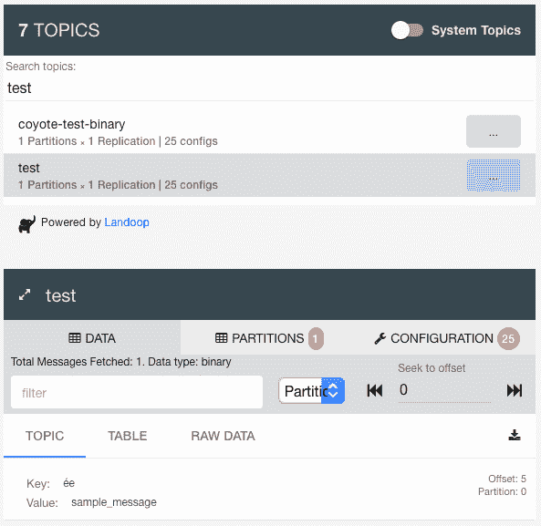

# 为发展设置 Kafka

> 原文：<https://dev.to/fabiothiroki/setup-kafka-for-development-44cd>

# 简介

当使用 Apache Kafka 开发应用程序时，我需要进行快速测试，如发布/消费消息、检查其格式或只是观察主题中的内容。

在本文中，我将展示如何使用 Docker 为 Apache Kafka 开发设置一个本地生产环境。在 [Github](https://github.com/fabiothiroki/spring-boot-kafka-docker) 中有一个演示应用。

# 安装依赖项

要在本地运行我们的本地 Kafka 及其工具，我们需要安装:

*   [对接员 CE](https://docs.docker.com/install/)
*   [坞站组成](https://docs.docker.com/compose/install/)

如果您使用的是 Mac OS 或 Windows，您还需要安装:

*   [虚拟框](https://www.virtualbox.org/wiki/Downloads)
*   [对接机](https://docs.docker.com/machine/install-machine/)

# Docker 图像

为了运行 Kafka 及其依赖项和工具，我选择了 [fast-data-dev](https://hub.docker.com/r/landoop/fast-data-dev/) 映像，因为它已经包含了 Kafka、Zookeeper 和 Kafka 主题 UI。

# 通过 Docker 揭露卡夫卡

我们的 Kafka 实例将在 Docker 内部网络之外运行，因此我们需要为我们的应用程序连接公开一个 IP 地址。如果你在 Linux 上，你可以直接使用`localhost`地址。

上面提到的所选 Docker 映像已经包含了创建`docker-machine`和设置环境变量
所必需的步骤

```
docker-machine create --driver virtualbox --virtualbox-memory 4096 landoop 
```

Enter fullscreen mode Exit fullscreen mode

```
eval $(docker-machine env landoop) 
```

Enter fullscreen mode Exit fullscreen mode

通过运行`docker-machine ip`你可以看到机器的 IP(通常是 192.168.99.100)。

# 复合坞站

我喜欢使用 docker-compose 文件在一个`git`存储库上注册`docker`命令，这样我就不需要每次运行 docker 映像时都键入和记住该键入什么。

例如，代替运行:

```
docker run --rm -p 2181:2181 -p 3030:3030 -p 8081-8083:8081-8083 \
       -p 9581-9585:9581-9585 -p 9092:9092 -e ADV_HOST=192.168.99.100 \
       landoop/fast-data-dev:latest 
```

Enter fullscreen mode Exit fullscreen mode

我只需要创建一个名为`docker-compose.yml`的文件，其中包含:

```
version: '3'
services:
  kafka:
    image: landoop/fast-data-dev:latest
    ports:
      - "9092:9092"
      - "8081:8081"
      - "8082:8082"
      - "8083:8083"
      - "2181:2181"
      - "3030:3030"
      - "9581-9585:9581-9585"
    environment:
      - ADV_HOST=192.168.99.100 // Use your 'docker-machine ip' or 'localhost' if linux 
```

Enter fullscreen mode Exit fullscreen mode

运行它的方式:

```
docker-compose up 
```

Enter fullscreen mode Exit fullscreen mode

# 测试

我已经提供了一个[示例应用程序](https://github.com/fabiothiroki/spring-boot-kafka-docker)来测试 Kafka 连接，使用了上面相同的 docker 配置。它是使用 [Spring Kafka](https://spring.io/projects/spring-kafka) 项目用 Java 编写的，但它应该适用于任何语言或库。你也可以使用[命令行界面](https://kafka.apache.org/quickstart)发布简单的消息。

运行提供的演示应用程序后，只需要访问端点[http://localhost:8080/publish？message=sample_message](http://localhost:8080/publish?message=sample_message) 在`test`主题中发布内容为`sample_message`的消息。

现在，为了检查您的主题消息，您可以访问地址`<docker-ip>:3030/kafka-topics-ui`上运行 [Kafka Topics UI](https://github.com/Landoop/kafka-topics-ui) 的地址(即:[http://192 . 168 . 99 . 100:3030/Kafka-Topics-UI/):](http://192.168.99.100:3030/kafka-topics-ui/):)

[](https://res.cloudinary.com/practicaldev/image/fetch/s--rYcoPioQ--/c_limit%2Cf_auto%2Cfl_progressive%2Cq_auto%2Cw_880/https://thepracticaldev.s3.amazonaws.com/i/zqjm27mk2jargez25053.png)

# 结论

有了这个简单的设置和一个单独的`docker-compose.yml`文件，您就可以发布和使用 Kafka 消息并开始开发您的应用程序了。