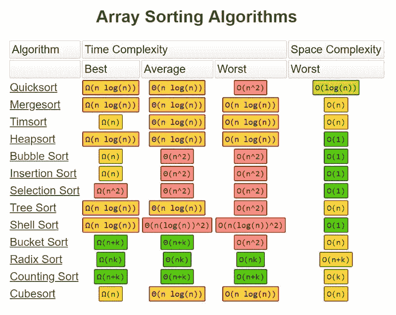

# 简单计数排序

> 原文：<https://dev.to/philipsterling/simple-counting-sort-50fc>

整理数据需要时间。
[T3】](https://res.cloudinary.com/practicaldev/image/fetch/s--8ID0CSH4--/c_limit%2Cf_auto%2Cfl_progressive%2Cq_auto%2Cw_880/https://thepracticaldev.s3.amazonaws.com/i/wngjjit2009w3b96d4la.jpg)

那么，为什么计数排序比归并、冒泡、堆等排序有不同的时间复杂度，为什么时间复杂度中有一个变量 k？

```
countingSort([9,1,0,4,6,5,7,8,1,3,2,3,3])

function countingSort(arrayToSort) {

   // 1.
   let i; 
   let indexOfReturn = 0;
   let count = [];

   // 2.
   for (i = 0; i <= 9; i++) {
      count[i] = 0;
   }

   // 3.
   for (i = 0; i < arrayToSort.length; i++) {
      count[arr[i]]++;
   }

   // 4.
   for (i = 0; i <= 9; i++) {
      while (count[i]-- > 0) {
         arrayToSort[indexOfReturn++] = i;
      }
   }
   return arrayToSort;
}

//output => [0,1,1,2,3,3,3,4,5,6,7,8,9] 
```

这很复杂，所以让我们把它分成 4 个部分:

1.  所需变量

```
//We are using a base 10 counting sort so the minimum 
//digit is 0 and the maximum digit is 9

//declaring i for index as a let to use in our for loops
let i; 

//declaring the starting index of the returnArray,
//which will just be a modification of the ArrayToSort
let indexOfReturn = 0;

//count is an array which will be marked in the time complexity
//as k so when you see O(n+k) k is the length(and therefore operations) 
//of count and n is the length(and therefore operations) 
//of the array to be sorted
let count = []; 
```

1.  ()循环的第一个计数长度

```
for (i = 0; i <= 9; i++) {
   count[i] = 0;
}

//this for loop sets up the count array to be used to
//keep track of the count of all numbers in the array to be sorted
// => count = [0,0,0,0,0,0,0,0,0,0]
//when created the count array has indexes equal to the base of the
//numbers that you are sorting, and because we are sorting in base 10
//it has 10 indexes that all point to the value zero 
```

1.  ()循环的第一个数组长度

```
for (i = 0; i < arrayToSort.length; i++) {
   count[arr[i]]++;
}

//this for loop goes for the length of the array that will be
//sorted and increases the value in the indexes of count that are 
//equal to the value in the array that needs to be sorted
// => count = [1,2,1,3,1,1,1,1,1,1]
//the indexes of count now reference the amount of each digit that
//are in the array 
```

1.  ()循环的秒计数长度

```
for (i = 0; i <= 9; i++) {
   while (count[i]-- > 0) {
      arrayToSort[indexOfReturn++] = i;
   }
}
//this for loop goes for the length of the count and changes the indexes
//of the array to be sorted to be equal to the index of the count array
//while the count is still greater than 0
//You can see that the indexes are not compared against each other but 
//are instead just kept track of through count and returned in index 
//order from smallest to largest from 0 -> 9
// => arrayToSort = [0,1,1,2,3,3,3,4,5,6,7,8,9] 
```

1.  重新振作起来

```
countingSort([9,1,0,4,6,5,7,8,1,3,2,3,3])

function countingSort(arrayToSort) {
   let i; 
   let indexOfReturn = 0;
   let count = [];
   for (i = 0; i <= 9; i++) {
      count[i] = 0;
   }
   for (i = 0; i < arrayToSort.length; i++) {
      count[arr[i]]++;
   }
   for (i = 0; i <= 9; i++) {
      while (count[i]-- > 0) {
         arrayToSort[indexOfReturn++] = i;
      }
   }
   return arrayToSort;
}

//output => [0,1,1,2,3,3,3,4,5,6,7,8,9]

// after all the counting and indexing into count is done
//the return is the sorted array 
```

计数排序似乎不太有用，但是基数排序是建立在计数排序的基础上的，计数排序和基数排序都有基于
的时间复杂度

```
 // n => Length of the array
// k => Base of the number system you are sorting
// Leading to O ( n + k ) being the runtime 
```

计数排序的时间复杂度低，因为它的用途有限，只能用于一个字符长度的数字。这不是一个比较排序，所以你不需要知道你要排序的索引的值。

参考文献-

[https://www . cs . usfca . edu/~ galles/visualization/radix sort . html](https://www.cs.usfca.edu/%7Egalles/visualization/RadixSort.html)-非常有用的关于基数排序的动画

[https://www . w3 resource . com/javascript-exercises/searching-and-sorting-algorithm/searching-and-sorting-algorithm-exercise-11 . PHP](https://www.w3resource.com/javascript-exercises/searching-and-sorting-algorithm/searching-and-sorting-algorithm-exercise-11.php)-关于如何在 JavaScript 中格式化计数排序的信息