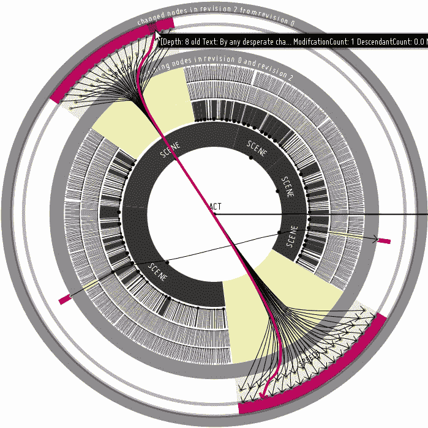
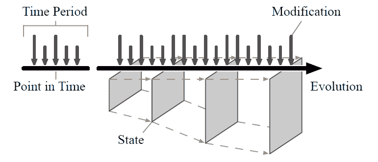

# SirixDB:有效保留数据历史的重要性

> 原文：<https://dev.to/johanneslichtenberger/sirixdb-importance-of-efficiently-retaining-the-history-of-your-data-5c1m>

[](https://res.cloudinary.com/practicaldev/image/fetch/s--yoCr9B4j--/c_limit%2Cf_auto%2Cfl_progressive%2Cq_auto%2Cw_880/https://sirix.img/moves-cut.png)

## 简介

通常，数据库系统要么就地覆盖数据，要么执行写时复制操作，然后删除过时的数据。后者可能是一段时间后从后台进程中产生的。然而，数据自然会发展。保留数据的历史通常很有价值。例如，您可能会记录 2019 年 3 月 1 日员工的工资单。假设是 5000/月。然后，在 4 月 15 日，您注意到记录的工资单有误，将其更正为 5300 欧元。现在，2019 年第一次 3 月工资是多少的答案是什么？只保存最新版本的数据库系统甚至不知道工资单不对。这个问题的答案取决于我们认为最权威的来源:记录还是现实？事实上，他们不同意有效地分裂这一工资事件分为两个轨道的时间，使任何来源都不完全准确。像 SirixDB 这样的时态数据库系统有助于轻松回答这些问题。SirixDB 设置事务时间；也就是说，它记录事务提交的次数(当事实在数据库中有效时)。应用程序或有效时间必须由应用程序自己设置(什么时候一个事实在真实世界/现实中是有效的？).

[](https://res.cloudinary.com/practicaldev/image/fetch/s--yePlsyUD--/c_limit%2Cf_auto%2Cfl_progressive%2Cq_auto%2Cw_880/https://sirix.img/evolution-of-state.png)

### 数据审核

因此，SirixDB 的一个使用场景是数据审计。与其他数据库系统不同，它完全是为了保留旧数据而设计的。它在专门的(双)时态数据索引结构中跟踪过去的修订。默认情况下，SirixDB 使用一种新颖的滑动快照版本控制算法来对数据页进行版本控制。它平衡了读写性能，同时避免了任何峰值。

SirixDB 非常节省空间，同时它存储了大量将来会被查询优化器使用的附加数据。根据写入期间的版本控制算法，它只复制已更改的记录，可能还会复制更多。因此，例如，如果只有一条记录发生了更改，SirixDB 通常不会复制整个数据库页面。相反，SirixDB 在提交期间将页面片段同步到持久存储。它不再需要对相关节点进行物理群集。顺序访问基于闪存的存储上的物理分散节点与访问磁盘上的物理群集节点数量级相同。SirixDB 从不允许覆盖或删除旧版本。单个读写事务始终追加数据。当然，您可以将资源恢复到一个特定的版本，并基于这个版本提交更改。中间的所有修订都可用于数据审计。因此，SirixDB 可以支持回答诸如谁在何时更改了什么之类的问题。

### 时间旅行查询

数据审计是关于特定记录是如何改变的。时间旅行查询可以回答这样的问题。然而，它们也允许在特定时间或特定时期重建记录。它们还有助于分析整个文档是如何随时间变化的。你可能想分析过去来预测未来。通过额外的时态 XPath 轴和 XQuery 函数，SirixDB 鼓励您研究数据是如何演变的。

下面的时间旅行查询给出了一个可能的初步印象:

```
let  $doc  :=  jn:open('database','resource',  xs:dateTime('2019-04-13T16:24:27Z'))  let  $statuses  :=  $doc=>statuses  let  $foundStatus  :=  for  $status  in  bit:array-values($statuses)  let  $dateTimeCreated  :=  xs:dateTime($status=>created_at)  where  $dateTimeCreated  >  xs:dateTime("2018-02-01T00:00:00")  and  not(exists(jn:previous($status)))  order  by  $dateTimeCreated  return  $status  return  {"revision":  sdb:revision($foundStatus),  $foundStatus{text}} 
```

该查询打开一个数据库，并在其中打开一个基于时间戳(*2019–04–13t 16:24:27Z*)的特定修订版的资源。然后，它会搜索所有状态，这些状态的*创建时间为时间戳*，必须晚于 2018 年 2 月 1 日，并且在之前的版本中不存在。 *= >* 是一个解引用操作符，用于解引用 JSON 对象中的键。您可以使用函数 bit:array-values 或通过指定一个从零开始的索引来访问数组值: *array[[0]]* ，例如，指定数组的第一个值。

### 修复程序或人为错误

引入应用程序或人为错误是很常见的。例如，一些代码可能会从数据库中删除错误的客户。也许您想要恢复文档中最后一个小时的更改。在这些和类似的情况下，您可以恢复到某个特定的时间点，在那里一切都处于已知的良好状态，并再次提交修订。或者，您可以选择一个特定的记录，纠正错误，并提交一个新的修订。

## [SirixDB](https://sirix.io)

SirixDB 是一个存储系统，它将版本控制提升到子文件粒度级别，同时充分利用基于闪存的驱动器作为 SSD。这样，存储了每个修订以及每个页面的增量。记录检索和存储的时间复杂度是对数的(`O(log n)`)。空间复杂度是线性的(`O(n)`)。目前，我们提供了几个分层的 API。一个非常低级的页面 API，它在每个页面片段级别上处理记录的存储和检索。一个基于游标的事务 API，用于存储和导航记录(目前是 XML 和 JSON 节点)。一个类似 DOM 的节点层，用于对这些节点进行简单的内存处理，它由 Brackit 使用，brack it 是一个复杂的 XQuery 处理器，也是一个 RESTful 异步 HTTP-API。SirixDB 提供

1.  资源或其任何子集的当前修订
2.  资源或其任何子集的完整修订历史
3.  资源或其任何子集的完整修改历史

SirixDB 不仅支持所有 XPath 轴在一个版本中查询资源，还支持时间轴，这有助于及时导航。资源上的事务性游标可以通过指定特定的修订号或给定的时间点来启动。后者在最接近给定时间戳提交的修订号上开始事务。

## 结论

SirixDB 是为了保留资源的历史而从头开始构建的。它负责以节省空间的方式存储每个新版本。查询还是很有效率的。每个修订都与用户定义的二级索引一起编制索引。我们提供了几个 API 作为 RESTful 非阻塞异步 API 和 XQuery，以及许多定制的时态函数，用于查询以本地二进制格式存储的 XML 和 JSON 数据。

## 试一试/需要帮助

如果你喜欢这个，请在 Twitter 上分享，在 Github 上给我一颗星，最重要的是检查一下并让我知道。几年来，我是 SirixDB 的唯一维护者，现在比以往任何时候都更渴望提出一个版本化的、安全的时态分析平台社区的想法。我很乐意听到任何建议，反馈，对未来工作的建议，例如关于水平缩放的工作，错误报告，只是一切…请联系):-)

开源库:[https://github.com/sirixdb/sirix](https://github.com/sirixdb/sirix)

新社区论坛:[https://sirix . discourse . group](https://sirix.discourse.group)

SirixDB 网址: [https://sirix.io](https://sirix.io)

[](https://res.cloudinary.com/practicaldev/image/fetch/s--5EPDdQWR--/c_limit%2Cf_auto%2Cfl_progressive%2Cq_auto%2Cw_880/https://sirix.img/sunburstview-cut.png)