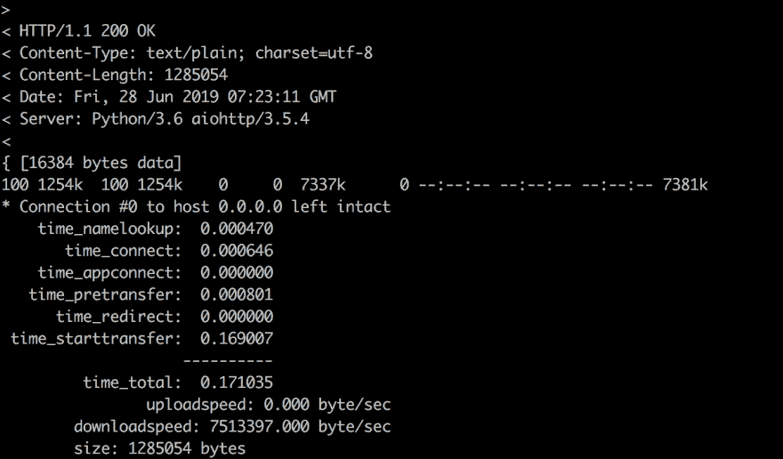

# 与 Aiohttp 库的标准和流响应比较

> 原文：<https://dev.to/tolgahanuzun/standard-and-streaming-response-comparison-with-aiohttp-library-3f3c>

Github 资源库: [Streaming_API](https://github.com/tolgahanuzun/Streaming_API)

在我开发的项目中，我们对客户的 API 调用返回了一个很好的响应消息。处理大量数据需要很长时间。在这个阶段，内存膨胀，服务器 CPU 增加。为了防止这种情况，我们开始使用流式方法。

我做了一个分析来解释这个过程给我们带来了什么。我将普通响应与呼叫请求进行了比较，并对呼叫请求进行了流式处理。

## 工作区域

*   Python3.6
*   Aiohttp
*   PostgreSql (SQLAlchemy)
*   50 万行数据集

(引用自 github 自述文件。)

## 如何安装

```
git clone git@github.com:tolgahanuzun/Streaming_API.git
virtualenv -p python3 venv
source venv/bin/activate
cd Streaming_API
pip install -r requirement.txt 
```

`vim settings.py`并且需要自己编辑设置文件。

# 如何运行

#### 发球

```
python run.py 
```

#### 客户端

*   JWT 需要它。如果你愿意，你可以把它去掉。

```
curl -H 'Accept: text/plain' -H "Authorization: JWT eyJ0eX....."  -v http://0.0.0.0:8080/standard 
```

```
curl -H 'Accept: text/plain' -H "Authorization: JWT eyJ0eX....."  -v http://0.0.0.0:8080/chunked 
```

# 流程分析

分块数据一点一点地来到你面前。
在标准中，数据是一次来的。
输入数据样本。

[](https://res.cloudinary.com/practicaldev/image/fetch/s--s-YeGImv--/c_limit%2Cf_auto%2Cfl_progressive%2Cq_auto%2Cw_880/https://raw.githubusercontent.com/tolgahanuzun/Streaming_API/master/img/response_data.png)

## 标准响应

所有数据都是一次性捕获、处理和发送的。互相阻挡。在本例中，它对应于 500000 行。

*   长达 0.16 秒没有数据流出现。数据在那一秒之后出现。

[](https://res.cloudinary.com/practicaldev/image/fetch/s--yWug8NLd--/c_limit%2Cf_auto%2Cfl_progressive%2Cq_auto%2Cw_880/https://raw.githubusercontent.com/tolgahanuzun/Streaming_API/master/img/standard_response.png)

## 串流响应

数据集大小为 500000 行。数据库中的数据被视为 1000 行。每组数据都经过处理和流式传输，无需等待。

*   长达 0.04 秒没有数据流出现。数据在那一秒之后出现。

*   小心！流式 API 在标准 API 开始发送数据之前完成。它没有阻塞自己，因为它以碎片的形式发送和接收数据。

[](https://res.cloudinary.com/practicaldev/image/fetch/s--s-YeGImv--/c_limit%2Cf_auto%2Cfl_progressive%2Cq_auto%2Cw_880/https://raw.githubusercontent.com/tolgahanuzun/Streaming_API/master/img/response_data.png)