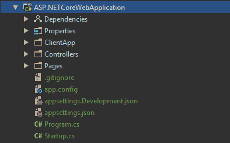
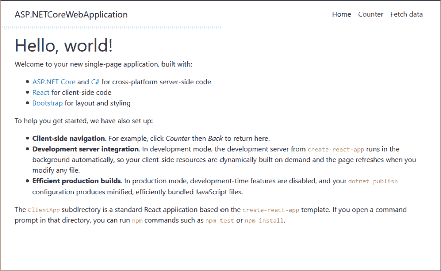

# 从 ASP.NET 核心 React 模板开始

> 原文：<https://dev.to/jonhilt/starting-out-with-the-asp-net-core-react-template-41dk>

啊，当你启动一个新的 ASP.NET 核心和 React.js 项目时，这些文件是怎么回事？！

如果你是 React 或 ASP.NET Core(或两者都是)的新手，那么“开箱即用”的体验可能会让人难以招架；很难知道从哪里开始。

所以让我们把它分解一下，看看我们得到了什么。

首先，这是相当简单的旋转了一个新项目，给你两个反应和 ASP.NET 核心…

使用点网命令行界面…

```
dotnet new react 
```

或 Visual Studio/Rider 等。

无论哪种方式，你都会得到类似这样的结果…

[](https://res.cloudinary.com/practicaldev/image/fetch/s--vTFtjeJm--/c_limit%2Cf_auto%2Cfl_progressive%2Cq_auto%2Cw_880/https://jonhilton.net/img/2019-6-26-dotnet-react-template/2019-06-26-21-51-49.png)

乍一看，这里似乎有很多事情要做(特别是当你开始钻取不同的文件夹时)，所以让我们来分解一下。

这个项目最好被认为是两个完全独立的实体，它们恰好位于同一个地方。

*   React 应用程序(使用“创建 React 应用程序”)
*   ASP.NET 核心 Web API 后端

## 反应前端

容纳新应用程序的前端部分。

只要您使用的是。你会发现这个应用程序的这一部分是一个标准的 React 应用程序，它是用一个叫做“Create React App”的东西创建的。

这个应用程序和 CRA 应用程序的唯一区别在于。NET 团队也提供了一些 React 组件示例来帮助您入门。

当您运行应用程序时,`ClientApp/public/index.html`将被提供给您的浏览器。

在那里你会看到一个类似这样的 div…

```
<div id="root"></div> 
```

这个元素非常重要，因为 React 会将您的应用程序呈现到这个 div 中。

看一看`ClientApp/src`你就会看到一些。js 文件和一个组件文件夹。

在`index.js`中，你会看到你的应用程序的“顶部”;这是一切开始的地方。

```
import 'bootstrap/dist/css/bootstrap.css';
import React from 'react';
import ReactDOM from 'react-dom';
import { BrowserRouter } from 'react-router-dom';
import App from './App';
import registerServiceWorker from './registerServiceWorker';

const baseUrl = document.getElementsByTagName('base')[0].getAttribute('href');
const rootElement = document.getElementById('root');

ReactDOM.render(
  <BrowserRouter basename={baseUrl}>
    <App />
  </BrowserRouter>,
  rootElement);

registerServiceWorker(); 
```

前几行引入了运行应用程序所需的其他 js 文件和节点模块中的各种模块。

然后声明一个变量，指向我们在前面的`index.html`(id 为`root`)中注意到的 div。

调用`ReactDOM`将由`BrowserRouter`和`App`组件组成的应用程序呈现到这个`root` div 中。

到目前为止一切顺利。

现在，如果你进入`<App />`组件，你会看到更多有趣的“几乎 HTML ”,它指向更多的组件…

```
export default class App extends Component {
  static displayName = App.name;

  render () {
    return (
      <Layout>
        <Route exact path='/' component={Home} />
        <Route path='/counter' component={Counter} />
        <Route path='/fetch-data' component={FetchData} />
      </Layout>
    );
  }
} 
```

那个“几乎 HTML”其实是“JSX”。它可能看起来像 HTML，但实际上被转换成 javascript，然后 React 使用它与浏览器中的 DOM 进行交互。

这个 React 组件(`App`)在一个`Layout`组件中嵌套了几个`Route`组件。

我们已经开始看到 React 应用程序是如何构建成许多可以组合在一起的小组件的。

在这种情况下，`Layout`负责为应用程序呈现诸如导航条之类的东西，然后这些`Route`组件让您为特定的组件分配路径。

因此，当你在浏览器中运行应用程序并前往`/fetch-data`时，`FetchData`组件将被呈现，但如果你前往`/Counter`，那么`FetchData`将从 DOM 中被省略，你将得到显示的`Counter`组件。

因为`Layout`组件是自己呈现的(不使用`Route`组件)，所以它将一直保持可见(不管您导航到的路径是什么)。

## 下一步

弄清楚模板如何工作的最好方法是进一步探索，并尝试打破一些东西！

当您运行应用程序(从 VS 或 CLI)时，您会发现 React 应用程序会在您的浏览器中启动。

[](https://res.cloudinary.com/practicaldev/image/fetch/s--rzmIGMbI--/c_limit%2Cf_auto%2Cfl_progressive%2Cq_auto%2Cw_880/https://jonhilton.net/img/2019-6-26-dotnet-react-template/2019-06-26-22-27-48.png)

当您点击导航栏中的链接时，您将看到总体布局(包括导航栏)保持不变，但页面的其余部分会更新以显示相关组件。

从现在开始，您对应用程序前端部分所做的任何更改都将触发浏览器的更新，因此您可以快速更改/调整和修改内容，并立即看到您的工作成果！

下次我们将快速浏览一下该项目的 Web API 部分。