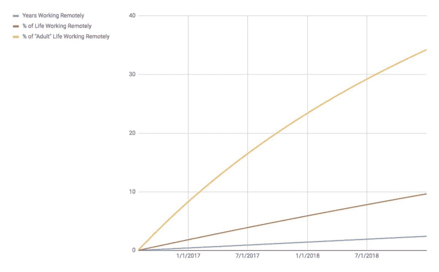
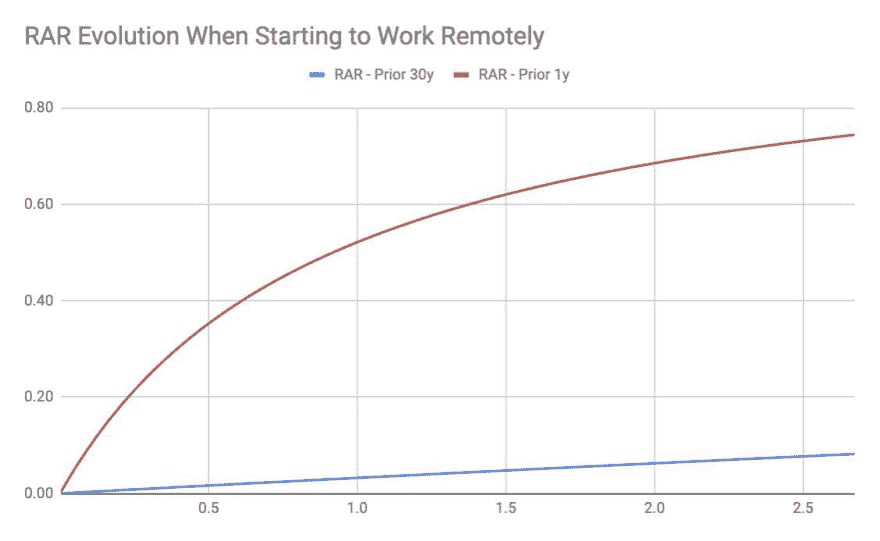
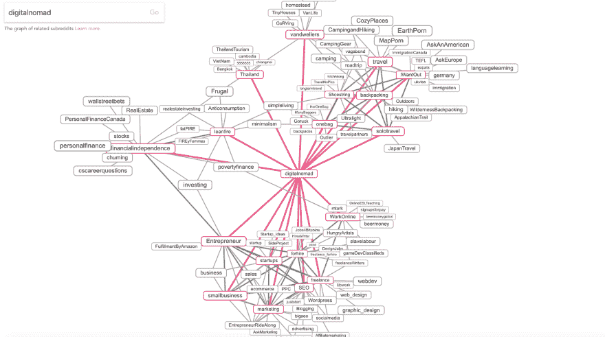
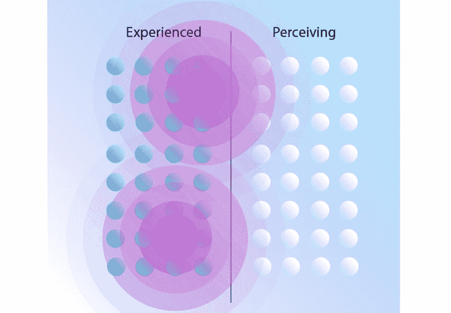

# 不要在一个盒子里寻找思维不在盒子里的人

> 原文：<https://dev.to/stephsmithio/stop-looking-in-a-box-for-people-thinking-outside-of-one-45b1>

这篇文章最初发表在我的[博客](https://blog.stephsmith.io/finding-top-talent/)上，我经常在那里写关于个人成长、远程工作、学习编码和技术领域的女性。

* * *

> “当你在寻找创新和行动驱动的人才时，为什么不向那些已经开创了自己生活的人敞开大门呢？”

最近有人联系我，说有一个机会。在许多层面上，这个机会“检查了所有的盒子”，但有一个警告:我必须搬到旧金山。对许多人(包括以前的我)来说，这将是一个梦想。但是对于现在的我来说，这意味着抛弃我花了三年多时间刻意营造的生活。

尽管我在 2015 年花了 10 个多月的时间寻找“合适的”远程工作，现在过着我长期以来想象的生活，但如果我说我没有认真考虑过转换，那我是在撒谎。金钱、关系和“硅谷”的诱惑令人信服。

然而，当我想到我生活中真正想要的和优先考虑的是什么时，我立刻清楚地意识到我将会放弃 T1。更具体地说，我将放弃优化自己生活的自由，而去追求主要由*和*自己决定的生活。

最终，我拒绝了这个职位，这当然促使公司继续寻找合适的人选。response﹣while 完全 logical﹣got 了我的想法..."他们能胜任这个角色吗？"。显而易见的正确答案是肯定的。但是引发这个问题的是他们意识到他们正在“盒子里面”寻找一个已经在盒子外面思考的人。

## **往盒子外面看**

在数字时代，许多公司将他们最大的挑战称为迫在眉睫的“人才战争”，这是由于技能差距扩大导致的供需失衡。

随着我们员工变化的速度越来越快，公司将“[赢得战争](https://www.pwc.com/gx/en/industries/industrial-manufacturing/winning-war-talent.html)”视为保持创新和竞争领先的唯一途径。为了吸引顶尖人才，他们的解决方案导致了[乒乓球桌](https://twitter.com/rdutel/status/1040918188886827009)，工资大战，以及科技中心内荒谬的通货膨胀。

随着公司越来越重视吸引、招聘和留住顶尖人才，我想知道一些公司是否遗漏了一块大拼图。我在想，那些将高度发达的审查程序与对现场人才的需求结合起来的公司，是否不仅限制了候选人的绝对数量，而且可能是最好的候选人？我不禁想知道，他们是否已经淘汰了很大一部分已经生活在这些公司希望创造的未来中的人。

你看到断开了吗？

公司:我们需要一个已经证明了自己执行能力的人。我们在寻找对事物有不同看法的人；跳出框框思考，创造创新解决方案的人。”

招聘人员:“太好了，住在波兰的人怎么样？她搬到那里和丈夫在一起，这样他们可以一起抚养他们的女儿。灵活性让她得以将一家公司的估值提升至 8 位数，但她刚刚卖掉了公司，正在寻找下一个挑战。

**公司**:“不好意思，我们做不了远程。”

虽然我当然能认识到我自己的偏见，但令我困惑的是，公司愿意自动淘汰一个我认为多样化和前瞻性的群体；一群人已经创造性地重新定义了他们的世界。

简而言之，这些人审视了自己的生活，认为“一定有更好的方式”，然后主动去影响改变。随着越来越多的公司寻找“招聘员工的创造性方法”，我不禁想知道，他们是否可以通过向远程员工敞开大门，在一夜之间形成强大的竞争优势。

## **【遥亲比(RAR)**

评估你是否应该更开放或更不开放远程工作或招聘的第一步是确定你对这种新的工作方式的潜在偏见。

在过去的三年里，我一直在远程工作。对大多数人来说，这可能不是一段很长的时间，但它实际上代表了我在全职工作中 75%的经历。在很多方面，这是我能记得的全部。

> 斯蒂芬·史密斯[@斯蒂芬·史密斯](https://dev.to/stephsmithio)今天是我远程工作的第 868 天。一个任意的数字，但更值得注意的是，我成年后的 30%或 10%的时间都是这样度过的。
> 
> 这种生活方式无疑塑造了我的心态，所以受[@ dinky dani 21](https://twitter.com/dinkydani21)/[@ JamesIvings](https://twitter.com/JamesIvings)的启发，这是我最后的 2.5 年:👇2018 年 12 月 16 日下午 18:28640

当我开始进一步考虑量化某人对远程工作的亲和力或开放程度(或许还有新的思维或生活方式)的概念时，我提出了“远程亲和力比率”或 RAR 的概念。

> 斯蒂芬史密斯[@斯蒂芬史密斯](https://dev.to/stephsmithio)💭💭💭我一直在考虑一个概念，我称之为远程亲和力比率(RAR)
> 
> 它是:远程工作年数/工作总年数的比率
> 
> 这不是一个竞争指标，而是一个反映你以前的经验*可能*如何影响你对新工作规范的开放程度的指标下午 13:02-03 2019 年 4 月1

简单地说，就是远程工作的年数和总工作经验的比率。

**RAR =(远程工作年数)/(在职年数)**

这一标准并不意味着一个人是从竞争中诞生的，而是反映了一个人以前的经历如何影响他对新工作规范的接受程度。

随着这种生活方式在我的工作方式中如此根深蒂固，我需要记住，世界上的许多地方仍然不是这样运作的。因此，当个人或公司对这个概念完全封闭时，我感到很惊讶，当我想到其他人从中得出背景的时间尺度时，它开始变得更有意义了。举个简单的例子，想象一个 55 岁的人的生活，他已经工作了 35 年，他们的“世界”和我上面画的我自己的世界的比较。

> 斯蒂芬·史密斯[@斯蒂芬·史密斯](https://dev.to/stephsmithio)举个例子:我的 RAR 是 0.74，因为我之前几乎没有远程操作的经验。远程几乎是我所知道的一切，所以我对它的亲和力很高。
> 
> 比较具有 30 年和 1 年非远程经验的人的 RAR 进化。RAR 需要长得多的时间才能达到临界水平。2019 年 04 月 03 日下午 13:0622

即使这个人远程工作了三年，这也只代表了他们职业生涯的一个位数百分比，因此他们的大部分看法仍然会落在这种新方法之外。

当并排比较时，毫不奇怪，我更容易想象一种不同的工作和生活方式。不是因为我更好、更聪明或更有创造力，而是因为我已经在这种新方法中生活了更长时间，并且我在看到过去几十年的经验时障碍更少。我对事情应该如何运作的观点还没有定型。

RAR 是一个纯粹用于反思的度量；试图理解我们的经验是如何积累起来，形成我们对什么是可能或不可能/更好/最佳的认知。

因此，对于那些在寻找和留住人才的过程中仍然心存芥蒂的人来说，考虑一下这种担忧是基于经验还是历史认知。更重要的是，你的感知反映了当今世界还是你的 RAR？

有了 RAR 的概念后，我开始思考远程工作的一些基本原理，以及 RAR 高的人可能深刻理解，但接触有限的人可能看不到的东西。我专注于三个似乎是最具雏形的想法:

*   按照惯例，远程工作人员倾向于跳出框框思考
*   弹性工作激励人们去优化和改进
*   生存偏见影响人们看待远程工作的方式

随着对这三点的深入理解，我真的相信招聘经理*可能会*对远程招聘的概念更加开放，因为在实现更大、更具创新性的人才库方面存在积极的权衡。

## **创新国家**

TechCrunch 最近发表了一篇文章，声称远程工作者和游牧者是下一个创新的技术中心。几周后，Stripe 宣布[他们的下一个工程中心](https://stripe.com/gb/blog/remote-hub)是……远程的！众所周知，公司正在利用创新和分布式劳动力之间的交集。

通过简单地给予某人用其他东西代替通勤的自由，他们不仅有更多的时间来创新，而且不会那么疲惫，更有灵感。这些人不仅开始跳出框框思考，也开始跳出框框生活。

远程工作使人们开始创造性地思考他们如何完成工作，但也邀请人们优化过去。许多人借此机会考虑如何改善他们的身心健康、财务状况、商业机会等等。想想数字游牧和财务独立、技术、企业家精神、极简主义和投资之间的重叠。远程革命的创造力推动人们在这些领域进行创新，产生了全新的概念，如[火灾](https://www.reddit.com/r/financialindependence/)。

很多人都熟悉彼得·泰尔的著名问题从[零到一](https://amzn.to/2XfocUP):

> 很少有人同意你对什么重要事实的看法

事实上，泰尔正试图分离个体的思维方式。虽然泰尔的问题可能会挖掘出聪明或有创造力的头脑，但我认为，隔离那些能够预测未来的人的更好方法是找到目前正在生活的人才。

## **错误的激励**

假设你有一系列的植物，你不再有能力照顾自己。你有两个选择:

1.  你可以把你的植物交给那些到特定地点来浇水的人。这个地方有足够的水和阳光来维持植物的存活。这些植物可能不会死亡，但它们肯定不会茂盛。好消息是你可以看到那些你雇佣的人进来给植物浇水。
2.  你可以选择让其他人来照顾你的植物。这些人拥有更多的资源，并且可以在他们认为合适的时候优化这些资源。虽然你不能看着这些人给植物浇水，但你可以根据他们成功完成工作的能力付给他们报酬。这种工作关系的成功建立在信任和影响的基础上。

现在把这些工厂想象成你的公司。这些场景与“内部”雇佣员工和给予员工远程工作的自由之间的比较没有太大不同。虽然第二种情况*可能*导致一些植物死亡(或终止雇佣)，但更有可能发生的是，个人会意识到他们有空间经营和产生结果。与此同时，第一种情况仍然有足够的潜力导致植物死亡，并且只能达到你预先设定的最大潜力。

关于办公室，有一件事很多人都不知道:你根本没有改善的动力。当你的一天最终被你需要待在那里的时间所限制时，为什么要决定变得更有效率呢？

*   为什么要费心制作更高质量的作品呢？
*   为什么要把你的工作流程改进到完成一项任务所需时间的一半呢？
*   为什么要费心开发 2 倍复杂的解决方案，却带来 10 倍的影响呢？

为什么要自寻更好、更快或更优呢？何必呢。

这种不给人们空间去创新和创造他们自己的影响之路的概念，进一步复杂化了。

为什么？我从根本上相信，一旦你让某人开始考虑如何更好地工作，这就会渗透到他们生活的其他方面。他们现在已经训练他们的大脑消除噪音，并优化影响。这将不可避免地影响员工处理他们所面临的各种问题的方式。

简而言之，通过启用远程工作，您在不经意间培训了您的员工，以改进他们的思维方式以及他们如何能够实现更多。最重要的是，你给了他们需要的空间。

## **生存偏差:在错误的地方寻找**

还不服气？再来说说[生存偏差](http://blog.idonethis.com/7-lessons-survivorship-bias-will-help-make-better-decisions/)。

当我去满是游牧民族的共同工作空间时，我总是对我遇到的人们的素质印象深刻。虽然总是有分配，但大多数人都在寻求以某种方式改善他们的生活，无论是开始新的业务，学习新的技能，投资更好的饮食，还是寻求养成某种形式的更好的习惯。

当我听说很多行业对远程工作人员感到担忧时，我不禁想知道是否存在某种生存偏见。

对于那些刚接触这个术语的人来说，生存偏差是:**逻辑错误，专注于那些通过了某些选择过程的人或事，而忽略那些没有通过的人或事，通常是因为他们缺乏可见性。**

 *在这种情况下，考虑到与远程员工一起工作的经历不好的人可能是最大声的。与保险业类似，人们会迅速报告和放大一次糟糕的经历，而当多次积极的经历发生时，他们会非常满意地保持沉默。

> 研究表明，最直言不讳的顾客是那些会表达自己感受的人。其他人要么再给公司一次机会，要么就走人。”——[沃克·多诺霍](http://blog.idonethis.com/7-lessons-survivorship-bias-will-help-make-better-decisions/)T3】

这些被放大的经历不再被视为局外人，而是成为他人的叙述。在保险业，如果一些索赔处理缓慢，他们的信任顾问评级是 2 星。在远程工作中，如果几个人不可靠，那么整个分散的工作人员都被认为是不可靠的。

这种叙事一旦设定，就很难打破。即使分享积极的故事，N 也太低，不足以抵消这种感觉。

*当您思考哪些例子可能会形成您对远程工作的看法时，其中有多少是基于您自己的经历？样本量是多少？这与现场雇佣的好坏相比如何？*

有一种错误的看法，认为所有远程工作人员都想“去远程”过更轻松的生活。事实是，他们通常希望过上更好的生活，这是截然不同的。例如，许多人正在寻找机会花更多的时间和他们的孩子在一起，优化他们的时间表，或者把像通勤这样的非生产性时间投入到更有生产性的事情上。事实上，根据 [IWG 全球工作空间调查](http://assets.regus.com/pdfs/iwg-workplace-survey/iwg-workplace-survey-2019.pdf%60)，超过 50%的人会优先考虑弹性工作制，而不是为知名公司工作或更多的假期津贴。

创始人经常会问他们如何找到有才华的员工，并且留住这些有才华的员工。给你一个提示:给他们他们明确渴望的自由。绝大多数分散在各地的员工并不打算在海滩上工作，甚至也不打算住在海滩附近——他们只是在寻求生活的自主权。

我想在这里传达什么？

1.  不要让生存偏见影响你对远程工作者的看法。通过经历建立自己的印象。
2.  重新定义那些希望远程工作的人的意图是很重要的。通常，人们不希望远程工作做得更少，而是希望做得更多。如果你仔细观察这些雄心的迹象，你可能会发现自己正在吸引有才华的员工。

## **盒子外招人**

我们从小就被教导要“跳出框框思考”，但我认为许多人在几十年里已经被训练得在一个框框内优化。作为招聘经理，当你寻找这些真正训练有素的思考者时，我质疑为什么这么多公司会自动淘汰这么多已经通过行动证明了自己跳出框框思考能力的人。

你可能听说过这样的“恐怖故事”:一家公司雇佣了一个非常糟糕的远程候选人，但我相信同样的招聘经理也能举出一个同样被误导的内部招聘案例。由于远程工作是更新、更具创新性的模式，我们用几个例子来推回更具创新性的模式。

我不会用糟糕的招聘来抹黑整个模式，而是鼓励招聘经理从头开始考虑他们想要招聘的人的类型:

*   是主动设计自己生活的人吗？
*   是某个致力于寻找创造性的解决方案来实现这种生活的人吗？
*   是能动态灵活工作的人吗？

如果这就是你想要的那种类型的人，不要淘汰他们中的一整批人，敞开你的心扉迎接未来的工作。在“人才争夺战”中，最大的竞争优势莫过于接触到成千上万的候选人，而这些人是你的竞争对手不敢探索的。

PS:在 Twitter 上加入对话[。](https://twitter.com/stephsmithio/status/1150418749788512261)

* * *

你可以在 [Twitter](https://twitter.com/stephsmithio) 上找到我，在这里阅读更多[，或者](https://blog.stephsmith.io)[订阅我的博客](https://mailchi.mp/3e320512ed0b/stephsmith)。*