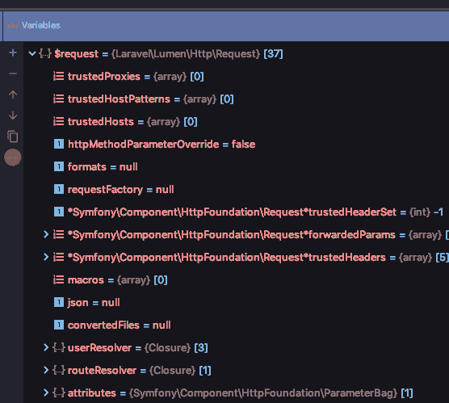
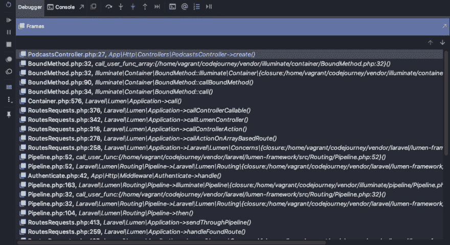

# 停止使用 Print 和 Die 语句

> 原文：<https://dev.to/theringleman/stop-using-print-and-die-statements-5g8p>

今天我们将复习使用 print 或 die 语句的 101 个调试技巧。讨论你应该做什么&为什么。这里介绍的技巧适用于所有技能水平的开发人员。只需按照下面的说明获取您的代码。

### 传统方式

下面的语句存在于每种语言中&我们都依赖它们在某些时候进行调试。

### 红宝石:

```
puts "Message goes here"
exit 
```

### PHP:

```
print_f("Message goes here")
die(); 
```

### Javascript:

```
console.log("Message goes here");
fail; 
```

### 你明白了

不要采用上述方法，而是尝试使用专门构建的调试工具。信不信由你，使用工具*可以*让你成为更好的程序员。一位高级工程师曾经告诉我(在我职业生涯的早期),任何不使用调试器的人都是傻瓜。我完全同意。

### 看到全貌

对于那些不熟悉调试器的人，这里有一个快速介绍。

调试器在程序执行过程中停止程序，显示它的状态，并允许你深入研究。

<figure>[](https://res.cloudinary.com/practicaldev/image/fetch/s--J6TiLBJ_--/c_limit%2Cf_auto%2Cfl_progressive%2Cq_auto%2Cw_880/http://www.codejourney.io/wp-content/uploads/Screen-Shot-2019-06-25-at-3.43.59-PM.png) 

<figcaption>一个 PHP 脚本在使用调试器时停止了执行。</figcaption>

</figure>

调试器还允许你单步调试你的代码，所以你可以看到正在发生的事情。

<figure>[](https://res.cloudinary.com/practicaldev/image/fetch/s--9rrQIMV---/c_limit%2Cf_auto%2Cfl_progressive%2Cq_auto%2Cw_880/http://www.codejourney.io/wp-content/uploads/Screen-Shot-2019-06-25-at-3.44.09-PM.png) 

<figcaption>一个 PHP 脚本用同样的方法单步执行两行。</figcaption>

</figure>

如果没有这个工具，看到一个程序的全貌几乎是不可能的(如果我错了，请给我一个不同的方法)。

调试器还允许您在执行的特定点检查所有当前变量值。全局变量、局部变量，甚至是深埋在私有方法中的变量。你可以看到这一切。

<figure>[](https://res.cloudinary.com/practicaldev/image/fetch/s--gc8HMWlD--/c_limit%2Cf_auto%2Cfl_progressive%2Cq_auto%2Cw_880/http://www.codejourney.io/wp-content/uploads/Screen-Shot-2019-06-25-at-3.43.00-PM.png) 

<figcaption>查看当前执行上下文中的所有变量。</figcaption>

</figure>

<figure>[](https://res.cloudinary.com/practicaldev/image/fetch/s--GGDFMc_x--/c_limit%2Cf_auto%2Cfl_progressive%2Cq_auto%2Cw_880/http://www.codejourney.io/wp-content/uploads/Screen-Shot-2019-06-25-at-3.43.09-PM.png) 

<figcaption>深入查看" $request "变量。</figcaption>

</figure>

> 任何不使用调试器的人都是傻瓜。

调试器还向您展示了通向执行点的调用堆栈。有些甚至让你在堆栈里跳来跳去。它显示了执行的文件和方法。

<figure>[](https://res.cloudinary.com/practicaldev/image/fetch/s--X-VtrEKd--/c_limit%2Cf_auto%2Cfl_progressive%2Cq_auto%2Cw_880/http://www.codejourney.io/wp-content/uploads/Screen-Shot-2019-06-25-at-3.43.31-PM.png) 

<figcaption>调试器显示的一个调用栈。</figcaption>

</figure>

### 与之交战

你不仅可以看一眼，还可以操作。更改任何值，并根据您当时选择的值执行程序。随之而来的力量是美妙的。例如，您希望确保输入到方法中的数据是正确的，您可以更改不正确的内容，只是为了测试您的代码是否如您所愿。虽然这是一把双刃剑，但程序的其余部分是在您更改的数据上执行的。小心点。

### 获得深刻的理解

通过单步执行代码，您可以自动使您正在使用的任何框架/库的源代码具有相关性。你可以看到代码改变了你的数据。这有助于深入理解系统控制流，尤其是在使用第三方库或框架时。我认为学习一个框架的最好方法之一是深入源代码。调试器会强制这样做。

[](https://res.cloudinary.com/practicaldev/image/fetch/s--i4-ZN-wS--/c_limit%2Cf_auto%2Cfl_progressive%2Cq_auto%2Cw_880/https://www.codejourney.io/wp-content/uploads/dive-in.jpg) 
潜入源头

### 接下来

我在本系列中的下一篇文章将更详细地介绍一个[#调试器](https://codejourney.io/tag/debugger)。所以今天我想留给你们一个行动项目，你们可以开始用 Javascript 来实现。

### 调试器；

```
function someThing(test) {
  test.er = 'howdy';
  debugger;
  test.ing();
} 
```

这个关键字在 [#Javascript](https://codejourney.io/tag/javascript) 中允许你在 Chrome 或 Firefox 中执行时自动触发一个调试器。请注意，您必须打开控制台，调试器才能停止执行。然后，您可以根据需要单步执行和进入方法。不再有 console . log()；

使用它。适应它。它工作了。