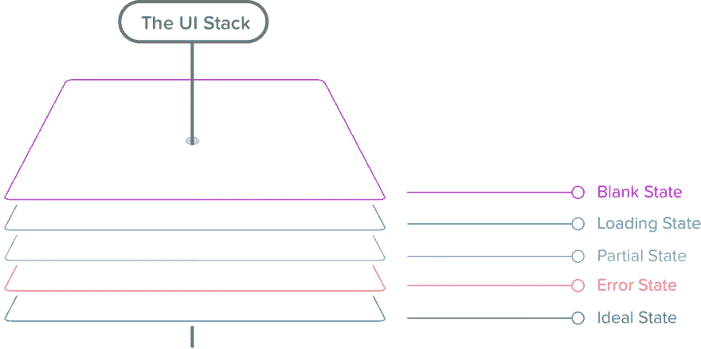

# RemoteData, slaying a UI Antipattern with Angular

> 原文：[https://dev.to/joanllenas/remotedata-slaying-a-ui-antipattern-with-angular-2i2h](https://dev.to/joanllenas/remotedata-slaying-a-ui-antipattern-with-angular-2i2h)

Kris Jenkins [How Elm slays a UI antipattern](http://blog.jenkster.com/2016/06/how-elm-slays-a-ui-antipattern.html) blog post about fixing a common UI state bug when fetching remote data has been around for a few years now, and its popularity has transcended the [Elm](https://elm-lang.org/) ecosystem. A few blog posts explain how to achieve the same results with other languages/frameworks, but none of them is based on Angular2+.
In this article, I'll try to explain how to achieve something similar with Angular and TypeScript.

## What we are trying to solve

You are making an API call, and you want to display different things based on the status of the request.

| ⠀ |
| --- |
|  |
| <sub>*Taken from ["How to fix a bad user interface"](https://www.scotthurff.com/posts/why-your-user-interface-is-awkward-youre-ignoring-the-ui-stack/), by Scott Hurff*</sub> |

### The traditional approach

```
export interface CakeOfTheDay {
  isInProgress: boolean;
  error: string;
  data: {
    name: string;
    image: string;
    recipe: string;
  };
} 
```

Enter fullscreen mode Exit fullscreen mode

Let's see what each property means:

*   `isInProgress`: It's true while the remote data is being fetched.
*   `error`: It's either null (no errors) or any string (there are errors).
*   `data`: It's either null (no data) or an object (there is data).

**There are a few problems with this approach** but the main one is that it is possible to create **invalid states** such:

```
{
  isInProgress: true,
  error: 'Fatal error',
  data: {
    name: "Bacon cake",
    image: "cake.png",
    recipe: "Bacon, sugar, mix, stir, bake, enjoy!"
  }
} 
```

Enter fullscreen mode Exit fullscreen mode

How do we interpret this payload? Our Html template will have to use complex `*ngIf` statements to make sure that we are displaying what we should.

### The RemoteData approach

The proposed solution uses an adaptation of Kris Jenkins' RemoteData library where instead of using a complex object, we use a single data type to express all possible request states:

```
export type RemoteData<T, E = string> =
  | NotAsked
  | InProgress<T>
  | Failure<E>
  | Success<T>; 
```

Enter fullscreen mode Exit fullscreen mode

This approach **makes it impossible to create invalid states**.
This pattern has served our team well for a long time, so, I decided to create the [ngx-remotedata](https://github.com/joanllenas/ngx-remotedata) library. It works exceptionally well with [ngrx](https://ngrx.io/)!
With this library creating a robust **UI stack** will be as easy as throwing a few ngx-remotedata pipes and let the data do the rest:

```
<h4 *ngIf="remoteData | isNotAsked">No requests yet!</h4>
<h4 *ngIf="remoteData | isInProgress">In progress...</h4>
<h4 *ngIf="remoteData | isSuccess" style="color: green">
  {{ remoteData | successValue }}
</h4>
<h4 *ngIf="remoteData | isFailure" style="color: red">
  {{ remoteData | failureValue }}
</h4> 
```

Enter fullscreen mode Exit fullscreen mode

### Library resources

*   [Github page](https://github.com/joanllenas/ngx-remotedata).
*   [Some examples with ngrx and plain old services](https://github.com/joanllenas/ngx-remotedata#some-examples).
*   [API](https://github.com/joanllenas/ngx-remotedata#api).
*   [Pipes](https://github.com/joanllenas/ngx-remotedata#pipes)