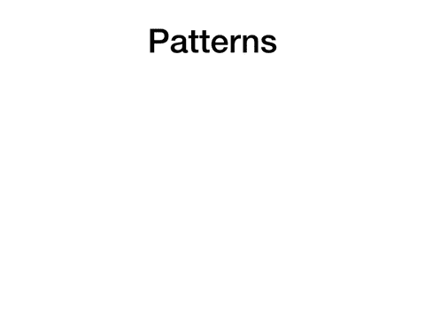
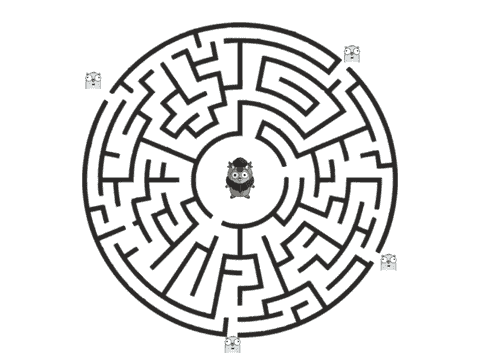
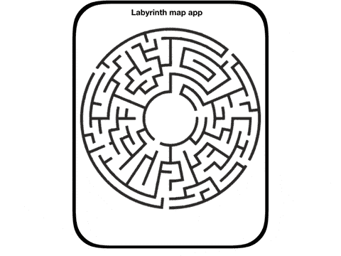
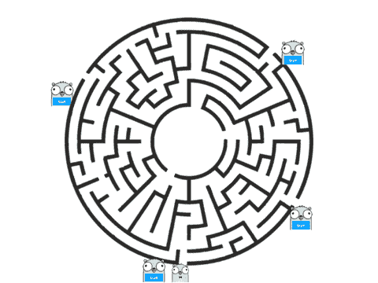
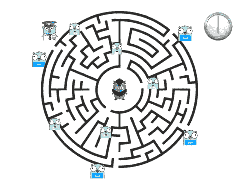
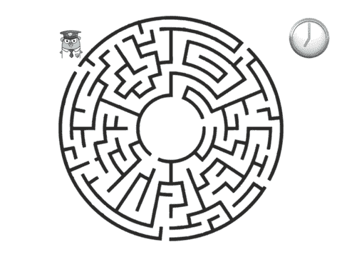
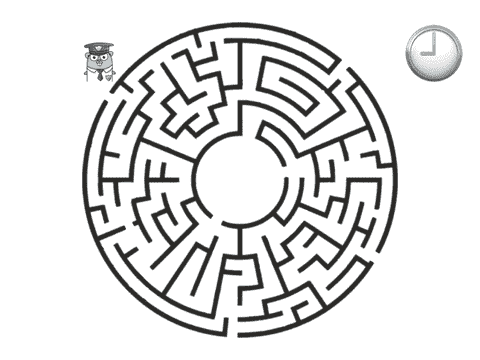
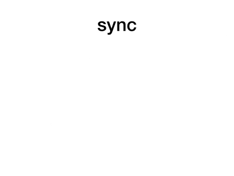

# 同步包解释

> 原文：<https://dev.to/d_n826/sync-package-explained-1h9>

### 同步包原语解释。

最近，我参观了在美丽的特内里费岛加那利群岛举行的 GopherConEU 2019 。我已经展示了我的关于同步包原语以及如何使用它们的闪电演讲，在我的例子中是管理一个游乐园中的景点。
如果你想探索 sync 包或者错过了我演讲中的一些东西，这篇文章会尽力帮助你。

* * *

When you build your program, usually you have complete concept, idea that you understand,
so with input in one place, you always can tell where will be the output.
But when time goes by and the program grows and extends it starts to look like a labyrinth especially if it can run concurrently. So from that moment, you can't tell where will be the output as a result of the given input, at least without great debugging tool.

To handle that complexity smart people created patterns, rules that help reduce complexity. There a lot of types of those patterns: structural, design, many more of others and also concurrency patterns.
Some of those concurrency patterns already implemented as synchronization primitives and placed in sync package that is a package from the Go standard library.

So let me bring some context to my story: let's imagine our complex program is a labyrinth, input data are gophers that walk inside that labyrinth and sync package primitives are rules and features that we can apply to that labyrinth.

With all those resources we can build an amusement park with one attraction called labyrinth. Our little visitors, will walk inside that labyrinth but to motivate them to explore let's place something interesting inside, let's place Minotaur (because what else could be placed in the labyrinth to get some hype?)

Let's try to apply sync package to that labyrinth to make it better.

Let's imagine our little visitors walk inside the labyrinth, they are trying to find the Minotaur, defeat him and become a hero of the day. But what if two Gophers will find Minotaur at the same time. If the first one will start the fight, what another one has to do?
I propose to isolate the section of the fight so no-one will be able to interrupt the battle. For that purpose in sync package has Mutex primitive with 2 methods: Lock() and Unlock() that work in a next way.
When the fight starts, we call mutex.Lock() and that is how we lock shared resource which Minotaur is since there are many visitors but only one Minotaur. After that, we can be sure that that no-one will interrupt the fight.
After the battle, we call mutex.Unlock(), that releases Minotaur so anyone else can call Lock() again and isolate resource again.

Ok, let's imagine someone defeated Minotaur, that guy portrait goes straight to the "Hero of the day" desk.

But what if we would like to scale, build many labyrinths in many different places. What if there will be many simultaneous victories, who should be the winner then?

To handle that, sync package has Once primitive with only one method Do() that can be called multiple times but executed only once. In our case, we can call Do() on each victory but the winner will be chosen right after the first call.

That's cool that anyone can discover who is the hero of the day because we don't restrict access to the desk, it's in the park and all visitors can look at it. But how to update the hero if everyone is watching?

We could use Mutex here but that will give only one by one access to the desk and we don't want to do that, visitors just watch the desk, they don't change the content so we can allow anyone watches the desk at the same time, it shouldn't break anything.
For that purpose, sync package has a special type of Mutex called RWMutex that has the same methods that common Mutex has plus 2 additional: RLock() and RUnlock(). Those 2 allow us block resource only for writing so multiple callers can get read access but no-one will get write access.

In our case, every visitor that starts to watch the desk calls RLock() getting read access with the possibility to everyone else get read access too but no write access. But once staff worker comes to update desk he calls Lock() to get write access but it's not possible until the last guy will that called RLock() will call RUnlock(). One by one visitors call RUnlock() and go away. When other visitors come after staff worker they call RLock() but don't get access to the resource, that is happening to avoid infinite lock for the staff worker.
Once the last visitor before staff worker called RUnlock() our guy can finally execute Lock() and isolate resource(desk), update the hero, release the desk by calling Unlock() and go away allowing to repeat everything again.

The most popular games have multiplayer, they allow you to play with your friends and we want to let you do that too!

Every visitor gets a tablet, so once they are in - they can fulfill the empty map on the tablet together with their friends increasing speed of exploration.
But what if 2 players will try to update the same sector of the labyrinth simultaneously? Something could crash, can we handle that?

To handle that we can use Map from sync package that is the thread-safe version of the common man in Go but with methods to handle concurrent access.

Ok, so we can handle some problems using sync package, but even if it's an imaginary situation we still have a limited budget, we can't create a new tablet for every new visitor. How to handle that? Can we reuse tablets?
Sure, and to reuse some resources we can use Pool from sync package.

Once a visitor comes inside he/she calls pool.Get() and gets a tablet from one shared pool. Then visitor goes inside the labyrinth, does his deals and when comes out, call pool.Put() to return tablet back.

We have some other problems: what to do if no-one can't find the Minotaur or what to do if it's time to close the attraction but visitors are still inside?

To solve those 2 we have Cond with 3 methods: Wait, Signal and Broadcast.

Tablets of all visitors automatically go to the "cond.Wait()" state once they come inside of the labyrinth.
Let's start from Signal. When we see that no-one can't find Minotaur for a long time we can reveal the location of all things for a random visitor just by calling cond.Signal(). That's how we can increase probability.

And when it's time to close we can call pool.Broadcast() to notify everyone inside that it's time to go out.

But even after the notification, we can't be sure that it's no-one inside the labyrinth, how can we know that for sure?

To be sure we have Waitgroup in sync package with 3 methods: Wait(), Add() and Done().

Once someone comes inside they call wg.Add(n), where n - number of visitors that came, usually it's 1 but if you came with your friend you can call wg.Add(len(friends)).
And when visitors come out, each of them calls wg.Done(). Security guy stay in the wg.Wait() state until the last visitor call wg.Done(), then wg.Wait() will disappear and we will know for sure that it's no-one inside.

I have tried to explain how we could use primitives from sync package, I haven't mentioned Locker, it's an interface that has the same methods as Mutex has.

如果你读到这里，我想感谢你，这是我第一篇用英语写的文章，所以请不要太苛刻地评价我。如果您有任何问题、命题或只是发现了一个错别字，请通过[Twitter](https://Twitter . com/d _ n826)或常用[email](mailto:dnahurnyi @ Gmail . com)联系我。

* * *

这是我来自 GopherconEU 2019

[的](https://www.dnahurnyi.com/)[闪电谈话](https://www.youtube.com/watch?v=Gw0mzVa4wnk)我的博客