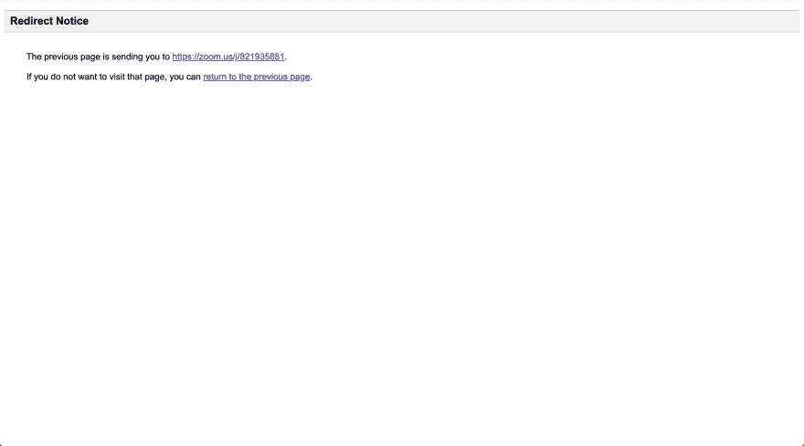
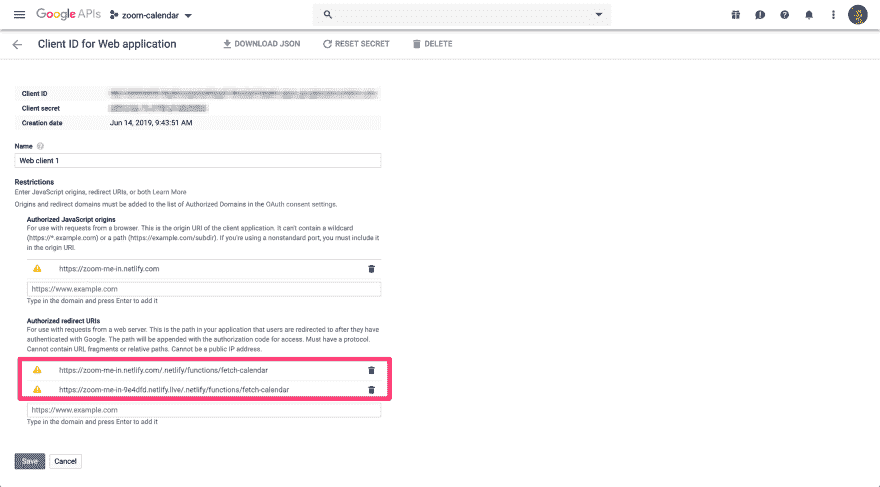
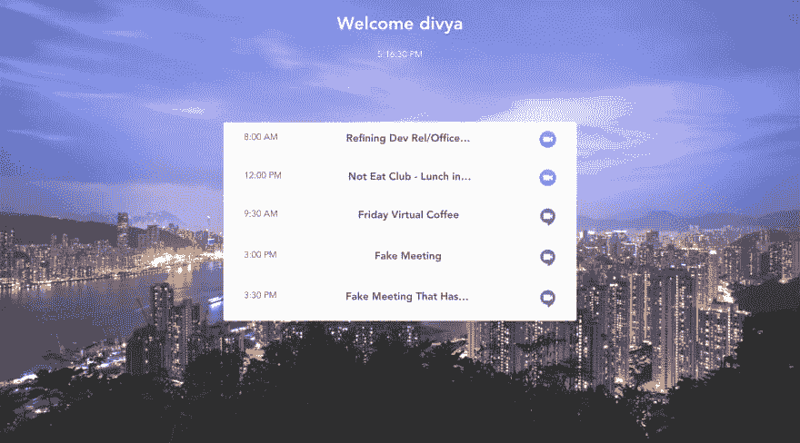

# 使用 Google 日历 API 和 Netlify 功能管理您的会议日程

> 原文：<https://dev.to/shortdiv/take-charge-of-your-meeting-schedule-with-the-google-calendar-api-and-netlify-functions-1dhp>

在 Netlify，我们为自己是一个偏远的一线队而自豪。尽管总部位于旧金山，但团队中的许多人生活在世界的不同地方，跨越了许多时区。因此，会议通过谷歌 Meet、Zoom 或 Slack 电话在线举行，具体取决于会议类型和与会人数。虽然拥有许多会议平台为我们提供了在如何开会方面的极大灵活性，但它也为特定会议将在哪里举行带来了额外的认知负担。

事实是，日历并不是记录会议地点的有效方式，尤其是当他们在线的时候。当然，它们给你一个很好的一天、一周、一月或一年中所有事件的概览，并在会议发生时提供急需的提醒。但是因为日历是作为时间的一般记录，它们并没有优化到可靠地告诉你去哪里开会。在线会议尤其如此。如果您使用谷歌日历，您可能已经注意到日历事件并不总是正确地链接到在线会议。除非你使用谷歌的默认会议软件 Google Meet，否则所有其他会议解决方案都被视为外部链接。这意味着等待重定向或多次点击以访问会议(很烦人，对吗？).

[](https://res.cloudinary.com/practicaldev/image/fetch/s--MTwaBccB--/c_limit%2Cf_auto%2Cfl_progressive%2Cq_auto%2Cw_880/https://paper-attachments.dropbox.com/s_70AE98E087CF0C4B99004A187D6BD50B4CC12DD8193DD560A90D265BE5E38C7F_1563562644374_Screen%2BShot%2B2019-06-25%2Bat%2B1.54.06%2BPM.png)

是为 Google Meet 创建的一个工具，它直接解决了这个问题。它提供了一个单一的地方来查看事件列表中的会议，假设它们发生在 Google Meet 上。考虑到大多数会议发生在各种平台上，例如 Slack Calls、Zoom 和 Blue Jeans 等等，`meet.google.com`的使用受到限制。为了解决这个问题，让我们构建一个`meet.google.com`的克隆，它显示所有的会议，而不考虑平台。

## 申请

由于我们的应用程序直接从 Google Calendar 中提取事件，因此我们将借助几个 Netlify 函数与 Google Calendar API 保持联系，这是一种使用 AWS Lambda 函数的简单快捷的方法，无需处理 API 网关。因为访问 Google Calendar API 需要访问敏感的、特定于用户的信息，所以我们必须首先确保请求得到了给定用户的认证和授权。让我们深入研究如何向 Google API 发出安全请求。

## 认证和授权

身份验证是验证用户身份的过程，而授权是定义特定用户或应用程序有权访问的内容的过程。授予对受限资源的访问权限需要身份验证和授权。简而言之，您不能查看受保护的资源，除非您的身份已经过验证(认证)，并且您已经被授予访问该资源的权限(授权)。

当对现代 API(如 Google API)的请求进行身份验证时，使用 OAuth 2.0。OAuth 2 是 web 上基于令牌的身份验证和授权的标准协议。OAuth 流的一般流程是获取访问令牌，并使用该访问令牌向 API 发出请求。在 Google API 的 OAuth 流程中，访问令牌是通过 Google 同意屏幕生成的。然后，这个令牌用于向授权的 Google API 端点发出任何后续的 API 请求。下面是 Google OAuth 流程的步骤分解。

1.  生成一个到 Google 同意界面的唯一 URL，并引导用户到那里
2.  如果用户同意，使用短期代码将用户重定向回您的应用程序
3.  使用短期代码生成访问令牌
4.  通过附加访问令牌作为授权承载报头，向 Google API 发出请求

现在我们已经对使用 Google API 时的总体授权流程有了一个概念，让我们将这些步骤付诸实施。

### 第一步:生成同意屏幕

首先，让我们生成我们的同意屏幕，在用户第一次访问我们的应用程序时发送给他们。为此，我们将创建第一个 Netlify 函数。

要在 Netlify 中创建一个工作函数，让我们在根目录中创建一个 functions 文件夹，并向其中添加一个名为`google-auth.js`的文件。这个文件是 OAuth 代码所在的位置。Netlify 函数的结构与用 Node 编写的 AWS lambda 函数没有太大区别。首先定义一个处理程序，函数用它来处理事件。调用该函数时，运行时运行处理程序，并根据函数是否成功返回或退出。下面的代码片段展示了一个返回消息体`hello world`的基本函数。

```
exports.handler = async (event, context) => {
  return {
    statusCode: 200,
    headers: {
      "Access-Control-Allow-Origin": "*",
      "Access-Control-Allow-Credentials": true,
      "Cache-Control": "no-cache",
       "Content-Type": "text/html"
    },
    body: JSON.stringify({ msg: "hello, world" })
  };
} 
```

为了生成我们的同意屏幕 URL，让我们修改我们的函数来生成 OAuth 实例。我们将首先关注生成 URL 的逻辑，然后将它添加到我们的函数中，以降低额外的复杂性。

对于我们的 generate URL 函数，我们将直接从 Google Calendar API 的 Nodejs quickstart 文档中提取，特别是`getAccessToken`函数。在下面的代码片段中，我们使用 googleapis 节点模块创建一个 OAuth 实例，传入我们的客户端 id、密码和所需的重定向 uri。redirect uri 是我们希望在用户授权我们的应用程序访问他们的日历数据时将用户重定向到的链接。

```
const { google } = require("googleapis");
/**
* Create an OAuth2 client with the given credentials, and then execute 
* the given callback function.
* @param {Object} credentials The authorization client credentials.
* @param {function} callback The callback to call with the authorized
* client.
*/
function authorize() {
  const SCOPES = ["https://www.googleapis.com/auth/calendar.readonly"];
  oAuth2Client = new google.auth.OAuth2(
    `${CLIENT_ID_HERE}`,
    `${CLIENT_SECRET_HERE}`,
    `${REDIRECT_URIS_HERE}`
  );
  //generate
  const authUrl = oAuth2Client.generateAuthUrl({
    access_type: "offline",
    scope: SCOPES
  });

  return authUrl;
} 
```

在上面的代码片段中值得注意的是在函数顶部定义的`SCOPES`变量。此变量定义了此应用程序可以访问的权限范围或授权级别。指定我们的应用程序的范围是很重要的，因为它限制了我们的应用程序可以访问的信息量，并且是保持用户信任应用程序不能扩展他们的访问范围的关键。

现在我们有了主授权函数，让我们把它转换成一个 Netlify 函数。我们将从实例化之前的 authorize 函数开始，并将返回值设置为一个名为`googleConsentURL`的变量。有了这个变量的返回值，我们就可以在函数体中将它作为 JSON 返回，就像这样:

```
const { google } = require("googleapis");

exports.handler = async () => {
  const googleConsentURL = await authorize();
  return {
    statusCode: 200,
    headers: {
      "Access-Control-Allow-Origin": "*",
      "Access-Control-Allow-Credentials": true,
      "Cache-Control": "no-cache",
      "Content-Type": "text/html"
    },
    body: JSON.stringify({ googleConsentURL })
  };

  function authorize() {
    ... // code from earlier
  }
}; 
```

虽然我们的代码到目前为止是有效的，但是我们还没有考虑授权代码失败的情况。如果我们的函数在当前的设置中失败，它将会停止并最终超时，而不是像我们预期的那样带着错误退出。为了说明失败情况，让我们将函数调用包装在一个`try…catch`块中。这样，当函数调用中出现错误时，我们可以返回一个正确的状态代码和一条有效的错误消息。

```
const { google } = require("googleapis");
exports.handler = async () => {
  let googleConsentURL;
  try {
    googleURL = await authorize();
  } catch (e) {
    return {
      statusCode: 500,
      headers: {
        "Access-Control-Allow-Origin": "*",
        "Access-Control-Allow-Credentials": true
      },
      body: JSON.stringify({
        error: e.message
      })
    };
  }
  return {
    statusCode: 200,
    headers: {
      "Access-Control-Allow-Origin": "*",
      "Access-Control-Allow-Credentials": true,
      "Cache-Control": "no-cache",
      "Content-Type": "text/html"
    },
    body: JSON.stringify({ googleConsentURL })
  };

  function authorize() {
    ... // code from earlier
  }
}; 
```

既然我们在函数中有了 OAuth 代码，我们就可以轻松地调用它，并使用 axios 检查返回值。注意，所有的 Netlify 函数都可以在带有后缀`/.netlify/functions/FUNCTION-NAME`的同一个域上访问，所以我们可以像这样简单地调用我们的函数:

```
axios.get("/.netlify/functions/google-auth")
  .then(res => {
    console.log(res.data.googleConsentURL);
  })
  .catch(err => console.log(err)) 
```

### 第二步:用代码重定向生成访问令牌

到目前为止，我们已经生成了一个指向 Google 同意屏幕的 URL，用户将通过该屏幕授权我们的应用程序访问他们的 Google 日历数据。如果我们要导航到该链接，我们将通过一个典型的谷歌认证工作流程完成 2FA(假设你有 2FA 设置)，如下图所示。成功认证后，Google 会将用户重定向回我们第一次创建初始 OAuth 实例时指定的`redirectURL`,还记得吗？。

[](https://res.cloudinary.com/practicaldev/image/fetch/s--65x1hN_F--/c_limit%2Cf_auto%2Cfl_progressive%2Cq_auto%2Cw_880/https://paper-attachments.dropbox.com/s_70AE98E087CF0C4B99004A187D6BD50B4CC12DD8193DD560A90D265BE5E38C7F_1561487349725_Screen%2BShot%2B2019-06-25%2Bat%2B2.28.44%2BPM.png)

为了让重定向后的谷歌登录流程工作，我们必须确保`redirectURL`设置在谷歌控制台的授权重定向 URIs 下(见下图)。这个重定向 URL 必须匹配初始 OAuth 实例中设置的`redirectURI`。一旦我们完成了这个设置，Google 的同意页面将正确地重定向一个用户，代码生成一个访问令牌作为查询字符串参数。假设我们的重定向 URI 是`https://zoom-me-in.netlify.com/.netlify/functions/fetch-calendar`，我们的同意屏幕将返回以下 URL: `https://zoom-me-in.netlify.com/.netlify/functions/fetch-calendar?code=CODE_TO_GENERATE_TOKEN_WILL_APPEND_HERE`

[](https://res.cloudinary.com/practicaldev/image/fetch/s--XC3YURTv--/c_limit%2Cf_auto%2Cfl_progressive%2Cq_auto%2Cw_880/https://paper-attachments.dropbox.com/s_70AE98E087CF0C4B99004A187D6BD50B4CC12DD8193DD560A90D265BE5E38C7F_1561489885616_googleapi.png)

### 第三步:获取访问令牌

现在我们已经有了生成访问令牌的适当代码，我们可以继续实际生成访问令牌，我们将需要它来向 Google Calendar API 发出请求。为了生成我们的令牌，我们将再次依赖一个 Netlify 函数。在前面的步骤中，您可能已经注意到，我们希望 Google 发送给用户进行 post 身份验证的重定向 URL 是一个函数端点(`/.netlify/functions/fetch-calendar`)。这是有意的，因为我们希望简化从认证请求到生成访问令牌的过程，而不需要让用户经历额外的步骤。在这一步中，我们将尝试实现的工作流是获取代码，生成访问令牌，并使用访问令牌将用户重定向回主应用程序。

为了生成我们的访问令牌，我们将从获取附加到 URL 的代码开始。在我们的函数处理程序代码中，我们可以通过`event.queryStringParameters`轻松访问我们的查询参数。由于 Google 在标签下添加了代码，`code`，我们可以简单地通过它的标签从查询字符串中提取代码，即`params.code`。有了这段代码，我们现在可以通过调用`oAuth2Client.getToken(code)`来创建一个访问令牌。

```
exports.handler = async event => {
  let params = event.queryStringParameters;
  const code = params.code;
  const token = await getAccessToken(code);

  async function getAccessToken(code) {
    const { CLIENT_SECRET, CLIENT_ID, REDIRECT_URIS } = process.env;

    let oAuth2Client = new google.auth.OAuth2(
      `${CLIENT_ID}`,
      `${CLIENT_SECRET}`,
      `${REDIRECT_URIS}`
    );

    const accessToken = await oAuth2Client.getToken(code);
    return accessToken;
  }
  return {
    statusCode: 200,
    headers: {
      "Access-Control-Allow-Origin": "*",
      "Access-Control-Allow-Credentials": true
    },
    body: JSON.stringify({ event: token.tokens.access_token })
  };
} 
```

注意，我们在这里重新实例化了一个 OAuth 实例，类似于我们在前面的函数代码中所做的。因为函数根据定义是无状态的，所以没有办法在函数之间共享一个变量。虽然我们可以将客户端保存到某种形式的外部数据存储中，但是两个函数生成的 OAuth 客户端是相同的，这里的代码重复非常少，因此我们可以复制这个代码片段。

目前，我们为成功生成的访问令牌返回 200 状态代码。尽管这在许多其他功能情况下都可行，但对于我们的用例来说并不理想。因为我们的函数是通过来自 Google 的重定向调用的，而不是来自我们的主应用程序，所以没有办法在这个函数之外获取这个函数的返回值。确保我们在获取该函数的返回值的同时保持无缝认证流的一种方法是执行重定向。

让我们将当前的回调转换为 302 重定向，这样在成功生成访问令牌后，用户将返回到主应用程序。

要将用户重定向回主应用程序，我们需要用户来自的原始 URL，也称为 referer URL。幸运的是，因为我们使用的是无服务器功能，我们可以通过事件标题中的`referer`属性轻松访问这个 referer URL。

使用重定向时需要注意的另一点是，通常重定向不支持发送消息体。这意味着我们不能只在事件主体中发送我们的访问令牌，并期望我们的主应用程序接收令牌。为了确保令牌被可靠地发送，我们将把我们的访问令牌作为查询字符串参数附加上去。

```
exports.handler = async event => {
  let referer = event.headers.referer;
  ...
  return {
    statusCode: 302,
    headers: {
      "Access-Control-Allow-Origin": "*",
      "Access-Control-Allow-Credentials": true,
      "Cache-Control": "no-cache",
      Location: `${referer}?token=${token.tokens.access_token}`
    },
    body: JSON.stringify({})
  };
} 
```

最后一步，让我们稍微重构一下我们的函数，像我们在前面的身份验证函数中所做的那样，考虑错误状态。我们将把对`getAccessToken`函数的调用封装在一个`try…catch`块中，每个场景都有相关的状态代码，如下所示:

```
exports.handler = async event => {
  let params = event.queryStringParameters;
  const code = params.code;
  let token;
  try {
    token = await getAccessToken(code);
  } catch (e) {
    return {
      statusCode: 500,
      headers: {
        "Access-Control-Allow-Origin": "*",
        "Access-Control-Allow-Credentials": true
      },
      body: JSON.stringify({
        error: "I AM AN ERROR MESSAGE"
      })
    };
  }

  async function getAccessToken(code) {
    ...
  }

  return {
    statusCode: 302,
    headers: {
      "Access-Control-Allow-Origin": "*",
      "Access-Control-Allow-Credentials": true,
      "Cache-Control": "no-cache",
      Location: `${referer}?token=${token.tokens.access_token}`
    },
    body: JSON.stringify({})
  };
} 
```

### 第四步:获取事件

现在我们有了合适的访问令牌，让我们最终向 Google Calendar API 发出请求。访问我们的 API 的端点看起来像这样:`https://www.googleapis.com/calendar/v3/calendars/primary/events?singleEvents=true&timeMax=${end.toISOString()}&timeMin=${start.toISOString()}`。因为我们的请求必须被认证，所以我们必须在`Authorization: Bearer`头中发送我们的访问令牌。

我们将使用 axios 库向 Calendar API 发出 GET 请求，并将令牌作为授权头传递，如下所示:

```
function getCalendarEvents() {
  var start = new Date();
  start.setHours(0, 0, 0, 0);
  var end = new Date();
  end.setHours(23, 59, 59, 999);

  axios
    .get(
      `https://www.googleapis.com/calendar/v3/calendars/primary/events?singleEvents=true&timeMax=${end.toISOString()}&timeMin=${start.toISOString()}&orderBy=startTime`, {
      headers: {
        Authorization: `Bearer ${this.token}`
      }
    })
    .then(res => {
      return res.data.items;
    })
    .catch(err => console.log(err))
} 
```

注意，Google Calendar API 端点接受一个`timeMax`和一个`timeMin`作为查询字符串参数。这些参数可以方便地定义您正在获取的事件的时间范围。设置此项可以让您更有预见性地从日历中获取事件。在上面的代码片段中，我们为当天创建了一个 24 小时的时间框架，因此我们可以准确地显示当天发生的事件。

## 提高 UX

尽管理论上一切正常，但让我们稍微平滑一下，以改善应用程序的用户体验。从我们创建的最后一个函数中，我们生成了一个访问令牌，并将其重定向回应用程序的根目录，该令牌作为查询字符串参数附加在后面。理想情况下，如果令牌存在，我们会希望我们的应用程序自动获取事件。

为了实现这一点，让我们让主应用程序每次挂载时都检查一个名为 token 的查询字符串参数。如果令牌存在，它将获取令牌并发出请求，如果不存在，它将生成一个指向同意屏幕的 URL，用户可以在该屏幕上运行身份验证流程。这里我们将使用 Vue 作为例子，但是在这里你可以随意使用你喜欢的前端框架。

```
<script>
  name: "zoomify",
  data() {
    return {
      url: null,
      token: null,
      events: []
    }
  },
  mounted() {
    if (window.location.search.indexOf("token") > -1) {
      this.token = this.geturlparams("token");
      this.getCalendarEvents();
    } else {
      axios.get("/.netlify/functions/google-auth").then(res => {
        this.url = res.data.redirectURL;
      });
    }
  },
  methods: {
    geturlparams(name) {
      // courtesy of https://stackoverflow.com/a/5158301/3216524 //
      var match = RegExp("[?&]" + name + "=([^&]*)").exec(
        window.location.search
      );
      return match && decodeURIComponent(match[1].replace(/\+/g, "  "));
    },
    getCalendarEvents() {
      var start = new Date();
      start.setHours(0, 0, 0, 0);
      var end = new Date();
      end.setHours(23, 59, 59, 999);

      axios
        .get(
        `https://www.googleapis.com/calendar/v3/calendars/primary/events?singleEvents=true&timeMax=${end.toISOString()}&timeMin=${start.toISOString()}&orderBy=startTime`, {
          headers: {
            Authorization: `Bearer ${this.token}`
          }
        })
        .then(res => {
          return res.data.items;
        })
        .catch(err => console.log(err))
    }
}
</script> 
```

## 总结起来

假设一切正常，您应该会看到如下所示的屏幕，显示当天的所有事件。下面的演示当然为天赋添加了一些额外的细节。如果你有兴趣看到我们在这里介绍的代码旁边的那些修改，[请在这里](https://github.com/shortdiv/zoom-me-in)随意查看 GitHub 上的回购。泰利霍！

[](https://res.cloudinary.com/practicaldev/image/fetch/s--QgPJmJuk--/c_limit%2Cf_auto%2Cfl_progressive%2Cq_auto%2Cw_880/https://paper-attachments.dropbox.com/s_70AE98E087CF0C4B99004A187D6BD50B4CC12DD8193DD560A90D265BE5E38C7F_1563576353284_Screen%2BShot%2B2019-06-21%2Bat%2B5.16.30%2BPM.png)