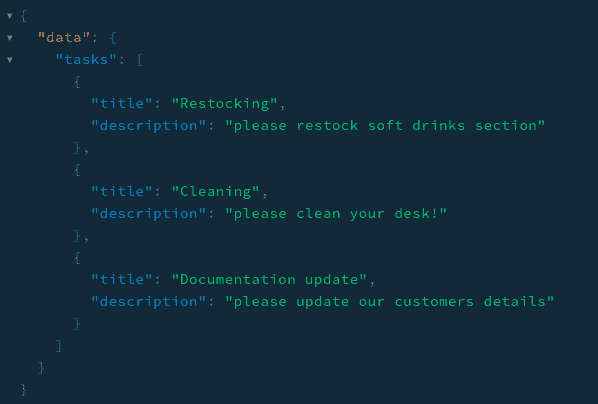
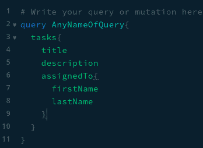
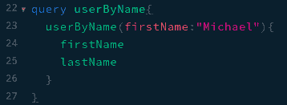

# REST、GraphQL 和 Graphback 速成班#3: GraphQL

> 原文：<https://dev.to/aerogear/technologies-that-changed-my-perception-of-software-development-mbm>

* * *

# 

<center>GraphQL</center>

* * *

GraphQL 是脸书发明的一种查询语言，是 REST 设计和构建 API 的替代方法。Schema 是任何 GraphQL 服务器的核心，它描述了客户机可用的功能。架构具有定义以下内容的类型:

*   实体之间的关系——在我们的例子中，它是用户和任务之间的关系
*   可以由客户端执行的数据操纵和操作，在我们的项目中，这些将是例如获取所有用户或所有任务的查询，以及删除和添加用户或任务的突变。

为了构建我们的 GraphQL 服务器，我们将使用“模式优先”的方法，这基本上是在开发中优先构建模式。它允许我可视化实体之间的数据流和我可能需要的查询/变化！我们还将使用 Apollo framework for GraphQL server，这是一个帮助我们将 graph QL 模式连接到节点服务器的库，与 express framework for REST 相同。

## 要求

*   [休息 10 分钟](https://dev.to/aerogear/technologies-that-changed-my-perception-of-software-development-34lm)完成或从我的[休息教程](https://github.com/MStokluska/REST-Tutorial) github 库下载。

## 我们开始吧

首先，考虑模式，我们的实体将会是什么？我们计划返回什么数据？客户需要什么？想象一下我们的项目，有任务和用户，我们的 GraphQL 类型看起来会像这样:

```
type User {
    id: ID!
    firstName: String!
    lastName: String!
    title: String!
    email: String
}

type Task {
    id: ID!
    title: String!
    description: String!
    status: String!
    assignedTo: [User!]!
} 
```

我们正在定义两个实体，一个`User`和`Task`实体。两者都有不同的属性和返回类型。客户端可以访问一个`User`对象或`Task`对象，从那里他可以访问任何给定的属性，然而，`Task`的`assignedTo`返回一个`User`对象。感叹号只是表示`Required`，所以在我们的`assignedTo`示例中——返回类型需要是`Users`的数组类型。

*   在现有的服务器项目中，使用 npm 添加以下依赖项:

```
$ npm install apollo-server-express graphql graphql-import 
```

*   接下来，编辑我们的`index.js`文件。

```
const express = require('express');
const { ApolloServer } = require('apollo-server-express');
const schema = require('./schema');

const app = express();

app.use(express.json());

const server = new ApolloServer({ schema });

server.applyMiddleware({
  app,
  path: '/graphql',
});

const port = 4000;

app.listen(port, () => {
  console.log(`🚀 Server is running at: http://localhost:${port}/graphql`);
}); 
```

我们不再需要 REST 方法，所以您可以删除它们。接下来，我们将 Apollo 服务器添加到我们的项目中。然后，将一个模式(尚未实现)应用到我们的 Apollo 服务器，最后，我们可以将中间件应用到它，这是 express 和 path -也称为- endpoint。

*   在我们的`server`文件夹中创建一个名为`schema`的新文件夹
*   在`schema`文件夹中创建一个名为`typeDefs.graphql`的文件，它将保存我们上面指定的类型。粘贴以下代码:

```
type User {
    id: ID!
    firstName: String!
    lastName: String!
    title: String!
    email: String
}

type Task {
    id: ID!
    title: String!
    description: String!
    status: String!
    assignedTo: [User!]!
} 
```

*   接下来，我们将添加类型查询——它支持给定的查询，现在，让我们保持简单，坚持我们的两个基本查询,`tasks`,它允许客户端访问所有任务的列表，以及`users`,它允许访问整个用户数组。

```
type Query {
    tasks: [Task!]!
    users: [User!]!
} 
```

*   接下来，将另一个名为`resolvers.js`的文件添加到`schema`文件夹中，并粘贴以下代码:

```
const { tasks, users } = require('../db');

const resolvers = {
  Query: {
    tasks() {
      return tasks;
    },

    users() {
      return users;
    },
  },
};

module.exports = resolvers; 
```

解析器只是从 typeDefs 中解析类型值的函数。它们可以返回值，如字符串、数字、布尔值等。例如，`users`解析器必须返回一个数组`Users`。它们类似于我们在 express 中看到的 HTTP 处理函数，它们实现业务逻辑并返回结果。

*   在`schema`文件夹中创建`index.js`并粘贴以下代码:

```
const { importSchema } = require('graphql-import');
const { makeExecutableSchema } = require('graphql-tools');
const resolvers = require('./resolvers');
const typeDefs = importSchema('schema/typeDefs.graphql');

module.exports = makeExecutableSchema({ resolvers, typeDefs }); 
```

在这一步中，我们已经创建了一个包含解析器和类型定义的可执行模式，因此它可以在我们的`index.js`
中使用

```
const express = require('express');
const { ApolloServer } = require('apollo-server-express');
const schema = require('./schema'); <-----------------------------

const app = express();

app.use(express.json());

const server = new ApolloServer({ schema });<---------------------

server.applyMiddleware({
  app,
  path: '/graphql',
});

const port = 4000;

app.listen(port, () => {
  console.log(`🚀 Server is running at: http://localhost:${port}/graphql`);
}); 
```

*   您现在可以保存所有更改，运行`npm start`并导航到`http://localhost:4000/graphql`。您应该看到以下内容:

[](https://res.cloudinary.com/practicaldev/image/fetch/s--EJjUEZ3W--/c_limit%2Cf_auto%2Cfl_progressive%2Cq_auto%2Cw_880/https://thepracticaldev.s3.amazonaws.com/i/gaz5w352o1y0k8fxnbw6.png)

您刚刚从您的第一台 GraphQL 服务器上启动了 GraphQL playground！在左侧窗口中，您可以写下您的查询和突变，而响应将显示在右侧！让我们试一试，编写我们的第一个查询:

[](https://res.cloudinary.com/practicaldev/image/fetch/s--pUidqr-f--/c_limit%2Cf_auto%2Cfl_progressive%2Cq_auto%2Cw_880/https://thepracticaldev.s3.amazonaws.com/i/c04ztnuycm9rl0q7pczu.png)

*   第 2 行`query AnyNameOfQuery` -在这里你简单地指定你是否要使用查询或变异，并且你命名你的查询/变异。
*   第 3 行`tasks{`这是我们在`typeDefs`文件中指定的查询名称:

```
tasks: [Task!]! 
```

*   第 4 & 5 行说明了我们感兴趣的是什么。我们已经在 typeDefs 中指定，查询任务将返回一个由`task`对象组成的数组。
*   点击操场中间的播放按钮，您应该会得到以下响应:

[](https://res.cloudinary.com/practicaldev/image/fetch/s--NvMyY_7i--/c_limit%2Cf_auto%2Cfl_progressive%2Cq_auto%2Cw_880/https://thepracticaldev.s3.amazonaws.com/i/nkkd90xqxyfghssgr5ny.png)

如果您在左边的窗口中输入了不止一个查询或变异，那么 play 按钮会为您提供一个选项来选择您想要执行的查询/变异。

当我们执行查询`task`时，我们可以访问整个对象，但是我们可能只想要它的某一部分！所以在上面的例子中，我们只从一个数组`tasks`中请求了标题和描述。您可能会想，如果我们使用的是 typeDefs 中预先命名的查询，为什么还要设置查询的名称。
答案是——我们不需要！但是想象一下，你正在为一个客户工作，你想访问任务两次，一次你只对标题感兴趣，另一次你只对描述感兴趣！命名查询非常有用。

*   现在，让我们将`assignedTo`添加到我们现有的查询中，这暂时不会起作用，但我希望您尝试一下，以便更好地理解解析器的职责。

添加`assignedTo{`并点击`ctrl + space`。您应该看到 GraphQL 可以为您获取的所有可用数据，所有这些信息都来自于在`typeDefs`中指定的类型。

*   假设我们对用户的`firstName`和`lastName`感兴趣。

[](https://res.cloudinary.com/practicaldev/image/fetch/s--zlTRUxeV--/c_limit%2Cf_auto%2Cfl_progressive%2Cq_auto%2Cw_880/https://thepracticaldev.s3.amazonaws.com/i/hflmb09uk44obzjdpcrd.png)

点击播放并...一个错误！现在想想我们的解析器和类型定义:

```
const { tasks, users } = require('../db');

const resolvers = {
  Query: {
    tasks() {
      return tasks;
    },

    users() {
      return users;
    },
  },
};

module.exports = resolvers; 
```

它不工作的原因是我们必须实现一个新的解析器来返回任务被分配到的用户。

*   让我们通过向解析器添加以下代码来指定我们的 assignedTo 应该做什么:

```
const resolvers = {

    Task: {
        assignedTo(task) {
            return users.filter(u => u.id === task.assignedTo);
        },
    },

    Query: {
        tasks() {
            return tasks;
        },

        users() {
            return users;
        },
    },
}; 
```

因此，当访问`assignedTo`时，我们将过滤一个数组`users`并返回一个`user`，它具有与`assignedTo`匹配的`id`。

现在我们的查询应该可以正常工作了，我建议您在操场上玩一会儿查询，以便更好地理解 GraphQL。

*   接下来，让我们向我们的服务器再添加一个查询——假设我们希望我们的服务器接受一个用户名并返回一个同名的`User`对象。首先，我们需要编辑我们的`typeDefs.graphql`:

```
type Query {
    tasks: [Task!]!
    users: [User!]!
    userByName(firstName: String!): User!
} 
```

所以我们新的`userByName`查询将接收一个字符串，并返回一个用户对象给我们。

*   现在进入解析器:

```
Query: {
        tasks() {
            return tasks;
        },

        users() {
            return users;
        },

        userByName(parent, args, context,){
            return users.filter(u => u.firstName === args.firstName)
        },
    }, 
```

我们所做的相当于 REST params！

*   现在重启服务器，在操场上测试我们的新查询:

[](https://res.cloudinary.com/practicaldev/image/fetch/s--n6Hk9jH9--/c_limit%2Cf_auto%2Cfl_progressive%2Cq_auto%2Cw_880/https://thepracticaldev.s3.amazonaws.com/i/cj0jobage6c0jmj9opwc.png)

我认为启用另一个查询是一个很好的实践，比如说`findUserById`——自己尝试一下吧！

*   接下来，我们将添加我们的第一个突变类型！如果我们可以将任务添加到我们的数据库中，这将非常有用，要启动它，我们需要首先编辑我们的 typeDefs:

```
type Mutation {
    addTask(id: ID!, title: String!, description: String!, status: String!, assignedTo: ID!): Task!
} 
```

我们的`addTask`变异接受 id、标题、描述、状态和 assignedTo，所有字段都是必需的，我们希望返回新的`task`。

*   现在来谈谈解决方案:

```
const { tasks, users } = require('../db');

const resolvers = {

    Task: {
        assignedTo(task) {
            return users.filter(u => u.id === task.assignedTo);
        },
    },

    Query: {
        tasks() {
            return tasks;
        },

        users() {
            return users;
        },

        userByName(parent, args, context,){
            return users.filter(u => u.firstName === args.firstName)
        }
    },
    Mutation: {
        addTask(parent, args, context) {
          const newTask = {
            id: args.id,
            title: args.title,
            description: args.description,
            status: args.status,
            assignedTo: args.assignedTo,
          };

            tasks.push(newTask);

            return newTask;
        },
    };
};

module.exports = resolvers; 
```

我们在`addTask`突变中所做的是:

*   基于传入的参数创建新的`task`
*   将新的`task`推送到`task`数组
*   返回新创建的`task`

你可以通过参观操场来观看我们新创造的突变:

[](https://res.cloudinary.com/practicaldev/image/fetch/s--O84HGVjp--/c_limit%2Cf_auto%2Cfl_progressive%2Cq_auto%2Cw_880/https://thepracticaldev.s3.amazonaws.com/i/io6thze4xpnmaeootujl.png)

*   我们的第二个突变将是`deleteTask`突变，我们再次从`typeDefs.graphql`文件开始:

```
removeTask(id: ID!): [Task!]! 
```

*   接下来我们的解决方案:

```
const resolvers = {

    Task: {
        assignedTo(task) {
            return users.filter(u => u.id === task.assignedTo);
        },
    },

    Query: {
        tasks() {
            return tasks;
        },

        users() {
            return users;
        },

        userByName(parent, args, context,){
            return users.filter(u => u.firstName === args.firstName)
        }
    },
    Mutation: {
        addTask(parent, args, context) {
          const newTask = {
            id: args.id,
            title: args.title,
            description: args.description,
            status: args.status,
            assignedTo: args.assignedTo,
          };

            tasks.push(newTask);

            return newTask;
        },

        removeTask(parent, args, context) {
            const taskIndex = tasks.findIndex(t => t.id === args.id);

            tasks.splice(taskIndex, 1);

            return tasks;
          },
    }
}; 
```

就像第一次变异一样，在操场上试一试！

## 总结

我想现在你应该很清楚你可以用 GraphQL 做什么，以及 GraphQL 和 REST 之间的区别——我们经历的所有这些查询和变化都使用一个端点，客户端决定他想从服务器得到什么，这可以极大地提高我们的响应速度！GraphQL 的另一个巨大成功是它允许在一个请求中接收许多资源！想象一下，在您的一个页面上，您需要访问任务和用户——您可以通过发送一个查询来实现！对我来说，理解 GraphQL 改变了我看待客户机-服务器架构的方式——仅仅是因为我发现它如此神奇和容易使用，以至于我后悔现在才了解它！我真的希望你也会喜欢它！

现在，让我们直奔最后一部分——绝对令人兴奋的 Graphback！