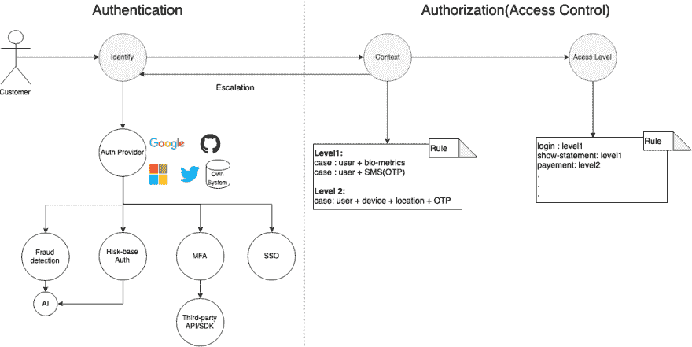

# 身份管理系统的技术前景

> 原文：<https://dev.to/koduki/technology-landscape-for-identification-management-system-33jl>

## 前言

身份管理系统对于企业和消费者来说都是非常重要的组成部分。

尤其是， **MFA** 是非常热门的话题。有人知道 MFA 吗？但是你清楚的了解 MFA **吗**？仅仅使用短信或生物识别是**而不是** MFA。

让我解释一下身份管理系统的技术趋势，如 MFA、基于风险的身份认证、CAAC 和 SSO。

## 认证/授权

如你所知 **Auth** 有两个意思——**认证**和**授权**。这些是非常相似词。但是不同就是简单。

认证是**识别**。这意味着“你是谁？”。授权是**访问控制**。这意味着“你被允许做什么？”

例如， **OpenID** 是用于识别的技术， **OAuth** 是用于访问控制的技术。

## 多因素认证(MFA)

MFA/2FA 是非常热门的技术。但并不是说要用短信或者生物识别。请注意与**两步验证**的区别。

根据 [NIST 专刊 800-63-3 数字身份指南](https://nvlpubs.nist.gov/nistpubs/SpecialPublications/NIST.SP.800-63-3.pdf)，认证有**三要素**。

*   你知道的事情
*   你有的东西
*   你是什么

***【你知道的东西】*** 是只有正确的使用者才知道的知识。密码或 PIN 是典型的例子。

***【你有的东西】*** 是只有权利人拥有的财产。SMS(电话号码)、邮件地址、令牌生成器、硬件密钥/卡、IP 地址和地理位置都是典型的例子。

***【你是什么东西】*** 是生物特征识别。指纹、面部和虹膜是典型的例子。今天，智能手机和人工智能有助于这一领域。

MFA 是两个以上因素的组合。这意味着**二号密码不是 2FA** 。只有**单因素两步验证**。因为密码和 2 号密码都是 ***“你知道的东西”*** 。

单因素**容易被同样的方式**黑掉。所以组合很重要。

尤其是几乎**攻击者已经知道正确的 ID 和密码**。然后我们需要对**附加因子**进行重要操作。

## 欺诈检测

**监控**和**欺诈检测**是身份管理非常重要的部分。因为**攻击者已经知道了正确的 ID 和密码**。但是我们需要缺陷欺诈。

互联网协议地址 **(IPA)位置**、**地理位置**和**时间**是重要的信息。

因为如果有人在日本被访问五分钟后在美国被访问，可能就是**非法访问**。这样的访问**应该被拒绝**。

## 基于风险的认证

基于风险的身份认证是对欺诈检测的改进。有时我们使用新电脑，然后搬到另一个地方。

如果只是提供欺诈检测，在这种情况下我们无法登录。它不是用户友好的。

因此，基于风险的认证管理这样一种**不规则的访问模式，即风险**。而且它需要更多的**附加认证**，比如短信、电子邮件等等。这是非常有用的功能。

一般智能手机行业把这种行为称为**两步验证**带短信认证。

## 上下文感知访问控制(CAAC)

上下文感知访问控制主要用于企业系统。它是基于角色的访问控制(RBAC)的延伸。

它**根据以下因素动态**确定接入能力。

*   用户
*   设备
*   位置
*   目标系统
*   目标操作

例如，我们可以通过办公室或家庭来控制访问级别。当用户在家时，它能够**要求额外的认证因子**,如硬件密钥。

[Azure AD 条件接收](https://docs.microsoft.com/en-us/azure/active-directory/conditional-access/overview)和 [Google Cloud IAP](https://cloud.google.com/iap/) 都提供了这个功能。它是**零信任证券**的关键部件。这是 SaaS 安全控制的唯一途径。因为云龄是**每次访问都是远程访问**。现在 VPN 不够用。

## 单点登录

对于企业来说，单点登录并不是新技术。LDAP 和 Acitive Direcotry 以及每个云供应商的 IAMs 都提供了这个功能。这是企业系统的自然方式。

也许有人会认为 **SSO 是为了员工**的可用性。但是**不对**。

**SSO 是为了安全**。你已经知道，**的身份识别管理是非常复杂的系统**。它需要许多功能，如 MFA、欺诈检测和监控以及上下文感知访问。

如果我们不使用单点登录，每个系统都有自己的帐户。用户需要管理他们的密码。它看起来很安全。

但是**很难为单个系统做出最好的认证功能**并且由每个用户正确地管理多个密码**是**不现实的场景**。也许**他们对每个系统使用相同的密码**来帮助他们的大脑记忆。不安全。**

 **所以我们**使用 SSO** 和**可信 ID 系统**来保证安全性。这是**的最佳做法！**

## 结论

此图是识别管理系统的概要。

最重要的是，**身份管理系统非常复杂**。我们**不应该自己做**。

如果你让**成为消费者**的系统，你应该使用**的社交服务 ID** 像谷歌、GitHub、Twitter 和脸书与**的 OpenID 连接**。

而如果把**做成业务**的系统，就要用 **IDaaS** 像 AzureAD 用 **SAML 2.0** 或者 **OpenID 连接**。

我相信这是避免识别问题的最佳实践和唯一方法。

黑客快乐！**