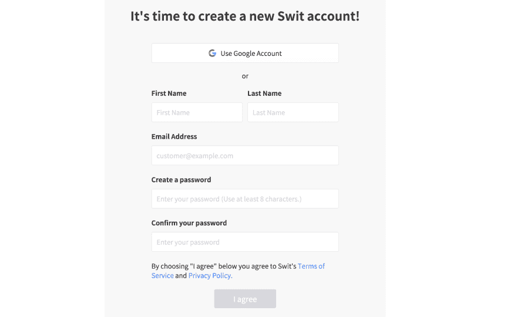
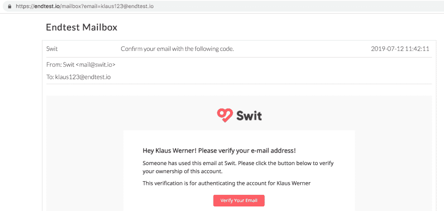

# 用 Selenium 测试电子邮件

> 原文：<https://dev.to/endtest/testing-emails-with-selenium-5h62>

**[Selenium](https://www.seleniumhq.org/)** 应用广泛，但一个鲜为人知的事实是，你可以用它来测试任何用 HTML 和 CSS 构建的东西，包括 **[Chrome 扩展](https://dev.to/razgandeanu/testing-chrome-extensions-with-selenium-491b)** 和电子邮件。

我们将为来自 **[Swit](https://swit.io)** 的 **[注册](https://swit.io/register)** 页面创建一个简单的测试，然后我们将测试我们收到的电子邮件。

我还将对 Selenium 和**[Endtest](https://endtest.io)**:
[https://www.youtube.com/embed/K3k-f9vB8Dc](https://www.youtube.com/embed/K3k-f9vB8Dc)
进行一些比较，Selenium 只能在浏览器中与 HTML 元素交互。

这意味着我们必须在浏览器中打开我们的电子邮件。

幸运的是，任何人都可以免费使用 **[Endtest 邮箱](https://endtest.io/mailbox)** 。

它的工作方式类似于一次性电子邮件服务。
只需将您的电子邮件发送到[用户名@endtest.io](mailto:username@endtest.io) 电子邮件地址。

用户名可以是您选择的任何名称。例如，你可以选择类似于 [jim32328@endtest.io](mailto:jim32328@endtest.io) 的东西。

您可以在该页面上访问该电子邮件地址的收件箱。

只需在 URL 中添加邮件参数，就像这样:
[https://endtest.io/mailbox?email=jim32328@endtest.io](https://endtest.io/mailbox?email=jim32328@endtest.io)

请注意，邮件将在 2 小时后被删除。

但是现在，让我们从 Swit 取回注册页面:

*driver . get([https://swit.io/register"](https://swit.io/register%22))*

*first name = driver . find _ element _ by _ id(" first name ")*
*last name = driver . find _ element _ by _ id(" last name ")*
*email = driver . find _ element _ by _ id(" id ")*
*password = driver . find _ element _ by _ id(" password ")*
*confirm password = driver . find _ element _ by _ id(" confirm password ")*
*submit button = driver*

*first name . send _ keys(" Klaus ")*
*last name . send _ keys(" Werner ")*
*email . send _ keys("[Klaus 123 @ endtest . io](mailto:klaus123@endtest.io)"*
*password . send _ keys(" password 123 ")*
*confirm password . send _ keys(" password 123 ")*
*submit button . click()*

这是结果:

现在，如果我们想查看那封邮件，我们必须去:
[【https://endtest.io/mailbox?email=klaus123@endtest.io】](https://endtest.io/mailbox?email=klaus123@endtest.io)

我们将能够打开我们的电子邮件:

我们只需用硒来写那部分:

*driver . get("[https://endtest.io/mailbox?email=klaus123@endtest.io"](https://endtest.io/mailbox?email=klaus123@endtest.io%22))*
*email = driver . find _ element _ by _ class _ name(" email _ item ")*
*email . click()*

因为您计划多次运行该测试，所以您应该生成一个随机的电子邮件，并将其存储在一个变量中，然后将其附加到 Endtest 邮箱 URL。

如果你正在寻找一个更好的硒替代品，切换到。
[https://www.youtube.com/embed/4DIVKcs--TA](https://www.youtube.com/embed/4DIVKcs--TA)