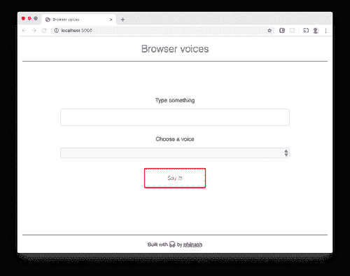
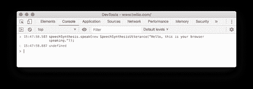

# 使用 Web 语音 API 在浏览器中进行文本到语音转换

> 原文：<https://dev.to/twilio/text-to-speech-in-the-browser-with-the-web-speech-api-20nk>

[网络语音 API](https://developer.mozilla.org/en-US/docs/Web/API/Web_Speech_API) 有两个功能，[语音合成](https://developer.mozilla.org/en-US/docs/Web/API/SpeechSynthesis)，也称为文本到语音，和[语音识别](https://developer.mozilla.org/en-US/docs/Web/API/SpeechRecognition)。使用 [`SpeechSynthesis API`](https://developer.mozilla.org/en-US/docs/Web/API/SpeechSynthesis) 我们可以命令浏览器以多种不同的声音读出任何文本。

从应用程序中的语音提示到在你的网站上实现自动驾驶的聊天机器人，Web Speech API 在 Web 界面上有很大的潜力。继续了解如何让您的 web 应用程序与您交流。

## 你需要什么

如果你想在我们学习`SpeechSynthesis` API 的时候构建这个应用程序，那么你需要几样东西:

*   现代浏览器([大多数桌面和移动浏览器都支持该 API](https://caniuse.com/#feat=speech-synthesis)
*   文本编辑器

一旦你准备好了，创建一个工作目录并下载[这个 HTML 文件](https://github.com/philnash/web-assistant/blob/master/speech-synthesis/browser-voices-starter.html)和[这个 CSS 文件](https://github.com/philnash/web-assistant/blob/master/speech-synthesis/browser-voices-style.css)到其中。确保它们在同一个文件夹中，并且 CSS 文件被命名为`style.css`。在您的浏览器中打开 HTML 文件，您应该会看到以下内容:

[](https://res.cloudinary.com/practicaldev/image/fetch/s--fMWp7hiF--/c_limit%2Cf_auto%2Cfl_progressive%2Cq_auto%2Cw_880/https://s3.amazonaws.com/com.twilio.prod.twilio-doimg/4LcA2N5fPD153TZqvW6QAOfBp2L54sS7O7_JEUHkOn8MvY.width-500.png)

让我们通过让浏览器第一次与我们对话来开始使用 API。

## 语音合成 API

在我们开始使用这个小应用程序之前，我们可以使用浏览器的开发工具让浏览器开始说话。在任何网页上，打开开发者工具控制台，输入以下代码:

```
speechSynthesis.speak(new SpeechSynthesisUtterance("Hello, this is your browser speaking.")); 
```

[](https://res.cloudinary.com/practicaldev/image/fetch/s--HUNF0zAC--/c_limit%2Cf_auto%2Cfl_progressive%2Cq_auto%2Cw_880/https://s3.amazonaws.com/com.twilio.prod.twilio-doimg/kdOBGAsfWuOC7SgTfHj12NKzm8Qg7JHgdDvYPqt91VP-ek.width-500.png)

您的浏览器将显示文本"*您好，我是您的浏览器。*”的默认语音。不过，我们可以稍微分解一下。

我们创建了一个`SpeechSynthesisUtterance`，其中包含了我们想要朗读的文本。然后我们将话语传递给`speechSynthesis`对象的`speak`方法。这会将要说的话语排队，然后启动浏览器说话。如果您向`speak`方法发送一个以上的话语，它们将被一个接一个地说出来。

让我们把之前下载的启动代码变成一个小应用程序，我们可以输入要说的文本，并选择浏览器说话的声音。

## web 应用中的语音合成

在文本编辑器中打开之前下载的 HTML 文件。我们将首先连接表单，以便在提交时朗读您在文本输入中输入的任何内容。稍后，我们将添加选择要使用的声音的功能。

在 HTML 底部的`<script>`标签之间，我们首先监听`DOMContentLoaded`事件，然后选择一些我们需要的元素的引用。

```
<script>
  window.addEventListener('DOMContentLoaded', () => {
    const form = document.getElementById('voice-form');
    const input = document.getElementById('speech');
  });
</script> 
```

然后我们需要监听表单上的 submit 事件，当它触发时，从输入中获取文本。我们将使用该文本创建一个`SpeechSynthesisUtterance`，然后将其传递给`speechSynthesis.speak`。最后，我们清空输入框，等待下一个要说的东西。

```
<script>
  window.addEventListener('DOMContentLoaded', () => {
    const form = document.getElementById('voice-form');
    const input = document.getElementById('speech');

    form.addEventListener('submit', event => {
      event.preventDefault();
      const toSay = input.value.trim();
      const utterance = new SpeechSynthesisUtterance(toSay);
      speechSynthesis.speak(utterance);
      input.value = '';
    });
  });
</script> 
```

在浏览器中打开 HTML，在输入中输入一些文本。此时您可以忽略`<select>`框，我们将在下一节中使用它。点击*说出它*，听浏览器读出你的话。

让浏览器说点什么并不需要太多代码，但是如果我们想选择它使用的声音呢？让我们用可用的声音填充页面上的下拉列表，并使用它来选择我们想要使用的声音。

## 为文本到语音挑选声音

我们需要获取页面上的`<select>`元素的引用，并初始化几个变量，我们将使用这些变量来存储可用的声音和我们正在使用的当前声音。将此添加到脚本的顶部:

```
<script>
  window.addEventListener('DOMContentLoaded', () => {
    const form = document.getElementById('voice-form');
    const input = document.getElementById('speech');
    const voiceSelect = document.getElementById('voices');
    let voices;
    let currentVoice;

    form.addEventListener('submit', event => { //... })
  });
</script> 
```

接下来，我们需要用可用的声音填充 select 元素。我们将创建一个新的函数来完成这项工作，因为我们可能希望不止一次地调用它(稍后会详细介绍)。我们可以调用`speechSynthesis.getVoices()`来返回可用的`[SpeechSynthesisVoice](https://developer.mozilla.org/en-US/docs/Web/API/SpeechSynthesisVoice)` [对象](https://developer.mozilla.org/en-US/docs/Web/API/SpeechSynthesisVoice)。

当我们填充声音选项时，我们还应该检测当前选择的声音。如果我们已经选择了一个声音，我们可以检查我们的`currentVoice`对象，如果我们还没有选择一个声音，那么我们可以用`voice.default`属性检测默认的声音。

```
 let voices;
    let currentVoice;

    const populateVoices = () => {
      const availableVoices = speechSynthesis.getVoices();
      voiceSelect.innerHTML = '';

      availableVoices.forEach(voice => {
        const option = document.createElement('option');
        let optionText = `${voice.name} (${voice.lang})`;
        if (voice.default) {
          optionText += ' [default]';
          if (typeof currentVoice === 'undefined') {
            currentVoice = voice;
            option.selected = true;
          }
        }
        if (currentVoice === voice) {
          option.selected = true;
        }
        option.textContent = optionText;
        voiceSelect.appendChild(option);
      });
      voices = availableVoices;
    };

    form.addEventListener('submit', event => { //... }) 
```

我们可以马上给`populateVoice`打电话。有些浏览器会加载语音页面，并立即返回列表。其他浏览器需要异步加载它们的语音列表，一旦加载完毕，就会发出一个“voiceschanged”事件。但是有些浏览器根本不会发出这个事件。

为了考虑所有可能的情况，我们将立即调用`populateVoices`，并将其设置为对“voiceschanged”事件的回调。

```
 voices = availableVoices;
    };

    populateVoices();
    speechSynthesis.onvoiceschanged = populateVoices;

    form.addEventListener('submit', event => { //... })
  });
</script> 
```

重新加载页面，您将看到`<select>`元素填充了所有可用的声音，包括声音支持的语言。我们还没有选择和使用声音，这是下一步。

监听 select 元素的“change”事件，每当它被触发时，使用`<select>`元素的`selectedIndex`选择`currentVoice`。

```
 populateVoices();
    speechSynthesis.onvoiceschanged = populateVoices;

    voiceSelect.addEventListener('change', event => {
      const selectedIndex = event.target.selectedIndex;
      currentVoice = voices[selectedIndex];
    });

    form.addEventListener('submit', event => { //... })
  }); 
```

现在，为了将声音与话语结合使用，我们需要将声音设置在我们创建的话语上。

```
 form.addEventListener('submit', event => {
      event.preventDefault();
      const toSay = input.value.trim();
      const utterance = new SpeechSynthesisUtterance(toSay);
      utterance.voice = currentVoice;
      speechSynthesis.speak(utterance);
      input.value = '';
    });
  });
</script> 
```

重新加载页面，选择不同的声音，说不同的话。

## 奖励:建立一个可视的说话指示器

我们已经建立了一个语音合成器，可以使用不同的声音，但我想再加入一个有趣的东西。[语音话语发出许多事件](https://developer.mozilla.org/en-US/docs/Web/API/SpeechSynthesisUtterance#Events),您可以使用这些事件让您的应用程序响应语音。为了完成这个小应用程序，我们将制作一个浏览器说话时的动画。我已经为动画添加了[CSS，所以要激活它，我们需要在浏览器说话时给`<main>`元素添加一个“说话”类。](https://github.com/philnash/web-assistant/blob/master/speech-synthesis/browser-voices-style.css#L35-L50)

在脚本顶部抓取对`<main>`元素的引用:

```
<script>
  window.addEventListener('DOMContentLoaded', () => {
    const form = document.getElementById('voice-form');
    const input = document.getElementById('speech');
    const voiceSelect = document.getElementById('voices');
    let voices;
    let currentVoice;
    const main = document.getElementsByTagName('main')[0]; 
```

现在，我们可以监听话语的开始和结束事件来添加和删除“speaking”类。但是，如果我们在动画中间移除该类，它将不会平滑地淡出，因此我们应该使用[“animation iteration”事件](https://developer.mozilla.org/en-US/docs/Web/API/HTMLElement/animationiteration_event)监听动画迭代的结尾，然后移除该类。

```
 form.addEventListener('submit', event => {
      event.preventDefault();
      const toSay = input.value.trim();
      const utterance = new SpeechSynthesisUtterance(toSay);
      utterance.voice = currentVoice;
      utterance.addEventListener('start', () => {
        main.classList.add('speaking');
      });
      utterance.addEventListener('end', () => {
        main.addEventListener(
          'animationiteration',
          () => main.classList.remove('speaking'),
          { once: true }
        );
      });
      speechSynthesis.speak(utterance);
      input.value = '';
    });
  });
</script> 
```

现在，当你启动浏览器说话时，背景会发出蓝色的脉冲，当说话结束时，背景会停止。

## 你的浏览器越来越多话了

在这篇文章中，你已经看到了如何开始使用来自[网络语音 API](https://developer.mozilla.org/en-US/docs/Web/API/Web_Speech_API) 的[语音合成 API](https://developer.mozilla.org/en-US/docs/Web/API/SpeechSynthesis) 。这个应用程序的所有代码都可以在 GitHub 上找到，你可以[看到它的运行或者在 Glitch](https://glitch.com/~browser-voices) 上重新混合。

我对这个 API 在构建我自己的浏览器机器人方面的潜力感到兴奋，所以在未来期待更多这样的东西。

你用过语音合成 API 或者有什么计划吗？我很想听听下面的评论，或者给我留言，地址是[philnash@twilio.com](mailto:philnash@twilio.com)，或者在推特上给我留言，地址是[@菲尔纳什](https://twitter.com/philnash)。