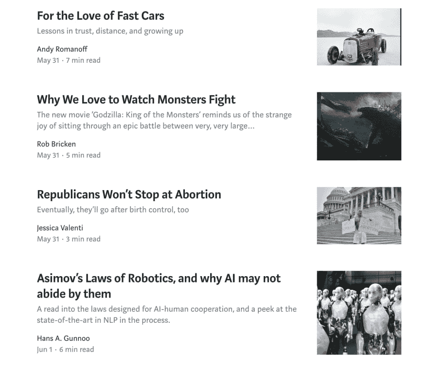
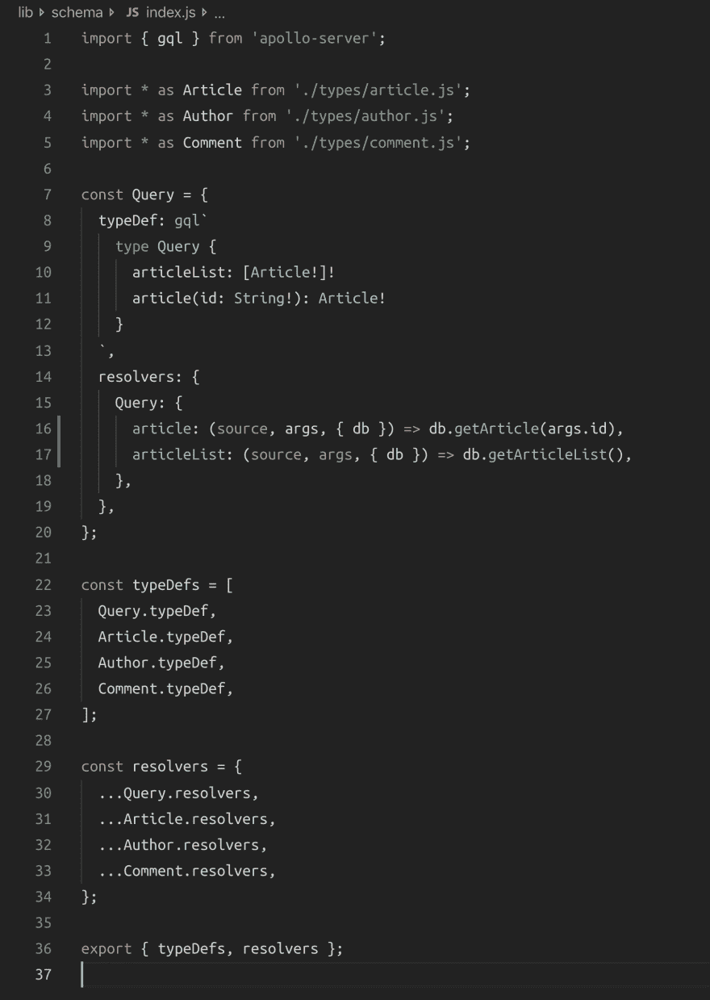
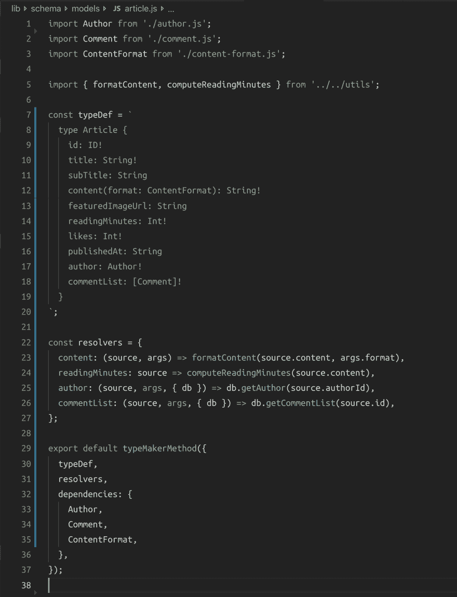
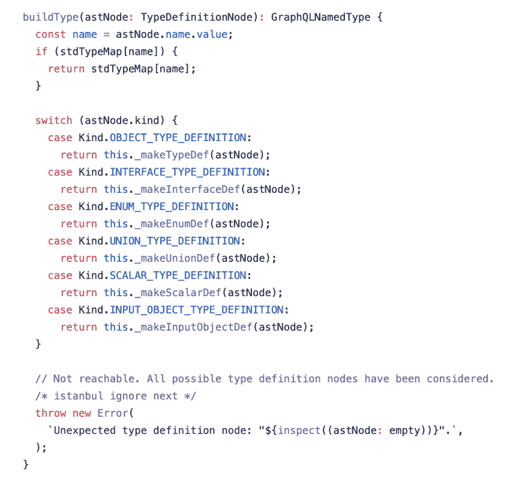
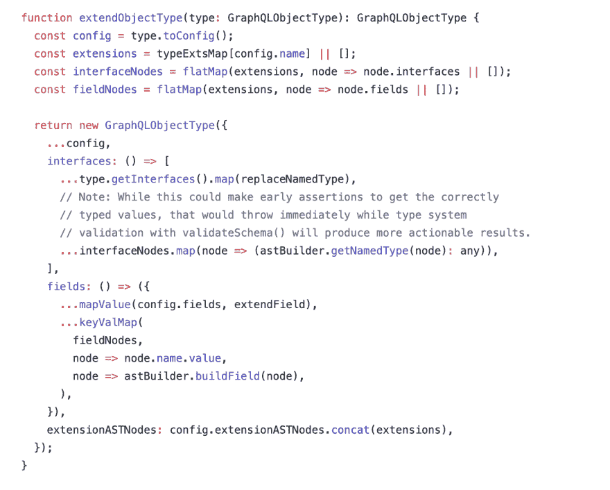

# 我希望 JavaScript GraphQL 实现支持的 API

> 原文：<https://dev.to/pluralsight/the-api-i-wish-javascript-graphql-implementations-supported-3k1n>

[](https://res.cloudinary.com/practicaldev/image/fetch/s--dNo2dAjx--/c_limit%2Cf_auto%2Cfl_progressive%2Cq_auto%2Cw_880/https://cdn-images-1.medium.com/max/2068/1%2Au_vXPo0vhgV6Hkp7EbT45g.png)

GraphQL [模式语言](https://graphql.org/learn/schema/)非常棒！这当然是交流任何关于 GraphQL 服务的最佳方式。难怪现在所有的文档都用它！

## 模式语言

假设你正在构建一个有“文章”和“评论”的博客应用程序(用 GraphQL)。您可以根据您对其 UI 的规划来考虑它的 API 模式。例如，主页可能会有一个文章列表，该列表中的一个项目可能会显示标题、副标题、作者姓名、出版日期、长度(阅读分钟)和特色图像。媒体本身的简化版本，如果你可以:

[](https://res.cloudinary.com/practicaldev/image/fetch/s--_70BfT0G--/c_limit%2Cf_auto%2Cfl_progressive%2Cq_auto%2Cw_880/https://cdn-images-1.medium.com/max/3084/1%2AcD5wtJ1V33DXOsYh1pM6qg.png)

我们可以使用 schema-language 来计划到目前为止你对主页的需求。基本模式可能看起来像:

```
type Query {
  articleList: [Article!]!
}

type Article {
  id: ID!
  title: String!
  subTitle: String
  featuredImageUrl: String
  readingMinutes: Int!
  publishedAt: String!

author: Author!
}

type Author {
  name: String!
} 
```

当用户导航到一篇文章时，他们将看到该文章的详细信息。我们需要 API 来支持通过文章对象的`id`来检索文章对象的方法。假设一篇文章也可以有丰富的 UI 元素，比如标题和代码片段。我们需要支持像 Markdown 这样的富文本格式语言。我们将让 API 通过字段参数(`format` : HTML)以 Markdown 或 HTML 的形式返回文章的内容。我们还计划在该视图中显示一个 likes 计数器。

把这些想法都写在纸上！模式语言是描述它们的最简洁的结构化方式:

```
type Query {
  # ...
  article(id: String!): Article!
}

enum ContentFormat {
  HTML
  MARKDOWN
}

type Article {
  # ...
  content(format: ContentFormat): String!
  likes: Int!
} 
```

one article 的 UI 视图还将显示一篇文章的可用评论列表。让我们保持评论 UI 视图简单，并计划它有一个文本内容和一个作者姓名字段:

```
type Article {
  # ...
  commentList: [Comment!]!
}

type Comment {
  id: ID!
  content: String!
  author: Author!
} 
```

*让我们只关注这些特征。这是一个非常好的起点。为了提供这些功能，我们需要为计算字段`content(format: HTML)`和`readingMinutes`实现定制的解析逻辑。我们还需要实现一对一和一对多的数据库关系。*

你注意到了吗，到目前为止，我是如何仅仅从 UI 的角度来考虑整个模式描述的。多酷啊。您可以将这个简单的模式语言文本交给团队中的前端开发人员，他们可以立即开始构建前端应用程序！他们不需要等待您的服务器实现。他们甚至可以使用一些优秀的工具来创建一个模拟的 GraphQL 服务器，用随机的测试数据来解析这些类型。

> The
> 
> # pattern is often compared to a contract. You always start with a contract.

## 构建 GraphQL 模式

当您准备好开始实现您的 GraphQL 服务时，现在您有两个主要选择(在 JavaScript 中):

1.  您可以使用我们拥有的完整模式语言文本来“构建”一个不可执行的模式，然后附加一组解析器函数来使该模式可执行。你可以用 [GraphQL.js](https://graphql.org/graphql-js/) 本身或者用 [Apollo Server](https://www.apollographql.com/docs/apollo-server/) 来完成。两者都支持这种通常被称为“模式优先”或“SDL 优先”的方法。我在这里称之为“**全模式字符串方法**”。

2.  您可以使用从 GraphQL.js API 中可用的各种构造函数类实例化的 JavaScript 对象(如`GraphQLSchema`、`GraphQLObjectType`、`GraphQLUnionType`等)。在这种方法中，根本不使用模式语言文本。你只是创造物体。这种方法通常被称为“代码优先”或“解析器优先”,但我认为这些名字并不能恰当地代表它。我在这里称之为“**基于对象的方法**”。

这两种方法各有利弊。

模式语言是描述 GraphQL 模式的一种与编程语言无关的好方法。这是一种易于操作的人类可读格式。你团队的前端人员绝对会喜欢它。这使他们能够参与 API 的设计，更重要的是，他们可以马上开始使用它的模拟版本。模式语言文本可以作为 API 文档的早期版本。

然而，完全依赖完整的模式语言文本来创建 GraphQL 模式有一些缺点。您必须付出一些努力来使代码模块化和清晰，并且您必须依赖编码模式和工具来保持模式语言文本与解析器树(也称为解析器映射)一致。这些都是可以解决的问题。

我认为完整模式字符串方法的最大问题是您的代码失去了一些灵活性。您没有与类型相关联的对象。你只是有绳子！虽然这些字符串使您的类型可读性更好，但在许多情况下，您需要灵活性而不是可读性。

基于对象的方法非常灵活，更易于扩展和管理。它不会遇到任何提到的问题。你*必须*模块化，因为你的模式是一堆对象。您也不需要将模块合并在一起，因为这些对象被设计并期望作为一棵树来工作。

我看到的基于对象的方法的唯一问题是，您必须处理更多的代码，这些代码围绕着您的模块中重要的管理内容(类型和解析器)。很多开发者认为这是“噪音”,你不能责怪他们。我们将通过一个例子来了解这一点。

如果您正在创建一个小范围且定义良好的 GraphQL 服务，使用完整的模式字符串方法可能没问题。然而，在更大和更敏捷的项目中，我认为更灵活和更强大的基于对象的方法是正确的。

> 即使使用基于对象的方法，也应该利用模式语言文本。在 [jsComplete](https://jscomplete.com) ，我们使用基于对象的方法，但是每次构建模式时，我们都使用`graphql.printSchema`函数将完整的模式写入文件。我们提交并跟踪项目 Git 存储库中的文件，这被证明是一个非常有用的实践！

为了比较这两种方法，我为我们开始时使用这两种方法的博客示例实现了一个可执行模式。为了简洁起见，我省略了一些代码，但保留了比较中重要的内容。

### 全模式字符串法

我们从模式语言文本开始，它定义了 3 个主要的定制类型(`Article`、`Comment`和`Author`)。主查询类型下的字段是`article`和`articleList`，它们将直接从数据库中解析对象。然而，由于我们计划的 GraphQL 模式具有围绕 article 对象的定制特性，并且我们还需要解决一些关系，因此我们需要为 3 种 GraphQL 类型提供定制的解析器。

下面是我写的代表完整模式字符串方法的代码的一些截图。我在这里使用了 Apollo Server，但这也可以用普通的 GraphQL.js(和更多的代码)来实现。

> 请注意，这只是实现此服务的完整模式字符串方法的一种方式。还有无数其他的方法。我在这里只是提出了最简单的模块化方法来帮助我们理解真正的优点和缺点。

[](https://res.cloudinary.com/practicaldev/image/fetch/s--mQMwDzOq--/c_limit%2Cf_auto%2Cfl_progressive%2Cq_auto%2Cw_880/https://cdn-images-1.medium.com/max/3616/1%2AIAEuUxNsfaS5uTRw42f_4Q.png)

这真好！我们可以在一个地方看到模式中的类型。模式从哪里开始是很清楚的。我们能够根据类型/特性模块化代码。

[](https://res.cloudinary.com/practicaldev/image/fetch/s--wsO75Zbk--/c_limit%2Cf_auto%2Cfl_progressive%2Cq_auto%2Cw_880/https://cdn-images-1.medium.com/max/4152/1%2Aah_kyrmC9uh-b2dE_4rH5g.png)

这又一次非常棒。冲突解决程序与其实现的类型位于同一位置。没有噪音。这个文件以非常易读的格式包含了重要的内容。我喜欢！

> 这里的模块化只有在 Apollo 服务器上才有可能。如果我们要用普通的 GraphQL.js 来做这件事，我们必须对数据对象进行处理，使它们适合成为“解析器树”。数据结构和解析器图之间的混合并不理想。

那么这有什么坏处呢？

如果你使用这种方法，那么你的所有类型都必须以依赖于模式语言文本的特定方式编写。你的灵活性变小了。当你需要的时候，你不能使用构造函数来创建一些类型。您受限于这种基于字符串的方法。

如果你不介意，那就忽略本文的其余部分。就用这个方法。它比其他选择要干净得多。

### 基于对象的方法

现在让我们看看基于对象的方法。下面是使用该方法构建的可执行模式的起点:

[](https://res.cloudinary.com/practicaldev/image/fetch/s--NJufs5Wr--/c_limit%2Cf_auto%2Cfl_progressive%2Cq_auto%2Cw_880/https://cdn-images-1.medium.com/max/3848/1%2AQOG32JcLvMl1k160GAroyw.png)

我们不需要单独的`resolvers`对象。解析器是架构对象本身的一部分。这使得它们更容易维护。这段代码也更易于编程扩展和分析！

这也是如此多的代码，更难阅读和推理！等着看剩下的代码吧。我无法在笔记本电脑屏幕上拍摄`Article`类型的截图。我不得不使用更大的屏幕。

[](https://res.cloudinary.com/practicaldev/image/fetch/s--rEnLT7-f--/c_limit%2Cf_auto%2Cfl_progressive%2Cq_auto%2Cw_880/https://cdn-images-1.medium.com/max/4076/1%2AVA13wQ8zkofwUMTGGzpkNg.png)

难怪全模式字符串方法如此流行！这里当然有很多“噪音”需要处理。类型一看就不清楚。自定义解析器混合在一个大的配置对象中。

我最喜欢的部分是当你需要像`[Article!]!`一样创建一个非空项的非空列表的时候。你看到我写的东西了吗？

```
new GraphQLNonNull(new GraphQLList(new GraphQLNonNull(Article))), 
```

然而，虽然这确实是更难理解的代码，但它仍然是比一个大字符串(或多个字符串合并成一个)和一个大根解析器对象(或多个解析器对象合并成一个)更好的选择。这比在一个入口点管理应用程序的所有依赖项要好。

使用对象(可能相互依赖)模块化您的代码有很大的威力。这样更简洁，也更容易编写测试和验证。当您调试问题时，您会得到更多有用的错误消息。一般来说，现代编辑可以提供更多有用的提示。最重要的是，您可以更加灵活地处理这些对象。GraphQL.js 构造函数 API 本身也使用 JavaScript 对象。你可以用它们做很多事情。

但是噪音也是真实的。

### 无噪声的基于对象的方法

我坚持使用基于对象的方法，但是我确实希望 JavaScript GraphQL 实现有一个更好的 API，可以给我们一些完整模式字符串方法的功能。

如果我们可以完全像在完整模式字符串方法中那样编写`Article`类型逻辑，但是以一种生成灵活的`GraphQLObjectType`的方式，我们可以插入到基于对象的模式中，这不是很好吗？

类似于:

[](https://res.cloudinary.com/practicaldev/image/fetch/s--0VPjzrOc--/c_limit%2Cf_auto%2Cfl_progressive%2Cq_auto%2Cw_880/https://cdn-images-1.medium.com/max/3988/1%2AeYYilCRjfJS6WW0kKJbTuQ.png)

那不是很理想吗？我们得到了这种类型的完整模式字符串方法的好处，但是没有锁定！系统中的其他类型可以进行不同的维护。也许其他类型将使用不同的 maker 逻辑动态构造！

我们所需要做的就是一个神奇的 **typeMakerMethod** 来把重要的部分转换成完整的`GraphQLObjectType`用于`Article`。

`typeMakerMethod`需要将一个字符串解析成 AST，用它构建 GraphQLObjectType，然后将自定义解析器函数集与从`typeDef`字符串解析的`fields`配置合并。

我喜欢挑战，所以我挖得更深一点，看看实现`typeMakerMethod`有多难。我知道我不能使用`graphql.buildSchema`函数，因为它只能解析一个完整的模式字符串来生成一个不可执行的模式对象。我需要一个较低层次的部件来解析一个只有一种类型的字符串，然后将自定义解析器附加到它上面。于是我开始阅读 GraphQL.js 的源代码寻找线索。几杯咖啡之后，我找到了一些答案(在 2 个地方):

[](https://res.cloudinary.com/practicaldev/image/fetch/s--LTy8tdy9--/c_limit%2Cf_auto%2Cfl_progressive%2Cq_auto%2Cw_880/https://cdn-images-1.medium.com/max/2456/1%2Al_UCRqQUpdExyxOHW_xs8g.png)

这是在`buildSchema`中使用的核心方法，用于从类型定义节点构造一个类型(我们可以通过解析`typeDef`字符串轻松获得)。

并且:

[](https://res.cloudinary.com/practicaldev/image/fetch/s--CistAHJr--/c_limit%2Cf_auto%2Cfl_progressive%2Cq_auto%2Cw_880/https://cdn-images-1.medium.com/max/2728/1%2A9875BHFxpFSGmY9NXWZT3w.png)

扩展一个对象类型并在`fields`和`interfaces`中附加任何需要的逻辑就是这么简单！

我所需要做的就是把一些碎片拼在一起，梦想就会成真。

[**我做了**](https://github.com/jscomplete/graphql-makers#readme) 。

女士们先生们。我向你介绍神奇的“typeMakerMethod”(我把它命名为`objectType`):

[](https://res.cloudinary.com/practicaldev/image/fetch/s--t9mtdIRK--/c_limit%2Cf_auto%2Cfl_progressive%2Cq_auto%2Cw_880/https://cdn-images-1.medium.com/max/3960/1%2ALIFeRi2IS2EWXLSX-cq2Xw.png)

就是这样(最基本的形式)！这将需要一个定义单一 GraphQL 类型的`typeDef`字符串、一个解析器对象和一个依赖关系映射(对于该类型),并且它将返回一个准备好插入到基于对象的模式中的`GraphQLObjectType`,就像它是用对象构造函数正常定义的一样。

现在您可以使用基于对象的方法，但是您可以选择使用类似于完整模式字符串方法的方法来定义一些类型。你有这个能力。

你认为这种方法怎么样？我很想听听你的反馈！

> 请注意，上面的`objectType`代码只是**的基本用例**。还有许多其他需要更多代码的用例。例如，如果类型有循环依赖关系(`article` → `author` → `article`)，那么这个版本的`objectType`将不能工作。我们可以延迟循环依赖的加载，直到我们进入`fields` thunk(这是基于对象的方法中解决这个问题的当前方法)。我们还可以使用“扩展”语法来设计模式，首先避免循环依赖。为了使例子简单，我跳过了这一部分。
> 
> *如果你想尝试一下，我在[**graph QL-makers**](https://www.npmjs.com/package/graphql-makers)NPM 包下发布了一个更加完美的版本`objectType`和其他一些类似的 maker 函数。*

*最初发布于[https://jscomplete.com](https://jscomplete.com/learn/19xfr-the-api-I-wish-graphql-implementations-supported)2019 年 6 月 9 日。*