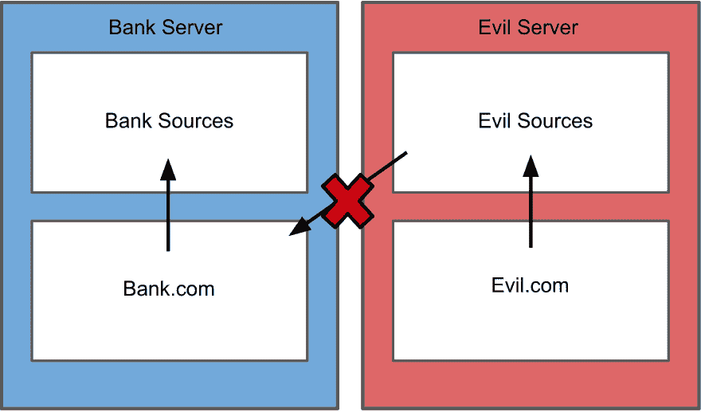
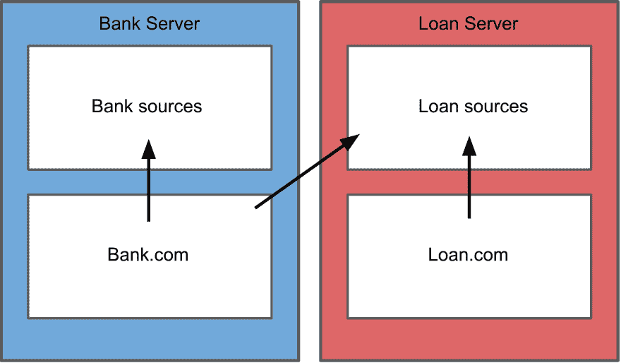

# 同源政策和 CORS 的基础

> 原文：<https://dev.to/maytd/the-basics-of-same-origin-policy-and-cors-2j3l>

假设您在一个浏览器选项卡中从 bank.com 访问您的银行帐户，但在另一个选项卡中打开了一个恶意网站 evil.com。很明显，银行帐户中有您不想共享的重要信息，所以这就是安全机制发挥作用的地方，它可以防止恶意网站的 Javascript 从银行的浏览器选项卡访问任何内容。这样的安全机制是同源策略和 CORS(跨源资源共享),其授权一个源与另一个源之间的交互。这意味着正在运行的代码不能只是任何代码，它必须有权限。

获得许可的一种方式是通过同源策略。通过共享由 URL 的协议、域和端口定义的相同来源，站点知道加载的文档应该能够与来自该来源的资源交互，而不是其他来源的资源。因此，虽然 evil.com 可以请求发送信息，但 bank.com 不允许接收这些信息，因为他们没有共享来源。Bank.com 只能与 bank . com 服务器上的其他文档进行交互。

由于同源策略有点限制性，另一种获得许可的方式是通过跨源策略。这种机制绕过同源策略，允许两个源在不共享源的情况下相互交互，但是只能从指定的源进行交互。这非常有帮助，因为许多网站使用彼此的资源，如图片。例如，如果 loan.com 请求访问 loan.com 的一些资源，并且其服务器正在等待该请求，那么 loan.com 就允许 loan.com 访问该信息。

同源策略和 CORS 只是众多策略中的两个，但是通过理解这些策略，您将理解安全策略如何降低恶意行为风险的一般核心概念。