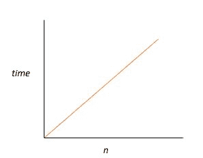
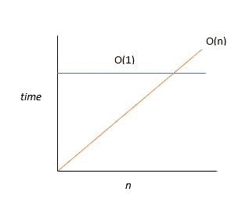
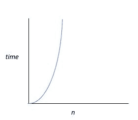
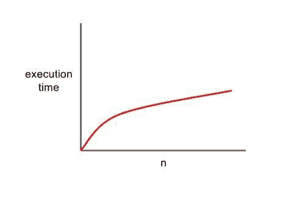

# 大 O 符号

> 原文：<https://dev.to/kritirai/the-big-o-notation-2cep>

假设你有一个数组，你需要一个函数来检查这个数组是否有一个给定的数字 *n* 。

然后编写一个简单的函数，比如:

```
const linearSearch = (array, n) => {
  for(let i = 0; i < array.length; i++) {
    if(array[i] == n) {
      return console.log(`${n} is at index ${i}`)
    }
  }
  return console.log(`${n} not found`);
} 
```

...你说完了吗？

好吧，你可能在最好的情况下，给定的数组足够小，函数执行迅速。

但是生活并不总是那么容易！

如果给定的数组很大呢？比方说， *n* 不等于数组中的第一个元素，而是在中间的某个位置，或者甚至不在那里？我们上面写的线性搜索函数仍然有效，但是遍历数组中的每个元素直到遇到我们要找的元素的执行时间呢？

[](https://res.cloudinary.com/practicaldev/image/fetch/s--Z5_L-hpz--/c_limit%2Cf_auto%2Cfl_progressive%2Cq_auto%2Cw_880/https://i.imgur.com/nTXnixm.jpg)

## 使其工作。做正确的事。快点！

遵循这个程序员的陈词滥调，在实现算法之前，应该真正考虑不同的场景——最好的、最坏的和可接受的。

这时候大 O 就发挥作用了。

[](https://res.cloudinary.com/practicaldev/image/fetch/s--6GbR1jjC--/c_limit%2Cf_auto%2Cfl_progressive%2Cq_auto%2Cw_880/https://media.makeameme.org/created/big-o.jpg)

计算机科学中的大 O 符号用于解释运行时间或所用空间如何相对于输入变量进行缩放，并且对于理解算法的效率是必不可少的。在这篇文章中，我将主要关注时间复杂度，所以让我们回顾一些常见的运行时。

## O(N) -线性

*O(N)* 描述了与输入大小成线性比例的算法的性能。比方说，你有一个 100 个元素数组。通过循环将花费 100 次迭代来`console.log()`所有的项目。类似地，一百万个元素需要一百万次迭代。因此，时间复杂度与数据输入大小成正比。

[](https://res.cloudinary.com/practicaldev/image/fetch/s--ByWNanG8--/c_limit%2Cf_auto%2Cfl_progressive%2Cq_auto%2Cw_880/https://i.imgur.com/YrmiRlP.jpgg)

## O(1) -常数时间复杂度

在时间复杂度不变的情况下，无论数据输入的大小如何，执行时间都是不变的。假设您有一个文件要从一个城市传输到另一个城市。通常，你会将文件附在电子邮件中发送出去，或者决定通过 FTP 传输。在这两种情况下，文件越大，传输文件所需的时间就越长。因此，运行时间将是线性的，即 O(N)。然而，假设你想出了一个别出心裁的主意，把你巨大的文件转移到闪存盘，然后通过一只你训练过的鸽子(因为邮寄很无聊)发送给收件人。现在，考虑文件大小和传输时间之间的关系。文件是 1GB 还是 1TB 有关系吗？我们的鸽子朋友还是会花同样多的时间飞过来送优盘。因此，这里我们的运行时将是 *O(1)* ，这意味着我们的算法将总是同时执行，而不管输入数据的大小。在这种情况下，一只鸽子会比互联网还快。

[](https://res.cloudinary.com/practicaldev/image/fetch/s--xtIMHZPN--/c_limit%2Cf_auto%2Cfl_progressive%2Cq_auto%2Cw_880/https://i.imgur.com/T52TPgs.jpg)

并不是说 O(1)总是比 O(N)好或者相反。这实际上取决于输入变量的大小。下图展示了 O(N)算法如何在某一点上超越 O(1)算法的运行时间，从而使 O(1)成为大于对应于截取点的数据大小的更好选择。然而，在截取点之前，O(N)更有效。

[](https://res.cloudinary.com/practicaldev/image/fetch/s--52ufgEM_--/c_limit%2Cf_auto%2Cfl_progressive%2Cq_auto%2Cw_880/https://i.imgur.com/UnUU7Pv.jpg)

## 【o(n^2】-二次

O(N^2)描述了一种算法，其性能与输入数据集大小的平方成正比。这通常涉及数据集上的嵌套迭代，比如:

```
let arr = [1,2,3,4,5];

for(let i = 0; i < arr.length; i++) {
  for(let j = 0; j < arr.length; j++) {
    console.log(i +"" +j);
  }
} 
```

其他一些例子有[冒泡排序](https://www.geeksforgeeks.org/bubble-sort/)和比较两个相同大小数组中的元素。

## 【o(2^n)

你可能会看到的另一个公共运行时是 O(2^N).具有这种运行时间的算法通常是递归算法，通过递归地解决两个较小的大小为 *N-1* 的问题来解决一个大小为 *N* 的问题。O(2^N 函数的增长曲线是指数型的——开始非常平缓，然后急剧上升。

[](https://res.cloudinary.com/practicaldev/image/fetch/s--1ULSX9tO--/c_limit%2Cf_auto%2Cfl_progressive%2Cq_auto%2Cw_880/https://i.imgur.com/odiNjyd.jpg)

O(2^N)算法的一个很好的例子是斐波那契数的递归计算。

```
function calculateFibonacciNumber(N) {
  if (N <= 1) {
     return N;
  } else {
   return calculateFibonacciNumber(N - 2) + calculateFibonacciNumber(N - 1);
} 
```

## O(logN) -对数

使用对数表示法时，执行时间会增加，但速度会降低。对排序后的数组执行[二分搜索法](https://en.wikipedia.org/wiki/Binary_search_algorithm)是 O(logN)运行时的一个很好的例子。这种算法遍历输入数据一次，然后在每次后续迭代中，输入数据的大小减半。下面是描述对数运行时间的增长曲线。当涉及到处理大量数据时，您会明白为什么二分搜索法是一个不错的选择。

[](https://res.cloudinary.com/practicaldev/image/fetch/s--Y0AXosio--/c_limit%2Cf_auto%2Cfl_progressive%2Cq_auto%2Cw_880/https://i1.wp.com/www.jenniferbland.com/wp-content/uploads/Olog-n-logarithmic-complexity.jpg%3Fw%3D472%26ssl%3D1)

## 注:

在计算大 O 符号时，有几件事需要注意。

**1)去掉常数和非主导项**

Big O 考虑了最坏的情况，所以我们试图预测当数据输入量大得离谱时，我们的算法效率会发生什么。从这个意义上说，如果 N 的值大得离谱，那么任何其他常数与 N 相比都几乎不存在。所以，O(2N)简单来说就是 O(N)。同样，我们也去掉了非主导项。例如，O(N^2 + N)变成 O(N^2)，O(N+logN)变成 O(N)等等。

**2)乘 v 加**

如果我们做 A 大块的功，然后 B 大块的功，总的功是 O(A+B)

```
arrayA.forEach(el => console.log(el)) 
```

类似地，如果我们对 A 中的每个元素做 B 块工作，总工作量是 O(AxB)

```
arrayA.forEach ( a => {
   arrayB.forEach ( b => {
    console.log(a+" " + b);
   })
}) 
```

最后，这里有一张我从这篇[文章](https://medium.com/@cindychen13.work/a-beginners-guide-to-big-o-notation-793d654973d)中提取的图表，展示了不同运行时的比较。

[](https://res.cloudinary.com/practicaldev/image/fetch/s--lxPQ9IXa--/c_limit%2Cf_auto%2Cfl_progressive%2Cq_auto%2Cw_880/https://i.imgur.com/803Xb30.jpg)

## 结论

如果您是编程新手，大 O 符号可能不是您的主要关注点。然而，当你踏上成为一名优秀程序员的旅程时，你会想了解算法的复杂性，以及当输入量增加时它们会如何表现。这是我们谈论的真实世界，你永远不知道你可能要处理多大的数据。因此，Big O 让我们为最坏的情况做好准备，帮助我们在设计和实现算法时做出正确的决定。