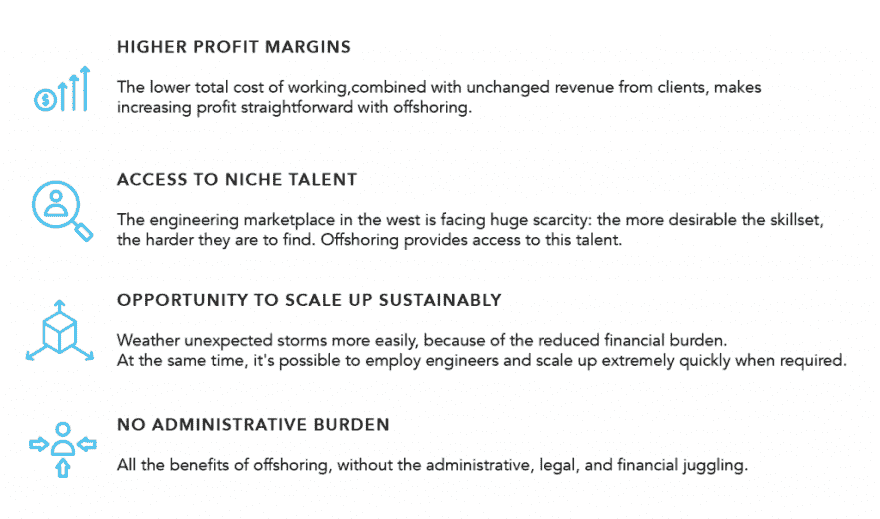

# 离岸软件开发的商业利益

> 原文：<https://dev.to/meghamaheshwar6/the-business-benefits-of-offshore-software-development-4fe9>

离岸外包允许公司以比国内更低的成本获得有才华的工程师。太好了！但是这样做有什么实际的商业利益呢？财务上。操作上。公司通过投资离岸团队获得了什么？

## 什么是离岸外包，真的？

当讨论离岸外包时，大多数人都很快陷入细节:*你可以建立一个更大的软件团队！可以省钱！比外包安全！*

没错，但是我们应该慢下来。什么是离岸外包？从根本上说，这是一种增加企业产出、提高技术专长的方式，不会带来不必要的压力、麻烦或成本。

最基本的，离岸外包只是用一个新的团队和新的(或互补的)技能来扩展你的业务。除了地理上的距离([这不是 2019 年的主要问题](https://thescalers.com/strategies-to-make-remote-teams-work/))这与在当地招聘没有什么不同:广告、招聘、工作、奖励——这是相同的过程。

那么，如果是同样的过程，那么为什么公司要使用离岸外包呢？离岸外包的真正商业利益是什么？

## 1.更高的利润率

很多公司和文章都在谈论离岸外包的“低成本”。我们希望更有帮助，更具体。

假设你在班加罗尔建立了一个 5 人开发团队，同时你在纽约的家中也有一个 5 人团队。现在让我们来看两个比较:首先，印度和美国之间的纯工资比较，然后是在海外和在国内做生意的总成本。

*   **仅工资-** 如果你在班加罗尔雇佣相同的团队(相同的级别、经验和质量)，那么工资差异将会很大。便宜 3-4 倍，但这种比较太简单，没有用。
*   **总成本**——对于我们的普通客户来说，在这里做生意的总成本(包括办公场所、行政人员、法律工作、工资、开发人员工资、保险——工程)通常是你们本地开发人员*工资* 的 50%**。**

没有哪个行业的印度熟练工人的成本比西欧或美国更高。生活费用的差异实在太大了。

最重要的是其他所有的事情，办公室、行政以及这些事情。由你的专业离岸合作伙伴正确处理，离岸外包为**提供了更高的利润**，因此**也获得了更高的利润**。

### 为什么这些工资差别这么大？

我们需要记住这个故事有两个方面。同样，印度工人总是比他们的英国或美国同事更便宜。但这种情况已经持续了几十年。超过几十年。

那么，为什么我们突然想从印度劳动力身上赚钱呢？

1.  印度工人的素质提高了。具体来说，在 IT 行业，印度各地的工程师都获得了与西方人一样的教育、培训和实践经验。他们非常能干，这对企业很有吸引力。
2.  **更低的生活成本=更低的薪水，期间**。这是基本的经济学。直到印度的经济增长*与西方相比显著*之前，卢比的价值将低于美元。因此，无论服务质量如何，印度的薪资水平仍将较低。
3.  西方的工程稀缺，这是我们不能忘记的。在孤立的情况下，高质量的印度工程师比过去花费更多。然而，在欧洲、英国和美国，工程师在 T2 非常难找，在 T4 非常昂贵。因为稀缺。印度劳动力如此“廉价”的部分原因实际上是因为当地劳动力如此昂贵。

<figure> 

<figcaption>*与其他国家相比，印度工程师拥有学士学位的比例更高，仅次于德国拥有硕士学位的工程师更多。*</figcaption>

</figure>

因此，也许我们应该停止如此怀疑地拒绝“便宜”的印度工资:这都是相对于工程师在国内的低廉工资而言的。如今，西方企业投资离岸外包的主要原因不是为了廉价——而是为了以**可承受的成本**雇佣**技能相当的人才**。

## 2.获得利基或罕见的人才

我们已经了解了在西方国家和城市雇佣工程师有多贵。这是不可避免的:对于一个有能力的高级开发人员来说，你可能会面临每小时 100 多美元的报酬。它们为什么这么贵？因为他们的技能非常抢手。

仅在美国，[就有 250，000 个软件工程职位空缺](https://www.arcgis.com/apps/MapJournal/index.html?appid=b1c59eaadfd945a68a59724a59dbf7b1)，并且还在增加。没有足够的新开发人员来填补空白。

大学正在努力推动信息技术和工程，但在这些毕业生进入这个行业之前，有一个不可避免的延迟。更糟糕的是，科技公司的数量和种类也在增加。优秀的候选人可以挑选他们的雇主。

因此，激励的圣杯是:疯狂的工资。

### 可用性问题

如今，公司寻求建立离岸团队并雇佣印度开发者的主要原因不是成本，而是可用性。

印度每年培养 150 万工程毕业生，其中很大一部分从事软件行业。由于受过高等教育(包括利基专业)和广泛的英语培训，这些工程师从大学毕业后就准备工作了。

英语是这个行业的语言。印度工程师可以流畅地交流，但在高度技术化的环境中也可以非常清晰和简洁。

即使你忽略较低的比率，也有一些很难找到的利基技能组合。为了获得这些技能，与海外承包商合作并不是不合理的。

离岸外包有时可以被看作是这种想法的延伸:接触到高技能的开发人员，你实际上可以**找到**(而且负担得起！)碰巧住在别处。

结合较低的利率，这个论点是显而易见的。招聘世界级的工程师需要有经验的人，但是在印度，有一个非常容易获得的人才库可以让你起步。

## 3.可持续扩大规模的机会

扩大公司规模从来没有听起来那么容易。雇用新员工(尤其是技术熟练的，即*昂贵的*员工)是一项巨大的投资，并且存在巨大的财务风险。

*   如果这些员工决定提前离开(在这个工作时代很常见)，你可能会工作负担过重。质量下降，客户转向别处，整个企业陷入困境。最坏的情况，但它确实发生了！
*   但如果所有人都留下来了，但你却无法招揽到你预期的那么多新客户，那该怎么办？你的工资单上只剩下多余的资源，无所事事，烧钱。这又是一个糟糕的局面，一个不可持续的局面。

有了离岸团队，事情就有点不同了。

### 简化缩放

首先，招聘和支付员工的成本更低。由于工资减少，企业可以更容易地与离岸团队合作。与此同时，扩大你的海外团队比内部团队要快得多。在短短 4 周内，我们已经为客户团队带来了多组工程师。审查，测试，并准备工作。

第二，由于离岸团队将有充足、廉价的办公空间，所以不必担心搬到更大的房产。

### 利润的游戏

为了提供更大的产能，你的离岸团队发展得越快，你的利润率就越高。

说你现在的员工工资是 5 个开发者一年 25 万。收入为 100 万英镑，业务蒸蒸日上，但你想要增长。

你设法为来年再争取 100 万份工作。你有三个选择:

1.  **再雇佣 5 名本地开发人员** -每年再花 25 万美元，你就可以将现有团队的规模扩大一倍。假设这样做的额外成本为零(当然，这是不可能的)，你的总利润现在是 150 万英镑。实际上，这比少了一些*，但接近 150 万英镑*
2.  **在一个离岸团队中雇佣 5 名新的开发人员** -这个团队的总业务成本，在最坏的情况下，是国内工资的 50%，还记得吗？让我们说 125k，这意味着*其他* 125k 直接进入你的利润。
3.  **解散 10 人离岸团队的内部团队** -离岸团队 25 万英镑，但仍有 200 万英镑的收入，因此利润高达 175 万英镑。

因此，尽管选项 1 的利润比 150 万英镑少了一些，但选项 3 保证有 175 万英镑的利润。

现在我们不希望公司抛弃他们的内部团队。这只是一个证明离岸外包如何显著影响底线的问题。简而言之，它对 it **的影响很大**。

## 4.行政负担没有增加

就其本身而言，这并不是建立离岸团队的足够好的理由。“事情不会变得更糟”并不是一种激励——但请和我们在一起。

鉴于我们列表中的前 3 点，这是一个重要的话题。扩大任何团队通常都是一项巨大的后勤工作。有了离岸外包，管理、工资、招聘(除了最终决定)、住宿、保险等等都由我们负责。

作为一个离岸合作伙伴，我们的职责是尽可能地为您提高效率，同时尽可能地减少压力和不便。在国内建立一个类似的团队会耗费更多的资源。

最终，在一个经验丰富、多才多艺的合作伙伴的帮助下进行离岸外包会带来很大的不同。它允许公司不折不扣地利用离岸外包的所有好处。

## 轮到你了

正如我们所说的，*离岸外包是如何运作的并不是什么大秘密:你去印度，在那里建立一个开发团队。这是我们很少涉及的离岸外包的好处，真实的、*有形的商业利益。概括一下:**

要了解更多关于离岸外包的信息，以及你的企业是否能从中获益，请联系我们。我们的团队总是乐于回答问题，所以请随意填写表格，让我们知道您的想法。

最初发布于:[https://the scalers . com/the-business-benefits-of-offshore-software-development/](https://thescalers.com/the-business-benefits-of-offshore-software-development/)