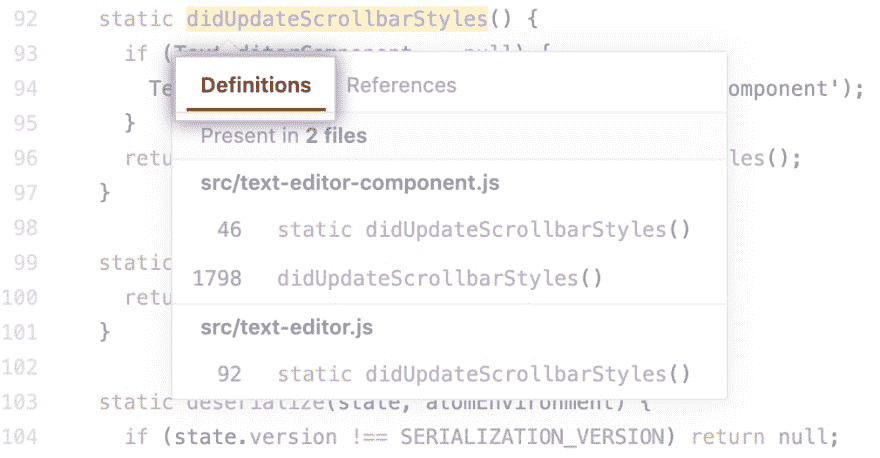
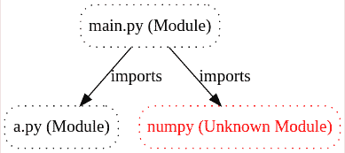
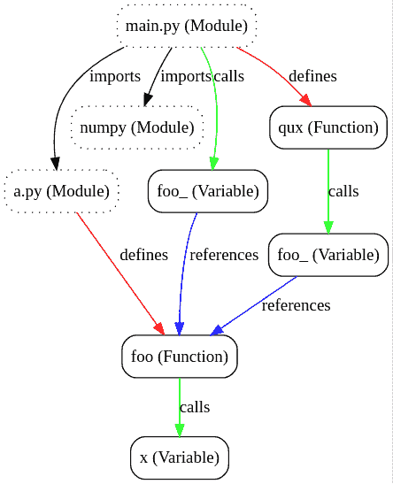

# GitHub 新代码导航背后的代码

> 原文：<https://dev.to/codenamev/the-code-behind-github-s-new-code-navigation-c1n>

GitHub [最近宣布了两个新的代码导航特性](https://help.github.com/en/articles/navigating-code-on-github):

1.  跳转到定义–快速查看任何给定方法的源代码。
2.  查找所有引用–识别同一个 repo 中某个函数的所有引用。

[](https://res.cloudinary.com/practicaldev/image/fetch/s---RYyQaQO--/c_limit%2Cf_auto%2Cfl_progressive%2Cq_auto%2Cw_880/https://blog.codenamev.com/conteimg/2019/08/jump-to-definition-tab.png)

我已经等这些功能出现很久了，最棒的是，所有这些背后的代码都是开源的！

从顶层开始，他们使用一个名为 [Semantic](https://github.com/github/semantic) 的 Haskell 库。语义可以*解析*、*分析*、*比较*源代码。截止到这篇文章的最后一次更新，它支持 Ruby、JavaScript、TypeScript、Python、Go、PHP、Java、JSON、JSX、Haskell 和 Markdown。

如需完整的示例列表，请查看[语义用法文档](https://github.com/github/semantic/blob/master/docs/examples.md)。它附带了一个很棒的 CLI，允许您:

### 生成解析树

<figure>

```
$ semantic parse test.A.py
(Statements
  (Annotation
    (Function
      (Identifier)
      (Identifier)
      (Return
        (Identifier)))
    (Empty))
  (Call
    (Identifier)
    (Call
      (Identifier)
      (TextElement)
      (Empty))
    (Empty))) 
```

<figcaption>Generate an abstract syntax tree (AST)</figcaption>

</figure>

### 生成语法感知差异

```
$ semantic diff test.A.py test.B.py
(Statements
  (Annotation
    (Function
    { (Identifier)
    ->(Identifier) }
      (Identifier)
      (Return
        (Identifier)))
    (Empty))
  (Call
    (Identifier)
    (Call
    { (Identifier)
    ->(Identifier) }
      (TextElement)
      (Empty))
    (Empty))) 
```

### 显示导入调用图

```
semantic graph main.py | dot -Tsvg > main.html && open main.html 
```

[](https://res.cloudinary.com/practicaldev/image/fetch/s--xFeI-4Ru--/c_limit%2Cf_auto%2Cfl_progressive%2Cq_auto%2Cw_880/https://blog.codenamev.com/conteimg/2019/08/import_graph.svg)

### 显示通话图表

```
semantic graph --calls main.py | dot -Tsvg > main.html && open main.html 
```

[](https://res.cloudinary.com/practicaldev/image/fetch/s--WBtf176C--/c_limit%2Cf_auto%2Cfl_progressive%2Cq_auto%2Cw_880/https://blog.codenamev.com/conteimg/2019/08/call_graph.svg)

## 理解你的代码

代码解析是通过 [tree-sitter](https://github.com/tree-sitter/tree-sitter) 库完成的，这个库看起来是 C 语言，带有一些语言绑定([CLI 已经过时了](https://github.com/tree-sitter/tree-sitter/tree/master/cli)！).

> [Tree-sitter]可以为源文件构建具体的语法树，并在源文件被编辑时有效地更新语法树

通过编写特定于语言的解析器来支持语言。这些解析器主要由两部分组成:

1.  **语法**–包含各种语言格式化的规则
2.  **词法分析**——模式化单个字符组(用于[词法](https://en.wikipedia.org/wiki/Lexical_analysis))。

解析来自 [tree-sitter-ruby](https://github.com/tree-sitter/tree-sitter-ruby) :
的简单 ruby 方法的语法示例

<figure>

```
{
  "name": "ruby",
  "word": "identifier",
  "rules": {
    "method": {
      "type": "SEQ",
      "members": [
        {
          "type": "STRING",
          "value": "def"
        },
        {
          "type": "SYMBOL",
          "name": "_method_rest"
        }
      ]
    }
  }
} 
```

<figcaption>[https://github.com/tree-sitter/tree-sitter-ruby/blob/master/src/grammar.json](https://github.com/tree-sitter/tree-sitter-ruby/blob/master/src/grammar.json#L5-L46)</figcaption>

</figure>

Tree-sitter 有[一个*令人敬畏的*游乐场](http://tree-sitter.github.io/tree-sitter/playground)，在那里你可以探索它为任何给定代码生成的解析树。

当你向语义库提供代码时，它使用 tree-sitter 生成解析树，然后使用[语言的语法](https://github.com/github/semantic/blob/master/docs/grammar-development-guide.md)(例如来自 tree-sitter-ruby)解析解析树并映射 AST 节点(其中许多已经可以从库本身获得:[文字](https://github.com/github/semantic/blob/master/src/Data/Syntax/Literal.hs)、[表达式](https://github.com/github/semantic/blob/master/src/Data/Syntax/Expression.hs)、[语句](https://github.com/github/semantic/blob/master/src/Data/Syntax/Statement.hs)和[类型](https://github.com/github/semantic/blob/master/src/Data/Syntax/Type.hs))。

虽然他们希望在将来取消这一步，但是一旦 AST 节点被映射，第二轮解析就完成了，以将它们包装成库可以理解的数据结构(关于这一点的更多信息，[参见“赋值”文档](https://github.com/github/semantic/blob/master/docs/assignment.md))。

还有很多事情发生在*分析*和*比较*源代码上，但是我会把解释留给他们的[关于程序分析的伟大文档](https://github.com/github/semantic/blob/master/docs/program-analysis.md)。

谢谢 GitHub ❤️继续努力😄