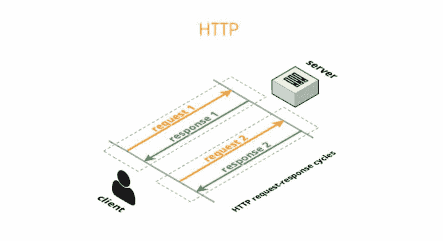
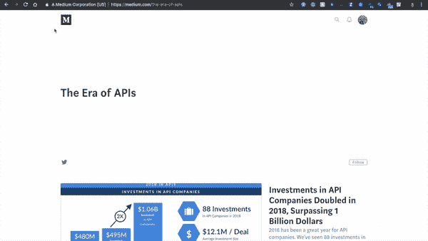
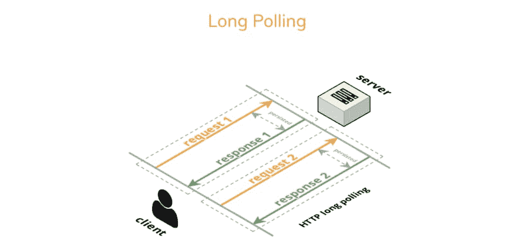
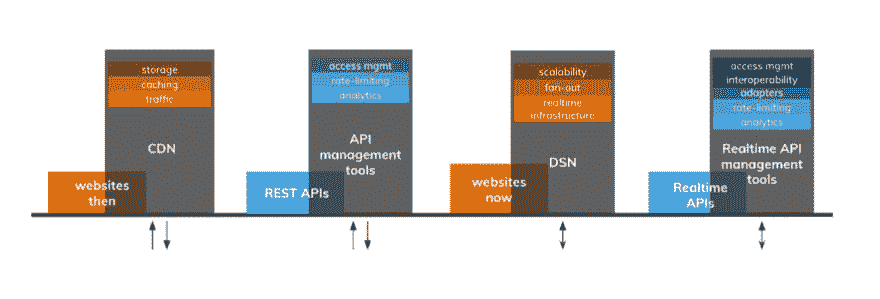
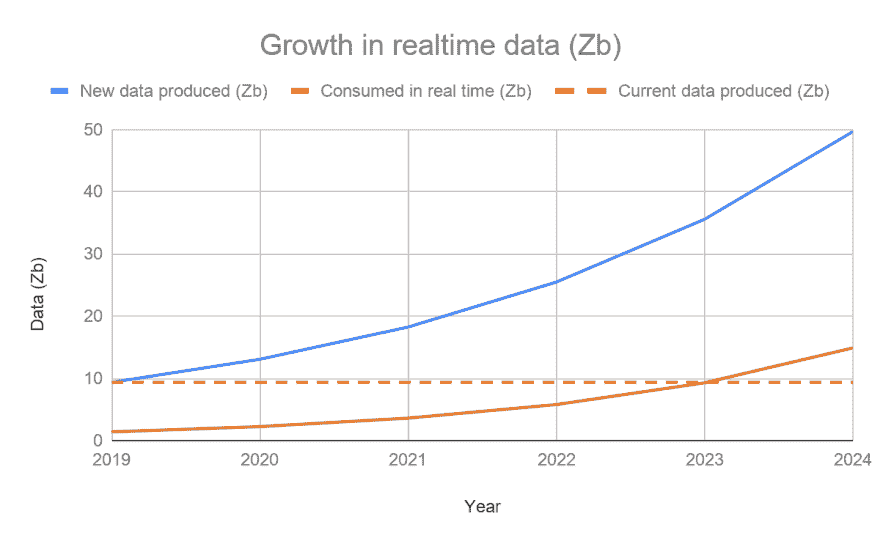

# 数据共享经济的现状

> 原文：<https://dev.to/srushtika/the-current-state-of-the-data-sharing-economy-57n>

随着数据爆炸，这篇文章着眼于在屏幕后面工作的网络是如何发展的，以实现大规模的数据共享——以及这对未来数据共享和消费方式的影响。

# 基础知识- HTTP

从 20 世纪 80 年代后期，蒂姆·伯纳斯·李爵士的“万维网”允许节点在计算机之间传输信息，这是由遵循共同规则集的标准化协议实现的。选择的协议是 HTTP。该协议与数据共享相关的关键是 HTTP 遵循请求-响应模型。

一个实体打开一个连接，请求一个资源或服务，然后另一个实体做出响应，要么是请求的资源，要么是错误响应(如果它不可用)。在每个请求-响应周期之后，连接被关闭。HTTP 是一种无状态协议，如果相同的两个实体需要再次通信，就会通过新的连接进行。HTTP 发明时附带的，但现在很重要的事实是，每个连接请求都带有一个[头](https://code.tutsplus.com/tutorials/http-headers-for-dummies--net-8039)，以及关于所需连接类型的附加细节。我们稍后将回到这一点。

在上世纪 90 年代至 2000 年代的网上冲浪中，这种模式运行得非常好。用户点击阅读文本或浏览销售目录，向服务器发送请求，获得响应并查看响应。网站——本质上是对数据仓库的访问——是数据共享经济的开端。

许多家庭启动了电子商务，这迅速催生了数据共享基础设施历史的下一个阶段。随着网站开始销售商品和服务，这引发了一系列新的工程挑战。专门的工程团队必须处理前所未有的流量，即数据传输请求。为了简化流程，工程师缓存了资源。缓存需要将要提供的资源存储在其他地方，使网站在向最终用户提供数据之前向数据库请求数据。

所有这些功能层都是在现有的基本网站实现之上实现的。随着他们意识到的功能变得越来越重要，堆栈——以及与维护它相关的工程负担——也在增长。输入解决方案。

# 内容分发网络(CDNs)

CDNs 提供了附加功能层，可以与企业网站进行内部通信。最终用户现在将通过这个新的服务提供商得到服务，网站的工程团队可以将精力集中在其他地方。

根据 [BuiltWith](https://www.keycdn.com/blog/why-use-a-cdn) 的数据，排名前 10，000 的网站中有超过 41%使用 CDN。著名的 CDN 提供商包括 MaxCDN、Cloudflare 和 Google App Engine。[被 Fast Company](https://www.fastcompany.com/company/cloudflare) 形容为“你从未听说过的最大的科技公司”，Cloudfare 报告称，它为全球近 10%的互联网请求提供服务，这些请求来自一个拥有 1600 万个域名的网络。虽然尚未上市，但 2019 年 Cloudflare 的价值估计为 32 亿美元。

# API 时代

请求/响应数据模型的下一步发展是 B2B 数据共享的概念——通过编程与其他开发人员共享数据。大约在 2000 年代末，公司和组织通过将他们的数据作为 API 提供，开辟了新的收入来源。

与直接数据不同，API 是以编程方式消费的，因此对通过 API 共享的数据的货币化至关重要的是分析、速率限制和访问管理等元素。构建 API 这个看似简单的想法现在变得非常复杂。API 需要维护和永无止境的基本附加特性。

API 管理工具的出现是为了解决认证、互操作性、缓存、可伸缩性、速率限制、分析和货币化等问题。众所周知的例子包括 Apigee、3scale、Kong、Mulesoft 和 Akana，他们都在引领人们热议的“大数据革命”中发挥了作用。频繁发生的大规模收购就是对 REST API 管理工具的需求的例证。例如，2016 年，帮助推动采用[云服务](https://www.salesforce.com/products/platform/best-practices/cloud-computing/)的公司之一 Salesforce 以 65 亿美元收购了 Mulesoft

# 问题解决了，继续下一个

cdn、API 管理工具和大数据=从此快乐？网络生活和现实生活的融合并没有保证什么。数据共享经济发展的下一个阶段，是由人们对网上能做什么以及能做多快的期望值提高所驱动的。

浏览从数据库中检索到的静态资源只是人们和企业在线工作的一小部分。优步、股票交易、谷歌文档、堡垒之夜和闪电般快速的客户关系管理系统等用例体现了向事件驱动的数据共享经济的转变。在这里，现实生活中的事件会触发实时发送给多方的通知。输入一组新的工程挑战，在上图中突出显示，如下所述。

# 新期望=新的数据传输机制

## 实时数据第一部分:HTTP-轮询

 
你收到了邮件:1998 年，电影制作时，梅格·瑞恩不得不按下刷新键。

对于事件驱动的应用程序，HTTP——就其自然形式而言——并不能完全满足它。以臭名昭著的比特币定价波动为例。在 HTTP 场景中，应用程序将向数据提供商请求当前的比特币价格，并将其显示在网页上。然而，在 HTTP land 中,“更新”的概念是不存在的。如果应用程序需要更新的数据，合乎逻辑的下一步就是刷新页面，发出新的 HTTP 请求。虽然它模糊地完成了工作，但是频繁地发出请求是低效的，并且是工程和能量密集型的。这种接收新的(可能不频繁的)更新的策略被称为 HTTP 轮询。

## 第二部分:HTTP 长轮询

如果这部电影是后来拍摄的，随着 Gmail 的发明，梅格会立即收到汤姆的电子邮件

HTTP 轮询的一个改进是 HTTP 长轮询。这里，只有当出现新数据时，才会返回对请求的响应，这是通过保持连接实现的。这是由 Gmail 在 21 世纪初首创的(并使“按下刷新”的仪式在很大程度上变得多余)，它通过避免空响应来减少请求-响应周期的频率。关于长轮询的详细技术概述可以在 Ably 博客上阅读。

虽然这无疑是一种改进，但长轮询作为一种数据传输方法，还不足以支持我们所期待的事件驱动的应用程序。想想日常的在线体验——WhatsApp、优步定位——追踪；第四次工业革命，“大趋势”型技术——智能物联网网络等等。大多数更新发生在几毫秒内:即使几秒钟的间隔也太小太晚了。

对于即时数据传输，需要一个新的标准，允许双向、持久的连接。

## 第三部分:网络套接字

WebSockets 在 2008 年作为一个想法孵化出来。到 2011 年，所有主要的浏览器供应商都支持它。由于 HTTP 是一个公认的、得到普遍支持的标准，它充当了广泛的 WebSocket 支持的桥梁。WebSocket 上的通信以 HTTP 请求-响应循环开始。包含一个新的 upgrade 报头(记住在上面的段落中提到的 HTTP 报头)启动了这一过程。该头邀请连接中涉及的所有各方遵守 WebSockets 协议。接受它，然后连接被升级到 WebSockets。数据共享突然增压。

WebSocket 连接在传输层使用 TCP/IP 来提供全双工连接。通信双方现在可以同时双向发送消息。该连接是持久的，这意味着只要应用程序运行，它就保持打开。连接也是有状态的——服务器可以发起消息，反之亦然。

回到比特币定价的例子，WebSockets 使服务器能够在更新可用时立即向客户端发送实时更新。将消费者的期望融入其中(“我们现在就需要这些数据”)，Websockets 成为数据共享经济中越来越普遍的一部分，为许多日常服务提供动力，包括位置跟踪、HQ 风格的应用程序、直播体育比分和许多其他事件驱动的应用程序。

虽然 WebSockets 并不是唯一的实时协议，但是 WebSockets 在很大程度上主导了事件驱动的消息传递。深入了解【WebSockets 如何工作以及如何开始使用它们可以在 Ably 博客上阅读。

# ‘解’爱一个小生——历史重演

当基于 REST 的应用程序需要扩展时，CDNs 开始解决问题，而运行在实时协议上的应用程序发现自己处于类似的困境。cdn 很好地处理了静态数据的问题，但是动态数据引发了许多其他问题。

其中包括:

*   互操作性(实时运行在一个高度分散的协议系统上，使得集成变得困难)
*   弹性可伸缩性(例如，大型体育赛事的直播评分系统，或者 T2 总部风格的应用程序，都受到使用量激增的影响)
*   扇出机制(“调谐”到直播流实际上意味着请求被发送消息。扇出机制使得向数百万订户发布相同消息的副本成为可能)。

# 数据流网络

这些复杂性意味着实时数据共享需要复杂的分布式系统架构。在工程师有可能为实时数据传输构建自己的系统的情况下，尤其是当这种数据传输大规模发生时，这种工程通常是外购的。具有实时消息传递能力的分布式系统网络可以方便有效地大规模集成事件驱动架构。这种服务被称为[数据流网络](https://ably.com/platform) (DSN)。DSN 的例子包括 PubNub、Pusher 和 [Ably](https://ably.com/) 。

要使 DSN 可视化，您需要将所有这些功能添加到实时消息传递基础结构中，然后构建一个提供该基础结构的分布式节点网络，将其封装到一个单元中，称之为数据流网络。然后，您可以将任意数量的设备、节点、服务器等以完全分离的方式连接到该 DSN，使它们能够实时相互通信。构建和操作实时连接的工作已经完成，因此开发人员可以专注于构建下一代实时应用程序、服务和 API 的更有创造性、更有价值的任务。

在撰写本文时，2019 年 6 月，这是我们发现自己处于的历史点。实时数据共享基础设施使人们体验体育、交通、教育技术、金融和 SaaS 的方式发生了变革。事件驱动和流式 API 使每个人都可以按需获得数据，模糊了线上和线下生活之间的界限，并提供了消费者和企业想要和需要的连接。

# 历史成为未来学

如果可以从数据共享的历史中吸取教训，那就是解决方案往往是为了解决常见的工程问题。这样开发者就有时间推动技术向前发展。

如果解决方案喜欢空白，当前的利基是缺乏实时 API 管理工具。虽然基于 REST 的 API 管理工具对于基于 REST 的应用程序来说工作得很好，但是对于事件驱动的应用程序来说却不存在这样的服务，事件驱动的应用程序能够以编程方式向其他开发团队提供数据流。虽然开发人员在构建流式 API 时面临的一些挑战与 REST APIs(分析、速率限制和访问管理)的挑战重叠，但将实时添加到组合中，事情会变得复杂。考虑如何创建一个可互操作的系统，例如，考虑实时协议的碎片，或者当消息总线在全球范围内分散数十亿条实时消息时，如何解决数据完整性和排序问题。

[API Streamer](https://ably.com/api-streamer)——互联网的第一个全生命周期 API 管理工具——是所有这些问题的现成解决方案(超过 50，000 个工程小时的产品)。它提供了一套管理工具来优化您的实时 API 的范围，以及一个现成的带有 Ably DSN 的分发网络。虽然它是目前唯一存在的实时 API 管理平台，但这是人类的聪明才智和实时 API 的激增，我们期待其他解决方案很快出现。就本文的目的而言，让我们集中讨论是什么造成了这种真空。

# 数据交换的未来

数据的指数级增长已经成为老生常谈。IDC 发布的一份名为《2025 年数据时代》的报告预测，5 年后，全球总体数据消耗量[将增长五倍](https://www.ably.io/ghost/#/editor/post/5cdc169eaeb241001e9910e7)，从今天的 33ZB 增至 175ZB。报告中特别有趣的是对全球数据经济不断变化的本质的洞察。上图中的红线代表实时消耗的数据。具体来说，到 2025 年，实时消耗的数据量将几乎是当今世界消耗的数据总量的 1.5 倍(见黄线)。

此外，尽管此前数据经济的主要来源是消费者创造者(你、我、脸书)，但数据生产的下一次激增(据 IBM 称高达 95%)将来自物联网设备和 B2B 流程的激增(据 IDC 称，全球 60%的数据将由企业产生)。数据发射设备是一种能够实现其他被大肆吹嘘的“大趋势”的技术，特别是人工智能和人工智能，反过来控制着我们生活中不可或缺的许多过程——交通、工业、安全，仅举三例。

# 数据交换 2025——下一步是什么？

实时基础设施是 Ably 的默认专业领域，也是一个有趣的棱镜，通过它可以看到数据共享的未来。从这个角度来看，10 年前，随着 REST API 管理工具开创了一个新的大数据经济，我们相信实时 API 管理工具的影响同样深远。广泛可用的实时数据使大数据文化不再是零星访问的“云中孤岛”，而是基于事件驱动的通信的在线/离线世界。以伦敦的交通为例。它共享实时 API 的决定吸引了超过 12，000 名开发人员，导致超过一半的伦敦人口使用数百种新应用和服务，并显著改善了伦敦的交通系统。德勤估计，这些项目的价值每年超过 1.3 亿英镑。英国国家统计局现在正在对经济数据集做同样的事情。欧盟估计，欧洲的类似计划可以减少 6.29 亿小时不必要的道路等待时间，并在整个欧洲减少 16%的能源消耗——并且正在开展活动，使实时[API 变得更容易获得。](https://ec.europa.eu/digital-single-market/en/proposal-revision-public-sector-information-psi-directive)

通过让数据流更加用户友好，其他行业(体育数据、运输、物流、电子学习和金融部门)的主要数据所有者和开发者启动了新一轮创新，开启了数据共享经济发展的新篇章。

本文基于[我在 2019 年 5 月伦敦 CityJS 大会上的发言](https://www.youtube.com/watch?v=0isukey1MYE)

如果你在你的应用和服务中使用 realtime，对数据共享经济的状态有一个看法，或者想要讨论更多- [随时在 Twitter 上联系我，我的 DMs 是开放的！](https://www.twitter.com/Srushtika)