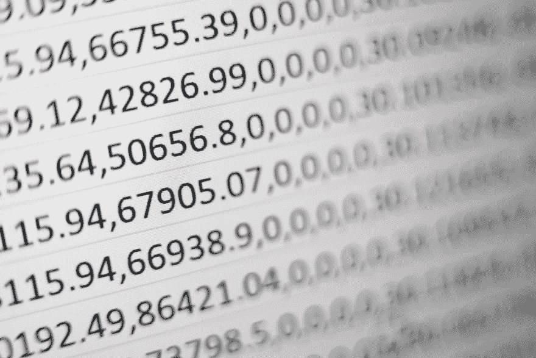
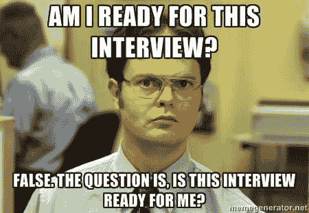

# 通过技术面试的注意事项

> 原文：<https://dev.to/seattledataguy/the-dos-and-don-ts-for-passing-your-technical-interview-55ap>

技术面试不仅仅测试你对数据结构和计算事件发生概率的算法的理解。

这些面试试图了解你在以前的项目中的责任水平，你的沟通能力，以及评估你过去的经验，看看你是否能独立做出好的决定。这就是为什么像亚马逊这样的公司有他们的 14 条领导原则。他们不想再雇佣一名数据科学家或软件工程师。

对于许多只参加第一次或第二次面试的受访者来说，这一点可能并不明显，因为你太专注于回答面试中的技术部分。然而，在你进行技术面试的时候，我们想提供一些建议来帮助你更好地为未来做准备。

## 技术面试 Dos

### 做好数字准备

米卡·鲍梅斯特在 Unsplash 上拍摄的照片

我回想起我第一次采访一个人。

在面试的第一个技术部分之后，我接受了一位 TPM 技术项目经理的面试。他们开始问我的经历和我过去做过的项目。起初，这还不算太糟。然后，他们开始询问我在当前职位上的影响。

在我最初的回答之后，他问了一个我之前从未想过的问题。

“那个项目节省了多少时间？”

我以前从未想过这个问题。在我职业生涯的那个阶段，我几乎只是做了别人告诉我的事情。从没想过影响和节省时间这样的大概念。我还是一名年轻的开发人员，我只考虑编程以及如何满足我所支持的人的需求。突然间，这一切都被抛到了九霄云外。

接下来的对话也遵循了类似的模式。我回答的每一个问题都会被戳来戳去，以衡量我的技能不仅仅是编程。他们在寻找所有权和独立思考，但老实说，我在目前的工作中没有花太多时间去做这些。

我的建议是做好数字准备。像亚马逊这样的公司是非常受指标驱动的。他们需要不仅仅是开发的开发人员和工程师。这意味着你需要做好准备。当你要去面试的时候，准备好不仅仅是一两件关于你做了什么的轶事。确保你准备好解释影响。

想想你过去的项目，即使你的公司没有直接计算影响和/或估计节省了多少时间。你应该花点时间自己估算一下。

准备好一些度量标准表明你考虑到了全局，并且对你的任务拥有所有权。这可以把你从人群中分离出来，帮助你更好地理解如何在 FAANG 中操作。

### 开始之前，一定要把你的问题说清楚

大多数人的前几次白板面试都很粗糙。你可能会愣住，因为你甚至在开始之前就试图在脑海中找到完美的答案。或者你没有和面试官交流你的计划就开始写答案。

立即开始寻找解决方案可能很有诱惑力。但是这可能会在早期把你引向错误的方向。你可能会发现自己在回答第一个问题时已经花了 15 分钟，却还没有找到答案。

所以，提前花几分钟给面试官准备好你的答案。概述你将使用什么方法、数据结构和算法来得到你的解决方案。这不仅能帮你解决答案，还能让你的面试官了解你的思维过程。

即使你没有用最佳答案回答问题，有时面试官会更赞同你的观点。沟通非常重要，能够讲述你的过程可以展示你传达解决方案的能力。

此外，如果你有一位出色的面试官，他们通常会引导你找到答案。我们并不是说他们会为您详细说明，但是他们可能会问一些问题，以确保您考虑到可能的边缘情况并避免主要陷阱。

老实说，我记忆中最好的面试之一是感觉一点也不像面试。感觉就像两个工程师一起解决一个问题。当然，篱笆另一边也有一些面试官根本不会帮你。

### 做好准备提出问题

这可能是一个老生常谈的建议，但是如果一个被面试者没有关于工作的问题，就会让人不舒服。可悲的是，对于你的第一份工作，你可能并不在乎这份工作。你只是想要这份工作。所以想出真正的问题很难。

这并不意味着你不应该准备一些问题来表现对这个角色的兴趣。

我不建议你问宽泛的、公司层面的问题，这些问题可以通过快速的谷歌搜索找到。相反，集中精力向你的面试官问一些关于他们角色的问题。例如:
您最近面临的最大技术挑战是什么？
你觉得自己在这里有很好的成长机会吗？
你如何描述这里的工程文化？
以此类推。

这些问题表明你个人对这份工作感兴趣。他们还能帮助你和面试官建立更多的联系。

现在我已经长大了，这些是我会问的问题，因为我知道这不仅仅是薪水的问题。我真的需要对公司既有挑战性又有影响力的问题和项目。当然，研究最酷的技术很有趣。但是总会有很酷的新技术。比起所使用的技术，我更关心项目的影响。

### 和朋友或在你的学校练习

一些读到这篇文章的人可能还在大学里。有些可能不会。对于在校学生，你的学校可能会提供面试服务。如果是这样，那么你应该接受他们。对于那些不在学校的人，找一个朋友。

这些服务通常有导师和员工，他们不断提供实践面试，并对面试的进展有很好的了解。这意味着你将获得最接近真实面试的机会。如果你没有，那么，希望你有其他计算机科学的朋友，或者已经在科技公司工作的朋友可以帮助你。你越能自如地讨论问题，在白板上而不是在电脑上做，你就会做得越好。

面试者做的一个假设是，他们擅长编程，所以他们会擅长面试。可悲的是，这些技能并不总是翻译。

所以一定要练习！

## 技术面试不要

### 不要让一个糟糕的回合打败你

一旦你最终被邀请参加面试，通常会有几轮面试。它们可能不同，从数据结构、系统设计、行为，以及这些大公司决定让我们经历的任何其他新的折磨方法。

关键是，有很多机会让事情变好，也有很多机会让事情变坏。

你可能会在一个问题上坚持一整轮。

你可能不知道他们引用的是什么面向对象的设计。科技领域很广阔，所以很难做到面面俱到。有一个你没有准备好的问题并不罕见。

关键是不要让一轮糟糕的面试决定了你接下来的面试。即使你内心深处知道那一轮你搞砸了，也要保持积极的态度。

这有多种原因。

第一，如果你在其他面试中表现得足够好，公司会倾向于在几个月后再次面试你，或者甚至是一个不同的职位。保持乐观可能很难，但你永远不知道这会对你产生怎样的影响。

第二，这只是很好的练习。是的，我们都希望技术面试不是这个过程的一部分，但它确实是。所以你练习得越多，你对下一次面试的准备就越充分。

即使你打了一轮，你也要保持乐观。

### 不要假设你知道会被问到什么类型的问题

在我们最近关于数据科学采访的文章中，我们讨论了不同的公司和团队在谈到数据科学家时如何寻找不同的特质。

软件工程师也是如此。

你永远不知道面试时会被问到什么类型的问题，所以问问招聘人员总是个好主意。大多数 FAANGs 会提供一些学习资料，这很好。但是如果你正要去你的现场，你还没有从招聘人员那里得到任何暗示，那么你应该问他们你应该期待什么。

一些公司非常专注于数据结构和算法。其他人把它与面向对象和系统设计问题混在一起。你最不想做的事情就是成为一名只与决策树打交道的数据科学家，并得到涉及反转链表或遍历树的问题。

很尴尬，很沮丧。事实上，每个人的时间都被浪费了，如果公司没有为你准备好这些问题…那么我把很大一部分责任归咎于他们。但你还是应该问！

你希望在参加面试时获得一切可能的优势。

### 不要太执着于一个解决方案

我们中的一些人有一个坏习惯，那就是过度致力于一个解决方案。当你在谈论一个问题时，你的面试官可能会试图在这个过程中提供一些提示，以确保你继续朝着正确的方向前进。

然而，当我们处于思考问题的状态时，我们通常会沿着同一条路走下去。即使它显然是错误的。接受暗示。如果你在同一个问题上 15 分钟都没有任何进展，考虑深呼吸，努力确保你走的方向是正确的。

如果你在异常长的时间里没有找到正确的解决方案，并且你知道你还有三四个问题需要回答，那么考虑花一两分钟来确保你真的走在正确的道路上。这很难做到，但你不希望过度致力于错误的解决方案。

### 不要恶言技术栈

听着，我们明白。你热爱 Hadoop，或者 Go，或者其他一些特定的语言或者基础设施。你甚至会讨厌其他人。

这并不意味着你需要让别人知道你对某一种语言的厌恶。它经常给人精英主义的印象。就像你比其他人更了解，因为你的语言显然是最好的，而其他人都在石器时代编程。

团队和公司使用多种语言。如果你开始谈论一个特定的技术堆栈，你可能会谈论他们的技术堆栈。

现在，如果你有你喜欢的语言，请随意提出来。但是总的来说，持有消极的观点可能会被误解。

### 不要让一次糟糕的面试毁了你接下来的几次

这听起来有点类似于不让一个回合来定义你，但这更重要。不要让一次糟糕的面试左右了你。我们很多人都会经历过多次面试，多次面试失败。收到一封给人留下如下印象的电子邮件或电话，感觉总是不好:

“对不起，你不够好”

感觉糟透了。

但是，你不能让一两次糟糕的面试击垮你。我们看到人们在同一年中多次被同一家公司面试，直到他们得到这份工作。让一次面试决定其余的是一个错误。

当我们最近在 Reddit 上发布软件面试指南时，我们确实注意到了一些负面情绪。我们想对每个面试的人说的就是不要放弃。

有很多东西要学，你可能不会全部学完。没关系。只要保持乐观，正确的大门就会打开。

### 结论

技术面试很难。面试官不只是在寻找程序员，他们经常在寻找能够掌控项目和工作的独立思考者。工作描述似乎希望程序员拥有五年以上的经验，能够用 30 种不同的语言编写代码，并且知道如何使用世界上的每一种云技术。

不要让它困扰你或劝阻你。继续申请！

不要放弃！

如果您对更多关于数据、软件和技术的视频和帖子感兴趣，请阅读下面的内容！

[将 CSV 数据动态批量插入 SQL Server](https://www.youtube.com/watch?v=2bBsYmQjzSE&t=4s)
[高效程序员的 7 个习惯](https://dev.to/seattledataguy/7-habits-of-highly-effective-programmers-inspired-by-an-ex-google-techlead-humor-4b4k)
[如何以数据科学家的身份获得你的第一个咨询客户](https://www.coriers.com/how-to-get-your-first-client-as-a-data-science-consultant/)
[算法如何变得不道德和有偏见](http://www.acheronanalytics.com/acheron-blog/how-do-machines-learn-bias-data-science)
[数据科学咨询；如何获得客户](https://www.coriers.com/data-science-consulting-how-to-get-clients/)
[如何开发健壮的算法](https://medium.com/better-programming/how-to-develop-a-robust-algorithm-c38e08f32201)
[4 数据科学家必备的技能](https://www.theseattledataguy.com/4-skills-data-scientist-must-have/)
[SQL 最佳实践—设计 ETL 视频](http://www.acheronanalytics.com/acheron-blog/sql-best-practices-designing-an-etl-video)