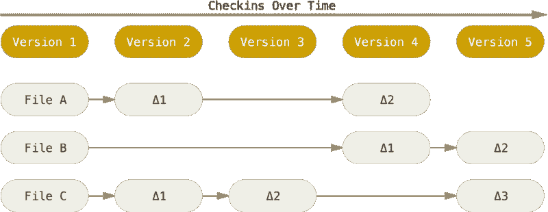
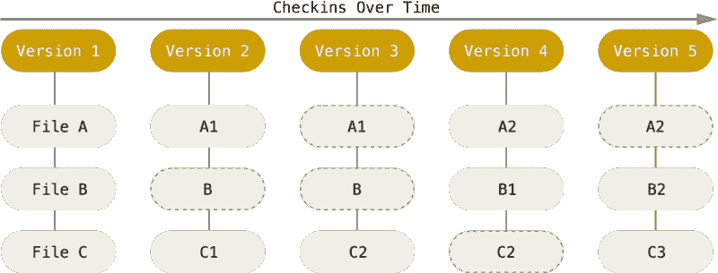

# 通过照片解释 Git 版本控制方法

> 原文：<https://dev.to/zkriszti/the-git-approach-explained-via-photography-3dme>

**我是如何遇见的...git**

当我开始做前端开发人员时，我基本上对 git 一无所知。我参加的在线课程还没有涉及这个话题。我拍的一个向我们“展示”了如何在 GitHub 上托管项目，这就是我剩下的全部。版本控制的基本概念，特别是 git，只是*没有被教授*。Git，GitHub，commit，push，什么？！我所看到的是，它在招聘信息中无处不在，如果我不想落后，就有熟悉它的冲动。

**我作为初学者面临的严重问题**

尽管 git 上有大量的文献，但我真的找不到任何一篇能接近这个主题的文章**英语*。基本上，我觉得概念是按照它们各自的同义词来解释的，我觉得我没有更进一步。*

 *然后，在我的第一个工作场所——管理层正在考虑引入 git 来取代一个相当过时的版本控制解决方案——我被分配了向其他团队成员介绍基本概念的任务。天知道为什么我是最年轻的队员，也许我看起来是最渴望的。:)所以我需要做研究。快进几个月和一个新的工作场所，我每天都在使用基本的 git。

鉴于我以上的挣扎，在这篇文章中，我试图用绝对简单的日常用语来阐述 git 的基础知识。这绝不是一个全面的 git 指南，请把这篇文章看做是:只是让你的 git 之旅更容易开始的一小部分。

**那么 git 是什么？我为什么要在乎？**

刚开始的时候，不妨用“mySuperbCode_v1.js”、“mySuperbCode_v3.js”之类的文件名...或者注释你认为不必要的部分。但是你很快就会发现这一切都显得笨拙和不专业。有一天你可能决定完全重写一个函数，但是你搞砸了。你只是希望能回到重构之前的起点。如果您可以回滚到项目的任何先前阶段，会怎么样呢？

你还将在职业生涯中的某一点上，你将在一个专业的环境中工作，同一项目的不同状态需要共存(即开发者版本 vs. live 版本或用于开发相对独立的新功能集的独立“单元”)。如果没有版本控制，像这样处理代码库很快就会变成一团乱麻。

**我都想要，我现在就想要**

让我们开始吧。:)

广义地说，版本控制有两个截然不同的概念，“增量”和“快照”。“增量”方法意味着每个文件中的更改都是受控的。而使用基于“快照”的方法，跟踪整个项目的所有状态。

请耐心听我说，让我用拍摄一个舞蹈演员的比喻来解释这一点。

*   你的单独文件是舞者的身体部位，像手臂，躯干，头，腿，臀部。
*   舞蹈演员是你的项目。

你会如何拍摄这个舞者？你可以选择分别捕捉每个身体部位的所有动作。那就是:

*   创建一个单独的手臂运动的照片条纹
*   ...又一条腿
*   ...臀部等的另一条纹...

当然，你绝对可以存储所有这些照片。但是你知道它们在任意时刻是如何匹配的吗？手指指向 0 点 15 分。脚的位置只在 0:35 发生了变化，但当时手指在做什么呢？这绝对很难理解。

当然，我们可以做得更好，因为我们有合适的工具！想象你正在用相机拍摄连拍模式的照片。在您选择的时间范围内，以您选择的频率，每一秒都被捕捉，匹配的身体部位状态每秒都被同步，一个动作接一个动作。如果你在连拍模式下创建照片，你可以每秒钟有一张照片。每张图片都告诉你在任何给定的时刻所有身体部位的位置。现在，这就是我们正在寻找的，这就是基于“快照”的方法在版本控制中的优势。(现在，我知道在摄影中一秒钟的时间太长了，但你应该明白了:)。

状态对于任何给定的时刻都是可追溯的——对我们来说，这意味着项目的任何给定状态。

...与仅基于变化的方法相反:(想象一下 FileA、FileB 等。是舞者的不同身体部位——你没有在 0:02 和 0:03 表示“FileB”的身体部位的信息)。

这张图片来自斯科特·沙孔和本·施特劳布的新书

...现在，回想一下运动摄影:

[这张图片来自斯科特·沙孔和本·施特劳布的程序书](https://git-scm.com/book/en/v2)

我希望我能更接近这个概念，这样您就能更轻松地继续您的 git 之旅！:)

本文中的照片来自 Unsplash 和 pxhere.com，并获得免费使用的许可。*