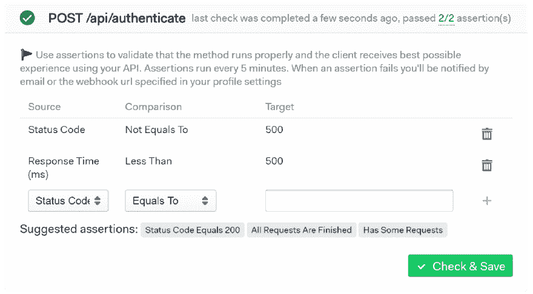
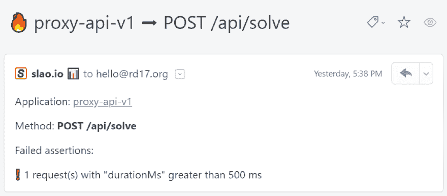

# ✨测试 REST API 的新方法

> 原文：<https://dev.to/sochix/the-new-way-of-testing-rest-api-s-5gd8>

我是一家小公司的软件工程师。简而言之，这意味着我做与业务中使用的软件相关的一切事情，从开发运营和 CI 设置到质量保证。我的大部分时间都花在为我们公司的客户开发 REST API 上。我唯一的问题是:**我对我的 REST API**的质量没有信心。

我猜有些人会推荐使用 TDD，做一个 100%的测试覆盖，你就被分类了。我已经做了所有这些，但是它不会在生产环境中拯救你。

以我的经验来看，单元测试和测试驱动的开发对于小的封装代码段来说非常有效。例如，如果您正在开发一些执行数学运算的库或部分代码，它就可以工作。一般来说，不依赖于外部服务的代码。如果您正在开发 REST API，您将主要依赖于数据库或队列或缓存服务，例如外部服务。

也许是烟雾测试？是的，如果出现已知问题，他们会提醒您，但不会完全解决问题。

我真正需要的是某种类型的集成测试。这是您唯一可以信任的方法，因为它在生产环境中工作，并且涵盖了从客户端请求到客户端响应的整个过程。

### 进行集成测试的最佳方式是什么？

标准的方法是运行一个脚本来模拟客户端的行为，并以特定的顺序调用 API 的方法。这个脚本在一个特殊的测试帐户下运行在“阶段”或“生产”环境中。每次运行后，您还需要删除由测试帐户创建的所有记录，或者重新创建整个数据库。听起来很难。您还需要提出测试场景并用代码描述它们，以及在 API 接口的每个小变化之后支持这些场景。我认为这种方法对于拥有专门 QA 团队的企业级公司来说是好的，但对于独立开发者来说就不太好了。独立开发者需要一种更简单有效的方法。

### 难不成监控？

环顾四周，我的第一个想法是使用一些监控服务来解决我的问题。其实我的队友在 2019 年写了一整篇关于[监控的文章。](https://slao.io/blog/posts/tools-for-monitoring/)

有一段时间，我们尝试了 APMs(像 NewRelic 和 ELK stack)和“ping”服务(像 PingDom、Assertible 或 Checkly)。

APM 解决方案有一个代理，它可以捕获所有需要的数据，但是缺乏快速、方便地定义断言的能力。作为证明，尝试在 ELK 堆栈中为一些不明显的情况设置警报。我还发现，对于增加一批 REST APIs 来说，NewRelic 的定价政策有点偏高。

或者，有几个“ping”服务有非常好的方法为 REST API 的每个方法定义断言，但是缺少对客户端请求和响应的访问。

所以我想出了一个主意:

> 如果我可以在代理库(比如 APM 服务)的帮助下捕获每一个客户端请求和对我的 API 的相应响应，会怎么样？但是让开发人员在每个 REST API 方法上定义一组断言(就像一个“ping”服务)。

我称之为“独立黑客的方式”,只需点击两三次就可以对整个 API 进行集成测试。

### 有哪些优点？

您不需要创建测试场景，然后用代码来描述它们，因为您的客户端的操作已经为您记录下来了。并且它将总是最新的，因为客户端总是正确的:)我的意思是，如果客户端不能以正确的顺序调用您的 API，那么这可能意味着您的文档很糟糕。

第二，你的测试覆盖率将会是 100%左右，因为每个请求都会经过断言。你可能会说有些方法客户不会调用，这些方法也不会被测试。好吧，确实如此，但是你需要这样的方法吗？

“独立黑客之路”的另一个特点是速率测试的可能性。例如，您可以为 API 的每个方法定义一个最小或最大每秒请求数的断言。如果有东西超过了阈值，你会收到通知。

最后但同样重要的是，例如，您可以断言客户的响应时间，并确信所有请求都在 100 毫秒以内运行。

### 有哪些弊端？

是的，它并不完美。正如我上面所说的，如果你有专门的 QA 团队，那么最好进行通常意义上的集成测试，或者配置一个合适的 APM 解决方案。

首先，由于捕捉和发送每个请求，您给应用程序增加了一些计算负载。这没什么大不了的，但对于某些应用程序来说，这可能是个问题。

其次，您不能在测试中定义任何自定义逻辑或方法之间的依赖关系。

### 实现

受这个想法的启发，我很快开发了一个 web 服务来定义断言和接收通知。它叫 SLAO。我每天都在使用它，并且已经将它添加到我所有的 REST APIs 中。

它是如何工作的？

1.  安装代理以捕获请求(现在仅支持 node.js/express)
2.  在简单的 web 界面中定义断言
3.  出错时收到通知

如果你喜欢这个主意，现在就在[上试试吧📊SLAO](https://slao.io?utm_campaign=new-way-of-testing) 并通过聊天或电子邮件提供您的反馈 [hello@slao.io](mailto:hello@slao.io)

*原贴:[https://slao.io/blog/posts/new-way-of-testing/](https://slao.io/blog/posts/new-way-of-testing/)T3】*