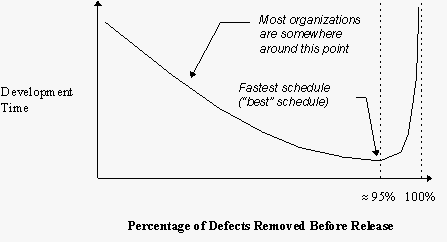

# 每个开发人员都必须理解的一个图表

> 原文：<https://dev.to/bosepchuk/the-one-chart-every-developer-must-understand-2db9>

我们的行业以交付项目晚且超出预算而闻名。许多项目被直接取消，许多其他项目从未交付任何接近我们向客户承诺的价值。然而，有一部分软件开发组织持续地交付优秀的成果。他们从 20 世纪 70 年代就知道如何做到这一点。在这篇文章中，我会告诉你他们的秘密。

一切都从理解史蒂夫·麦康奈尔的这张图表开始。它描述了缺陷率和开发时间之间的关系。

这张图表显示，如果大多数团队将更多的精力放在缺陷预防、早期缺陷消除和其他质量问题上，他们可以更快地交付他们的软件项目。

### 但是这个图表是真的吗？

史蒂夫·麦康奈尔于 1996 年在一篇名为[全速软件质量](https://stevemcconnell.com/articles/software-quality-at-top-speed/)的博客文章中发表了这张图表。这张图表(和博文)总结了他的优秀著作[快速发展](https://www.amazon.com/Rapid-Development-Devment-Developer-Practices-ebook/dp/B00JDMPOB6/)中的一些数据。这本书在一定程度上是基于 20 世纪 90 年代早期对 Capers Jones 的研究。我把这些日期都加进去是因为我想让你知道我们已经知道了多久:

> 在软件中，更高的质量(以更低的缺陷率的形式)和减少的开发时间是携手并进的。

无论如何，Capers Jones 继续他的研究，他在 2011 年与合著者 Olivier Bonsignour 出版了另一本书，书名为[软件质量经济学](https://www.amazon.com/Economics-Software-Quality-Capers-Jones-ebook/dp/B005DKQQQY/)。他们**分析了 1973 年至 2010 年间来自 660 多个组织的 13，000 多个软件项目**，并收集了更多证据表明:

> ...高质量水平总是与短于平均水平的开发进度和低于平均水平的开发成本联系在一起。

换句话说，史蒂夫·麦康奈尔的图表是真实的。

### 那么问题出在哪里？

有三个问题。

#### 问题 1:我们忽略了研究

大多数项目的运行就好像这张图表不是真的一样。几乎没有一天我没有听说过某个项目或某个人做出了糟糕的判断，然后不出所料地遭到了宇宙的斥责。每年都有数十亿美元因为这种愚蠢的行为而损失。从我们开始给电脑编程开始就这样了。每个开发者都经历过。而且看不到尽头。

例如，通过偷工减料来迫使自己(或屈服于外部压力)走得更快，几乎肯定会增加您的缺陷率并减慢您的项目。然而，这种事情一直在发生！

但问题远不止于此。经理要对最严重的项目灾难负责。我们有运行这些项目的人，虽然他们的意图是好的，但是他们不知道他们在做什么。他们的许多项目从一开始就走向灾难(见下面的“经典”软件错误)。当他们意识到他们的项目陷入困境时——通常是在开发人员得出相同结论的几个月后——通常为时已晚。

#### 问题 2:小项目开发实践不能很好地扩展

对小项目相对有效的开发实践不能扩展到大的、真实的项目。小项目是大多数学生参与的唯一一种项目。所以他们毕业时有一个错误的印象，认为他们知道如何开发软件。但是，当我们试图雇佣他们建造相当于摩天大楼的时候，他们却在建造相当于花园的棚子。摩天大楼不仅仅是一个真正的大花园小屋，它们是完全不同的东西。

因为很少有组织能做好软件开发，所以许多团队采用适合花园棚子的方法来解决摩天大楼大小的问题。所以这些可怜的开发人员认为混乱、困惑、错误、冲突的需求、无尽的测试周期、错过的截止日期、压力、成堆的返工和死亡行军都是软件开发的正常部分。

#### 问题 3:许多团队不具备所需的技能

要在现实世界的项目中实现低缺陷率，你需要的不仅仅是简单的技术技能。你需要一整套组织、管理和技术层面的战略和战术来实现这个目标。几乎可以肯定的是，您需要对组织中的几乎每个人进行额外的培训，这也需要您接受不同的开发实践。

### 达到 95%的预发布缺陷去除率需要什么？

对于大多数组织来说，要达到 95%的预发布缺陷去除率，需要相当大的调整。但是好消息是**即使预发布缺陷率的适度改善也会对你的项目的经济性产生积极的影响**。

考虑到这一点，我建议采取以下步骤:

1.  接受这样一个事实:高质量的软件比低质量的软件构建起来更快更便宜
2.  注意史蒂夫·麦康奈尔的“经典”软件错误
3.  尽可能使用内存安全的语言
4.  开始改进您的开发实践

让我们开始吧。

### 接受这个事实:高质量的软件比低质量的软件构建起来更快更便宜

如果你需要比你已经有的更多的证据，阅读[软件质量经济学](https://www.amazon.com/Economics-Software-Quality-Capers-Jones-ebook/dp/B005DKQQQY/)来真正说服你自己和你的队友这个图表是在说实话。本书的作者毫不怀疑:

> 2011 年的最佳可用质量结果非常好，但它们没有被很好地理解，也没有被广泛部署，因为，出于一个原因，高质量是昂贵的错误信念。高质量的软件不贵。从最初的开发一直到总拥有成本，高质量的软件比低质量的软件构建和维护起来更快更便宜。

此外:

> 如果在每个主要的软件项目中使用缺陷预防、预测试缺陷消除和正式测试的最新组合，交付的缺陷可能会比 2011 年的平均值下降 60%。

#### 为什么会这样？

低质量的项目比高质量的项目花费更多的时间在测试、调试、修复和返工上。事实上，低质量的项目包含如此多的缺陷，以至于测试通常比构建花费更长的时间。并且低质量的项目经常在他们没有 bug 可找之前就停止测试。

在瀑布项目中，他们要么按原样发布软件，要么取消项目，因为测试和修复将永远持续下去。在敏捷项目中，工作的增量一开始完成得很快，然后随着在现有代码中发现越来越多的问题而变得缓慢。最终，低质量的敏捷项目会达到和瀑布项目一样的选择:发布或者取消项目。

高质量的项目投资于缺陷预防和预先测试的缺陷消除活动，以便当他们开始测试时，有更少的缺陷需要发现和修复。高质量的项目比低质量的项目发布得更快，成本更低，因为它们有更短的测试阶段和更少的返工。高质量的项目也很少需要修复发布后的问题。因此，当他们确实需要做出改变时，高质量项目中的代码修改起来更容易，也更便宜。

#### 让我们看看来自*的软件质量经济学*的一些要点:

*   从 1973 年到 2010 年，整体质量水平没有太大变化。ide，新语言，解释语言，自动化测试工具，静态分析工具，更好的库，框架，持续集成，成千上万的书，敏捷，Scrum，XP，OOP，TDD，整个 fricking web 都没动过针！真是令人沮丧。(我知道有人要论证这一点不可能是真的。请随意查阅*软件质量经济学*的第 538 和 539 页。
*   在低质量的软件项目**中，将近 50%的努力投入到寻找和修复缺陷和返工**中。
*   缺陷率比项目规模增长得更快。这意味着在一个 5 KLOC 项目中确保 95%的预发布缺陷去除率所需要做的事情与你在一个 500 KLOC 项目中所需要做的事情是完全不同的。更大的项目不仅需要更多的 QA 活动，还需要不同的 QA 活动。记住，摩天大楼不仅仅是一个真正的大花园小屋。
*   自从软件行业开始以来，测试一直是缺陷消除的主要形式，并且对于许多项目来说，它是唯一使用的形式。这很遗憾，因为**测试并不是那么有效**。即使你结合了 6 或 8 种形式的测试，你也不能期望去除大型系统中超过 80%的缺陷。
*   **缺陷预防方法**包括复用、正式检查、原型化、 [PSP/TSP](https://smallbusinessprogramming.com/want-to-write-defect-free-software-learn-the-personal-software-process/) 、静态分析、根本原因分析、TDD 等等。对缺陷预防伤害最大的因素是过度的需求变更，过度的进度压力，以及没有缺陷或质量度量。
*   最有效的预测试缺陷消除形式是正式检查和静态分析。但是作者也讨论了 23 种其他的预测试缺陷消除方法，它们的预期结果范围，以及何时你可能想要使用它们。
*   **每花费 1 美元，更好的表单预测试缺陷消除的投资回报就超过 10 美元**。
*   这本书讨论了 40 种测试，它们的有效范围，以及你什么时候想使用它们。

我认为这本书的真正价值来自它提供的证据，帮助你反驳那些对你的项目成本和进度有特别负面影响的想法和实践。例如，读完这本书后，很难争辩你没有时间进行代码评审。

### 注意史蒂夫·麦康奈尔的经典软件错误

在《快速开发》的第三章中，史蒂夫·麦康奈尔列出了 36 个“经典”的软件错误。

成为这些错误中的一个的受害者会使你的项目陷入缓慢而昂贵的开发中。如果你想有效率，你需要避免所有这些。

它们是:

1.  削弱动机
2.  弱势人员
3.  不受控制的问题员工
4.  英雄辞令
5.  向后期项目添加人员
6.  嘈杂拥挤的办公室
7.  开发人员和客户之间的摩擦
8.  不切实际的期望
9.  缺乏有效的项目赞助
10.  缺乏利益相关者的认同
11.  缺少用户输入
12.  政治高于实质
13.  痴心妄想
14.  过于乐观的时间表
15.  风险管理不足
16.  承包商违约
17.  规划不足
18.  在压力下放弃计划
19.  模糊前端期间浪费的时间
20.  缩短上游活动
21.  设计不当
22.  质量保证不足
23.  管理控制不足
24.  过早或过于频繁的收敛
25.  从评估中省略必要的任务
26.  打算晚点再聊
27.  像地狱一样的代码编程
28.  要求镀金
29.  特征蠕变
30.  显影剂镀金
31.  你推我拉我的谈判
32.  面向研究的开发
33.  银弹综合症
34.  过高估计新工具或方法带来的节约
35.  在项目进行过程中切换工具
36.  缺乏自动化源代码控制

*快速发展*发布于 25 年前。然而，这些经典错误中的 35 个仍然非常普遍(Subversion 和 GIT 已经在很大程度上解决了#36“缺乏自动化源代码控制”)。

* * *

Update: 2021-08-17

查看史蒂夫·麦康奈尔更新和改进的“[经典软件错误](https://dev.to/steve-mcconnells-classic-software-mistakes-revisited/)”列表

* * *

### 尽可能使用内存安全的语言

这个建议没有写进任何一本书，但我认为这是 2019 年的一个重要点。[每年通过安全更新解决的微软产品中大约 70%的漏洞是内存安全问题](https://www.zdnet.com/article/microsoft-70-percent-of-all-security-bugs-are-memory-safety-issues/)。

在这一点上，很明显，如果不犯大量的错误或者不花费大量的金钱来查找和消除错误，人类就无法用像 C 和 C++这样的内存不安全的语言来编写大型系统。

如果微软不能将这些错误排除在他们的软件之外，就没有理由认为你能做得更好。所以，如果你开始一个新的项目，选择一种记忆安全的语言。即使是最苛刻的领域也有内存安全的语言，所以不要因为担心性能问题或兼容性问题而不去尝试它们。

### 开始改进你的开发实践

好吧。所以，你现在相信图表是正确的，你进一步相信你在最优值的左边。现在怎么办？当然，要努力让你的组织沿着曲线朝着图表上的最佳点前进。

你的第一步是**接受**低质量是你项目的一个问题这一事实。由于大多数项目都存在质量问题，所以拿出证据来支持你的观点应该不难。*的第二章软件质量经济学*将帮助你建立一个缺陷跟踪系统来跟踪正确的事情并避免常见的度量陷阱。掌握关于低质量成本的确凿数据将有助于你提出自己的理由。

你的下一步是说服你自己和你的团队不要走捷径，因为它们几乎总是适得其反。如果有必要，把图表打印出来，挂在墙上。

接下来，我建议你**在你的团队中实施一个小的改变**，尝试一段时间，评估你的结果，保留或放弃你的改变，然后选择其他的东西来改进**并重复这个循环**。

并非所有的想法都同样有用，所以我会从[全速软件质量](https://stevemcconnell.com/articles/software-quality-at-top-speed/)中的建议开始。那篇博文中的三个想法完全正确。**从消除捷径开始，替换容易出错的模块，并采用某种代码审查过程**。欢迎您使用我的[代码审查清单](https://smallbusinessprogramming.com/code-review-checklist-prevents-stupid-mistakes/)作为起点。

然后我会继续进行[快速开发](https://www.amazon.com/Rapid-Development-Devment-Developer-Practices-ebook/dp/B00JDMPOB6/)。这本书是关于让你的项目处于控制之下，并更快地交付工作软件。要避免的 36 个经典错误超级重要。接下来去那里，然后处理本书剩余部分的主题。

[软件质量经济学](https://www.amazon.com/Economics-Software-Quality-Capers-Jones-ebook/dp/B005DKQQQY/)并不是一本真正的入门书，但它会作为参考资料派上用场。它将帮助您确定特定项目的最佳质量目标。它为您提供了一个选项菜单，帮助您选择正确的实践组合来实现它。

### 如果没有人对提高质量感兴趣怎么办？

可悲的是，这将发生在你们许多人身上。质量贵的神话很难撼动。更难的是说服人们改变他们的工作方式。除非你是团队中的老大，否则你可能不具备引领这种变革所需的影响力。

所以你有三个选择:

1.  忘记在项目层面提高质量，遵从你的团队的规范。
2.  继续倡导质量改进，并希望人们最终会同意你的观点。
3.  找一个已经关注质量的新工作场所。

我不能为你做决定，但让我说，有更多的开发人员职位比合格的开发人员来填补他们。许多雇主确实关心质量，并积极招聘各种经验水平的人来帮助他们提高质量。

### 包装完毕

你们中的许多人和我一样对普通软件项目的质量感到担忧和苦恼。我们知道如何做得更好，但我们只需要让更多的软件开发团队开始行动。我认为第一步是向人们展示这张图表及其背后的证据。

我知道这个问题不会在一夜之间消失。但是，如果你和我有同样的感受，请尽你所能传播消息，分享这篇文章，改善你自己项目的结果，并帮助改善我们行业的集体成果。

*同意还是不同意？有故事分享？让我写在评论里吧。*

喜欢这篇文章吗？请在下面“点赞”。