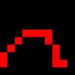
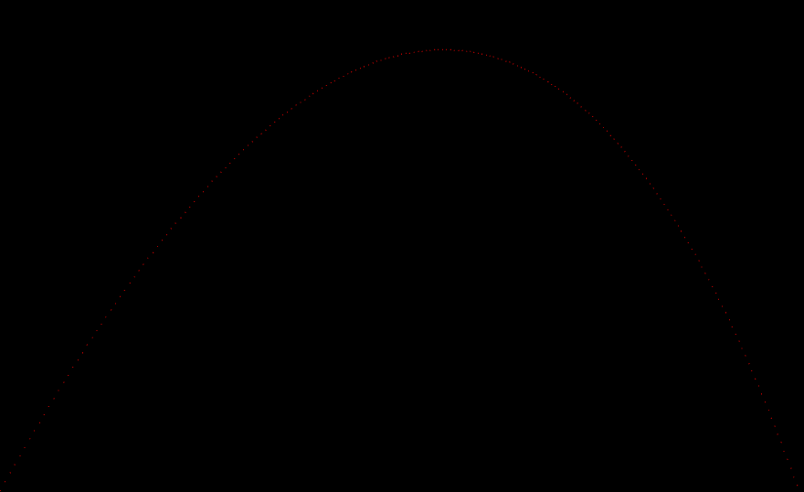

# 光线追踪挑战——在画布上绘图并将图像保存到文件中

> 原文：<https://dev.to/simonech/the-ray-tracer-challenge-drawing-to-a-canvas-and-saving-the-image-to-a-file-5gl6>

在上一篇文章中，我已经展示了我如何实现[光线追踪挑战书](https://amzn.to/2Elaxkr)的第一章，编写基本的原语和它们的操作。还实现了弹道轨迹计算器。在第二章中，我们的目标是能够在画布上绘制图像，然后保存到文件中。

如果你没有，我推荐你阅读我的[介绍文章](http://codeclimber.net.nz/archive/2019/05/22/raytracer-challenge-netcore-intro/),它解释了我想要达到的目标和原因。

## 遇到的挑战

这是一个比前一章更简单的练习，但是，并不是一切都很简单。

### 建模颜色类

绘制图像背后的概念非常简单。图像是像素的矩阵，每个像素的值是一种颜色。颜色是三个值的“元组”(红、绿、蓝分量)。

出于这个原因，作者建议重构`Tuple`的实现，这样就不需要重新实现基本操作(标量的加、减和乘)。我想到创建一个`TupleBase`类，它扩展了`Array`并在数组上实现这 3 个操作。不幸的是，在 C#中，`Array`是一个密封类，不能用作基类。我想用一个`List`，但是它可能会有很高的性能价格比。我最终决定复制这 3 个操作的代码，并在本章结束后再回来。

```
public class Color
{
    public static readonly Color Black = new Color(0, 0, 0);

    public Color(double r, double g, double b)
    {
        Red = r;
        Green = g;
        Blue = b;
    }

    public double Red { get; set; }
    public double Green { get; set; }
    public double Blue { get; set; }

    //All operations
} 
```

在我的 GitHub 知识库中，你可以看到标签为[第 2.1 章](https://github.com/simonech/ray-tracer-challenge-netcore/tree/Chapter-2.1)的实现。

### 建模画布类

这个类实现起来非常简单。我使用了一个二维数组来存储值，并实现了一个索引访问器来设置和读取值。

```
public class Canvas
{
    private Color[,] canvas;

    public Canvas(int width, int height) : this(width, height, Color.Black)
    {

    }
    public Canvas(int width, int height, Color background)
    {
        Width = width;
        Height = height;
        canvas = new Color[width, height];
        Initialize(background);
    }

    public int Width { get; set; }
    public int Height { get; set; }

    public Color this[int x, int y]
    {
        get
        {
            return canvas[x, y];
        }

        set
        {
            canvas[x, y] = value;
        }
    }
} 
```

这个索引器工作得很好，但是 intellisense 没有显示变量的名称，在编写练习时，我希望我编写了一个显式的方法来设置像素的颜色，就像`Canvas.SetPixelAt(int x, int y, Color color)`。

在我的 GitHub 存储库中，你可以看到标签[上画布的实现第 2.2 章](https://github.com/simonech/ray-tracer-challenge-netcore/tree/Chapter-2.2)。

最后，在写这篇文章时，我意识到我也可以对基本元组类使用相同的方法。我想现在我知道如何重构实现了。

### 实现 PPM 编写器

PPM 文件格式是现存的最基本的文件格式。每个像素用一个包含三个部分的字符串表示。如果一个像素是白色的，它将被表示为`255 255 255`，每个像素 12 个字节。而黑色像素将是 6 字节。这使得它可能是现有的最低效的图像格式。我想在我的“重构冲刺”中，我会尝试实现一个更有效的格式。

每行像素表示为一系列线，最多 70 个字符，因此渲染代码也必须考虑到这一限制。

```
public string GetPPMContent()
{
    var builder = new StringBuilder();
    builder.AppendLine("P3");
    builder.AppendLine($"{Width} {Height}");
    builder.AppendLine("255");
    for (int y = 0; y < Height; y++)
    {
        int lineLength = 0;
        for (int x = 0; x < Width; x++)
        {
            string[] colorA = canvas[x, y].ToRGBA();
            foreach (var color in colorA)
            {
                if (lineLength + 1 + color.Length > 70)
                {
                    builder.AppendLine();
                    lineLength = 0;
                }
                if(lineLength!=0)
                {
                    builder.Append(" ");
                    lineLength++;
                }
                builder.Append(color);
                lineLength += color.Length;
            }
        }
        builder.AppendLine();
    }
    return builder.ToString();
} 
```

这个算法可行但感觉不对。或许有一种更优雅的方式。为我的重构冲刺提供更多食物。

## 把所有的东西放在一起

实现了这些基本的图像绘制方法后，第 2 章的练习是绘制上一章中实现的轨迹。这是一个非常简单的练习。只需要确保轨迹在画布里。

下面是这个方法的代码，它用红色标出了投射物在画布上的位置。

```
private static void Draw(Canvas canvas, Tuple position)
{
    var x = (int)sys.Math.Round(position.X);
    var y = canvas.Height - (int)sys.Math.Round(position.Y) - 1;
    //sys.Console.WriteLine($" {x},{y} - {position}");
    if (x >= 0 && x <= canvas.Width - 1 && y >= 0 && y <= canvas.Height - 1)
    {
        canvas[x, y] = new Color(1, 0, 0);
    }
} 
```

这个练习的复杂部分是找到一些初始值，这些初始值会产生一些可见的东西。第 1 章中使用的值将适合 10 乘 10 的图像。

```
var p = new Projectile(Tuple.Point(0, 0, 0), Tuple.Vector(1, 1, 0).Normalize());
var e = new Environment(Tuple.Vector(0, -0.1, 0), Tuple.Vector(-0.01, 0, 0));
var c = new Canvas(10, 10); 
```

[](https://res.cloudinary.com/practicaldev/image/fetch/s--r8PuH23E--/c_limit%2Cf_auto%2Cfl_progressive%2Cq_auto%2Cw_880/http://codeclimber.net.nz/media/1061/4-trajectory-10x10.png)

为了产生更多可见的东西，我必须将抛射体的速度增加 11(同时保持重力和风力不变)，并以更陡的角度发射。有了这些值，图表就符合 900/550 的图像。

```
var p = new Projectile(Tuple.Point(0, 1, 0), Tuple.Vector(1, 1.8, 0).Normalize().Multiply(11.3));
var e = new Environment(Tuple.Vector(0, -0.1, 0), Tuple.Vector(-0.01, 0, 0));
var c = new Canvas(900, 550); 
```

[](https://res.cloudinary.com/practicaldev/image/fetch/s--hfLZWZ_n--/c_limit%2Cf_auto%2Cfl_progressive%2Cq_auto%2Cw_880/http://codeclimber.net.nz/media/1062/4-trajectory-900x500.png)

在我的 GitHub 存储库中，你可以看到练习的[代码，以及输出，两张图片，](https://github.com/simonech/ray-tracer-challenge-netcore/tree/Chapter2-End/Exercises/Chapter%202) [10x10](https://github.com/simonech/ray-tracer-challenge-netcore/blob/Chapter2-End/Exercises/Chapter%202/Results/file-10x10.ppm) 和 [900x550](https://github.com/simonech/ray-tracer-challenge-netcore/blob/Chapter2-End/Exercises/Chapter%202/Results/file-900x500.ppm) 的尺寸。

## 结论

这一章比前一章更容易实现，但是仍然有一些我想改进的地方。具体来说，我想将`Color`实现重构为一个`TupleBase`的子类，与另一个`Tuple`类共享点和向量。此外，看看我是否可以使 PPM 序列化代码更好一点，并找到一个更有效的存储文件格式。

除了这些任务，我还想回到基本的原语，将数学实现为操作重载，并进行一些性能测试，以找到性能最好的数据存储解决方案。

如果你喜欢这一系列的帖子，不想错过我的下一集，请考虑订阅。