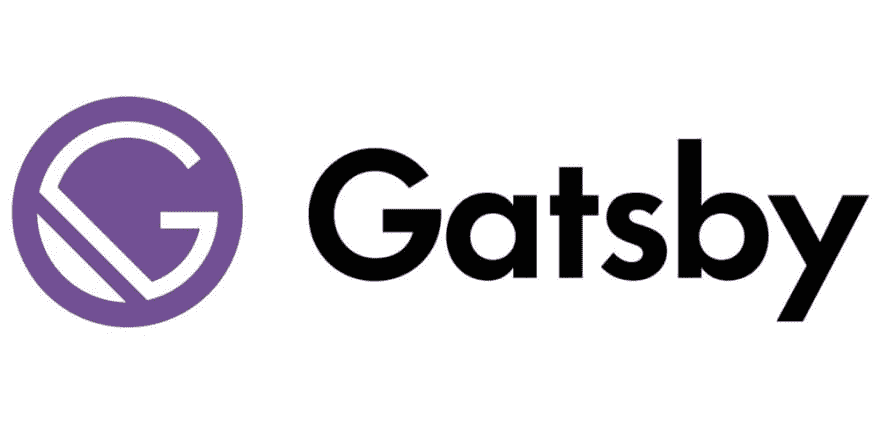
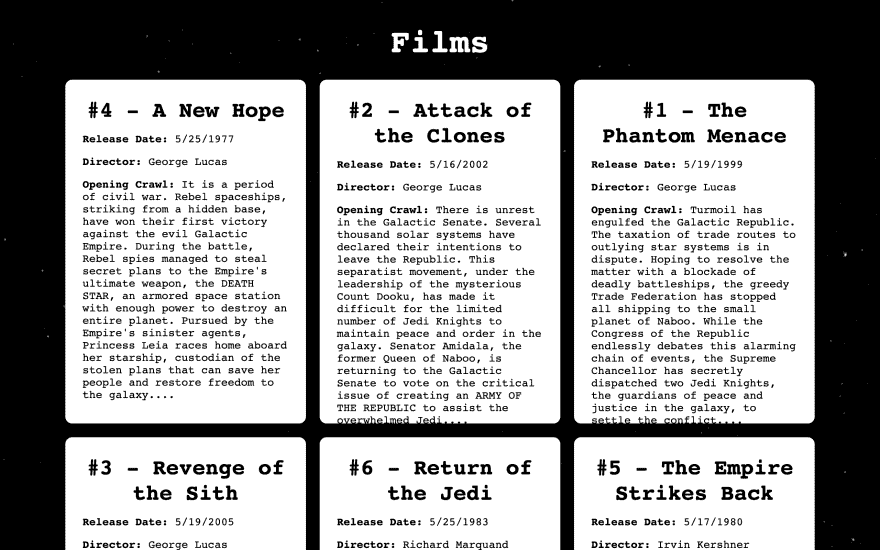
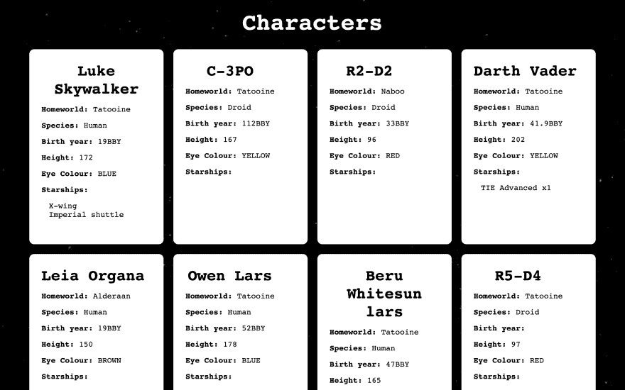

# web 性能的趋势和静态站点生成器的兴起，带 Gatsby.js，GraphQL 和 React.js 教程。

> 原文：<https://dev.to/andrewsmith1996/the-trend-of-web-performance-and-the-rise-of-static-site-generators-with-gatsby-js-graphql-and-react-js-tutorial-1jk>

# web 性能的趋势和静态站点生成器的兴起，有了 Gatsby.js，

在当今 web 开发时代的所有趋势中，高端 web 性能的趋势是单独为用户和 web 开发人员提供最多回报和收益的趋势；日常用户现在期望网站提供惊人的页面速度、最短的加载时间和绝对零挫败感的吸引人和令人满意的用户体验。

近年来，我们看到这种期望实现了。随着我们 ***不断*** 推动 web 做越来越多的事情，并为我们的应用程序添加更多的功能，我们开始看到网站性能的**严重**下降。但是，随着 PWAs(渐进式 web 应用程序)、服务人员和静态站点生成器等 web 技术的出现，以及本地应用程序加载时间长和令人沮丧的延迟的日子的结束，开发人员能够创建快速、高效和可靠的应用程序，以很少的开发时间提供出色的 web 体验。

**底线是性能很重要**，谷歌在这方面的持续推进，为 PWAs 和加速移动页面(AMP)提供 Lighthouse 服务，这真正表明了行业巨头现在如何优先考虑网络性能，我们也应该这样做。

谷歌甚至给了我们数据来支持这一点。例如，当 Pinterest 将等待时间减少 40%时，搜索引擎流量和注册人数增加了 15%(1)，BBC 发现，他们的网站加载时间每增加一秒，就会额外失去 10%的用户(2)。

特别是，由于其惊人的快速页面速度、增强的安全性和简单的开发、部署和托管，许多 web 开发人员转向静态站点生成器，作为一种构建他们的网站的方式，同时实现他们的 web 性能目标。

### 那么，什么是静态站点生成器呢？

静态网站的一个常见误解是它们是一项新技术，而事实上它们已经存在了 ***年*** 。静态网站是 web 开发的原始方法，使用普通的 HTML、CSS 和 JavaScript 来构建网站，没有前端框架、库或插件。

静态站点生成器本身专注于生成普通的 HTML、CSS 和 JavaScript 站点作为完整的输出，没有任何到数据库或服务器端处理的链接(因此使它们的加载速度非常快)。这些静态 HTML 文件由服务器生成，并准备好返回给浏览器。静态站点生成器能够从任何地方提取数据，包括各种 CMS、API 和内容文件。

### 使用静态站点生成器有什么好处？

1.  **速度**。由于缺少任何实际交付网站的后端系统，不需要运行任何数据库查询，也不需要处理任何客户机-服务器请求，并且服务器总是准备好 HTML 输出以交付给用户，静态网站的性能通常是 ***快得惊人*** 。此外，许多静态站点生成器都有缓存特性，这进一步减少了延迟。从本质上讲，服务器所要做的就是返回一个文件，事实证明，它很擅长快速处理…

2.  **安全**。同样，由于缺乏后端系统，静态站点没有可被攻击或利用的数据库，没有可用作进入系统的路径的插件或扩展，也没有任何人可以未经授权访问的区域。WordPress(拥有互联网上 34%*的网站)因被利用和存在安全漏洞而声名狼藉*，但对于静态网站来说，任何人对一组普通的 HTML 文件都不会造成太大的损害。**

**   **健壮**。没有后端系统的另一个 JAMstack 好处。静态站点的部署和扩展要简单得多，并且应用程序作为一个整体通常更加稳定和健壮，因为服务器实际上只需要请求简单的静态文件就可以处理大量的流量。

    *   **易于开发**。静态站点生成器大大简化了开发过程。只需最少的设置和配置，就可以非常容易地启动和运行，而且一旦编写了站点，通常只需一个简单的命令就可以部署站点。

    *   **SEO** 。通常情况下，网络爬虫无法读取包含数百个组件的复杂 React.js 或 Vue.js 应用程序，这使它们处于 SEO 桶的底部。但是当你的内容是静态的，并且你有很好的页面速度和性能，那么你一定会在 SEO 方面很出色。* 

 *### 使用静态站点生成器有什么弊端？

1.  **实时应用**。由于该网站仅限于根据每个请求生成的一组静态 HTML 文件，目前还没有能力创建一个托管实时数据的应用程序。因此，告别任何需要自动更新新闻故事、实时评论、实时数据或任何形式的消息应用程序等功能的应用程序。

### 输入 Gatsby.js

js 是一个用于生成静态站点的开源框架。基于 jam stack([https://jamstack.org](https://jamstack.org/))。Gatsby 使用 React.js 作为首选的前端框架，并使用 GraphQL 来支持其数据层；最终使 Gatsby 能够从一系列来源(基本上是任何地方)获取数据，包括 WordPress、Drupal 和 Craft CMS 等 CMS、由元数据组成的简单降价文件、成熟的数据库和 API 或本地文件。

Gatsby 也有大量的插件来扩展它的功能。Gatsby 使用两种类型的插件， **source 插件**用于将数据“来源化”到应用程序中，例如从 WordPress 等 CMSs 中获取数据，以及 **transformer 插件**用于将来自 source 插件的数据“转换”成一些新数据，例如延迟加载图像。

[](https://res.cloudinary.com/practicaldev/image/fetch/s--jRGyr3nn--/c_limit%2Cf_auto%2Cfl_progressive%2Cq_auto%2Cw_880/https://cdn-images-1.medium.com/max/2000/0%2AOKqQlSGyTtCOdlm_.jpeg)

### React.js

Gatsby 使用 React.js 来构建网站的用户界面，实际上它很快而且非常好(我是 React 和 React 的忠实粉丝)，根据 Stack Overflow 最近的开发人员调查，它是 31.3%的开发人员的首选 web 框架，是 74.5%的开发人员最喜欢的框架，并且是最受欢迎的 web 框架。

[](https://res.cloudinary.com/practicaldev/image/fetch/s--rb3Elz-k--/c_limit%2Cf_auto%2Cfl_progressive%2Cq_auto%2Cw_880/https://cdn-images-1.medium.com/max/2000/0%2AIFfX3ate97WRJ-gv.png)

### GraphQL

Gatsby 使用 GraphQL 作为其数据层。GraphQL 最初是由脸书创建的，它允许我们将数据放入我们的网站。GraphQL 真的很强大，并且产出 ***真的*** 优雅高效的解决方案。稍后将详细介绍 GraphQL。

[](https://res.cloudinary.com/practicaldev/image/fetch/s--VHieVx78--/c_limit%2Cf_auto%2Cfl_progressive%2Cq_auto%2Cw_880/https://cdn-images-1.medium.com/max/2400/0%2ATiw6euetQcRVsapn.png)

## 教程

在本教程中，我们将使用 Gatsby.js，这是一个流行的静态站点生成器，被 AirBnB 和 Nike 等公司使用。Gatsby.js 利用 React.js 和 GraphQL，在本教程中，我们将构建一个简单的网站，显示有关星球大战电影和角色的信息(nerd alert)，然后我们将使用 Gatbsy.js 输出一个完整的静态网站，每当用户访问它时，它都会在构建期间自动生成。

我们将创建的展示 Gatsby.js 威力的项目是一个简单的应用程序，它从《星球大战》API(SWAPI—[https://github.com/graphql/swapi-graphql](https://github.com/graphql/swapi-graphql))获取数据，并显示电影和特许经营/宇宙中角色的内容。我们将有一个简单的索引页，列出电影和人物，我们将使用一个简单的卡片布局来显示索引页上的每一段内容。

[](https://res.cloudinary.com/practicaldev/image/fetch/s--Hcr5TgLt--/c_limit%2Cf_auto%2Cfl_progressive%2Cq_auto%2Cw_880/https://cdn-images-1.medium.com/max/5120/1%2Ak8y3PoaMbp_bzd7EsQN6wQ.png)

[](https://res.cloudinary.com/practicaldev/image/fetch/s--aJRio9D5--/c_limit%2Cf_auto%2Cfl_progressive%2Cq_auto%2Cw_880/https://cdn-images-1.medium.com/max/5120/1%2AqJTw-HefvTbNghFnzOpMuA.png)

Gatbsy 在这里的角色包括查询 API 和在运行时构建静态站点(每当有人访问网站时)，从而产生一组几乎瞬间加载的超快速动态网页。此外，当新的内容被添加到星球大战 API 中时，静态站点将自动拉入这些新内容并重新生成自己；最终创建一个有点混合的**动态-静态**站点。

### 步骤 1 —安装 Gatsby.js

首先我们需要安装 Node.js，如果你已经安装了，那么跳过这一步，如果没有，那么转到[https://nodejs.org/en/download/](https://nodejs.org/en/download/)。

接下来，我们需要使用 NPM 来安装 Gatsby.js CLI(命令行界面)，这将使创建和管理 Gatsby 项目变得更加容易:

```
npm install -g gatsby-cli 
```

作为参考，您可以通过运行以下命令来查看所有可用的 Gatsby 命令:

```
gatsby --help 
```

Gatsby 附带了一系列预构建的项目配置/启动模板，使得创建 Gatsby 项目变得非常简单。我们将使用“Hello World”启动模板，因此要创建我们的新 Gatsby 项目，请运行带有我们项目名称的 **gatsby new** 命令，然后我们将使用启动模板:

```
gatsby new star-wars-app [https://github.com/gatsbyjs/gatsby-starter-hello-world](https://github.com/gatsbyjs/gatsby-starter-hello-world) 
```

这将为我们创建基本的 starter 项目，因此运行以下命令开始开发应用程序:

```
cd star-wars-app
gatsby develop 
```

然后，如果您前往 [http://localhost:8000](http://localhost:8000/) ，您将看到您的 Gatsby 项目带有一个空白的 hello world 模板！

### 步骤 2 —创建我们的模板

在您选择的文本编辑器中打开项目，我将使用 VS 代码。打开 **/src** 文件夹，里面会有一个名为 **pages** 的目录。正如你可能已经猜到的，这里是网站上所有内容页面的存放地。由于我们使用了一个起始模板，它们将是一个单独的 **index.js** 文件，其中将有一个单独的“hello world”组件消息。删除它，因为我们将创建我们自己的用于索引页面的组件。

值得注意的是，Gatsby 有超级酷的 **createPage API** ，你可以根据数据自动生成页面，所以理论上我们可以自动和动态地为我们从 API 中获得的所有电影和角色创建单独的电影和角色页面。这是一个 ***真正强大的*** 功能，它真正将 Gatsby 放在了静态站点生成器的最前沿，如果利用得当，可以用最少的编码时间创建一个完整的网站。很酷，是吧？但是对于本教程，我们将只使用一个索引页面。

接下来，我们需要创建一个文件夹来创建组件。所以在 **src** 创建一个名为**组件**的新目录。因此，您的项目结构应该如下所示:

```
src
 pages
   index.js
 components 
```

我们将创建两个列表组件，一个用于电影列表，一个用于角色列表。然后我们将创建两个卡片组件，一个显示每部电影的基本信息，另一个显示每个角色的信息。

电影列表和角色列表组件都将显示在主页(index.js)上，然后每个列表组件将显示多个卡片组件。

首先，让我们使用以下 React 代码在 src/components/films 下创建 filmsList.js 文件来创建 films 组件:*