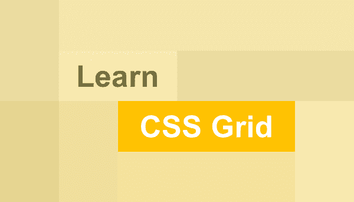
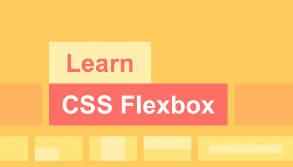
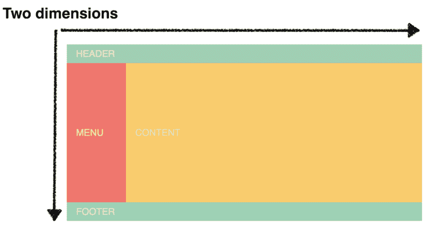
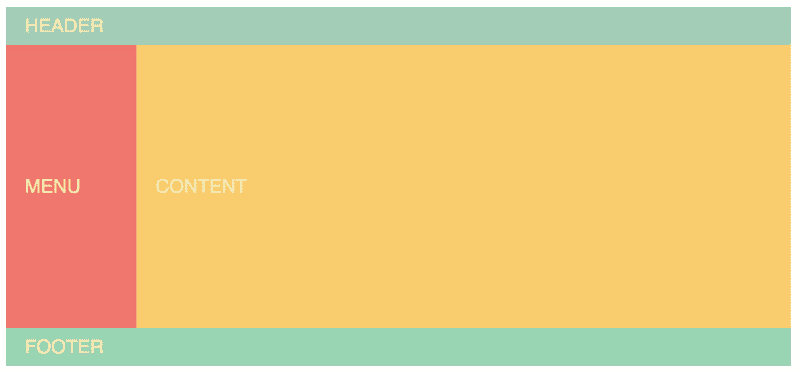
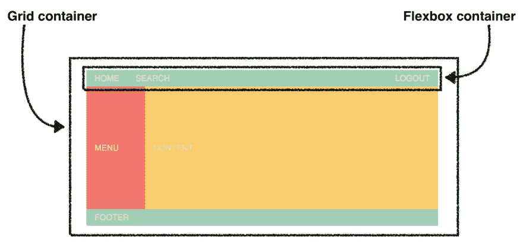
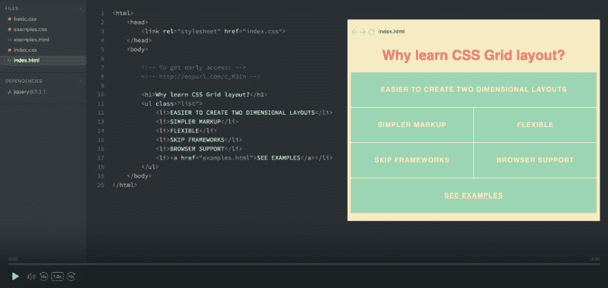

# 终极 CSS 之战:网格 vs Flexbox

> 原文：<https://dev.to/scrimba/the-ultimate-css-battle-grid-vs-flexbox-24jn>

在过去的几年里，CSS Flexbox 在前端开发人员中变得非常流行。这并不奇怪，因为它让我们更容易创建动态布局和对齐容器内的内容。

然而，有一个叫 CSS Grid 的新生事物，它有很多和 Flexbox 一样的功能。在某些情况下，它比 Flexbox 更好，而在其他情况下，它不是。

这似乎是开发人员困惑的一个来源。因此，在本文中，从微观和宏观两个层面对这两个模块进行比较。

> 如果你想好好学习这两个模块，可以看看我的免费课程 [CSS Grid](https://scrimba.com/g/gR8PTE?utm_source=dev.to&utm_medium=referral&utm_campaign=gR8PTE_grid_vs_flexbox) 和 [CSS Flexbox](https://scrimba.com/g/gflexbox?utm_source=dev.to&utm_medium=referral&utm_campaign=gR8PTE_grid_vs_flexbox) 。

[](https://scrimba.com/g/gR8PTE?utm_source=dev.to&utm_medium=referral&utm_campaign=gR8PTE_grid_vs_flexbox) 
[ ](https://scrimba.com/g/gflexbox?utm_source=dev.to&utm_medium=referral&utm_campaign=gR8PTE_grid_vs_flexbox) *点击一幅图像即可进入其各自的球场。*

现在让我们开始吧！

### 一维 vs 二维

如果你要从这篇文章中吸取一个教训，那就是这个:

> Flexbox 是为一维布局设计的，而 Grid 是为二维布局设计的。

这意味着，如果你在一个方向上布置项目(例如，一个标题中的三个按钮)，那么你应该使用 Flexbox:

[](https://res.cloudinary.com/practicaldev/image/fetch/s--bs59DXSj--/c_limit%2Cf_auto%2Cfl_progressive%2Cq_auto%2Cw_880/https://cdn-images-1.medium.com/max/800/1%2Ah6dcLWRp0lXeWklPAFK8cA.png)

它会给你比 CSS 网格更多的灵活性。它也更容易维护，需要的代码更少。

但是，如果您要创建一个二维的完整布局——包含行*和列*——那么您应该使用 CSS Grid:

[](https://res.cloudinary.com/practicaldev/image/fetch/s--sv1KMzyv--/c_limit%2Cf_auto%2Cfl_progressive%2Cq_auto%2Cw_880/https://cdn-images-1.medium.com/max/1200/1%2AAxItLokVtaF56WMo_ZF6Pw.png)

在这种情况下，CSS Grid 会给你更多的灵活性，使你的标记更简单，代码也更容易维护。

当然，现在你可以将两者结合起来。在上面的例子中，使用 Grid 进行页面布局，然后使用 Flexbox 来对齐页眉中的内容是最完美的。这会让你两全其美。在这篇文章的最后，我会告诉你具体怎么做。

### 内容优先 vs 布局优先

两者的另一个核心区别是 Flexbox 基于**内容**，而网格基于**布局**。这可能看起来很抽象，所以让我们看一个具体的例子，因为这样更容易理解。

我们将使用上一段的标题。下面是它的 HTML:

```
<header>  
    <div>Home</div>  
    <div>Search</div>  
    <div>Logout</div>  
</header> 
```

在我们将其转换为 Flexbox 布局之前，这些 div 会像这样堆叠在一起:

[](https://res.cloudinary.com/practicaldev/image/fetch/s--kDvhenCR--/c_limit%2Cf_auto%2Cfl_progressive%2Cq_auto%2Cw_880/https://cdn-images-1.medium.com/max/800/1%2AVRnOqt5g9NVKY-NUh0vh7Q.png) 
我已经添加了一点基本的样式，这与 Flexbox 或 Grid 无关，所以我把它去掉了。

#### Flexbox 表头

然而，当我们给它一个`display: flex;`时，这些项目将被很好地放置在一行上。

```
header {  
    display: flex;  
} 
```

[](https://res.cloudinary.com/practicaldev/image/fetch/s--72t7Fi1n--/c_limit%2Cf_auto%2Cfl_progressive%2Cq_auto%2Cw_880/https://cdn-images-1.medium.com/max/800/1%2AXHmGGavmUsEi3-vd9v0vcg.png)

要将*注销*按钮移动到最右边，我们只需瞄准该元素并给它一个边距:

```
header > div:nth-child(3) {  
    margin-left: auto;  
} 
```

这会导致以下结果:

[](https://res.cloudinary.com/practicaldev/image/fetch/s--sznXwt9G--/c_limit%2Cf_auto%2Cfl_progressive%2Cq_auto%2Cw_880/https://cdn-images-1.medium.com/max/800/1%2A1inbBN_44U2HSwFL3Ech-w.png)

我想让你注意的是，我们让物品自己决定它们的摆放方式。除了最初的`display: flex;`之外，我们不需要预定义任何东西。

这是 Flexbox 和 Grid 之间区别的核心，当我们使用 Grid 重新创建这个头时，这一点会更加明显。

> 尽管 CSS Grid 不是为创建一维标题而构建的，但在本文中它仍然是一个很好的练习，因为它告诉我们 Flexbox 和 Grid 之间的核心区别。

#### 网格表头

我们可以使用 CSS Grid 以几种不同的方式创建标题。我要用一个非常简单的方法，我们的网格有十列，每列有一个分数单位宽。

```
header {  
    display: grid;  
    grid-template-columns: repeat(10, 1fr);  
} 
```

它看起来与 Flexbox 解决方案完全相同。

[](https://res.cloudinary.com/practicaldev/image/fetch/s--4bLMqlZ7--/c_limit%2Cf_auto%2Cfl_progressive%2Cq_auto%2Cw_880/https://cdn-images-1.medium.com/max/800/1%2AVPeA-uXOph9dNuOEUAz_kQ.png)

然而，我们可以在引擎盖下窥视一下，看看有什么不同。我们将使用 Chrome 检查器来检查列行:

[](https://res.cloudinary.com/practicaldev/image/fetch/s--lpLHXsLs--/c_limit%2Cf_auto%2Cfl_progressive%2Cq_auto%2Cw_880/https://cdn-images-1.medium.com/max/800/1%2ARK-Kw7WoW6hXnpIYIPZF3Q.png)

这种方法的关键区别在于，我们必须首先定义列——布局。我们从定义列的宽度开始，*然后*我们将内容放入可用的网格单元中。

> 这种方法迫使我们决定将标题分成多少列。

除非我们改变网格，否则我们只能有十列。这是我们在 Flexbox 中不会遇到的限制。

为了将*注销*更改到最右边，我们将它放在第十列，就像这样:

```
header > div:nth-child(3) {  
    grid-column: 10;  
} 
```

这是我们检查电网时的情况:

[](https://res.cloudinary.com/practicaldev/image/fetch/s--BVJf9b72--/c_limit%2Cf_auto%2Cfl_progressive%2Cq_auto%2Cw_880/https://cdn-images-1.medium.com/max/800/1%2Au5z2zikNjwyL84dcUhRgJA.png)

我们不能简单地给它一个`margin-left: auto;`，因为*注销*按钮已经被放置在布局的第三列的一个特定单元格中。要移动它，我们必须为它找到另一个网格单元。

### 两者结合

现在让我们看看如何结合使用这两者，将我们的页眉合并到我们的网站布局中。我们将从构建网站布局开始。

[](https://res.cloudinary.com/practicaldev/image/fetch/s--iH6Rqwiv--/c_limit%2Cf_auto%2Cfl_progressive%2Cq_auto%2Cw_880/https://cdn-images-1.medium.com/max/800/1%2AOcjCKOnh48lYnUuEJw_ZBA.png)

下面是标记:

```
<div class="container">  
  <header>HEADER</header>  
  <aside>MENU</aside>  
  <main>CONTENT</main>  
  <footer>FOOTER</footer>  
</div> 
```

下面是 CSS:

```
.container {  
    display: grid;      
    grid-template-columns: repeat(12, 1fr);  
    grid-template-rows: 50px 350px 50px;  
} 
```

我们将像这样在网格上放置项目:

```
header {  
    grid-column: span 12;  
}

aside {  
    grid-column: span 2;  
}

main {  
    grid-column: span 10;  
}

footer {  
    grid-column: span 12;  
} 
```

现在我们将简单地添加标题。我们将把标题 CSS 网格中的一个*项目*—转换成一个 Flexbox 容器。

```
header {  
    display: flex;  
} 
```

现在我们可以将注销按钮设置在右边:

```
header > div:nth-child(3) {  
    margin-left: auto;  
} 
```

我们有一个完美的布局，它充分利用了 Grid 和 Flexbox 的优势。以下是这两个容器的外观:

[](https://res.cloudinary.com/practicaldev/image/fetch/s--hpOc5B_R--/c_limit%2Cf_auto%2Cfl_progressive%2Cq_auto%2Cw_880/https://cdn-images-1.medium.com/max/1200/1%2AjPJsp3kukI6WNQBntfHsWg.png)

所以现在你应该对 Flexbox 和 Grid 的一般和具体区别有了很强的理解，并且知道如何一起使用它们。

#### 浏览器支持

在结束之前，我还需要提一下浏览器支持。本文发表时， [92%的全球网站流量支持 CSS 网格](https://caniuse.com/#feat=css-grid)，并且还在攀升。

相信 CSS 网格会变成前端开发者的必备技能。就像过去几年 CSS Flexbox 所发生的一样。

点击下图查看课程预览。

[](https://scrimba.com/p/pWqLHa/cg9PpTb?utm_source=dev.to&utm_medium=referral&utm_campaign=gR8PTE_grid_vs_flexbox)

感谢阅读！我叫 Per，我是 Scrimba 的联合创始人，我喜欢帮助人们学习新技能。如果你想获得关于新文章和资源的通知，请在 [Twitter](https://twitter.com/perborgen) 上关注我。