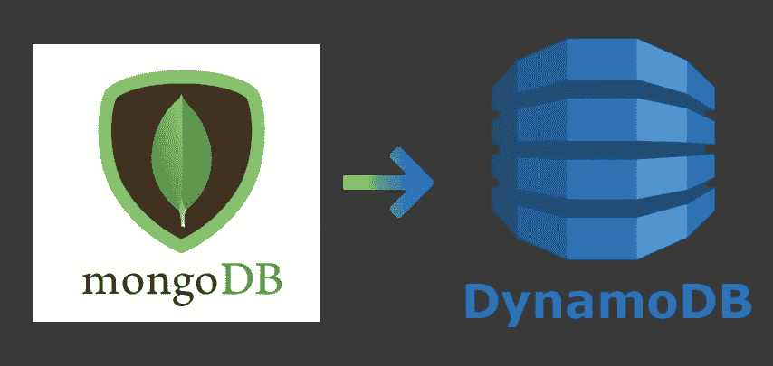
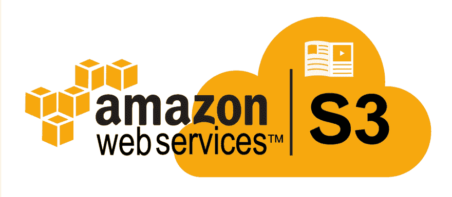
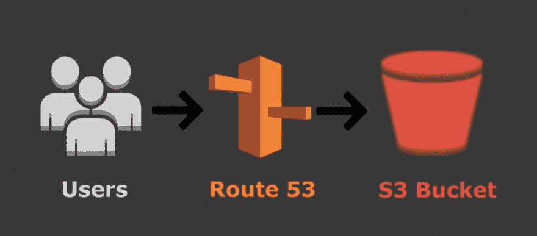
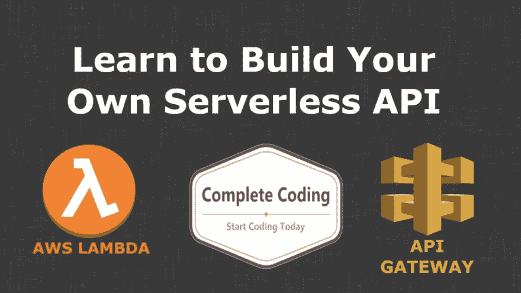

# 无服务器云迁移终极指南

> 原文：<https://dev.to/samwsoftware/the-ultimate-guide-to-migrating-to-the-cloud-with-serverless-2e60>

#### 迁移现有软件产品以在云中无服务器运行的分步指南

您已经运行了一个应用程序，并且已经听说了大量关于无服务器及其优势的信息。你可能已经尝试过用无服务器部署一些东西，但是你想把你的整个应用程序转移到无服务器。

你是怎么做到的？你首先做什么？你必须同时做所有的事情吗？

本文将指导您完成将应用或服务迁移到无服务器云的步骤。

### 1。简单 API

当您开始将服务迁移到的过程时，最好从容易实现的目标开始。这将使您获得一些使用无服务器和 AWS 的经验，但仍然为应用程序提供价值。

简单 API 是不需要访问数据库来执行其操作的端点。这可能是一个用于发送电子邮件、访问外部 API 和组合数据的 API，或者是用于在输入上运行一些逻辑的 API。

创建这些 API 的第二个好处是它减少了现有服务器的负载。我们 MissionLabs 发现，这种功能和复杂性的去除使我们能够将服务器上的代码减少 50%以上。这导致了更多可读的代码和更快的错误修复。

**如何迁移**

[](https://res.cloudinary.com/practicaldev/image/fetch/s--droUM8QW--/c_limit%2Cf_auto%2Cfl_progressive%2Cq_auto%2Cw_880/https://cdn-images-1.medium.com/max/535/0%2AgO1wm8d-FYq6EWIk.png)

幸运的是，通过 AWS Lambda 和 API Gateway，使用无服务器将简单的 API 迁移到云中非常容易。

AWS Lambda 是一个云函数服务，你可以运行代码函数，只需在函数运行时付费。你可以用 Ruby，Python，Node，Java，Go 或者。通过 AWS SDK，您可以轻松访问其他 AWS 服务(如电子邮件、短信、kinesis、数据库)。

要使用 AWS Lambda 和 API Gateway 创建 API，您需要编写一个执行逻辑的函数。然后，您需要将该函数导出为 exports.handler。

```
exports.handler = async (event, context) => { 
    // your function code goes here 
} 
```

要使用无服务器部署您的 API 代码，我们需要将这个新函数添加到函数声明下的无服务器. yml 文件中。您需要定义代码的位置以及 API 端点的方法和路径。

```
functions:    
myFirstApi:
    handler: src/myFirstApi/index.handler        
        events:            
        - http:
              path: getFromMyAPI                  
              method: GET
              cors: true 
```

这将把您的函数代码部署到${random-api-subdomain}。执行-api。$ { region } . Amazon AWS . com/$ { stage }/getFromMyApi。这是一个端点的例子。

[https://IC 5 hwq 6j 0 a . execute-API . eu-west-1 . Amazon AWS . com/live/item](https://ic5hwq6j0a.execute-api.eu-west-1.amazonaws.com/live/item)

如果您想创建一个可读性更好的 API 地址，那么您可以使用 Route 53 来转发流量，这样您的端点就可以像这样:

[https://api.completecoding.io/v1/item](https://api.completecoding.io/v1/item)(未激活)

### 2。数据库和连接的 API

既然您已经迁移了一些 API，那么您已经熟悉了如何编写 Lambda 函数并使用无服务器部署它们。

下一步是将数据库迁移到无服务器上，并创建其余的 API。

#### 2.1 数据库

数据库显然是任何软件产品的重要组成部分，但是创建、管理和扩展它们可能是一件痛苦的事情。即使在最好的情况下，供应碎片和同步实例也可能很困难。

通过无服务器，您可以使用 DynamoDB，其中伸缩和性能由 AWS 管理，让您专注于产品中有价值的部分。

[](https://res.cloudinary.com/practicaldev/image/fetch/s--G4oZ1iMa--/c_limit%2Cf_auto%2Cfl_progressive%2Cq_auto%2Cw_880/https://cdn-images-1.medium.com/max/854/0%2AtJqlob-FSsWCU7ZG.png)

**如何迁移**

在无服务器中创建 DynamoDB 表相对简单。我们需要做的就是创建一个新的资源并提供表细节。

```
Resources:  
    OrderTable:
    Type: AWS::DynamoDB::Table
        Properties:
        TableName: order-table
            AttributeDefinitions:
            - AttributeName: userID
                  AttributeType: S
                - AttributeName: orderId
                  AttributeType: S
            KeySchema:
            - AttributeName: userId
                  KeyType: HASH
                - AttributeName: orderId
                  KeyType: HASH 
```

当涉及到自动缩放和二级索引时，事情会变得稍微复杂一些。

要将自动缩放添加到我们的表中，我们有两个选项。我们可以设置 PayPerReqest 计费或在桌面上配置自动扩展。

如果你有更多不规则的高峰和低谷流量，PayPerRequest 会更好。要设置的是您可以删除这些行:

```
ProvisionedThroughput:
    ReadCapacityUnits: 5
    WriteCapacityUnits: 5 
```

并用下面的代码替换它们:

```
BillingMode: PAY\_PER\_REQUEST 
```

另一个选项是添加自动缩放。当 Dynamo 第一次发布时，这不是一个特性，所以配置更加复杂。为了降低复杂性，我们可以使用 server less-dynamo db-auto scaling 插件。要安装这个插件，运行 NPM install server less-dynamo db-auto scaling，然后在我们的 serverless.yml 文件中添加一些自定义字段。

```
plugins:  
    - serverless-dynamodb-autoscaling
custom:  
    capacities:    
        - table: order-table # DynamoDB Resource      
          read:
              minimum: 5 # Minimum read capacity
              maximum: 1000 # Maximum read capacity        
              usage: 0.75 # Targeted usage percentage      
          write:        
              minimum: 40 # Minimum write capacity
              maximum: 200 # Maximum write capacity
              usage: 0.5 # Targeted usage percentage 
```

您应该使用这些方法中最适合每个表使用方式的方法。没有理由不让 PayPerRequest 上的一些表和其他表使用正常的自动缩放。

还有将所有数据从现有表迁移到新的 dynamo 表的问题。幸运的是，这是一篇关于如何完成这类迁移的精彩文章，无论是从 MongoDB、Cassandra、mySQL 还是 RDBMS。

#### 2.2 连接的 API

既然我们已经创建了数据库，我们应该能够将大部分剩余的 API 转换成无服务器的。这些请求可能是用户查找、登录、产品查找、订单状态更新或任何其他类型的对表进行读写的请求。

**如何迁移**

创建这些函数的过程将与您在步骤 1 中所做的过程完全相同，但是现在我们有了要访问的数据库。

要在 DynamoDB 中访问数据，可以使用 AWS SDK 和 DynamoDB 文档客户端。该接口具有执行所有 rest 方法以及一些额外功能，如*扫描、查询、批处理获取*和*批处理写入*。

虽然这些方法听起来非常适合嵌入到 Lambda 代码中，但我建议创建自己的使用这些方法的类。这是因为向文档客户机发出的请求的格式通常过于复杂。这是我的一个从 Dynamo 获取的简化方法的例子。

```
get(ID, table) {
    if (!table)
        throw 'table needed';
    if (typeof ID !== 'string')
        throw `ID was not string and was ${ID} on table ${table}`;
    return new Promise((resolve, reject) => {
        let params = {
            TableName: table,
            Key: {
                ID: ID,
            },
        };
        documentClient.get(params, function (err, data) {
            if (err) {
                console.log(`There was an error fetching the data for ID ${ID} on table ${table}`, err);
                return reject(err);
            }
            return resolve(data.Item);
        });
    });
} 
```

如果你现在需要在你的 API 中查找，你可以使用

```
let user = await DB.get('123-f342-3ca', 'user-table') 
```

您可以对写入、更新、删除、扫描和查询进行同样的操作。

使用这些方法，您应该能够将几乎所有的 API 移植到无服务器上。这可能是一项很大的工作，但有很多好处，包括自动伸缩、按需付费、冗余、关注点分离等等。

### 3。储存；储备

云存储是 AWS——亚马逊 S3 提供的第一项服务。该服务允许您在云端托管文件，定义访问策略，并在其他 AWS 服务中轻松使用这些文件。

存储在 S3 的项目被放入桶中，桶是用于分组项目的独立容器(类似于您机器上的文件夹)。你可以在 S3 存储任何你喜欢的文件，从产品图片到发票，从 JSON 格式的数据到整个网站。

[](https://res.cloudinary.com/practicaldev/image/fetch/s--ox9XGq4h--/c_limit%2Cf_auto%2Cfl_progressive%2Cq_auto%2Cw_880/https://cdn-images-1.medium.com/max/960/0%2Ac5UnX4FIuiYXGxt1.png)

**如何迁移**

迁移到无服务器云存储有两个阶段:创建存储桶和部署资源。

要在无服务器中创建存储桶，您需要定义一个新资源。需要记住的一点是，bucket 名称必须是全局唯一的。这意味着您不能在两个帐户或两个地区使用相同的存储段名称。

```
resources:
  Resources:
    UploadBucket:
      Type: AWS::S3::Bucket
      Properties:
        BucketName: my-bucket-name-is-unique 
```

当您现在运行 sls deploy 时，您会发现您已经在您的帐户上创建了一个 bucket。现在，您可以使用 UI 手动将文件上传到这个 bucket，或者将它用作上传文件的位置，但是我们还将学习如何将本地文件同步到 bucket。

为了自动上传文件到我们的新 bucket，我们将使用无服务器 s3-sync 插件。这个插件允许我们在部署过程中把我们电脑上一个文件夹的所有内容上传到一个 S3 桶中。

要开始使用插件，我们需要使用 NPM install-save serverless-S3-sync 安装它，然后将插件添加到我们的 server less 文件中。没有自动缩放的 DynamoDB 插件，我们现在有了这个:

```
plugins:  
    - serverless-dynamodb-autoscaling
    - serverless-s3-sync 
```

为了配置上传，我们还需要向自定义部分添加另一个字段。

```
custom:
  s3Sync:
    - bucketName: my-bucket-name-is-unique # required 
      bucketPrefix: assets/ # optional 
      localDir: dist/assets # required 
```

bucketName 需要与您创建的 bucket 的名称相匹配。localDir 是您想要上传到 bucket 的文件夹。如果想要在文件的开头添加前缀(将它们放在 bucket 内的文件夹中)，也可以使用 bucketPrefix。

设置好这些之后，运行 sls deploy 将会创建一个新的 bucket 并上传您在 dist/assets 中的文件。

### 4。网站托管

到目前为止，你必须为你已经实现的所有 API 改变对你的网站做相当多的 URL 改变。现在，如果你也可以完全无服务器地托管那个网站，并使用你所有的 API、数据库和其他东西来部署它，这不是很酷吗？

**如何迁移**

我们将以与上一节中托管资产存储非常相似的方式托管和部署我们的网站:无服务器-s3-sync。

当我们托管一个网站时，有一些额外的东西需要我们注意。开始时，我们仍然上传一个文件夹(包含我们的静态站点)到一个 S3 桶。我们可以添加一个新的 bucket (MyWebsiteBucket)和新的 S3Sync 设置。我们设置一个名为 siteName 的自定义变量，然后用它来定义 bucket 名称。

```
resources:
  Resources:
    UploadBucket:
      Type: AWS::S3::Bucket
      Properties:
        BucketName: my-bucket-name-is-unique
    MyWebsiteBucket:
      Type: AWS::S3::Bucket
      Properties:
        BucketName: ${self:custom.siteName}

custom:
  s3Sync:
    - bucketName: my-bucket-name-is-unique 
      bucketPrefix: assets/
      localDir: dist/assets
    - bucketName: ${self:custom.siteName}  
      localDir: myWebsiteFolder
  siteName: serverlessfullstack.com 
```

但是这次我们需要在我们的 S3 桶配置中添加一些东西。我们需要设置访问控制，并告诉 S3 这是一个我们在桶里托管的网站。

```
 MyWebsiteBucket:
      Type: AWS::S3::Bucket
      Properties:
        BucketName: ${self:custom.siteName}
        WebsiteConfiguration:
          IndexDocument: index.html
        AccessControl: PublicRead 
```

我们还需要为我们的资源
中的存储桶创建一个策略文档

```
 WebsiteS3BucketPolicy:
      Type: AWS::S3::BucketPolicy
      Properties:
        Bucket:
          Ref: MyWebsiteBucket
        PolicyDocument:
          Statement:
            - Sid: PublicReadGetObject
              Effect: Allow
              Principal: "\*"
              Action:
              - s3:GetObject
              Resource:
              Fn::Join: ["", [
                  "arn:aws:s3:::",
                  {"Ref": "StaticSite"},
                  "/\*"
                ]] 
```

当我们现在运行 sls deploy 时，我们会将我们网站的内容上传到 S3，并在 bucket 上设置所有正确的权限。

您现在可以在[http://server less full stack . com . S3-website-us-east-1 . Amazon AWS . com/](http://serverlessfullstack.com.s3-website-us-east-1.amazonaws.com/)查看您的网站

这很好，但如果我们在自己的 url 上托管会更好，所以这就是我们现在要做的。我们需要创建一个 DNS 记录，将请求的域指向我们的 s3 存储桶。

[](https://res.cloudinary.com/practicaldev/image/fetch/s--1CZNKJtB--/c_limit%2Cf_auto%2Cfl_progressive%2Cq_auto%2Cw_880/https://cdn-images-1.medium.com/max/1024/0%2ArSb9sWpJ-AS20Mie.png)

在 Route 53 中，确保您已经设置了托管区域名称，然后我们可以将 DNS 记录添加到资源中。

```
 DnsRecord:
        Type: 'AWS::Route53::RecordSet'
        Properties:
            AliasTarget:
                DNSName: ${self:custom.aliasDNSName}
                HostedZoneId: ${self:custom.aliasHostedZoneId}
            HostedZoneName: ${self:custom.siteName}.
            Name:
                Ref: MyWebsiteBucket
            Type: 'A' 
```

为此，我们还需要设置几个额外的自定义字段 hostedZoneName、aliasHostedZoneId 和 aliasDNSName。

```
custom:
    s3Sync:
        - bucketName: ${self:custom.siteName}
          localDir: myWebsiteFolder
    siteName: serverlessfullstack.com
    hostedZoneName: ${self:custom.siteName}
    aliasHostedZoneId: Z3AQBSTGFYJSTF # us-east-1
    aliasDNSName: s3-website-us-east-1.amazonaws.com 
```

如果你在美国东部以外的地区设置了这个，那么你可以在这里找到你的 aliasHostedZoneId。

完成所有设置后，您现在应该能够再次运行 sls deploy 了。这将添加 DNS 记录到您的帐户，现在你可以访问 serverlessfullstack.com，并看到从 S3 主办的现场网页。

如果你已经跟随，我们的代码之间的唯一区别应该是:custom.siteName 和你的资产桶名称，你应该有你自己的无服务器托管应用程序！

如果你觉得这篇文章很有用，并且想开始使用无服务器，那么看看我的关于创建和部署无服务器 API 的免费课程。您将学会:

*   在 AWS 上创建一个用户并获取凭证，然后设置无服务器
*   创建一个 Lambda 和 API 端点来处理 API 请求
*   部署、测试和更新您的 API

[](https://courses.completecoding.io/p/build-a-serverless-api/)

*原载于 2019 年 8 月 7 日*[*https://complete coding . io*](https://completecoding.io/migrating-your-app-to-the-aws-cloud-with-serverless/)*。*

* * *