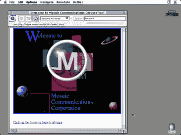
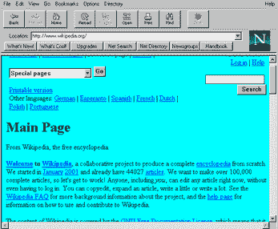

# JavaScript 的怪异历史

> 原文：<https://dev.to/codediodeio/the-weird-history-of-javascript-2bnb>

[https://www.youtube.com/embed/Sh6lK57Cuk4](https://www.youtube.com/embed/Sh6lK57Cuk4)

JavaScript 的历史几乎和语言本身一样怪异。在过去的 25 年里，它已经从网景的仓促原型发展成为世界上最广泛使用的编程语言。我猜事情是这样发生的...

## 让 JavaScript 出现

*1990 年- 1999 年*。在此期间，我们看到了 JavaScript 的诞生，以及从 ECMA 到版本 3 (ES3)的标准化。

1990 年圣诞节。世界上第一个现代网络浏览器 WorldWideWeb(后来改名为 Nexus)是由瑞士的蒂姆·伯纳斯·李爵士开发的。带它来一次[旋转](https://worldwideweb.cern.ch/browser/)。

**一九九一年十二月**。高性能计算法案通过(戈尔法案)。阿尔·戈尔后来被可笑地错误引用为“发明了互联网”。

【1993 年 1 月马赛克浏览器是由伊利诺伊大学的[马克·安德森
T4 和埃里克·比纳在戈尔法案的资助下开发的。它作为第一款主流网络浏览器脱颖而出🚀。](https://en.wikipedia.org/wiki/Marc_Andreessen)

1995 年初。网景公司(马克·安德森的联合创始人)增长迅速，占据了近 80%的浏览器市场份额，但是网页设计者需要一种“粘合”语言来使他们的网站更加动态。起初，他们转向 Java，但意识到需要更动态、更易接近的东西。

**一九九五年五月**。 [Brendan Eich](https://en.wikipedia.org/wiki/Brendan_Eich) 被招募来将“方案放进浏览器”,但是在微软抢先一步的威胁下，他不得不迅速生产出一个原型。

**十天后...他创造了一种叫做摩卡的语言。它有 Java 的语法，Scheme 这样的一级函数，Lisp 这样的动态类型，Self 这样的原型。**

**一九九五年九月**。出于营销原因，它被重命名为 LiveScript。

**一九九五年十二月**。出于营销原因，它被重命名为 JavaScript。

**一九九六年八月**。微软对 JavaScript 进行逆向工程，并将其与 Internet Explorer 3 一起发布，但出于~~营销~~法律原因，称其为 JScript。

1996 年 11 月。微软正在用一种内部文化**“拥抱、扩展和消灭”**，哎呀，粉碎他们的竞争😬。网景提交文档，与 [ECMA International](https://www.ecma-international.org/publications/standards/Ecma-262-arch.htm) 一起标准化 JavaScript。

1997 年 6 月。JavaScript 的第一个标准化版本(ES1)被 TC-39 委员会批准为 ECMA-262 或 ECMAScript。它拥有我们今天在 JS 中使用的许多特性，比如一级函数、对象和原型继承。

1998 年 6 月。ES2 是标准化的，基本没有变化。

1999 年 12 月。ES3 是标准化的，增加了对严格相等、异常处理等的支持。它将在未来 10 年保持不变。

## 黑暗时代

2000 年至 2008 年。在科技泡沫破裂后，JS 经历了无数挫折和 ES4 的失败。

2000 年 3 月。科技泡沫破裂。

过了一段时间...为 ES4 提出了广泛的特性，如类、接口、可选类型和其他旨在满足大型企业需求的机制。[来自雅虎的道格拉斯·克洛克福特](https://en.wikipedia.org/wiki/Douglas_Crockford)提出了该提议过于复杂和臃肿的担忧，微软表示同意。

TC-39 委员会决定并行开发 ECMAScript 3.1(简单版)和 ECMAScript 4(企业版)。最终，这种方法失败了，ES4 永远不会出现。

与此同时...微软的 Internet Explorer 占据了大约 90%的浏览器市场份额。他们为 ECMAScript 做出了贡献，但大部分都遵循自己的规则，在浏览器中发布 JS 的新特性。最值得注意的是， [AJAX](https://en.wikipedia.org/wiki/Ajax_(programming)) 为未来的单页面应用程序搭建了舞台。

2006 年 8 月。约翰·雷西格创建了 [JQuery](https://jquery.com/) 。该库解决了当时存在的与跨浏览器兼容性相关的极其令人沮丧的问题。它还提供了一个记录良好的简洁 API，为“开发人员体验”设立了一个新标准。今天，就实际页面负载而言，它仍然是使用最广泛的 JS 库。

2008 年 9 月。谷歌发布了 Chrome 浏览器，并开源了其高性能运行时，名为 [V8 引擎](https://v8.dev/)。它为新的可能性打开了大门...

## 文艺复兴

*2009 年至 2015 年。JavaScript 得到全面发展，并在其开发生态系统中看到了多产的增长*

2009 年 5 月。[瑞安·达尔](https://en.wikipedia.org/wiki/Ryan_Dahl)与谷歌的 V8 项目一起开发 NodeJS。它的独特之处在于能够在服务器上运行带有事件循环的非阻塞代码。它催生了无处不在的**JavaScript**范式。

2009 年 12 月。在 ES3 整整十年后，我们终于看到了 JavaScript 的新版本- **ES5** 。它基于 ES3.1 添加了一组保守的新功能，如严格模式、访问器和 JSON。

2010 年 10 月。 [AngularJS](https://en.wikipedia.org/wiki/AngularJS) 和 [Backbone](https://en.wikipedia.org/wiki/Backbone.js) 框架都看到了它们的初始版本。它们变得非常流行有不同的原因——Angular 是声明性的和固执己见的，而 backbone 是命令性的和最小的。这标志着现代单页面应用(SPA)和“框架搅动”的开始。

【2013 年 5 月。脸书释放[反应堆](https://en.wikipedia.org/wiki/React_(JavaScript_library))。它看到了未来几年的快速增长，巩固了今天许多应用程序中使用的声明式 UI 模式。

大约在这个时期出现了许多其他前端、后端和全栈框架，比如 Angular、Ember、Meteor、Sails、Vue、Svelte、Mithril、Knockout、Polymer 等等。

## 现代

*2015 年至今。ES6 中的大量新特性改变了现代 JS 开发人员编写代码的方式。*

**2015** 。ES6 为该语言带来了大量新特性(其中许多源自失败的 ES4)，比如 let/const、箭头函数、类、承诺等等。它产生了像 Babel 和 Typescript 这样的 transpilers，因此开发者可以编写现代代码，但仍然支持运行 ES5/3 的传统浏览器。

**2016 款** ES7。我们做了一些小的改动，比如 Array.includes()。最重要的是，ECMA 现在每年都在做一些小的改变。

**2017** ES8。我们得到异步等待！

**2018** ES9。我们得到 Rest/Spread 语法！

**2019** 。ES10。更多小而有用的更新已经完成。今年夏天应该会上市。

JavaScript 将何去何从？WASM 会取代 JS 吗？微前端会让 React 过时吗？新的科技泡沫会破裂吗？

只有时间会证明一切，敬请期待 2045 年的第二部！