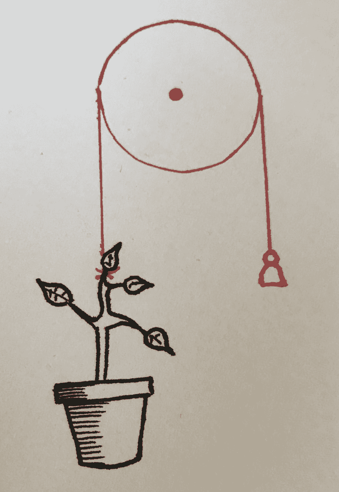

# 关于植物生长自动测量的思考

> 原文：<https://dev.to/rossdrew/thoughts-on-automated-plant-growth-measurement-59ab>

### 简介

我有一个温室。我在那个温室里种植辣椒。我想利用技术来提高我的产量。使用一个树莓派，一些便宜的电子产品和一些 Python，我已经开始编写遥测软件，这将让我做出更好的选择。我一直在想我能走多远。

一个这样的领域是植物生长监测，它将在未来提供更接近整个封闭系统的输入。

### 植物生长

所以我们需要一些可以测量的东西，在我看来，植物有两个可以测量的阶段

##### 第一阶段:从种子开始

测量发芽就是检测从无到有的东西，测量的是从种植到发芽的时间。时间应该很短(1-4 周)，任何更多的是一个失败。另一个有用的度量可能是从给定数量的种植中发芽的种子数量。

##### 第二阶段:从萌芽开始

这是有趣的地方，因为这种反馈可以反馈到循环中，并进行调整以改善。有用的指标可能是:

*   植物高度
*   生理年龄:叶片数
*   叶子的大小
*   花/水果的数量
*   颜色的变化
*   植物重量(有一些浇水补偿)

##### 测量阶段

所以我们*可以*从技术上衡量第一阶段，但除非我们进行几轮发芽或使用数据反馈到下一年，所以我将专注于第二阶段，因为它符合基于反馈的行动纲要，以提高产量。

#### 技法

所以我们知道我们想要测量什么，我们如何测量它？

##### 高度

测量植物高度的最简单的方法已经使用了很长时间，叫做植物生长计。这基本上是一根绳子系在植物的顶部，它穿过一个滑轮到一个重物上，随着植物的生长，重物下降。这是直线运动，很容易测量。

另一个选项是图像处理，我们将在...

##### 叶片数、叶片大小、花/果数、颜色变化

没有手工处理，这些更难阅读。想法可以是一个相机系统，不图像 processing^[1][2]，激光雷达，创建三维模型，红外线或一些组合，如 XBox Kinect systems^[3][4][5].

##### 重量

一个有趣的选项是植物重量。随着植物体积的增大，它们的重量会明显增加。这里有几个问题，植物需要浇水，不同的浇水状态有不同的权重，这种偏移需要考虑。另一个是权重会考虑到植物上的东西；湿气、害虫、污垢，叶子、茎、花或果实之间没有区别。后者是一个较小的问题。

##### 其他

像植物和它的叶子的结构和生长方向这样的东西可以方便地检测疾病、缺水和过热。然后，能够检测并可能识别害虫可能导致建议的或自动化的治疗。

#### 前进的道路

有一些立竿见影的方法，如 auxanometer 和称重平台，但如果我们不希望每个工厂周围都有多台机器，最有效的解决方案是图像/激光雷达/红外处理。它应该以一种非常紧凑的方式完成这一切。这当然不是一个立竿见影的解决方案，需要非常先进的软件。

因此，如果我继续下去，我的计划将是使用一台相机(也许是 XBox Kinect)并编写软件来处理高度、叶子数量和大小、水果和花朵的产量以及颜色。

#### 步骤(速胜优先)

*   将摄像机安装到我的电网上，并根据需要进行调整
*   添加软件来区分植物，甚至当它们被移动时，也许花盆上的识别标记，如数字或甚至条形码，允许我们在植物上对植物类型进行编码。
*   扩展软件以检测植物颜色的变化
*   展开软件检测身高
*   扩展软件和硬件以检测叶子/花的大小/数量

最后一种可能需要改变硬件，因为静态相机和静态植物可能意味着叶子/花可能被植物本身从相机中隐藏。这种硬件扩展也可能有助于植物远离太阳旋转，以帮助它们建立良好的茎干。

#### 如何处理所有这些数据？

从一点点数据中，我们可以很快开始让工厂的生活变得更好，自主地对常见问题提出手动补救措施:

*   浇水不足或过热的植物往往会失去叶子的结构完整性。我们可以给它们浇水，或者打开通风口给温室降温。

*   害虫或疾病会使植物变色，一些害虫可以通过喷水来清除，另一些可以通过天然杀虫剂(如大黄/辣椒茶)来清除，还有一些可以建议改变园艺实践，如增加更多的植物，鼓励瓢虫吃蚜虫等害虫。

*   花朵缺乏生长可能表明我们浇水过多或喂食不足。

*   没有成熟的花可能意味着不适当的喂养或不理想的湿度水平。

*   生长方向可能表明植物需要更有规律地转动，这样它们就必须朝向太阳，加强它们的茎干。

*   挣扎中的植物可能会建议温室改变，如更好的基础、绝缘或引入热物质来限制温度峰值。

我们停止思考常见问题的时间越长，我们就越能开始思考如何提高产量和质量。

##### 参考文献

林、戴德来、郑宗正、刘、叶定宇、刘玉辉、张志忠、张伟昌。(2019).基于视觉的叶菜植物生长自动测量系统。

^2:深度学习用于城市农场植物生长的基于图像的预测。2017 年 9 月 25 日

胡、杨、王、乐、向、、吴、钱、江、。(2018).基于 Kinect 的叶菜生长自动无损测量。传感器。18.806.10.3390/s18030806。

夏春雷、王龙潭、郑步坤和李江明等人(2015 年)。使用用于农业自动化的 RGB-D 摄像机对单个植物叶片进行原位 3D 分割。开放式传感器 ISSN 1424-8220

^5:·豪尔赫·马丁内兹-关特、安杰拉·里贝罗等人(2019 年)。作物植物的低成本三维建模。传感器 2019、19、2883；doi:10.3390/s19132883