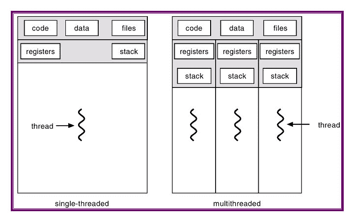
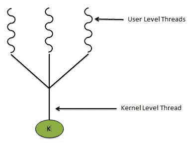
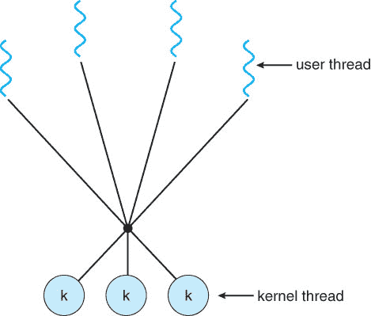
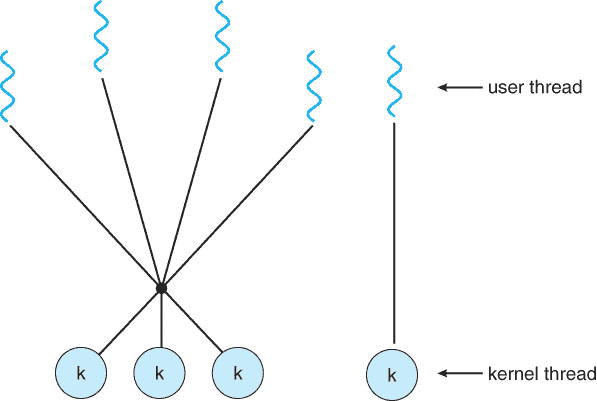
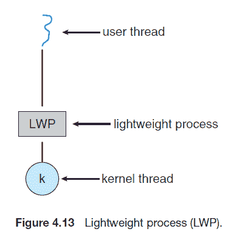

# 操作系统中的多线程

> 原文：<https://dev.to/hrishi2710/threading-in-operating-system-3gjb>

我们将介绍多线程和单线程的基础知识以及两者的优缺点。

### **什么是线程？**

线程是 CPU 利用率的基本单位，即应用程序如何使用 CPU。我们通过一个例子来了解一下。假设我们打开一个网页，我们经常看到文本内容先于图像和视频内容被加载。这里加载网页是一个[进程](https://dev.to/hrishi2710/processes-in-operating-system-551h)，该进程包含两个线程，一个用于加载文本内容，另一个用于加载图片内容。

让我们再举一个由基本编码问题组成的例子。假设，我们想要得到一个长度为 n 的数组中数字的和，我们可以通过关联两个线程来求和，从而使这个简单的数字相加过程多线程化。一个用于数组的前半部分，另一个用于数组的另一半。然后把两半的和相加。这里，将两部分相加的线程是**子线程**，具有最终总和的线程被称为**父线程**。

一个进程可以有任意多的线程(受限于硬件要求和效率开销)。因此，很明显，属于特定进程的代码、数据、文件将为多线程进程中的所有线程所共有。

但是每个线程都有其唯一的线程 Id、程序计数器、寄存器组和堆栈内存，如下图所示:

#### **我们为什么需要多线程？**

1.  **响应能力** -在前面提到的例子中，当加载一个网页时，有一些大的图像被加载并占用了它的时间。由于整个过程是多线程的，图像的加载将不会阻止文本内容的加载，从而使其更好地响应用户。

2.  **资源共享** -默认情况下，线程共享进程的内存和资源，从而允许应用程序在同一地址空间内拥有多个不同的线程。

3.  **经济性** -因为线程与进程共享相同的内存和资源。相对于进程创建来说，创建线程并在上下文中切换线程是很经济的。

#### **多线程有哪些挑战？**

1.  **识别任务**到多线程，使应用程序高效。
2.  维护**数据完整性**,因为可能会出现不同线程处理相同数据的情况。
3.  **平衡成本** -在不同的线程之间平均分担应用程序的工作负载非常重要，否则会有线程比其他线程做得更少，从而产生经济开销。
4.  测试和调试单线程应用程序比多线程应用程序更容易。

### **排比**

我们会经常遇到两个术语，并行性和并发性。一般来说，这两者是相辅相成的。但是它们到底是什么意思呢？

##### **并行 vs 并发**

如果一个系统可以同时执行一个以上的任务，那么它就是并行的。

**并发**是指一个以上的任务取得进展。即使系统是单核的，CPU 调度程序也会在进程之间快速切换，从而产生并行系统的假象，从而允许不同任务的进展。

因此，需要注意的是**并发可以在没有并行的情况下发生。**

**并行类型**

1.  **数据并行** -这里，相同的数据被分成组，这些数据子集在不同的内核上运行。

2.  **任务并行** -在不同的内核上对相同的数据执行独特的操作。

### **多线程模式**

**多对一模式**

许多用户级线程(由用户使用线程库(稍后解释)在应用中创建的线程)被映射到单个内核级线程。在这方面，存在以下问题

*   一个用户级线程上的 Block 语句阻塞所有线程。
*   没有真正的并发。
*   多核架构使用效率不高。

**一对一模式**

单用户级线程映射到单内核级线程。与多对一模式相比，它具有以下优势

*   一个线程上的 Block 语句不会阻塞任何其他线程。
*   真正的并发。
*   多核系统的高效利用。

但是它有一个创建尽可能多的内核级线程的开销问题。

**多对多模式**

许多用户级线程被映射到相同或更少数量的内核级线程上。它解决了创建内核级线程的开销问题。

该模型有一个变体，即 2 级模型，包括多对多以及一对一模型。

在这种情况下，某个进程的某个线程被映射到某个内核级线程，直到它完成它的执行。

### **线程库**

线程库是程序员在应用程序中创建和管理线程的 API。

实现线程库有两种方法:-

1.  第一种方法是在没有内核支持的情况下，完全在用户空间中提供一个**库。该库的所有代码和数据结构都存在于用户空间中。这意味着调用库中的函数会导致用户空间中的局部函数调用，而不是系统调用。**

2.  第二种方法是实现一个由操作系统直接支持的内核级库。在这种情况下，库的代码和数据结构存在于内核空间中。调用 API 中的库函数通常会导致对内核的系统调用。

有 **3 个主线程库** :-

1.  POSIX Pthreads——可能是用户级或者内核级的库。主要由基于 Linux/Unix 的操作系统使用。
2.  **Windows** -内核级。
3.  **Java** -直接在 Java 程序中创建和管理的线程。因为，JVM 本身运行在操作系统上。因此，它是使用操作系统上的线程库来实现的。

### **线程创建**

创建线程有两种策略:-

1.  **异步** -父线程创建子线程，然后独立执行。这意味着，父线程和子线程之间很少共享数据。
2.  同步 -父线程等待子线程完成它的执行。更多的数据共享在这里完成。

#### **Pthreads**

*   线程创建和同步的 POSIX 标准。
*   这些仅仅是线程行为的规范，而不是它的实现。
*   大多由 UNIX 类型的系统实现。
*   Windows 本身不支持它。

#### **Windows 线程**

*   在很多方面类似于 Pthread 的创建和管理。
*   方法名称的不同。例如:- `pthread.join()`功能在这里是用`WaitForSingleObject()`实现的。

#### **Java 线程**

2 实现 Java 线程的技术:-

1.  从线程类派生的新类，然后重写 run 方法。
2.  实现 runnable 接口。

JVM 隐藏了底层操作系统的实现细节，提供了一致的、抽象的环境，允许 Java 程序在任何平台上运行。

所有上述用户级线程库的创建和管理都属于程序员创建和管理线程的**显式线程**范畴。
创建和管理线程的另一种方式是将创建和管理从应用程序开发人员转移到编译器和运行时库。这种策略被称为**隐式线程**。

2 隐式线程的常见策略有:-

1.  **线程池**
2.  **打开 MP**

#### **线程池**

显式线程时很少有困难:-

*   为了高效使用多核架构，需要创建多少线程？
*   创建线程的时间。

线程池背后的一般思想是在进程启动时创建许多线程，并将它们放入一个池中，它们在那里等待工作。当服务器收到请求时，它会从这个池中唤醒一个线程(如果有可用的线程的话)，并将服务请求传递给它。一旦线程完成了它的服务，它就返回到池中，等待更多的工作。如果池中没有可用的线程，服务器会一直等待，直到有一个线程空闲。

线程池的优势:-

*   用现有线程处理请求比等待创建线程要快。
*   线程数量的限制。因此，有益于不支持大量线程的系统。

#### **开 MP**

*   这些是为并行编程提供支持的一组编译器指令和 API。
*   它识别进程中的并行区域并执行它们。
*   我们还可以控制创建的线程数量和线程间共享的数据。

最后，是时候深入探讨线程化的问题了。

### **穿线问题**

#### **`fork()``exec()`系统调用**。

在执行`fork()`语句后，进程的所有线程是将被复制还是将变成
单线程。
`exec()`语句仍然以几乎相同的方式工作，即被指定为
参数的程序将替换整个过程。

#### **信号处理**

**信号**用于标记执行过程中的任何事件。
有两种类型的处理程序

*   **默认信号处理程序** -内核在处理信号的同时运行它。
*   **用户定义的信号处理器** -用户定义的处理器将覆盖默认的信号处理器。

在单线程程序中，所有的信号都被传递给进程。在多线程程序中，有 4 个选项:-

*   将信号传递给该信号所应用的线程。
*   将信号传递给进程中的每个线程。
*   将信号传递给进程中的某些线程。
*   分配一个特定的线程来接收进程的所有信号。

在同步信号的情况下，信号需要被传递到信号所应用的线程。在异步信号的情况下，如果信号影响所有的线程，那么它将被传送到每个线程。如果它影响某个线程，那么信号将被传递给该线程。
Windows 没有明确提供信号处理，而是通过**异步过程调用(APC)** 来模拟它。APC 被交付给特定的线程而不是进程。

#### **线程取消**

将被取消的线程被称为目标线程。
线程取消有两种策略:-

1.  **异步取消** -一个线程立即终止目标线程，导致突然终止。
2.  **延迟取消** -目标线程定期检查是否应该终止，从而有序地终止。

`pthread_cancel(tid)`仅请求取消一个线程。原始取消取决于如何设置目标线程来处理请求，即延迟或异步。

#### **线程本地存储**

属于一个进程的线程共享该进程的数据。然而，在某些情况下，每个线程可能需要自己的某些数据的副本。我们将这样的数据称为**线程本地存储(TLS)** 。大多数线程库(包括 Windows 和 Pthreads)都为线程本地存储提供了某种形式的支持。Java 也提供支持。

#### **调度器激活**

对于要执行的用户级线程，它必须与内核级线程通信。这种通信的方案被称为调度程序激活。

*   内核为应用程序提供了一组称为轻量级进程(LWP)的虚拟处理器
*   应用程序可以在 LWP 上安排用户线程。
*   内核必须通知应用程序事件，称为 **upcall** 。
*   upcall 由带有 upcall 处理程序的线程库处理，并且 upcall 处理程序必须在虚拟处理器上运行。
*   在 upcall(假设阻塞)的情况下，内核向应用程序发出一个 upcall，通知它一个线程将要阻塞，并标识特定的线程。
*   然后内核给应用程序分配一个新的虚拟处理器。
*   应用程序在这个新的虚拟处理器上运行一个 upcall 处理程序，它保存阻塞线程的状态，并释放阻塞线程正在其上运行的虚拟处理器。
*   然后，向上调用处理器调度另一个有资格在新的虚拟处理器上运行的线程。
*   当阻塞线程等待的事件发生时，内核对线程库进行另一次向上调用，通知它先前阻塞的线程现在可以运行了。
*   这个事件的 upcall 处理程序也需要一个虚拟处理器，内核可能会分配一个新的虚拟处理器。
*   在将未阻塞的线程标记为有资格运行之后，应用程序调度有资格的线程在可用的虚拟处理器上运行。

穿线基础到此为止。希望你读得不错。