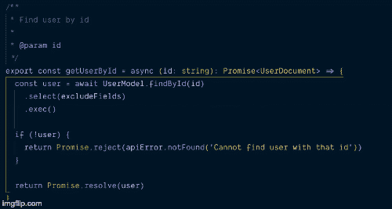

# 增强开发工作流程的工具

> 原文：<https://dev.to/vinhle95/tooling-for-boosting-your-development-workflow-1dgg>

## 第 1 部分:代码格式化

如果编程只是一个人对计算机的过程，事情可能会非常简单。你写任何你认为有用的东西，电脑会帮你验证。

遗憾的是，大多数时候情况并非如此。当你在团队中工作时，你的同事需要审查你的代码，反之亦然。这是事情升温的时候*一点点*🙃

[](https://res.cloudinary.com/practicaldev/image/fetch/s--wvxBcbm0--/c_limit%2Cf_auto%2Cfl_progressive%2Cq_auto%2Cw_880/https://i.imgflip.com/38s5zo.jpg)

## 何苦呢？

### 格式不良的代码会减慢审核过程

当同事在拉式请求(PR)中标记您时，他们希望快速获得批准，将下一个功能从待办事项中移除。另一方面，你也想快速浏览一遍。然而，如果代码的格式很差，或者更糟，根本没有格式化，那么你们都有麻烦了。

让我们面对现实:我们每个人都有不同的*编码风格*。因此，这种差异肯定会让你花更多的时间去理解背后的逻辑。

举一个在 JavaScript 中处理**承诺**的例子:

```
getShots(myShotsEndpoint).then((shots) => {return shots.forEach(shot => {
    saveMyShot(shot)
    removeMyLastShot()
    return
})}).catch(error => {
    if(getErrorStatus(error) === 401) { handleUnauthenticatedUser() } else {
        showErrorMessage('Cannot get my shot now!!!')
    }
}) 
```

Urghhhh🤦🏻‍♂️😐🔥

我知道你在想什么😤但是请再多容忍我一点。如果你遇到空间/标签问题，不要撒谎，我知道你是🤗像这样的功能可能会毁了你的一天:

```
getShots(myShotsEndpoint).then((shots) => {return shots.forEach(shot => {
        saveMyShot(shot)
    removeMyLastShot()
            return
})}).catch(error => {
        if(getErrorStatus(error) === 401) { handleUnauthenticatedUser() } else {
                showErrorMessage('Cannot get my shot now!!!')
    }
}) 
```

> 我明白，阅读这些代码很累😥

这只是一个承诺处理器。想象有几十个组件，包括功能逻辑、UI 元素、样式..前方 etc。你的工作是*通过所有的*。令人恼火的是，这个拦截器大大降低了你的速度。

相信我，你的同事听到这样的评论时也不会高兴:

> *“请在第 531 行增加 1 个制表符”*

他们的工作是照顾商业逻辑，而不是你这个评审员觉得不对的小空间/标签。从这里开始，你别无选择，而不是放弃，接受一个痛苦的事实，告诉自己

> 不会有问题的。电脑会处理的。

直到有一天...

### 噩梦维持

一个新人来维护这个项目，他的反应可能会遵循这个链条:🧐🤨😡🤬

这些丑陋的代码块肯定会增加维护的难度。当更多的开发人员采用不同的编码风格时，维护变得更具挑战性。

[](https://res.cloudinary.com/practicaldev/image/fetch/s--8xdwaMRh--/c_limit%2Cf_auto%2Cfl_progressive%2Cq_auto%2Cw_880/https://i.imgflip.com/38s842.jpg)

### 幸好你没有。

有一些工具可以成为你团队的救星。让我介绍其中一个已经救了我的人🤩

## 漂亮些

更漂亮的是一个很棒的代码格式化工具。它支持多种语言，文档丰富，易于上手。

### 现在该编码了！👨🏻‍💻💪

我将向您展示如何在 NodeJS 模块中设置它，因为这是我最喜欢的🔥尽管如此，它应该与你的项目有许多相似之处。

### 第一步:安装[beautiful](https://www.npmjs.com/package/prettier)和 [TSLint](https://www.npmjs.com/package/tslint) (或者 ESLint，如果你不是 TypeScript 的粉丝的话)

```
npm install --save-dev prettier tslint
--or--
yarn add -D prettier tslint 
```

你还需要安装一些助手/插件，让它们看起来更漂亮，TS Lint 也能很好地工作:

```
npm install --save-dev tslint-config-prettier tslint-plugin-prettier
--or--
yarn add -D tslint-config-prettier tslint-plugin-prettier 
```

简而言之， [`tslint-config-prettier`](https://github.com/prettier/tslint-config-prettier) 禁用 TSLint 和 Prettier 之间的[冲突规则](https://unpkg.com/tslint-config-prettier@1.18.0/lib/index.json)。

### 第二步:为 TSLint 配置林挺规则

在项目的根目录下创建`tslint.json`文件:

```
touch tslint.json
code . tslint.json (*) 
```

(*)我使用的命令`code .`是 [VSCode](https://code.visualstudio.com/) 的一个特性。VSCode 粉丝举起手来！🚀

然后，您可以在这个配置文件中添加规则。为了简单起见，我将介绍一些基本规则。点击[此处](https://github.com/palantir/tslint)了解您的具体需求。

**功能区。json**

```
{
    "defaultSeverity": "error",
    "extends": ["tslint:recommended", "tslint-config-prettier"],
    "jsRules": {},
    "rulesDirectory": ["tslint-plugin-prettier"],
    "rules": {
        "prettier": true,
    },
    "linterOptions": {
        "exclude": ["node_modules/**/*.ts"]
    }
} 
```

### 第三步:添加更漂亮的(格式)规则

你需要告诉更漂亮的你想要你的代码如何被格式化。为此，让我们创建一个[配置文件](https://prettier.io/docs/en/configuration.html)，就像我们为 TSLint
所做的那样

```
touch .prettierrc
code . .prettierrc 
```

让我们在这个文件中添加一些规则✍️

```
{
    "arrowParens": "avoid",
    "bracketSpacing": false,
    "insertPragma": false,
    "printWidth": 80,
    "proseWrap": "preserve",
    "requirePragma": false,
    "semi": false,
    "singleQuote": true,
    "trailingComma": "all",
    "tabWidth": 2,
    "useTabs": true
} 
```

请记住，您在这里指定的将是如何更漂亮地格式化您的代码。例如，最后 2 行告诉更漂亮的使用标签宽度= 2(抱歉空间迷在那里😔).例如，`"singleQuote": true`将用单引号替换所有双引号。还有许多其他的[选项](https://prettier.io/docs/en/options.html)，你可能想参考一下。

### 第四步:格式化你的代码

有两种方法可以做到这一点，要么就在保存一个文件之前，要么在你喜欢的时候将所有文件放在一起。

**保存时的格式**

这是一个特定于编辑器的功能，这意味着您必须在编辑器的设置中启用该功能。例如，在 [VSCode](https://code.visualstudio.com/docs/getstarted/settings) 中，你可以把这一行放到`settings.json` :
中

```
"editor.formatOnSave": true 
```

**格式化整个项目**

我个人更喜欢这种方式，因为它能让我更好地控制我想要格式化的文件类型。让我们在`package.json`
写一个脚本

```
...  "name":  "awesome-formatter",  "author":  "ShotCode <shotcode@gmail.com>",  "scripts":  {  "format":  "prettier \"**/*.+(js|json|ts|md|mdx|graphql)\" --write"  }  ... 
```

那个`format`脚本是做什么的？

它告诉 Prettier 在指定的文件扩展名上应用我们在`prettierrc`中配置的格式规则。在这种情况下，它们就是`.js, .json, .ts...`你能想到的。接下来我们告诉漂亮点的**通过`--write`命令覆盖**那些文件。

让我们运行这个脚本，看看它是如何工作的:

```
npm run format 
```

[](https://res.cloudinary.com/practicaldev/image/fetch/s--DCJVGXlt--/c_limit%2Cf_auto%2Cfl_progressive%2Cq_66%2Cw_880/https://i.imgflip.com/38uiaa.gif)

嘣！太酷了，不是吗？🤩🏎

为了更上一层楼，您可以将这个脚本配置为使用 Git 挂钩运行。这样你的代码在提交前就可以很好的格式化。如果你对此感到好奇，请继续关注下一部分《🥳》

## 关键要点

*   格式不好的代码很糟糕。句号。
*   为什么？它需要更长的时间来审查，更难维护，尤其是在有几十个开发人员的大型项目中。
*   如何正确格式化你的代码？使用像**beautiful**这样的牛逼工具。它很容易设置，很容易看到结果，并且与工作流程中的其他流程配合良好。

## 但是等等，你不是唯一的决策者😔

如果你的同龄人正在犹豫是否使用 pretty，我相信它的强大功能和好处是至少值得一试的重要理由。相信我，你们都会喜欢的。

> 你再也不用担心你的同事的编码风格了。让我们继续写些精彩的东西吧。让电脑处理剩下的事情。

* * *

## 感谢阅读本博客！

我很想在下面的评论区听到你的想法🤗

## 敬请期待即将到来的🤩

* * *

### ✍️所写

**Vinh Le** [@vinhle95](https://twitter.com/vinhle95) 👨🏻‍💻🤓🏋️‍🏸🎾♂️🚀

一个骗子，终身学习者，技术爱好者和软件开发者

打招呼👋在

✅ [Github](https://github.com/vinhlee95)

✅ [领英](https://www.linkedin.com/in/vinhlee95/)

✅ [Medium](https://medium.com/@vinhle95)

✅ [个人网站](https://vinhlee.com/)