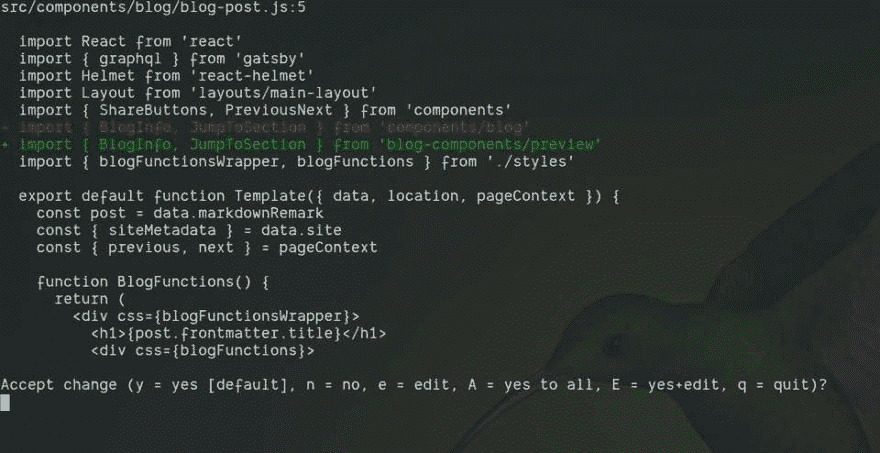

# 大代码变更的工具

> 原文：<https://dev.to/thorning_m/tools-for-big-code-changes-1f78>

在我的团队中，我们目前有五个应用程序是用 React 编写的。这些应用程序都在一个存储库中共享组件。随着应用程序和组件数量的增加，我们决定将我们的共享组件分离到各自的存储库中，这将是一个更好的主意。这是一项艰巨的任务，不仅我们的应用程序需要更新以从新位置导入组件，而且许多组件都依赖于其他组件，这意味着每次拆分都会导致更多地方需要进行更改。

有两个工具帮助我完成了这个任务，现在我将向您介绍这两个工具(如果您还没有使用过它们)；Tmux 和 Codemod。

## Codemod

Codemod 是脸书写的命令行工具。你给它一个正则表达式模式来搜索和你想替换它的代码，它会递归地搜索你的目录，寻找每一行包含一些匹配你的模式的文本。当它匹配一行时，它会显示一个差异，您可以接受、拒绝或手动更改:

[](///static/738972751cba152019576c8242f68428/aa4c3/codemod-output.jpg)

你可以给它很多选择，你可以用正则表达式做各种聪明的事情，比如捕获模式的一部分用于替换；我只需要为这个任务做一些非常简单的事情，这里有一个使用这个博客的代码库的例子:

```
codemod -d src --extensions js,jsx \
"components/blog" \
"blog-components/preview" 
```

第一行告诉 Codemod 使用`-d`开关递归搜索`src`中的所有目录。然后`extensions`选项告诉 Codemod 只搜索`js`或`jsx`文件。第二行是我们正在搜索并希望替换的模式。你可以在这里使用正则表达式；我不太擅长 Regex，所以我使用了一个试错系统，使用像 [this](https://regex101.co!/) 这样的网站！需要记住的一点是，Codemod 是用 Python 编写的，所以你要确保你使用的是 Python 风格的 Regex。最后一行是我们想要用来替换匹配字符串的文本。

## Tmux

Tmux 是一个“终端多路复用器”,这是一种奇特的说法，它可以让你打开许多终端。我可以写一篇关于 Tmux 的很长的博文(我可能还会写)，所以我将快速列出您可能想要使用它的主要原因:

*   Tmux 创建会话，这些会话可以分离，然后在以后重新连接。如果您在远程服务器上工作或者必须频繁切换上下文，这非常有用。你可以建立一个运行不同东西的环境，当你需要的时候从它分离，然后重新连接你离开时的所有东西。您还可以轻松地从一个会话切换到另一个会话。
*   每个会话可以有多个窗口，每个窗口可以分成多个窗格。
*   当与 ZSH 和维姆一起使用时，它会给你超能力。

我在这篇文章中提到 Tmux 的原因是因为它允许你同步窗格。这意味着我可以在一个窗口中打开尽可能多的窗格，同时在所有这些窗格中运行命令。

因此，我可以在所有五个应用程序中运行`npm install`，或者提交并标记十二个组件回购，或者，因为我也使用 Neovim，我甚至可以在编辑一个文件所需的时间内编辑多个`package.json`文件。

[](https://res.cloudinary.com/practicaldev/image/fetch/s---8Z2dTPT--/c_limit%2Cf_auto%2Cfl_progressive%2Cq_66%2Cw_880/https://hellocode.dev/sync-panes-f59f828887519bf3ccbfcd71d9e9e10a.gif)

* * *

我不认为有很多客户或公司喜欢为重构任务留出宝贵的时间，而这并不会带来立竿见影的效果。多亏了这些工具，移动我们的回购文件的任务比其他方式花费的时间要少得多，这意味着我们现在可以继续进行编写代码的重要工作了！如果你没有听说过这两个工具，那么我希望这篇文章作为介绍是有用的。我使用 Tmux 已经有一段时间了，并且一直在精心制作我的配置文件，如果你感兴趣的话，你可以在我的 Github 页面上找到它。

再见👋