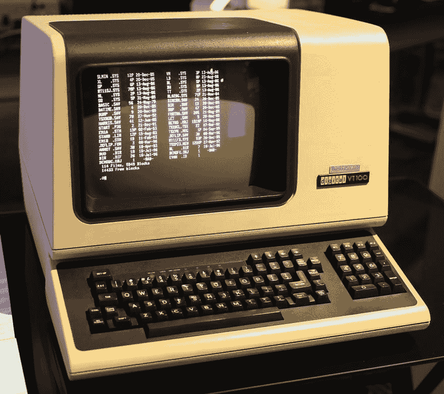
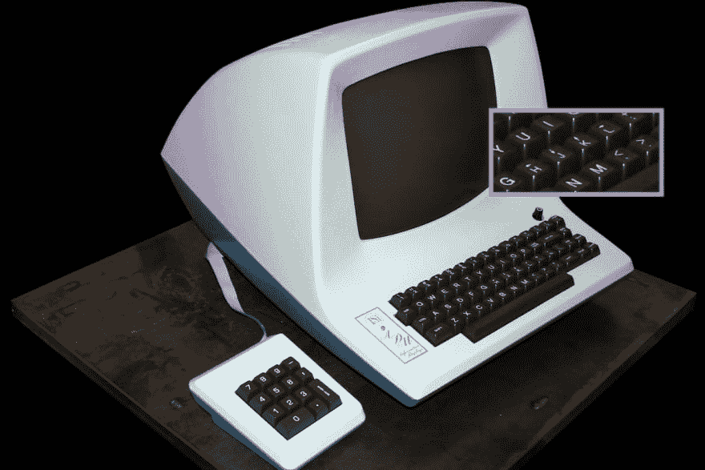
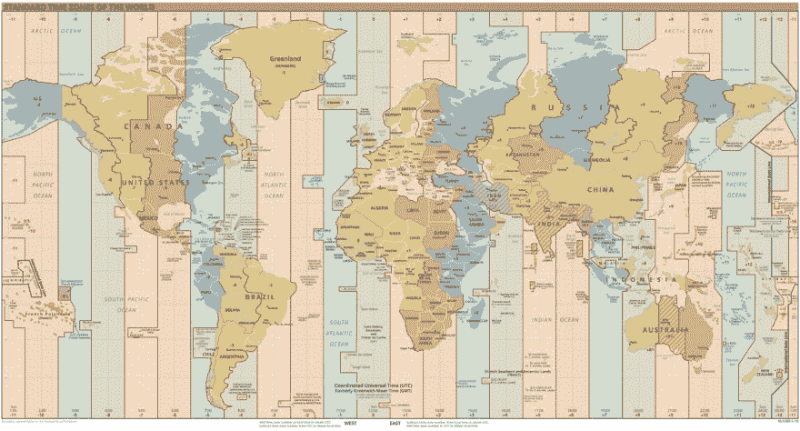
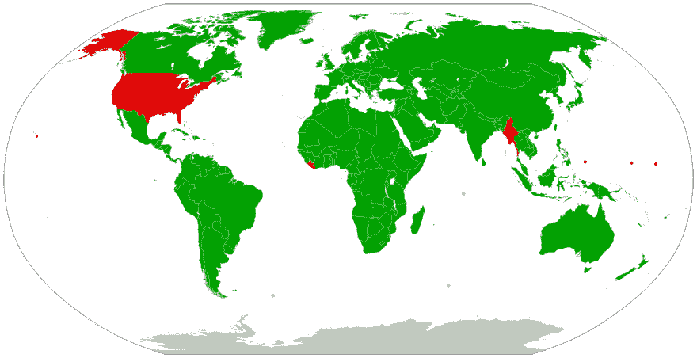

# 传统、标准和程序员

> 原文：<https://dev.to/stereobooster/traditions-standards-and-programmers-5477>

## 传统

> 思想、行动或行为的继承、建立或习惯模式(如宗教实践或社会习俗)
> 
> ——[韦氏词典](https://www.merriam-webster.com/dictionary/tradition)

有些事情我们做的时候不会质疑。为什么我们要这样做？因为这是我们被教导的做事方式，或者其他人也是这样做的。那些未形成的规则(传统)，也可以称为[已知的未知](https://www.destroyallsoftware.com/talks/ideology)或[意识形态](https://www.youtube.com/watch?v=ql80Klk4pSU)。

你见过或者写过这种代码:

```
for (var i = 0; i < ls.length; i++) {
  /* ... */
} 
```

你知道它为什么用`i`吗？因为这是你在 Fortran 中声明整数变量的方式，它最早出现在 1957 年。

> 以字母 i j k l m n 开头的变量名是整型变量。
> 
> - [四种基本的 Fortran 数据类型](https://www.cs.mcgill.ca/~ratzer/lectures/lecture4.htm)

这种语言很久以前就不广泛使用了，但我们仍然使用这种惯例。传统就是这样运作的——透明地，在幕后，你知道而不知道。

## 标准

> 由权威、习俗或普遍同意作为典范或榜样而建立的事物
> 
> ——[韦氏词典](https://www.merriam-webster.com/dictionary/standard)

与传统相反的标准被形式化并写下来(已知的已知)。标准通常由开发人员世界中的某个委员会制定。比如《IEEE 754:现代计算机中的浮点》、《ECMAScript 6》、《国际标准 ISO/IEC 14882:2017(E)——编程语言 C++》。

标准是达成某种公共协议的方法，例如，当涉及多个供应商时。

基于委员会的标准化过程的缺点是它可能是缓慢和痛苦的。比如他们讨论了 10 年的 JavaScript v4，一直没有发布。相反，他们发布了 v4 的一个更小的子集作为 v5 (JS5)。

### 相互矛盾的标准

有时人们不能在一个标准上达成一致，那么我们就有了标准冲突的问题。我们支持哪个？我们要不要试着制定一个统一的标准？

[](https://res.cloudinary.com/practicaldev/image/fetch/s--bgJvlRF5--/c_limit%2Cf_auto%2Cfl_progressive%2Cq_auto%2Cw_880/https://thepracticaldev.s3.amazonaws.com/i/f9l2fw5q1f21eght1bc1.png)

图片来源: [xkcd](https://xkcd.com/927/) 。

### 遗留问题

有些标准比它们最初的用例更长寿，因为它们是为了向后兼容而保留下来的。

例如，ASCII(美国信息交换标准码)是一种用于电子通信的字符编码标准。33 型电传打字机于 1963 年问世。它是最早使用 ASCII 的产品之一。

[](https://res.cloudinary.com/practicaldev/image/fetch/s--iEJc-BC5--/c_limit%2Cf_auto%2Cfl_progressive%2Cq_auto%2Cw_880/https://thepracticaldev.s3.amazonaws.com/i/9jaxi4vavhx3xg1yujb3.jpg)

图片来源:[维基百科](https://en.wikipedia.org/wiki/Teletype_Model_33)。

因为它们便宜且容易获得，所以被用作与大型机通信的终端(TTY)。所以在大型机中使用 ASCII 作为编码也是很自然的。

后来推出了智能终端(用单色屏幕代替纸张)，如 DEC VT100 (1978)。这些终端也支持 ASCII。

[](https://res.cloudinary.com/practicaldev/image/fetch/s--jWZ5yIlb--/c_limit%2Cf_auto%2Cfl_progressive%2Cq_auto%2Cw_880/https://thepracticaldev.s3.amazonaws.com/i/tiwq9dcy6rz35o3hc0xg.jpg)

图片来源:[维基百科](https://en.wikipedia.org/wiki/VT100)。

最终，这些终端被个人电脑取代，但 ASCII 被保留下来，因为它被用于软件中。如果你在现代操作系统中打开一个终端并粘贴 char 给`0x0B`你会听到一个声音。因为这是在电传打字机 33 型中用来响铃的同一代码🔔。

[](https://res.cloudinary.com/practicaldev/image/fetch/s--0TMTC9oI--/c_limit%2Cf_auto%2Cfl_progressive%2Cq_auto%2Cw_880/https://thepracticaldev.s3.amazonaws.com/i/pvhfzsg2wkiia9wh97od.jpg)

Gary Bernhardt 对终端和传统标准进行了精彩的演讲。

为什么 vi 使用 h j k l 进行导航？因为是为 ADM-3A (1976)写的。

[](https://res.cloudinary.com/practicaldev/image/fetch/s--r_Q9eINa--/c_limit%2Cf_auto%2Cfl_progressive%2Cq_auto%2Cw_880/https://thepracticaldev.s3.amazonaws.com/i/4pu1g9jngsl7up0jr0ft.jpg)

图片来源:[维基百科](https://en.wikipedia.org/wiki/ADM-3A)。

QWERTY 的设计基于为 Sholes 和 Glidden 打字机设计的布局，并于 1873 年卖给了 E. Remington and Sons。

今天使用的最古老的传统标准是我们用来测量时间的 60 进制数字系统。这个系统起源于公元前 3000 年的苏美尔人，然后被巴比伦人使用。

**给读者的作业**:一美元钞票和屏幕上的 80 字限制有什么联系？

### 混乱的标准

并不是所有的标准都是由某个委员会制定的，而是由于某些历史原因而随机选择的，后来固定在纸上。例如，州边界、时区(部分遵循州边界)、[门牌号码、街道方位](https://www.mjt.me.uk/posts/falsehoods-programmers-believe-about-addresses/)(在老城区)等。

[](https://res.cloudinary.com/practicaldev/image/fetch/s--1OSCiFip--/c_limit%2Cf_auto%2Cfl_progressive%2Cq_auto%2Cw_880/https://thepracticaldev.s3.amazonaws.com/i/kx25851maxsvfb70hx1c.png)

图片来源:[维基百科](https://en.wikipedia.org/wiki/List_of_UTC_time_offsets)。

在编程中也会发生这种情况，例如，Excel 错误地将 1900 年视为闰年，并允许将 1900 年 2 月 29 日作为日期输入。这是为了与 Lotus 1-2-3 兼容，Lotus 1-2-3 也有这个缺陷。

### 全球化

> 全球化的行为或过程:被全球化的状态
> 
> ——[韦氏词典](https://www.merriam-webster.com/dictionary/globalization)

科学的进步和全球化迫使人们巩固一些标准，例如，公制。

公制第一次在现实生活中使用是在 1799 年(法国大革命)。今天几乎全世界都在使用它。绿色-正式采用公制的国家。红色-没有正式采用公制的国家。

[](https://res.cloudinary.com/practicaldev/image/fetch/s--ugbbzBBI--/c_limit%2Cf_auto%2Cfl_progressive%2Cq_auto%2Cw_880/https://thepracticaldev.s3.amazonaws.com/i/7v0uc121ptz2byn9flvp.png)

图片来源:维基媒体。

万维网使全球化进程更快了。

### 林迪效应

> 一项技术存在的时间越长，它存在的时间也就越长。这是林迪效应的结果。
> 
> 约翰·库克

这一原则也适用于标准。这意味着我们将永远停留在六十进制的基础时间，这将是很难取代公历，我们将不得不处理相当长的时间 C。

### 多此一举

现在很多标准都需要翻译成“机器语言”。很难使用一些遗留下来的标准。

有取代传统标准的尝试(或想法),例如:

**新日历**

[](https://res.cloudinary.com/practicaldev/image/fetch/s--FmhwGksU--/c_limit%2Cf_auto%2Cfl_progressive%2Cq_auto%2Cw_880/https://thepracticaldev.s3.amazonaws.com/i/ngippxk17alag3iev42w.jpg)

图片来源:[卢克·米勒](https://twitter.com/ltm/status/1160670266046816257?s=21)。

**新地理坐标** - [开放位置代码](https://github.com/google/open-location-code)是一种技术，它给出了一种将位置编码成比纬度和经度更容易使用的形式的方法。

问题是，由于林迪效应，很难取代旧的标准。

公平地说，程序员并不是这个领域的第一批创新者。1792 年法国大革命期间，他们尝试使用十进制时间，将一天分为 10 个十进制小时，每个十进制小时分为 100 个十进制分钟，每个十进制分钟分为 100 个十进制秒。

### 细节中的魔鬼

程序员可以提高标准，但也可能让它变得更糟。我们需要意识到[谬误、相信](https://github.com/kdeldycke/awesome-falsehood)和偏见。标准应该由不同的团体来创建。