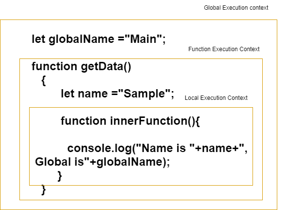
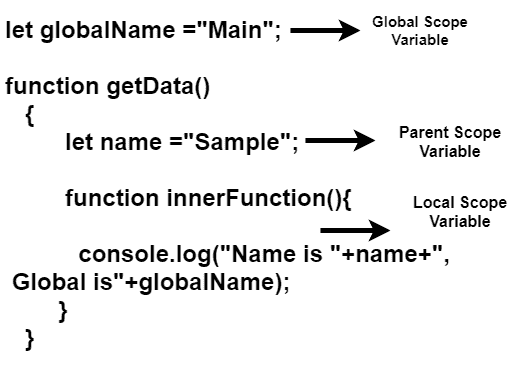

# 理解 Javascript 中的闭包——Javascript 周刊

> 原文：<https://dev.to/ganeshmani/understanding-closures-in-javascript-javascript-weekly-3050>

定期更新，订阅每周简讯，[每周更新](http://eepurl.com/gvbr7j)。

在这篇文章中，我们将看到什么是闭包，为什么我们需要像闭包这样的东西，在 Javascript - Javascript weekly 中理解闭包

上一篇:[https://cloud nweb . dev/2019/06/understanding-generators-in-JavaScript-JavaScript-weekly/](https://cloudnweb.dev/2019/06/understanding-generators-in-javascript-javascript-weekly/)

### 什么是终结？

简单地说，闭包只不过是一个定义在另一个函数内部的函数。闭包可以访问所有的局部变量、外部函数变量和全局变量。

[](https://res.cloudinary.com/practicaldev/image/fetch/s--9jv4cmR0--/c_limit%2Cf_auto%2Cfl_progressive%2Cq_auto%2Cw_880/https://cloudnweb.dev/wp-content/uploads/2019/07/closure.png)

### 问题陈述

为了更好地理解这一点，考虑下面的代码结果。

1.  问题陈述

```
let name = "Ganesh";

function getMyName() {
  console.log("Name is "+name);
}

name = "Mani";

getMyName(); //what will be the output here?
```

这种场景在 web 开发中很常见(前端和后端)。我们将定义一个函数，并在以后的某个时间调用这个函数。

2.问题陈述

```
function getMyName() {
  let name = "Ganesh";

  return function() {
    console.log(name);
  };
}

let name = "Mani";

// create a function
let myname = getMyName();

// call it
myname(); // What will it show? 
```

要理解这个概念，首先我们需要理解**词汇环境**的概念

### 词汇环境

词法环境无非是维护特定函数的状态及其外部环境状态，即变量。

[](https://res.cloudinary.com/practicaldev/image/fetch/s--mn5-mB8f--/c_limit%2Cf_auto%2Cfl_progressive%2Cq_auto%2Cw_880/https://cloudnweb.dev/wp-content/uploads/2019/07/lexical_env.png)

每个内部函数都会有一个局部变量，内部函数也可以访问父函数变量和全局变量。

维护特定函数的范围只不过是一个词法环境。

### 回到问题陈述...

现在，如果我们回到问题语句，问题语句#1 将返回值为“Mani”

因为，这个值会被更新，因为我们已经把它定义为全局变量。

现在，在问题陈述#2 中，我们已经定义了一个名为 **getMyName()** 的函数。在函数内部，我们定义了一个名为**名为**的变量，它只不过是一个父函数变量。

我们从 **getMyName()** 函数中返回一个函数。

现在，如果我们在全局上下文中定义同一个名为 **name** 的变量并执行 **getMyName()** 。

这不会改变它的价值。因为 **getMyName()** 返回一个仅仅是**闭包**的函数将保存特定环境的变量状态和值

[https://output.jsbin.com/qikuginowe](https://output.jsbin.com/qikuginowe)

javascript 首先查看内部函数，然后查看父函数。最后，它会查看全局变量。

## 关闭-实际执行

### 使用闭包代替对象

如果你熟悉 OOPS 概念，你会知道" **this** "的概念，它将引用类的**上下文**

让我们试着用 OO 概念写一个函数，然后我们看看如何用闭包重写它。

```
function User(){

  this.firstname = "John";

  this.lastName = "Robert";
}

User.prototype.getFirstName = function getFirstName() {
  console.log(this.firstname);
}

User.prototype.getLastname = function getLastname() {
 console.log(this.lastName);
}

User.prototype.showFullName = function showFullName() {
   console.log(this.firstname+" "+this.lastName);
}

module.exports = User;
```

我们正在创建一个名为 user 的函数，并为特定的用户函数添加函数 **getFirstName** 、 **getLastName** 和 **showFullName** ，并使用 **this** 关键字访问函数变量。

为了调用这个特定的函数，我们需要创建它的一个新实例并调用这个特定的函数

```
 let User = require('./user');

let data = new User();
data.showFullName(); 
```

它会显示类似于"**约翰·罗伯特**"的内容

现在，让我们看看如何用**闭包**重写这个

```
function User() {

  let firstName = "Will";

  let lastName = "Smith";

  return { 
   getFirstName : function () {
    console.log(firstName);
  },

   getLastName: function () {
      console.log(lastName);
    },

    showFullName :function () {
      console.log(firstName+" "+lastName);
    }
  }
}

module.exports = User;
```

我们像以前一样定义一个用户函数，而不是绑定函数。我们从父函数**用户**返回这些函数。

**注**:返回函数不过是闭包。

现在，如果我想调用这个函数，我们必须这样做

```
//using Closure in Javascript

let userClosure = require('./user_closure');

let closureresult = userClosure();

closureresult.showFullName()
```

它将返回“**威尔·史密斯**作为输出。

这是一个实时用例，可以尝试实现**闭包**，而不是使用**这个**关键字。

### 测验:

试着解决这个问题，并在这个帖子中评论你的结果，并向我解释它是如何工作的。

```
function doIncrement(){
  let counter = 0;

  return function(){
    counter ++;
    return counter; 
  }
}

let increment = doIncrement();

console.log(increment());
console.log(increment());
console.log(increment());
//What is the result ?
```

这就是这周的内容。尝试在实时用例中实现这一点，这样你就可以从中领会概念。

参考:

[https://medium . com/JavaScript-scene/master-the-JavaScript-interview-what-a-a-closure-b2f0d 2152 b 36](https://medium.com/javascript-scene/master-the-javascript-interview-what-is-a-closure-b2f0d2152b36)

我们将在接下来的文章中看到 javascript 的其他一些特性。

在此之前，**快乐编码** :-)