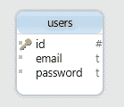
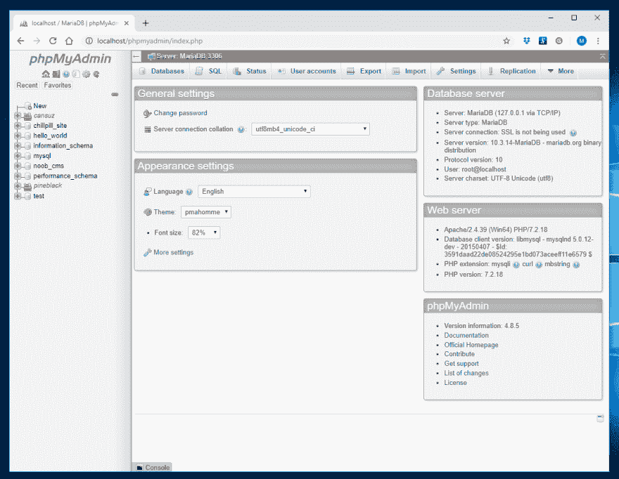
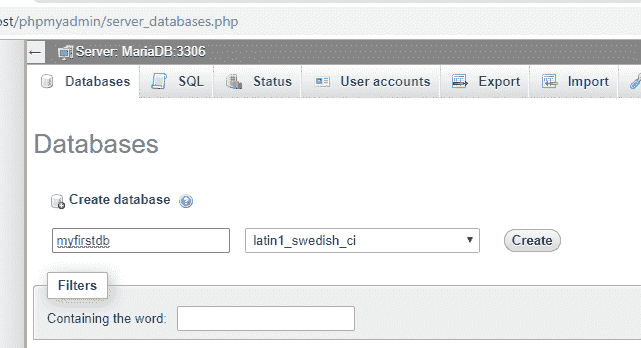
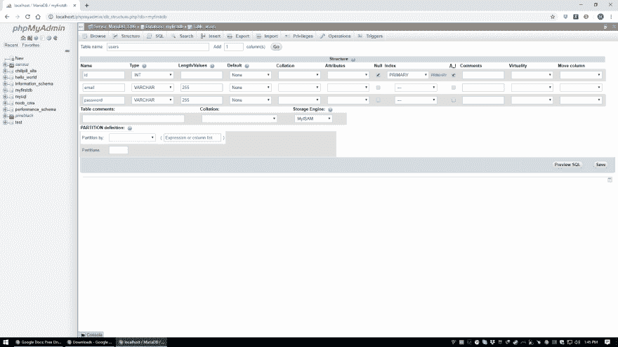
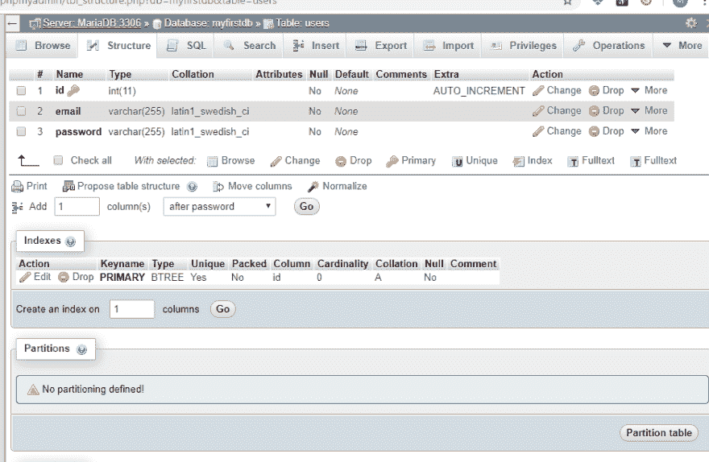
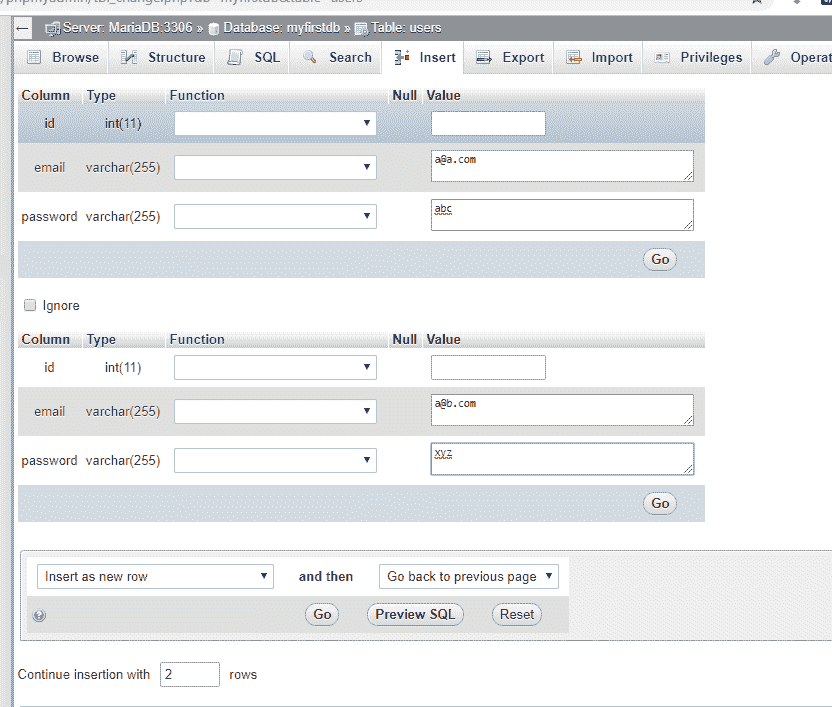
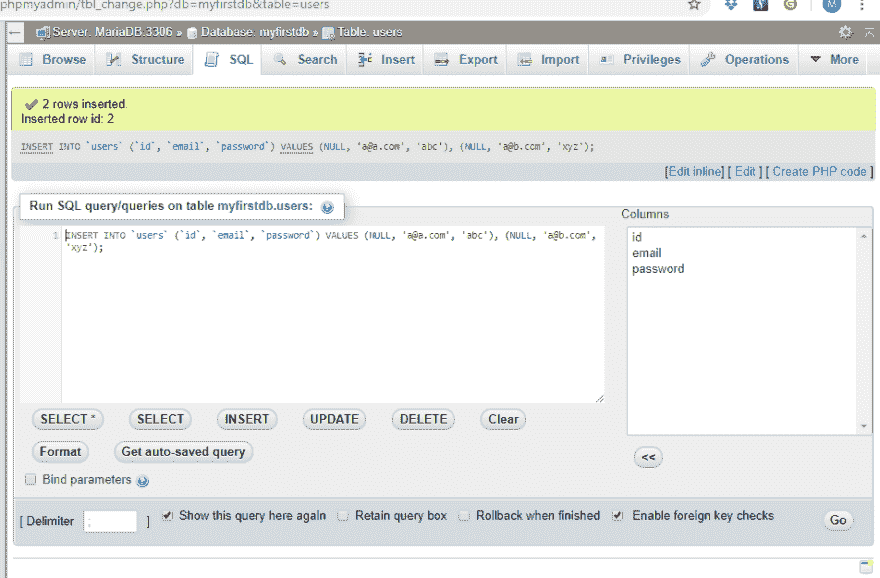
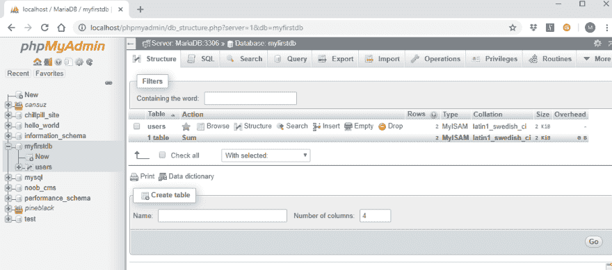

# 理解数据库(关系型)

> 原文：<https://dev.to/th3n00bc0d3r/understanding-databases-relational-jhn>

在生活中，一个最简单的问题是迄今为止最难理解的，也许也是最难定义的，但它们包含了人们一直在寻找的普遍真理。让我们来谈谈数据库。“数据”一词的意思是，在存储器中参考文献的统计集合，在存储器中可以以最终的方式对它们进行进一步的分析和推断。当数据被分析时，它就变成了有价值的信息。

因此，当我们谈论数据库时，通常我们会谈到以下内容:

*   也称为模式的数据库
*   桌子
*   行

这是用谷歌文档准备的 excel 表格。

我的文件 myfirstdb 的名称称为数据库或模式。该表被称为用户，我们称之为表。床单越多，桌子就越多。甲、乙、丙...被称为水平柱，1，2，3...被称为垂直的行。

现在让我们看看，在数据库可视化工具中相同的 excel 表的可视化表示。

现在让我们来谈谈一些术语和它们的含义，这些特征就像帮助我们在数据库中设计和存储条目；

*   主关键字
*   NN 或 Not Null 或 Null
*   自动增量或 AI

主键
这是关系数据库的一个特性，它设置一个列，以确保它包含的任何值都是唯一的。如果没有任何值试图插入其中，它将不会允许条目。

**NN or Not Null or Null**
简单来说，它必须有一个值或者不允许任何条目进入其中。

现在你真的不想计算插入的行数，也不想计算要存储和改进的行数，所以这个工具有所帮助，它会自动记录先前的条目数，并在需要的地方给下一个条目加 1。

现在有四种基本操作可以在任何关系数据库上完成，它们是；

*   插入或创建-将数据插入表格的行中
*   选择或读取-从表中带回数据
*   更新-更新表格中的一行
*   删除或移除-删除一行

它有一个简称，叫做 **CRUD** (创建、读取、更新、删除)，我想创建我自己的，比如说 **SIDU** (选择、插入、删除、更新)

现在让我们创建一个数据库，如果你已经按照教程学习了，你应该在你的计算机上运行一个基本的 web 服务器和一个数据库服务器，并安装 phpMyAdmin 或 MySQL Workbench 作为数据管理工具。确保您的 web 服务器正在运行。

打开你的浏览器，输入: [http://localhost/](http://localhost/) 或者 [http://127.0.0.1/](http://127.0.0.1/) ，在 Windows 情况下你应该会被一个 WampServer 页面显示出来，其他情况下只需按照 phpMyAdmin 页面即可。点击 phpMyAdmin

现在，您应该会看到一个登录屏幕。
用户名:root
密码:

密码为空，无且为空。

点击 Go。

别担心，所有的标签和东西。点击左上角的数据库。

现在让我们创建一个数据库。输入 myfirstdb，然后点击 Create。

“结构”选项卡是我们定义将使用哪些列的地方。

将列数设置为 3，并键入 users，这就是我们正在创建的表。点击 Go

现在它将创建 3 个空字段，我们将在其中输入列名。见图参考。primary 是主键，AI 是自动增量。点击保存。

现在，结构已经创建，如果你通读文本，我相信它现在会开始变得有意义。点击插入标签

让我们输入一些行，并取消选中忽略，因为我们要输入 2 行。点击 Go。现在，查询开始运行，并在其中插入了两行。点击浏览

现在，您可以看到 excel 表和我们创建的 MySQL 数据库之间的相似之处。

[Noob 指数](https://dev.to/th3n00bc0d3r/noob-guides-index-4mne)