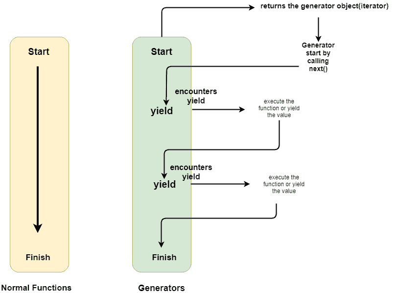

# 理解 Javascript 中的生成器- Javascript 周刊

> 原文：<https://dev.to/ganeshmani/understanding-generators-in-javascript-javascript-weekly-4p09>

定期更新，订阅每周简讯，[每周更新](http://eepurl.com/gvbr7j)。

在这个每周一期的系列中，我们将会看到什么是 javascript 中的生成器以及生成器的用例。理解 Javascript 中的生成器- Javascript 周刊

### 什么是发电机？

首先，让我们用一个简单的类比来理解这个概念。

例如，假设您正在笔记本电脑上看电影。突然有人按你的门铃，这是你订的比萨饼。你将暂停电影，拿起比萨饼，回来，从你离开观看的地方继续。对吗？

类似地，javascript 中的**生成器**也是以同样的概念工作的。

**生成器**是 javascript 中的特殊函数，可以暂停并从离开的地方恢复。

此外，我们都知道，一旦一个普通的 javascript 函数被执行，就不可能中断并做一些工作，然后从它停止的地方返回。

例如，看看下面的代码

```
setTimeout(function(){
  console.log("Hello World");
},1);

function foo() {
  // NOTE: don't ever do crazy long-running loops like this
  for (var i=0; i<=700; i++) {
      console.log(i);
  }
}

foo();
```

但是，setTimeout 函数只会在循环结束后执行。不可能中断 for 循环并执行函数。

这就是**生成器**函数解决的问题。

[](https://res.cloudinary.com/practicaldev/image/fetch/s--q0-aiFRU--/c_limit%2Cf_auto%2Cfl_progressive%2Cq_auto%2Cw_880/https://cloudnweb.dev/wp-content/uploads/2019/06/diag.png)

### 实现生成器

要将一个函数定义为生成器函数，我们需要用星号(*)来定义它。举个例子，

```
function* getData() {
   //yield comes here.
}
```

每当生成器函数遇到 yield 语句时，它都会执行该语句，并在此之后恢复该函数。

让我们用一个例子来理解这个概念，

```
function* getData() {

  for(let i=0;i < 10;i++){
    console.log(yield getUser(i));
  }

}

function getUser(value) {
    return {
      id : value,
      name : "John",
      age : 20 
    }
}

const get = getData();

console.log(get.next().value)
console.log(get.next().value)
console.log(get.next().value) 
```

这里，我们定义一个生成器函数来获取用户数据。每次 getData()函数遇到带有 getUser()函数的 yield 语句，就执行该函数，并将数据返回给主函数。

我们需要调用 **next()** 来迭代并从生成器函数中获取值。它被称为**生成器迭代器**

### 什么是生成器迭代器？

生成器迭代器是一种特殊的设计模式。我们可以一步一步地遍历有序集。

例如，考虑一个带有值的数组

```
['a','b','c','d','e']
```

使用迭代器，我们可以使用关键字 **next()** 一次遍历一个值。这样做的目的是，如果我们有一些函数运行后，每一个值返回。我们可以这样执行。

```
function *doIt() {
    yield 1;
    yield 2;
    yield 3;
    yield 4;
    yield 5;
}
```

遍历发生器函数 **doIt()** 的值。我们需要构造一个迭代器。我们可以通过定义，

```
var it = doIt();
```

同时，为了迭代生成器函数，我们需要使用关键字 **next()** 来获取值。

```
console.log( it.next() ); // { value:1, done:false }
console.log( it.next() ); // { value:2, done:false }
```

我们得到一个值和一个叫做 **done** 的东西，它表明迭代器是否到达了函数的末尾。

我们也可以在生成器函数中使用 **return** 代替 **yield** 。但是，**回归**的问题是，在为..的循环返回语句将被丢弃。它不会被执行

### 用 for..循环的

```
function *doIt() {
    yield 1;
    yield 2;
    yield 3;
    yield 4;
    yield 5;
    return 6;
}

for (var v of doIt()) {
    console.log( v );
}
// 1 2 3 4 5

console.log( v ); // still `5`, not `6` :(
```

### 我们在哪里使用生成器函数？

#### [Redux-saga](https://redux-saga.js.org/docs/introduction/BeginnerTutorial.html)

最重要的是，redux saga 用来处理 redux 的副作用。如果您使用过 react/redux，您可能知道在 redux 中维护动作创建者和减少者有多困难。

Redux-saga 通过将动作创建者和缩减者分组为 **sagas** ，简化了维护动作创建者和缩减者的过程。

Redux sagas 明确使用生成器函数来实现 saga 效果，例如

*   调用 API 并从后端获取数据
*   从 redux 状态中选择值
*   采取每一个行动，做一些业务逻辑和调度一些其他行动。

#### 承诺备选方案

最重要的是，它还可以用作 promise、async/await 替代方案。

因为，大多数开发人员使用 promise，他们不会那么频繁地使用生成器。

但是我们可以使用 Generator 来解决 Promise、Async/Await 解决的问题。

### 结论

好了，这就是发电机的基本知识。

同样，我们将在即将到来的 Javascript 每周系列中看到更多关于 Javascript 核心概念的内容。在那之前，你可以阅读我的其他[博客文章](https://cloudnweb.dev/category/web-dev/)，它们解释了 web 开发的基础。

**快乐编码** :-)

同时，要阅读更多关于 Javascript 的内容

[你不知道 JS](https://github.com/getify/You-Dont-Know-JS)