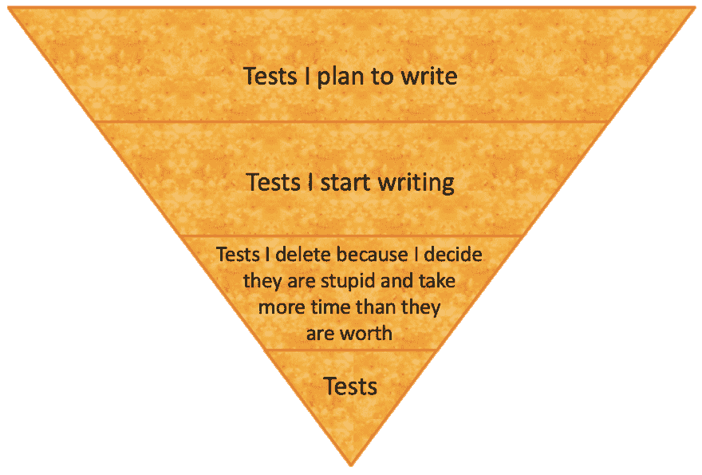

# 单元和集成测试

> 原文：<https://dev.to/leading-edje/unit-and-integration-testing-bco>

## 简介

对于我目前的客户，我们正在研究如何编写有效的单元和集成测试，以及重新编写代码以使其更具可测试性。他们正朝着持续开发/持续集成的方向发展。我在这里的目的是展示我们的前进方向。本文将关注前端，但是这些概念当然也可以应用于其他领域。

第一，他们有前端测试；不久前有一场引入测试的运动。从我最初看到的情况来看，他们学会了 TDD(测试驱动开发),并专注于让代码覆盖率达到 100%。虽然他们得到了这些信息很好，但是他们显然在 TDD 的实现上相当严格(如果他们不得不使用 TDD，他们宁愿不进行测试)，并且对 100%覆盖率的强烈要求似乎导致了较高范围内脆弱的测试(最终的 10-20%通常很难测试)。

此外，很少考虑正在编写的不影响他们正在编写的测试类型的代码类型。

## 未来...

随着更多的细节浮出水面，或者我想出了更好的解释，我希望我会在接下来的章节中写得更详细。

## 测试多利托

改编自[肯特·c·多兹(推特帖子)](https://www.google.com/url?sa=i&source=images&cd=&cad=rja&uact=8&ved=2ahUKEwjV7PKNvd_iAhUJ26wKHeRyAiIQjhx6BAgBEAM&url=https%3A%2F%2Ftwitter.com%2Fkentcdodds%2Fstatus%2F960723172591992832&psig=AOvVaw1PkXkHMP7c4Ypmvf9NSo9q&ust=1560275437312169)

我不打算在这里进入测试金字塔(我们大多数人都见过)。请注意，我们正在区分开发人员集成测试和 QA 集成测试(后者在本文中不再讨论)。

## 我们的目标

*   为了对无缺陷发布的代码有信心，
*   以及证明它有效的证据。

*   对我们如何测试持实际态度；

*   对应该测试的内容要谨慎。

*   为了减少缺陷(更早发现 bug ),

*   以及更快、更轻松的部署。

## 定义:集成测试

*   不需要所有服务、环境和访问的实时版本(部分可以)。
*   范围不一定很广，但范围越窄越有效。
*   当独立的代码单元相互连接时，它们可以正常工作。
*   可以使用“忠实”测试替身

## 定义:单元测试

*   原子，最低级别(小而快)。
*   单一责任原则(SRP):“做好一件事。”

*   可重复的、可靠的和确定的。

*   展示具体的进展。

*   因错误或变更的需求而失败。

*   很容易理解为什么会失败。

*   降低 bug 成本。

### 标准

*   容易写
*   易读的
*   可靠的
*   快的

## 整体测试策略

测试没有“一成不变”的规则。

*   测试不是为了发现错误。但是，错误应该会触发额外的测试以及错误修复
*   测试开发人员对需求的理解。
*   将业务逻辑与服务器端或客户端集成逻辑分开。
*   在编写代码之前仔细考虑如何测试(可测试性设计)。
*   改进生产代码通常会简化测试代码。
*   不要在设计可测试性时测试原型、概念验证或实验代码(直到你知道它将成为产品代码)。
*   生产代码中的最佳实践不等于测试中的最佳实践。

## 行业测试最佳实践

1.  知道代码中的痛点在哪里。
2.  并行工作和测试。
3.  使其成为工作流程的一部分(提供责任/审查)。
4.  命名惯例(第一道防线/理解)。
5.  拥抱神奇的数字。
6.  复制是可以的(违反干燥原则)。
7.  测试琐碎的案例
8.  边界情况
    *   负面案例
    *   捕捉已知的错误
9.  优先
    *   算法引擎
    *   实用方法
    *   核心业务逻辑方法
    *   高风险服务

## 复杂程度

### 代码大小(“这个功能做的太多了。”)...

*   项目代码的数量不会改变，但是方法中语句的数量会改变。
*   少于 20 行:28%包含错误。
*   20 行或更多:78%包含错误。

### JSLINT...

*   识别不良的风格、语法和语义；重构糟糕的代码并用好的代码替换它。

### 圈复杂度...

*   代码中独立路径的数量。
*   此外，执行代码所需的单元测试的最小数量。

### 重用...

*   重复两次以上的代码应该是我们可以将代码放入其自身功能的候选代码。

### 人体试验...

*   复杂性归结为其他人阅读代码的难度。
*   代码审查过程:显示发现 60-90%的缺陷。

## 度量标准

(超越代码覆盖和分支)

有两个测试指标需要关注:

1.  仅是测试问题而不是代码问题的测试失败的百分比。各种元素被嘲讽的时候经常会出现这种情况。
2.  错误修复或其他不间断更改需要更新单元测试的次数百分比。

目标是使这两个百分比都为 0%。这表明每一次测试失败都代表了代码中的一个实际问题，只有特性的改变才需要更新测试。

## 是什么让代码难以测试？

*   当它紧密耦合时
*   隐藏或嵌入的依赖项
*   所需的数据和数据库
*   测试的设置代码数量惊人

## 设计图案

这些是我们想要关注的设计模式。开发人员需要为可测试性编写代码；他们使用的特定模式应该随着过程的进行而变化。

### 测试驱动开发(TDD)

*   从内向外透视(首先是单元级别)。
*   通过重构编码，测试比开发领先一步。

问题:

*   可能会错过打破模式。
*   编码前的集成测试令人望而生畏。
*   在了解原因之前，几乎不可能编写复制错误的测试。

### 行为驱动开发(BDD)

*   由外向内的视角
*   基于需求和场景
*   用户的预期行为

## 边界测试

我们提倡测试任何第三方代码的“边界”。界限应该是我们“如何”使用他们的代码(希望他们对自己的代码进行了良好的测试)。我们希望看到的是，当升级发生时，我们的实现(入口)在哪里发生了变化。

*   第三方用例:在当前状态下，很难升级。
*   测试我们在哪里以及如何使用它们的功能。

*   通过边界测试减少升级的痛苦，通过运行边界测试识别问题。

*   不需要测试第三方代码...他们这样做。

## 结论

编写有效的单元和集成测试从编写可测试的代码开始。当转向持续开发/持续集成管道时，需要进行可靠的测试来表明代码如预期的那样工作。

## 领先 EDJE

 