# 使用断点拦截和编辑 HTTP 请求/响应

> 原文：<https://dev.to/renee/use-breakpoint-to-intercept-and-edit-requests-responses-2dp4>

在软件开发中，断点被称为“有意停止或暂停的地方”，在这里您可以检查、编辑 API 请求或响应，甚至决定是阻止它还是允许它继续。这篇博客演示了我如何使用 Proxyman 断点工具来操纵这些 API 调用以进行调试。

* * *

### 何时使用断点

基本上，如果您为请求启用断点，[代理人](https://proxyman.io/)将在请求到达您的服务器之前停止请求。如果您为响应启用断点，它将在响应转到您的应用程序之前停止响应。因此，您可以修改这样的请求/响应来测试 UI 错误或某些后端功能(包括安全漏洞)。在这篇博客中，举两个简单的例子来看看断点是如何工作的:

*   示例 1:更改用户的搜索查询以查看应用程序的行为(修改请求)
*   示例 2:更改响应中的用户名和头像，看看 UI 是否可以处理长消息(修改响应)

### 在远程设备上安装代理人证书

在我们开始之前，让我们[在我的 iOS 设备](https://proxyman.io/blog/2019/06/How-I-use-Proxyman-to-see-HTTP-requests-responses-on-my-iPhone.html)上安装代理人证书，以便我们能够看到 HTTPs 内容

为了更加集中，让我们使用[引脚](https://proxyman.io/blog/2019/06/How-I-use-Proxyman-to-see-HTTP-requests-responses-on-my-iPhone.html)来隔离两个端点**“API . unsplash . com/me”**&**“API . unsplash . com/search”**用于我们的测试场景

### 用端点定义匹配规则

现在是我们定义断点如何捕获*传出*请求和*传入*响应的时候了。基本上，这些条件可以通过两种方式设置:

#### 选项 1:菜单栏

从**菜单栏** - >选择**工具** - >选择**断点** - > **规则**。然后将弹出一个断点规则窗口，以便我们可以定义匹配条件

[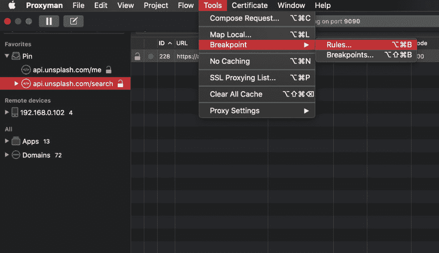](https://res.cloudinary.com/practicaldev/image/fetch/s--zNZgi8Pv--/c_limit%2Cf_auto%2Cfl_progressive%2Cq_auto%2Cw_880/https://thepracticaldev.s3.amazonaws.com/i/izufvre3x71g2cp5ztla.png)

要添加新规则，可以点击窗口左下角的**“+”**按钮

[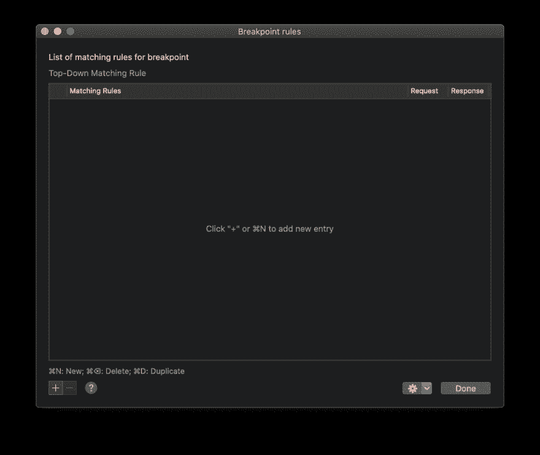](https://res.cloudinary.com/practicaldev/image/fetch/s--tAVJH6QQ--/c_limit%2Cf_auto%2Cfl_progressive%2Cq_auto%2Cw_880/https://thepracticaldev.s3.amazonaws.com/i/qi35uxfp6gfojm7bg35j.png)

因为我们只想更改第一个场景的搜索查询，所以让我们键入端点**“API . unsplash . com/search”**并只选择“Request”

[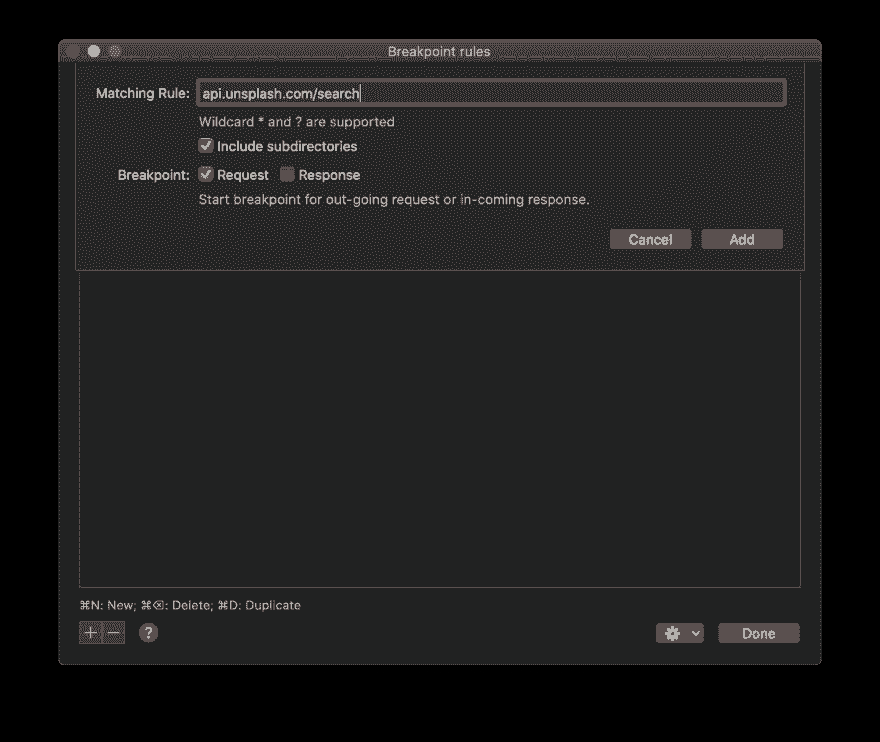](https://res.cloudinary.com/practicaldev/image/fetch/s--2uD-pASc--/c_limit%2Cf_auto%2Cfl_progressive%2Cq_auto%2Cw_880/https://thepracticaldev.s3.amazonaws.com/i/juqat029aqh57pg0cae9.png)

点击**“Add”**按钮后，我们知道，从现在开始，任何向该端点发出的请求都将被断点停止:)

[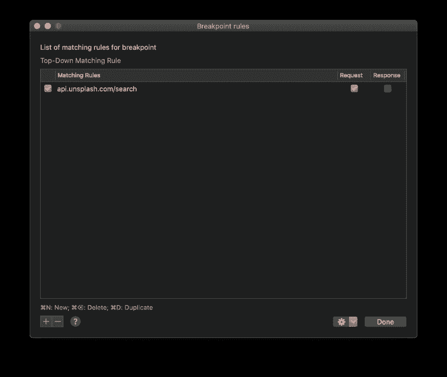](https://res.cloudinary.com/practicaldev/image/fetch/s--oKqBos_Q--/c_limit%2Cf_auto%2Cfl_progressive%2Cq_auto%2Cw_880/https://thepracticaldev.s3.amazonaws.com/i/4yiauhybjnnsibmy0x2z.png)

#### 选项二:右键

另一个定义匹配规则的选项是**右键**选中 URL(端点)——>选择**工具**——>——**断点**

由于 Proxyman 自动使用所选端点作为条件，我们应该看到端点 **"api.unsplash.com/me"** 被自动填充，如下所示

[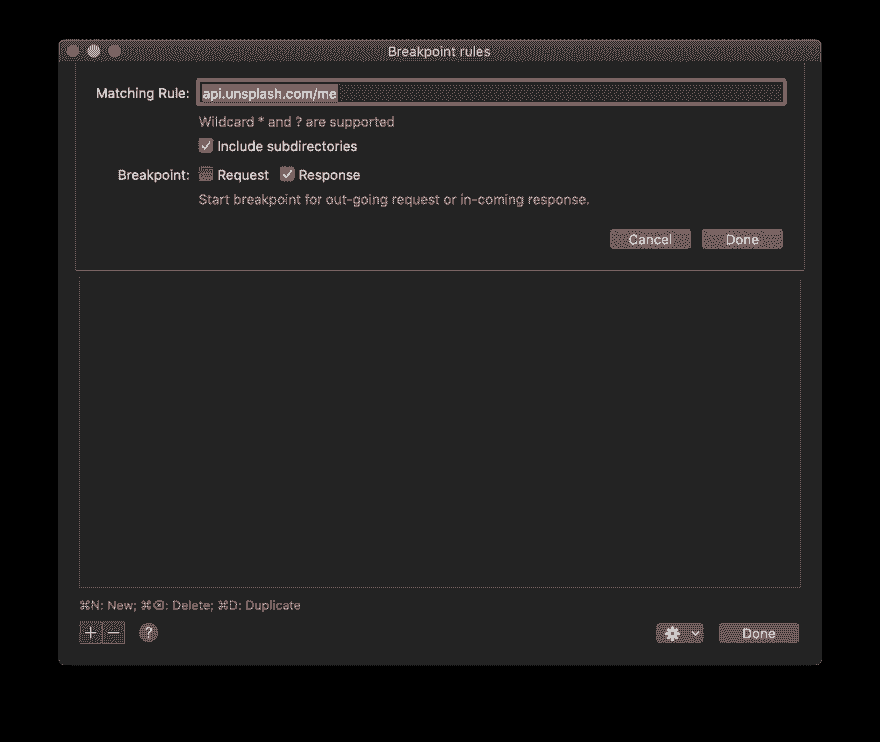](https://res.cloudinary.com/practicaldev/image/fetch/s--Z9UrK4i---/c_limit%2Cf_auto%2Cfl_progressive%2Cq_auto%2Cw_880/https://thepracticaldev.s3.amazonaws.com/i/wfc4xsmus1tzvjks0qx6.png)

因为我们只想更改响应，所以让我们为第二个场景选择“响应”。点击**“Done”**按钮后，新规则被添加到断点规则窗口中

[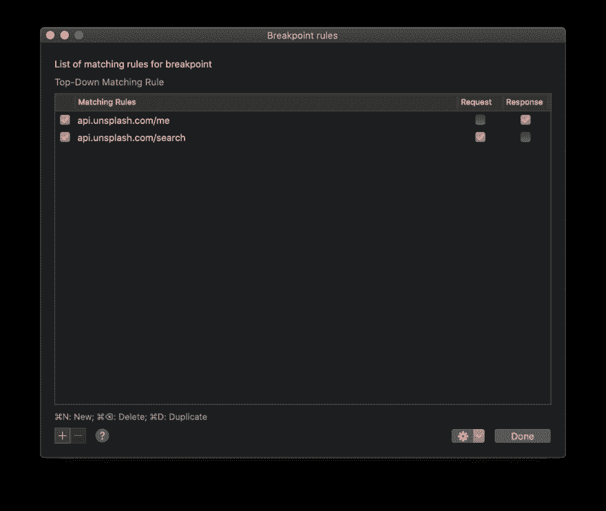](https://res.cloudinary.com/practicaldev/image/fetch/s--TUV25USx--/c_limit%2Cf_auto%2Cfl_progressive%2Cq_auto%2Cw_880/https://thepracticaldev.s3.amazonaws.com/i/sz3ofrull9rhyd2eyv3f.png)

设置好之后，是时候修改请求/响应，看看我们的应用程序如何运行了:)

### 用断点修改请求

首先，让我们运行 Unsplash 应用程序；然后从*搜索框*，输入关键字*“吃干净”*，导航到触发断点的端点。一旦捕获到 API 调用，就会弹出一个**断点窗口**，这样我们就可以修改查询

让我们将搜索查询从*“吃得干净”*改为*“山”* …

[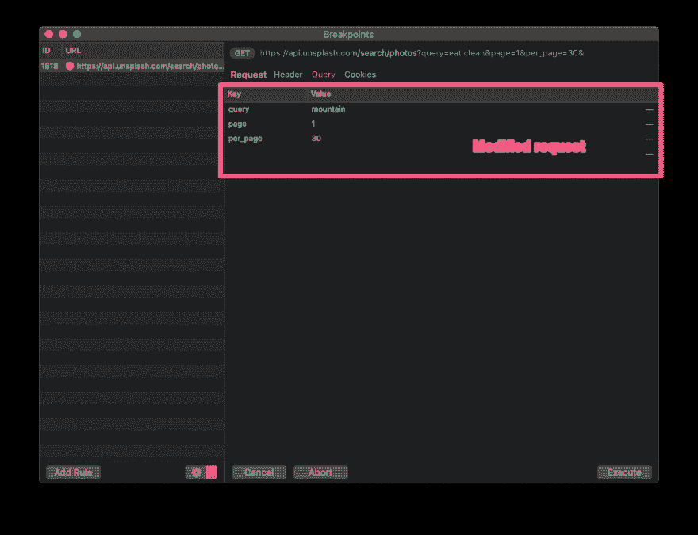](https://res.cloudinary.com/practicaldev/image/fetch/s--0xavU1ec--/c_limit%2Cf_auto%2Cfl_progressive%2Cq_auto%2Cw_880/https://thepracticaldev.s3.amazonaws.com/i/ktrss4fqarrpgg38h4z8.png)

…该应用程序并没有按照原始请求显示*“吃干净”*图像(左图)，而是按照我们的预期呈现了*“山”*图像(右图:)

[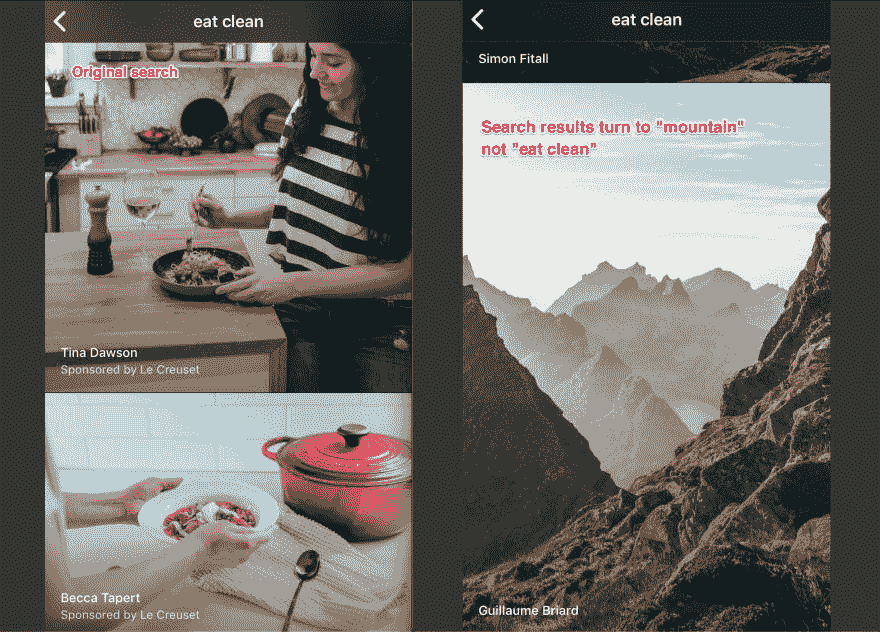](https://res.cloudinary.com/practicaldev/image/fetch/s--vIJA68_x--/c_limit%2Cf_auto%2Cfl_progressive%2Cq_auto%2Cw_880/https://thepracticaldev.s3.amazonaws.com/i/ryoiufv15ractbl1ghnx.png)

### 用断点修改响应

与编辑请求类似，我们也能够编辑响应的内容。让我们重新打开 Unsplash 应用程序来调用端点 **"api.unsplash.com/me"**

[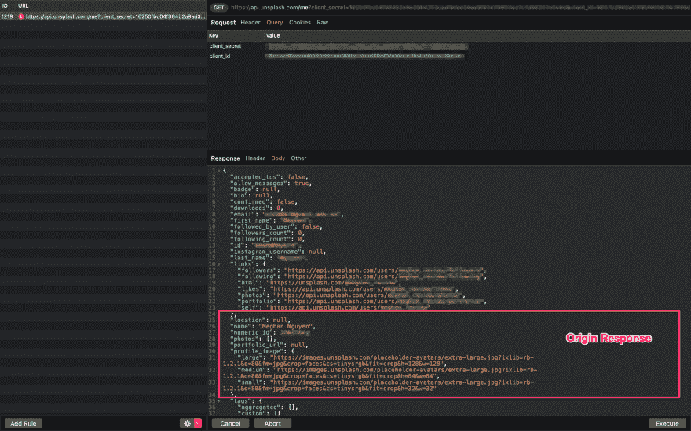](https://res.cloudinary.com/practicaldev/image/fetch/s--O2v56_VW--/c_limit%2Cf_auto%2Cfl_progressive%2Cq_auto%2Cw_880/https://thepracticaldev.s3.amazonaws.com/i/4axrmzamx22y8r25y7rp.png)

一旦捕捉到 API 响应，我们可以更改用户名和头像来查看我们的应用程序如何处理。在这里，我将用户名编辑得更长，并更新头像

[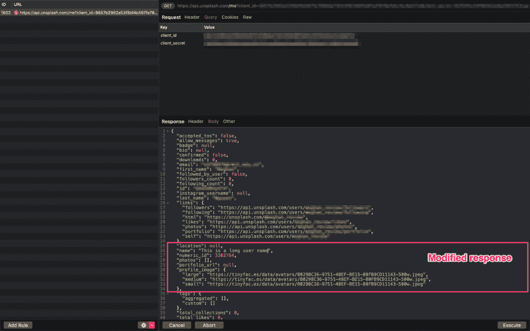](https://res.cloudinary.com/practicaldev/image/fetch/s--9locrKeW--/c_limit%2Cf_auto%2Cfl_progressive%2Cq_auto%2Cw_880/https://thepracticaldev.s3.amazonaws.com/i/8qrjg2176mn5pxzd3bgl.png)

点击**“执行”**后，修改后的档案会显示新的用户名和头像，而不是原来的:)

[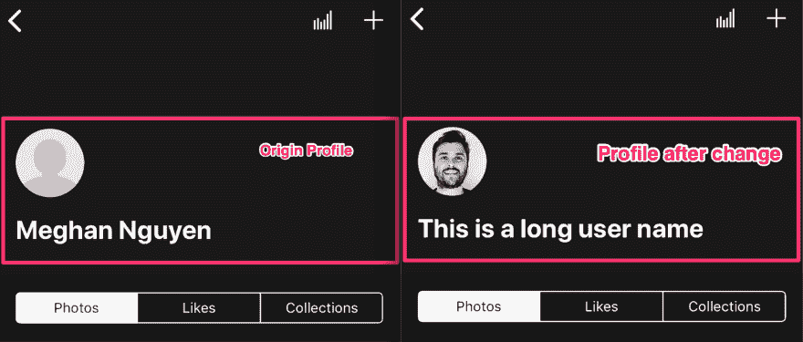](https://res.cloudinary.com/practicaldev/image/fetch/s--MpxY2qAV--/c_limit%2Cf_auto%2Cfl_progressive%2Cq_auto%2Cw_880/https://thepracticaldev.s3.amazonaws.com/i/4ftfsu9npwubm9khvi81.png)

### 接下来是什么？

使用 Breakpoint，您可以更改 API 请求/响应的任何部分，但是请记住，当它没有获得预期的正确格式时，它可能会行为不当或崩溃。也就是说，不要犹豫使用这个工具来体验和提高你的生产力。调试愉快:)

* * *

[Proxyman](https://proxyman.io/) 是一款高性能的 macOS 应用，开发者可以在 iOS 设备、iOS 模拟器和 Android 设备上查看来自应用和域的 HTTP/HTTPS 请求。去 https://proxyman.io/[的](https://proxyman.io/)看看吧