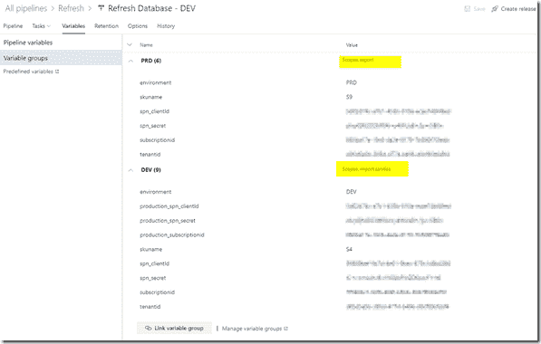

# 使用 Azure 管道将生产数据库恢复到另一个环境

> 原文：<https://dev.to/chris_mckelt/using-azure-pipelines-to-restore-a-production-database-to-another-environment-51lo>

我们经常需要在另一个环境(例如开发/测试/UAT)中生产数据库的新副本。

以前，这是一项繁琐的任务，包括获取备份文件，将其复制到另一个位置，恢复数据库。这里有一个使用 Azure 管道来自动化这个过程的解决方案。

### 用户故事

给定一个生产数据库存在于<u>订阅 1</u>

当我们发布名为'*Refresh Database–DEV '*的 Azure 管道时

然后，在<u>订阅 2</u> 的开发环境中可以获得生产副本

和权限对于开发环境来说是正确的

## 管道概述

对于您希望恢复到的每个环境，创建一个包含 3 个阶段的 Azure 管道。

创建**作用于特定阶段**的变量组

每个变量组都包含部署凭证，特定阶段将需要这些凭证来在特定的 Azure 订阅中执行操作。

### 任务 1–导出

创建一个 PowerShell 任务来运行脚本，并向其传递生产环境的信息。

这违背了生产环境，并创建了一个保存导出的 BACPAC 的博客存储容器

###### [查看脚本制作代码-导出. ps1](https://gist.github.com/chrismckelt/cc3c2ea53d8500b7c02e3da43513cbae)