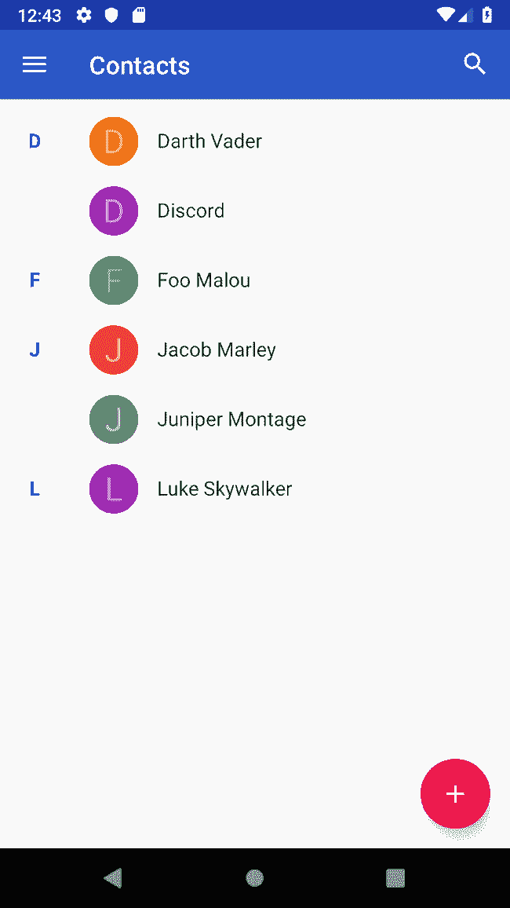
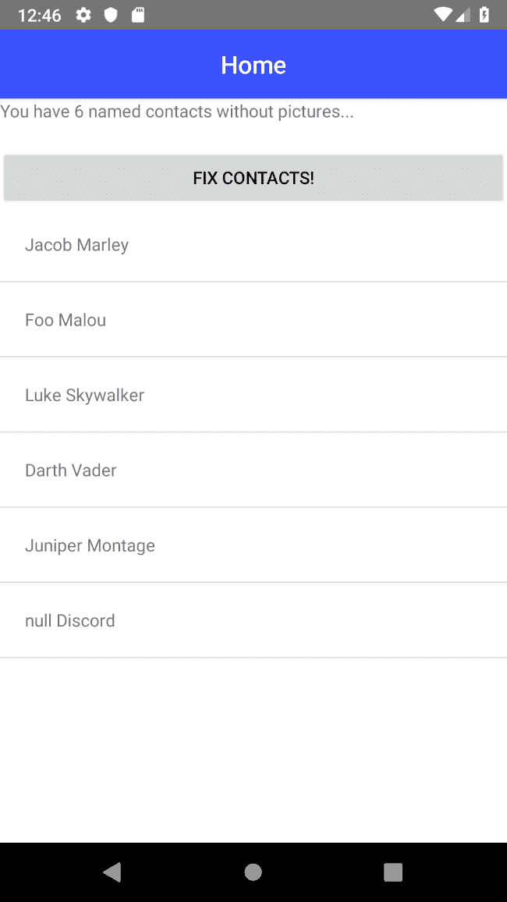
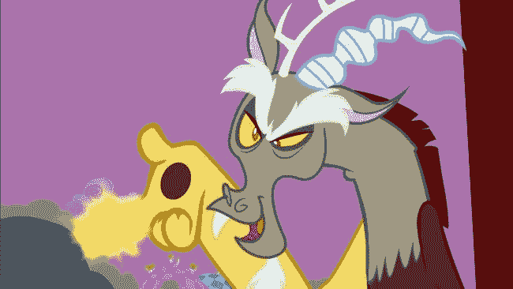
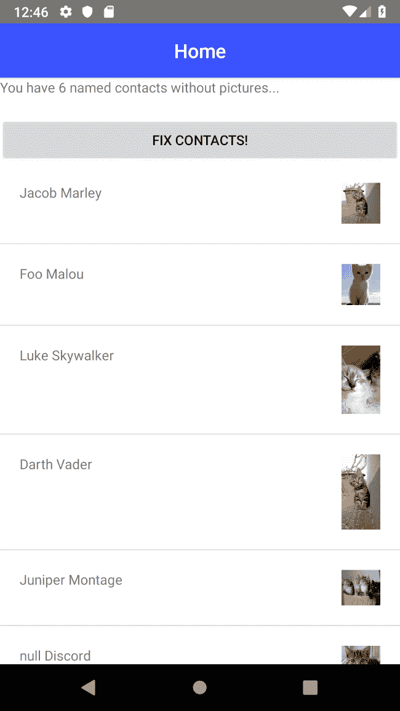
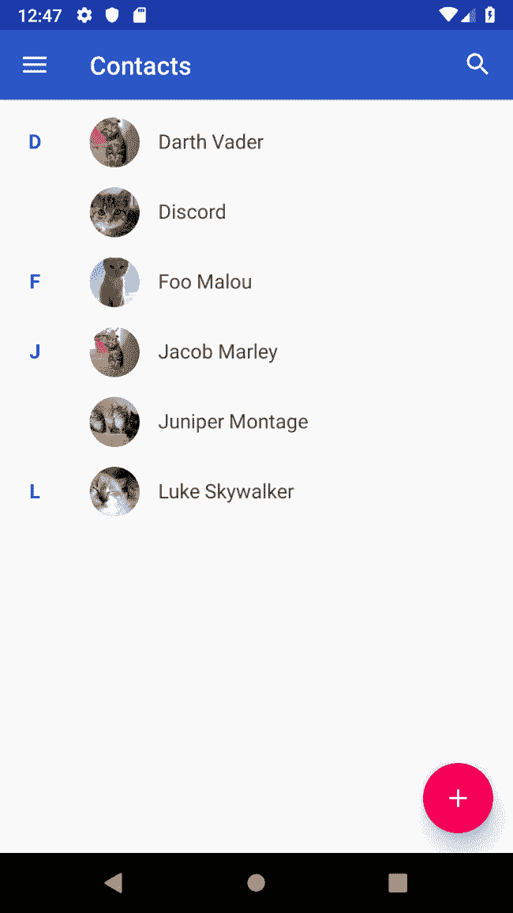
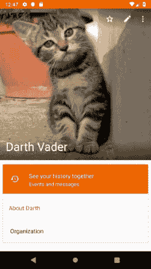
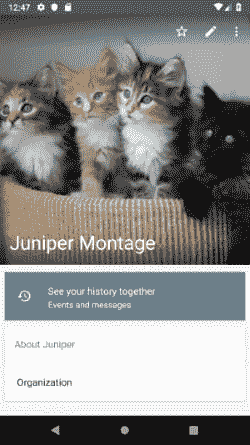

# 用 NativeScript 和 Vue.js 把你的朋友变成猫

> 原文：<https://dev.to/raymondcamden/using-nativescript-and-vue-js-to-turn-your-friends-into-cats-103k>

很久以前，好吧，回到 2016 年，我写了一个关于 Ionic 和 Contacts API 包装器的实验([“使用 Ionic 原生联系人固定器”](https://www.raymondcamden.com/2016/12/12/working-with-ionic-native-contact-fixer))。这个想法很简单。假设您的设备上有一大堆联系人，如果有一种简单的方法可以在没有联系人的情况下向这些联系人添加图片，会怎么样？如果我们要给联系人添加图片，那么最好的图片肯定是一只猫，对吗？

<figure>[](https://res.cloudinary.com/practicaldev/image/fetch/s--hisAza3U--/c_limit%2Cf_auto%2Cfl_progressive%2Cq_auto%2Cw_880/https://static.raymondcamden.cimg/2019/06/cat1.jpg) 

<figcaption>难道你不想接到这家伙的电话吗？</figcaption>

</figure>

作为更多使用 NativeScript 的借口，我认为重建它会很有趣，当然，也抓住机会使用 [NativeScript Vue](https://nativescript-vue.org/) 。最终的应用程序非常简单，所以并不令人兴奋，但是最终的结果却很简洁。当然，有一个处理联系人和本地脚本的插件，[本地脚本联系人](https://www.npmjs.com/package/nativescript-contacts)。这个插件总体上对我来说工作得很好，但是在更新现有联系人方面有一个[未解决的问题](https://github.com/firescript/nativescript-contacts/issues/30)。尽管有这个问题，我的代码似乎还能工作，但是你会注意到操作中的一个 try/catch。我还利用了 [nativescript-permissions](https://www.npmjs.com/package/nativescript-permissions) 来处理 Android 特有的权限问题。这也很容易，但我几乎希望它被烘焙成 NativeScript，因为它感觉像是你永远需要的东西。

让我们从看一下代码开始。这是一个“一个视图”的应用程序，所以我只有一个组件来分享，正如我所说的，这几乎是愚蠢的简单，所以我不知道它有多大用处。我先从版面说起。

```
<template>
    <Page class="page">
        <ActionBar class="action-bar">
            <Label class="action-bar-title" text="Home"></Label>
        </ActionBar>
        <StackLayout>
            <Label textWrap="true" :text="status" height="40" />

            <Button v-if="readyToFix" text="Fix Contacts!" @tap="fixContacts"></Button>
            <ScrollView orientation="vertical" height="100%">
                <ListView for="contact in contacts">
                    <v-template>
                        <GridLayout columns="*,40" padding="20">
                        <Label row="0" col="0" :text="contact | name"/>
                        <Image row="0" col="1" :src="contact.photo" />
                        </GridLayout>
                    </v-template>
                </ListView>
            </ScrollView>

        </StackLayout>
    </Page>
</template> 
```

Enter fullscreen mode Exit fullscreen mode

在顶部，您可以看到一个绑定到`status`值的标签，我将用它来报告应用程序的状态。在我的设备上加载联系人需要 4 秒左右的时间，所以我需要一条消息让用户知道发生了什么。

在它下面，我有一个按钮和一个联系人列表。这个按钮是你用来“修复”你的联系人的，你会注意到它只在我们准备好更新他们的时候才会出现。联系人显示在一个`ListView`中，使用一个`GridLayout`来显示他们的姓名和图片(起初会是空白的)。

现在让我们看看代码。

```
const permissions = require('nativescript-permissions');
const contacts = require('nativescript-contacts');
const imageSource = require('image-source');

function getRandomInt (min, max) {
    return Math.floor(Math.random() * (max - min + 1)) + min;
}

function getRandomCatURL() {
    let w = getRandomInt(200,500);
    let h = getRandomInt(200,500);
    return `https://placekitten.com/${w}/${h}`;
}

export default {
    data() {
        return {
            status:'',
            contacts:[],
            readyToFix:false
        }
    },
    created() {
        this.status = 'Loading up your contacts to find those missing a picture - please stand by!';

        permissions.requestPermissions([android.Manifest.permission.READ_CONTACTS, android.Manifest.permission.WRITE_CONTACTS], 'I need these permissions to work with your contact.')
            .then(() => {

                var contactFields = ['name','nickname','photo'];
                contacts.getAllContacts(contactFields).then(
                    args => {

                        //get contacts w/o a picture AND with a name
                        let fixableContacts = args.data.filter(c => {
                            if(c.photo) return false;
                            if(!c.nickname && !c.name.family) return false;
                            return true;
                        });

                        this.status = `You have ${fixableContacts.length} named contacts without pictures...`;
                        this.contacts = fixableContacts;
                        this.readyToFix = true;

                    },
                    err => {
                        console.log("Error: " + err);
                    }
                );

            })
            .catch(e => {
                console.log('error in perms thing',e);
            });
    },
    methods:{
        fixContacts() {
            let fixes = [];
            for(let i=0; i<this.contacts.length; i++) {
                fixes.push(imageSource.fromUrl(getRandomCatURL()));
            }
            Promise.all(fixes).then(sources => {
                console.log('in the promise all and ive got '+sources.length + ' sources');
                // should be a 1 to 1 map to contacts, but doesn't matter since random :>
                for(let i=0; i<sources.length; i++) {
                    this.contacts[i].photo = sources[i];
                    // wrap in try/catch: https://github.com/firescript/nativescript-contacts/issues/30
                    try {
                        this.contacts[i].save();
                    } catch(e) {
                        // ignore
                    }
                }
            });
        }

    }
}; 
```

Enter fullscreen mode Exit fullscreen mode

在顶部，我们已经加载了所需的库，在它的下面，有两个助手函数。`getRandomInt`就是这么做的，一个介于两个值之间的随机数，而`getRandomCatURL`就是我如何为联系人生成一张新的猫照片。它使用了 placekitten.com 的[形象占位符服务。在这种情况下，我们只是生成 200 到 500 像素宽的随机尺寸。](https://placekitten.com)

下面是 Vue 特定的代码。我的`created`方法处理加载所有联系人，但是注意，我们既过滤已经有图片的联系人，也过滤那些没有名字的联系人。最终结果是可以固定的触点阵列。它们被保存到`contacts`值，然后在`ListView`中渲染出来。

最后，您可以看到处理获取那些随机猫图片的`fixContacts`方法。我利用`imageSource.fromUrl`从一个 URL 载入一张图片。这将返回一个承诺，因此我使用`Promise.all`将这些结果分配给我的联系人。(如果你好奇，你*可以*在 NativeScript 中使用 Async/Await，亚历克斯·齐斯金德有一篇文章[在这里](https://nativescripting.com/posts/async-await-in-nativescript)讨论它，但是因为它涉及一个小的变通办法，我决定今天避免它。)

仅此而已。我们来看看结果吧！首先，在运行应用程序之前，这里是我的虚拟 Android 设备上的联系人。注意这些无聊图标的名字:

[](https://res.cloudinary.com/practicaldev/image/fetch/s--II-1zf_x--/c_limit%2Cf_auto%2Cfl_progressive%2Cq_auto%2Cw_880/https://static.raymondcamden.cimg/2019/06/cat2.png)

当我运行应用程序时，它会加载我所有的联系人，因为他们都没有照片。请注意最后一行中的错误:

[](https://res.cloudinary.com/practicaldev/image/fetch/s--m-JBav3q--/c_limit%2Cf_auto%2Cfl_progressive%2Cq_auto%2Cw_880/https://static.raymondcamden.cimg/2019/06/cat3.png)

这来自于我用来显示名字的 Vue 滤镜。基本的想法是，寻找一个昵称，如果没有，使用名和姓:

```
// Used to find a good name for a contact
Vue.filter('name', contact => {
    if (contact.nickname) return nickname;
    else if (contact.name.family) return contact.name.given + ' ' + contact.name.family;
    return '';
}); 
```

Enter fullscreen mode Exit fullscreen mode

不幸的是，`Discord`联系人没有名字。不和谐就是不和谐。

[](https://res.cloudinary.com/practicaldev/image/fetch/s--ZA1uGAl2--/c_limit%2Cf_auto%2Cfl_progressive%2Cq_auto%2Cw_880/https://static.raymondcamden.cimg/2019/06/discord.jpg)

然而，我认为“零不和”听起来像一个很酷的名字，所以我保留了这个 bug。或者是我懒。你选吧。

点击按钮后，每个联系人都会被分配一个随机的猫网址，该网址会在`ListView`中自动更新:

[](https://res.cloudinary.com/practicaldev/image/fetch/s--nkyAZI5D--/c_limit%2Cf_auto%2Cfl_progressive%2Cq_auto%2Cw_880/https://static.raymondcamden.cimg/2019/06/cat4.png)

最酷的是你马上就能看到这个。我回到虚拟设备上的联系人应用程序，看到了很好的结果。首先列出所有联系人:

[](https://res.cloudinary.com/practicaldev/image/fetch/s--mcm-DDmy--/c_limit%2Cf_auto%2Cfl_progressive%2Cq_auto%2Cw_880/https://static.raymondcamden.cimg/2019/06/cat5.png)

这里有两个例子:

[ ](https://res.cloudinary.com/practicaldev/image/fetch/s--II8GGwh_--/c_limit%2Cf_auto%2Cfl_progressive%2Cq_auto%2Cw_880/https://static.raymondcamden.cimg/2019/06/cat6.png) [ ](https://res.cloudinary.com/practicaldev/image/fetch/s--Zv_GLs2j--/c_limit%2Cf_auto%2Cfl_progressive%2Cq_auto%2Cw_880/https://static.raymondcamden.cimg/2019/06/cat7.png)

仅此而已。愚蠢的乐趣，但很好建立。如果有人想要完整的源代码，尽管问！

*un splash 上 [Q'AILA](https://unsplash.com/@mewmewmew?utm_source=unsplash&utm_medium=referral&utm_content=creditCopyText) 的标题照片*