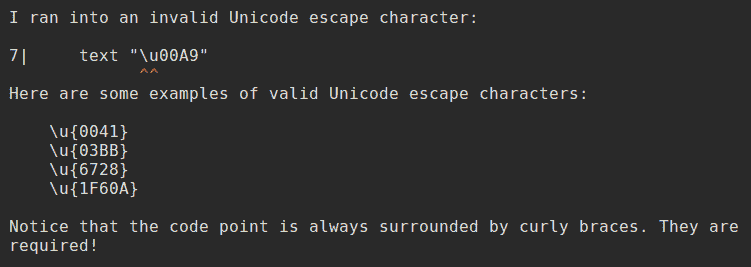

# 在 Elm 中使用特殊的 HTML 字符

> 原文：<https://dev.to/dwayne/using-special-html-characters-in-elm-1f6l>

**注:** *作品为榆树 0.19。*

如果您试图使用以下符号显示版权符号:

```
view = text "&copy;" 
```

Enter fullscreen mode Exit fullscreen mode

然后你就会看到`&copy;`。

为了得到你需要使用 Unicode 转义字符。

```
view = text "\u{00A9}" 
```

Enter fullscreen mode Exit fullscreen mode

就这么简单。

如果出于任何原因你弄乱了转义语法(也许你忘记了花括号，就像我的一个“朋友”一样；))然后 Elm 会用这个非常有用的错误消息来支持你。

[](https://res.cloudinary.com/practicaldev/image/fetch/s--ysAEUMlN--/c_limit%2Cf_auto%2Cfl_progressive%2Cq_auto%2Cw_880/https://thepracticaldev.s3.amazonaws.com/i/6e56s1uyyi71yrdztp7i.png)

顺便说一句，你可以在这里查找你需要的十六进制代码[。](https://ascii.cl/htmlcodes.htm)

**附言** *在我的[鼓机](https://github.com/dwayne/elm-drum-machine)项目中，当我不得不[输出一个不间断空格](https://github.com/dwayne/elm-drum-machine/blob/1c17d9f41af5a4f56b5817f0e05f520f3579c3da/src/Main.elm#L283)时，我需要弄清楚这一点。*